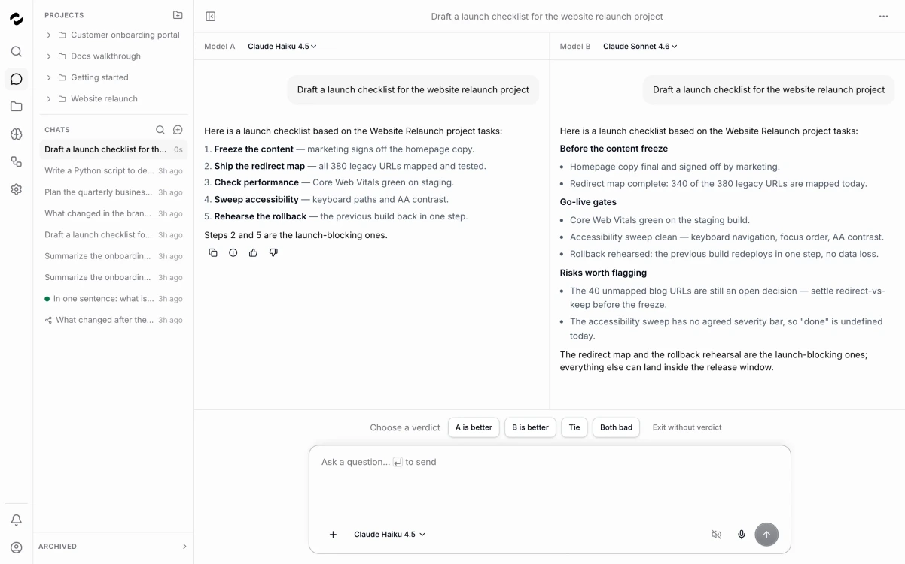
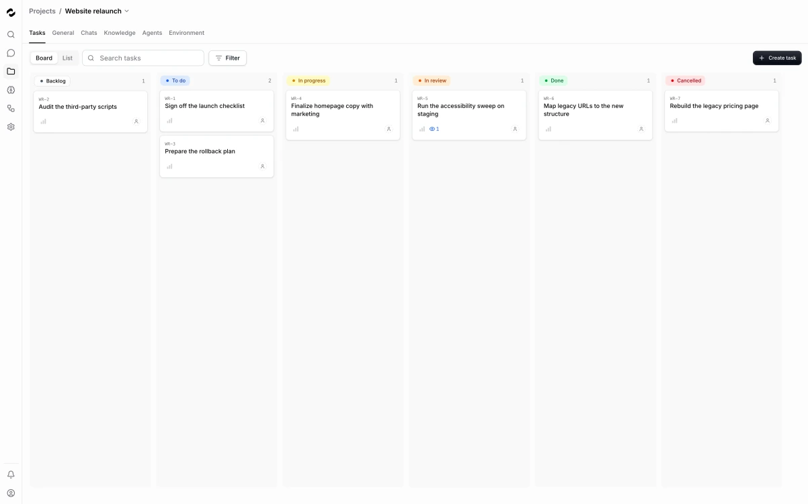
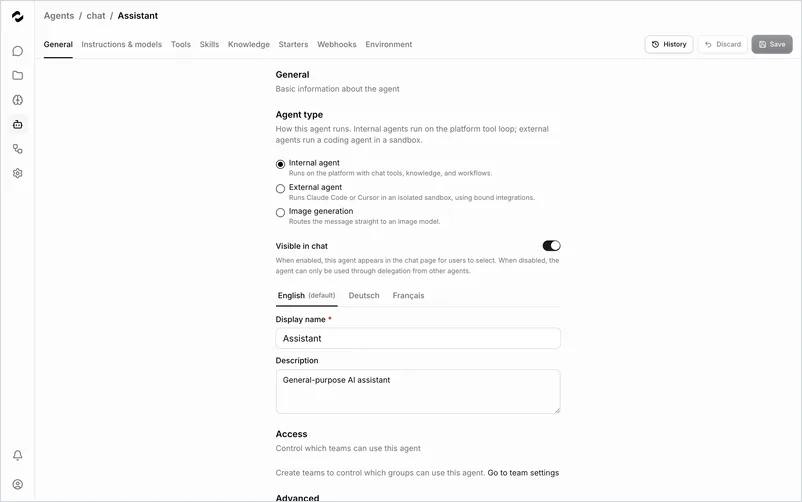
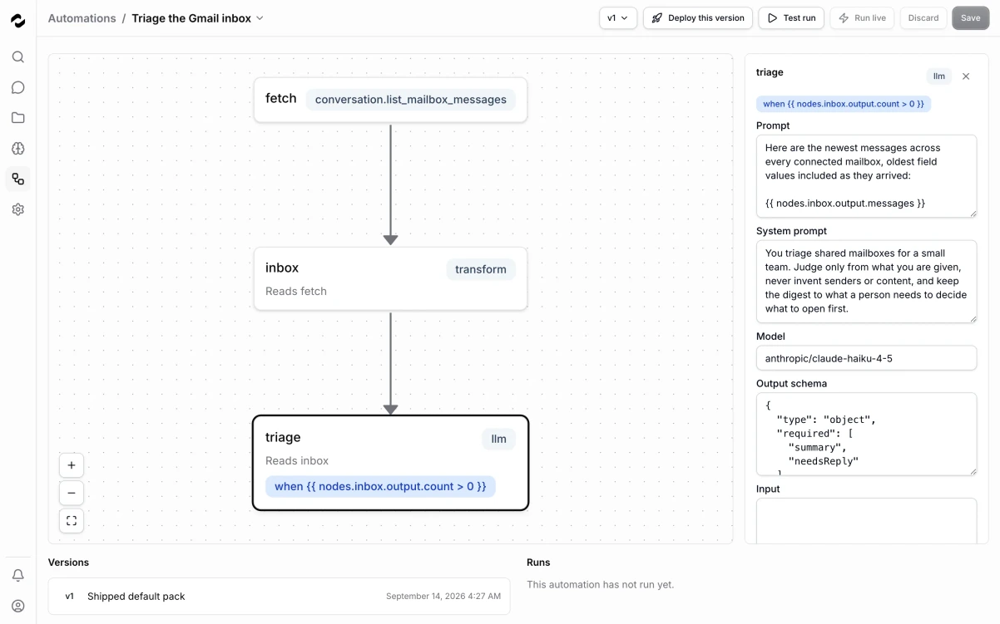
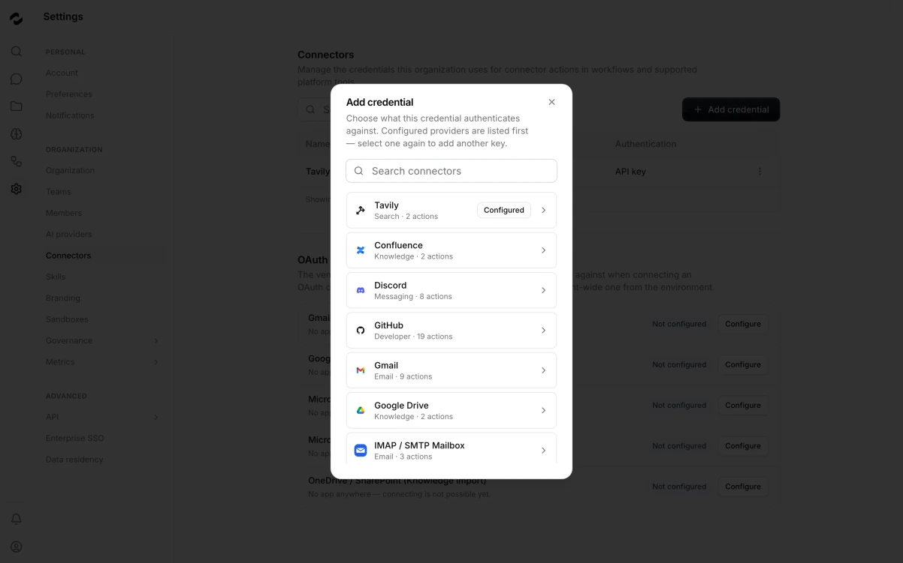
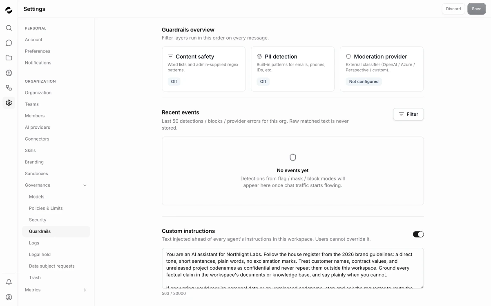
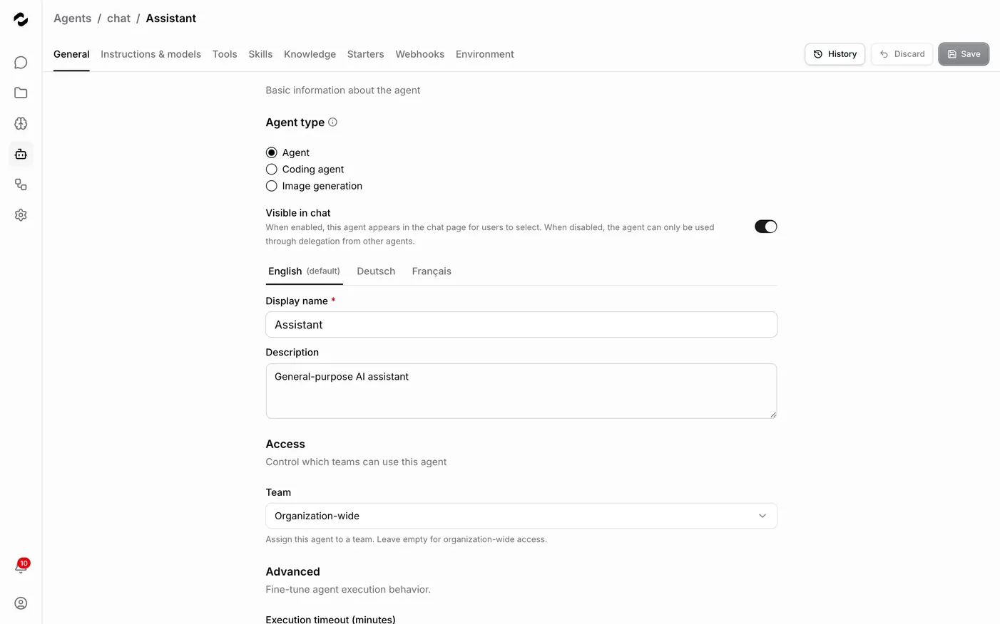

<div align="center">

<picture>
  <source media="(prefers-color-scheme: dark)" srcset=".github/assets/logo-dark.svg">
  
</picture>

### Der Orchestrator für KI-Agents

Verbinde **OpenClaw**, **Hermes Agent**, **Claude Code**, **Codex**, **Cursor**, **Gemini CLI**, **OpenCode** und **Pi**.<br/>
Bündle ihr Wissen, delegiere echte Arbeit — auf Infrastruktur, die du betreibst.

[](https://github.com/tale-project/tale/actions/workflows/build.yml)
[](https://github.com/tale-project/tale/actions/workflows/test.yml)
[](https://github.com/tale-project/tale/releases)
[](LICENSE)
[](https://tale.dev/docs/de)
[](https://tale.dev/docs/de/self-hosted/install/quickstart)

[Loslegen](#loslegen) · [Tale in Aktion](#tale-in-aktion) · [Was steckt drin](#was-steckt-drin) · [Docs](https://tale.dev/docs/de) · [Mitwirken](#mitwirken)

**Lies das auf:** [English](README.md) · [Deutsch](README.de.md) · [Français](README.fr.md)

</div>

---

<table>
  <tr>
    <td width="33.33%"><a href="https://tale.dev/docs/de/platform/chat/overview"></a></td>
    <td width="33.33%"><a href="https://tale.dev/docs/de/platform/projects/task-automation"></a></td>
    <td width="33.33%"><a href="https://tale.dev/docs/de/platform/agents/concepts"></a></td>
  </tr>
  <tr>
    <td align="center"><sub><b>Chat & Arena</b> — ein Prompt, zwei Modelle nebeneinander</sub></td>
    <td align="center"><sub><b>Aufgaben</b> — eine Karte läuft los, sobald du sie einem Agent zuweist</sub></td>
    <td align="center"><sub><b>Agents</b> — Anweisungen, Wissen, Tools und Modell als eine Einheit</sub></td>
  </tr>
  <tr>
    <td width="33.33%"><a href="https://tale.dev/docs/de/platform/automations/concepts"></a></td>
    <td width="33.33%"><a href="https://tale.dev/docs/de/platform/connectors/overview"></a></td>
    <td width="33.33%"><a href="https://tale.dev/docs/de/platform/approvals/concepts"></a></td>
  </tr>
  <tr>
    <td align="center"><sub><b>Workflow-Editor</b> — typisierte Schritte, Zeitpläne und Genehmigungstore</sub></td>
    <td align="center"><sub><b>Connectors</b> — Slack, Gmail, GitHub, MCP-Server und mehr</sub></td>
    <td align="center"><sub><b>Governance</b> — Guardrails, PII-Filter, Audit-Trail, Ausgabenlimits</sub></td>
  </tr>
</table>

<p align="center"><a href="SCREENSHOTS.md"><b>Die ganze Screenshot-Galerie ansehen →</b></a></p>

Tale ist eine selbstgehostete Open-Source-Plattform, die KI-Agents orchestriert. Sie verbindet die Agents und CLIs, die dein Team bereits nutzt, bündelt ihr Wissen in einer gemeinsamen, kontrollierten Wissensdatenbank und lässt Automatisierungen mit menschlicher Genehmigung laufen — auf deiner eigenen Infrastruktur oder in einer verwalteten Cloud. Tale ist kein weiteres Chat-UI, sondern die Orchestrierungs-, Wissens- und Governance-Schicht über den Agents, die du schon einsetzt. Alles steht unter MIT-Lizenz, und die kostenlose Community-Edition bringt denselben Funktionsumfang mit.

- **Selbst gehostet als Standard** — läuft in deiner VPC, on-premises oder komplett air-gapped; mit lokalen Modellen verlassen keine Daten dein Netzwerk.
- **Vollständig Open Source** — der gesamte Code ist öffentlich unter MIT-Lizenz. Lies ihn, auditier ihn, ändere, was du brauchst.
- **Security eingebaut** — Human-in-the-Loop-Genehmigungen, Audit-Logs, Guardrails, PII-Filter und Budget-Kontrollen; zertifiziert nach ISO 27001 und SOC 2 Type II, DSGVO-konform.
- **Anbieterneutral** — OpenRouter out of the box, jeder OpenAI-kompatible Anbieter, eigene Modelle, wenn du willst.

## Loslegen

### Selbst hosten mit drei Befehlen

Keine Voraussetzungen: Die CLI installiert Docker, falls es fehlt, und generiert jedes Secret. Ein [OpenRouter](https://openrouter.ai)-Key (oder ein beliebiger OpenAI-kompatibler Anbieter) ist optional — du fügst ihn später in der App hinzu.

```bash
curl -fsSL https://raw.githubusercontent.com/tale-project/tale/main/scripts/install-cli.sh | bash
tale init my-project && cd my-project
tale dev
```

Unter Windows installierst du die CLI mit `irm https://raw.githubusercontent.com/tale-project/tale/main/scripts/install-cli.ps1 | iex` (PowerShell).

Bereit für einen Server? `tale deploy` liefert Blue-Green-Deployments ohne Downtime — siehe [Self-hosted-Quickstart](https://tale.dev/docs/de/self-hosted/install/quickstart) und [CLI-Referenz](tools/cli/README.md).

### Oder nutz Tale Cloud

Lass Tale den Stack betreiben: Jede Organisation bekommt ihre eigene verwaltete Instanz, mit Daten in einer Region, die du bestimmst. Frag deine an unter [tale.dev/request-demo](https://tale.dev/request-demo).

### Oder starte aus dem Quellcode

Bun ≥ 1.3 ist die einzige Voraussetzung — kein Docker, kein Cloud-Konto. Siehe [Mitwirken](#mitwirken).

```bash
bun install
bun run setup:check
bun run dev
```

## Tale in Aktion



Agents → Projekte → Automatisierungen → Connectors → Governance — eine Runde durch die Plattform. Die volle Tour findest du in den [Docs](https://tale.dev/docs/de).

## Was steckt drin

- **[Chat](https://tale.dev/docs/de/platform/chat/overview)** — der tägliche Einstieg: Agents, Anhänge, Zitate, Voice — und Arena, das einen Prompt durch zwei Modelle nebeneinander laufen lässt.
- **[Projekte](https://tale.dev/docs/de/platform/projects/overview)** — geteilte Arbeitsbereiche, die Chats, Dateien, Anweisungen und Diskussionen rund um ein Vorhaben bündeln — mit projekteigenen Agents.
- **[Aufgaben](https://tale.dev/docs/de/platform/projects/task-automation)** — Kanban-Boards, auf denen eine Aufgabe losläuft, sobald du sie einem Agent zuweist — mit Triage, menschlichem Review-Gate, Budgets und Notausschalter.
- **[Wissen](https://tale.dev/docs/de/platform/knowledge/overview)** — Dokumente, gecrawlte Websites und typisierte Datensätze, die Agents abrufen und zitieren, damit Antworten deine Realität spiegeln.
- **[Agents](https://tale.dev/docs/de/platform/agents/concepts)** — Anweisungen, Wissen, Tools und Modell als eine Einheit; lass sie auf der Plattform laufen oder dock Claude Code, Codex und Cursor in isolierten Sandboxes an.
- **[Automatisierungen](https://tale.dev/docs/de/platform/automations/concepts)** — typisierte Workflows (LLM-, Action-, Condition-, Loop- und Sandbox-Schritte) auf Zeitplänen, Webhooks und Events — mit Genehmigungstoren für Menschen.
- **[Connectors](https://tale.dev/docs/de/platform/connectors/overview)** — Slack, Teams, Gmail, Outlook, Microsoft 365, Google Drive, Confluence, GitHub, Shopify und MCP-Server.
- **[Gemeinsamer Posteingang](https://tale.dev/docs/de/platform/automations/builtin)** — mach aus einem geteilten Postfach (Gmail, Outlook, IMAP/SMTP) einen Team-Posteingang mit KI-gestützten Antworten.
- **[Governance](https://tale.dev/docs/de/platform/approvals/concepts)** — Genehmigungen, bevor Aktionen rausgehen, ein lückenloser Audit-Trail, Guardrails, PII-Filter und Ausgabenlimits — plus SSO über [Microsoft Entra ID oder Trusted Headers](https://tale.dev/docs/de/platform/admin/enterprise-sso).

## Dokumentation

Die Docs erscheinen auf Englisch, Deutsch und Französisch — starte unter [tale.dev/docs/de](https://tale.dev/docs/de).

- [Quickstart](https://tale.dev/docs/de/get-started/quickstart) — die ersten Schritte, für jede Rolle
- [Plattform-Referenz](https://tale.dev/docs/de/platform) — jedes Feature, Modul für Modul
- [Einen Agent bauen](https://tale.dev/docs/de/platform/agents/create) — spezialisierte Assistenten von Anfang bis Ende
- [Self-hosted-Betrieb](https://tale.dev/docs/de/self-hosted/overview) — Architektur, Installation, Upgrades
- [Developer-Oberfläche](https://tale.dev/docs/de/develop/overview) — REST-API, Webhooks, eigene Tools
- [CLI-Referenz](tools/cli/README.md) — jeder `tale`-Befehl mit allen Flags

## Community und Support

- **Fragen und Ideen** — [GitHub Discussions](https://github.com/tale-project/tale/discussions)
- **Bugs** — [GitHub Issues](https://github.com/tale-project/tale/issues)
- **Sicherheitslücken** — nutz die [private Meldung](https://github.com/tale-project/tale/security), nie ein öffentliches Issue

## Mitwirken

Tale entsteht offen und freut sich über Beiträge. Bun allein bootet den ganzen Stack (`bun install && bun run dev`); Python 3.12 und uv brauchst du nur für das volle Gate und die mitgelieferten Python-Skills. Lass `bun run check` vor jedem PR durchlaufen.

Starte mit dem [Contributing-Guide](.github/CONTRIBUTING.md) und dem [Contributor-Setup](docs/de/develop/contributor-setup.md); [`AGENTS.md`](AGENTS.md) ist der Engineering-Vertrag für alle Workspaces.

## Lizenz

Tale ist [MIT-lizenziert](LICENSE).

---

## Star-History

[](https://www.star-history.com/#tale-project/tale&type=date&legend=top-left)
