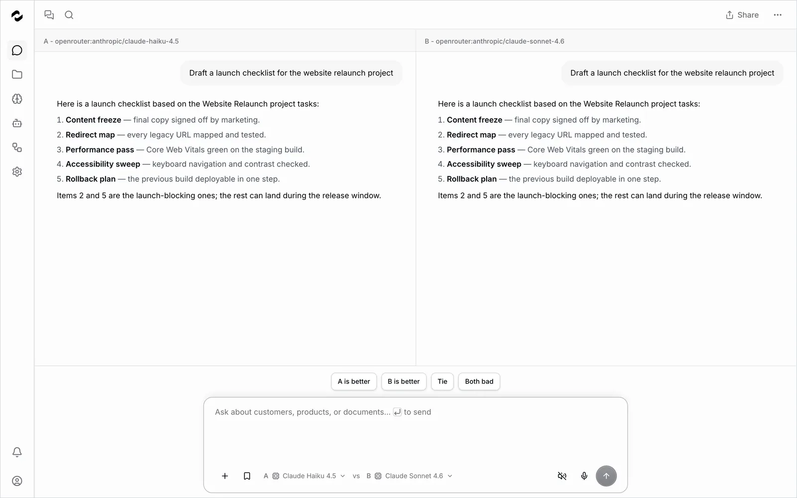

<div align="center">

<picture>
  <source media="(prefers-color-scheme: dark)" srcset=".github/assets/logo-dark.svg">
  
</picture>

### L’orchestrateur pour agents IA

Connecte **OpenClaw**, **Hermes Agent**, **Claude Code**, **Codex**, **Cursor**, **Gemini CLI**, **OpenCode** et **Pi**.<br/>
Mets leur savoir en commun, délègue du vrai travail — sur une infrastructure que tu fais tourner.

[](https://github.com/tale-project/tale/actions/workflows/build.yml)
[](https://github.com/tale-project/tale/actions/workflows/test.yml)
[](https://github.com/tale-project/tale/releases)
[](LICENSE)
[](https://tale.dev/docs/fr)
[](https://tale.dev/docs/fr/self-hosted/install/quickstart)

[Démarrer](#démarrer) · [Tale en action](#tale-en-action) · [Dans la boîte](#dans-la-boîte) · [Docs](https://tale.dev/docs/fr) · [Contribuer](#contribuer)

**Lis ceci en :** [English](README.md) · [Deutsch](README.de.md) · [Français](README.fr.md)

</div>

---

<a href="https://tale.dev/docs/fr"></a>

Tale est une plateforme open source et auto-hébergée qui orchestre les agents IA. Elle connecte les agents et les CLI que ton équipe utilise déjà, met leur savoir en commun dans une base de connaissances gouvernée et fait tourner des automatisations avec approbation humaine — sur ta propre infrastructure ou dans un cloud géré. Tale n’est pas un énième chat UI : c’est la couche d’orchestration, de connaissances et de gouvernance au-dessus des agents que tu fais déjà tourner. Tout est sous licence MIT, et l’édition Community gratuite embarque exactement les mêmes fonctionnalités.

- **Auto-hébergé par défaut** — tourne dans ton VPC, sur site ou en environnement air-gapped ; avec des modèles locaux, aucune donnée ne quitte ton réseau.
- **Entièrement open source** — tout le code est public sous licence MIT. Lis-le, audite-le, change ce qu’il te faut.
- **Sécurité intégrée** — approbations human-in-the-loop, journaux d’audit, guardrails, filtres PII et contrôles budgétaires ; certifié ISO 27001 et SOC 2 Type II, conforme RGPD.
- **Neutre côté fournisseurs** — OpenRouter prêt à l’emploi, tout fournisseur compatible OpenAI, tes propres modèles si tu veux.

## Démarrer

### Auto-héberger en trois commandes

Aucun prérequis : la CLI installe Docker s’il manque et génère chaque secret. Une clé [OpenRouter](https://openrouter.ai) (ou tout fournisseur compatible OpenAI) est optionnelle — tu l’ajoutes plus tard, dans l’app.

```bash
curl -fsSL https://raw.githubusercontent.com/tale-project/tale/main/scripts/install-cli.sh | bash
tale init my-project && cd my-project
tale dev
```

Sous Windows, installe la CLI avec `irm https://raw.githubusercontent.com/tale-project/tale/main/scripts/install-cli.ps1 | iex` (PowerShell).

Prêt pour un serveur ? `tale deploy` fait des déploiements blue-green sans interruption — voir le [démarrage rapide auto-hébergé](https://tale.dev/docs/fr/self-hosted/install/quickstart) et la [référence CLI](tools/cli/README.md).

### Ou utilise Tale Cloud

Laisse Tale exploiter la stack : chaque organisation reçoit sa propre instance gérée, avec tes données épinglées dans une région que tu choisis. Demande la tienne sur [tale.dev/request-demo](https://tale.dev/request-demo).

### Ou lance depuis le code source

Bun ≥ 1.3 est le seul prérequis — pas de Docker, pas de compte cloud. Voir [Contribuer](#contribuer).

```bash
bun install
bun run setup:check
bun run dev
```

## Tale en action


Agents → Projets → Automatisations → Intégrations → Gouvernance — un tour de la plateforme. La visite complète est dans les [docs](https://tale.dev/docs/fr).

## Dans la boîte

- **[Chat](https://tale.dev/docs/fr/platform/chat/overview)** — l’entrée de tous les jours : agents, pièces jointes, citations, voix — et Arena, qui fait répondre deux modèles au même prompt, côte à côte.
- **[Agents](https://tale.dev/docs/fr/platform/agents/concepts)** — instructions, connaissances, outils et modèle en une seule unité ; fais-les tourner sur la plateforme, ou branche Claude Code, Codex et Cursor dans des sandboxes isolées.
- **[Projets](https://tale.dev/docs/fr/platform/projects/overview)** — des espaces de travail partagés avec fichiers, tableaux de tâches et agents de projet qui prennent le travail en charge.
- **[Automatisations](https://tale.dev/docs/fr/platform/automations/concepts)** — des workflows typés (étapes LLM, Action, Condition, Loop et Sandbox), déclenchés par planification, webhook ou événement — avec des approbations humaines aux étapes qui comptent.
- **[Base de connaissances](https://tale.dev/docs/fr/platform/knowledge/overview)** — documents, sites web explorés et fiches typées que les agents consultent et citent, pour des réponses qui reflètent ta réalité.
- **[Gouvernance](https://tale.dev/docs/fr/platform/approvals/concepts)** — des approbations avant qu’une action parte, une piste d’audit complète, des guardrails, des filtres PII et des plafonds de dépense — plus le SSO via [Microsoft Entra ID ou trusted headers](https://tale.dev/docs/fr/platform/admin/enterprise-sso).
- **[Intégrations](https://tale.dev/docs/fr/platform/integrations/overview)** — Slack, Teams, Gmail, Outlook, Microsoft 365, Google Drive, Confluence, GitHub, Shopify et serveurs MCP.
- **[Boîte de réception unifiée](https://tale.dev/docs/fr/platform/automations/builtin)** — transforme une messagerie partagée (Gmail, Outlook, IMAP/SMTP) en boîte de réception d’équipe, avec des réponses assistées par l’IA.

## Documentation

Les docs existent en anglais, allemand et français — commence sur [tale.dev/docs/fr](https://tale.dev/docs/fr).

- [Démarrage rapide](https://tale.dev/docs/fr/get-started/quickstart) — les premiers pas, pour chaque rôle
- [Référence plateforme](https://tale.dev/docs/fr/platform) — chaque fonctionnalité, module par module
- [Construire un agent](https://tale.dev/docs/fr/platform/agents/create) — des assistants spécialisés de bout en bout
- [Exploitation auto-hébergée](https://tale.dev/docs/fr/self-hosted/overview) — architecture, installation, mises à niveau
- [Surface développeur](https://tale.dev/docs/fr/develop/overview) — API REST, webhooks, outils personnalisés
- [Référence CLI](tools/cli/README.md) — chaque commande `tale` et ses flags

## Communauté et support

- **Questions et idées** — [GitHub Discussions](https://github.com/tale-project/tale/discussions)
- **Bugs** — [GitHub Issues](https://github.com/tale-project/tale/issues)
- **Vulnérabilités** — passe par le [signalement privé](https://github.com/tale-project/tale/security), jamais par une issue publique

## Contribuer

Tale se construit au grand jour et accueille les contributions. Bun suffit à démarrer toute la stack (`bun install && bun run dev`) ; Python 3.12 et uv ne servent qu’au gate complet et aux skills Python embarqués. Lance `bun run check` avant chaque PR.

Commence par le [guide de contribution](.github/CONTRIBUTING.md) et la [configuration contributeur](docs/fr/develop/contributor-setup.md) ; [`AGENTS.md`](AGENTS.md) est le contrat d’ingénierie de tous les workspaces.

## Licence

Tale est sous [licence MIT](LICENSE).

---

## Historique des étoiles

[](https://www.star-history.com/#tale-project/tale&type=date&legend=top-left)
