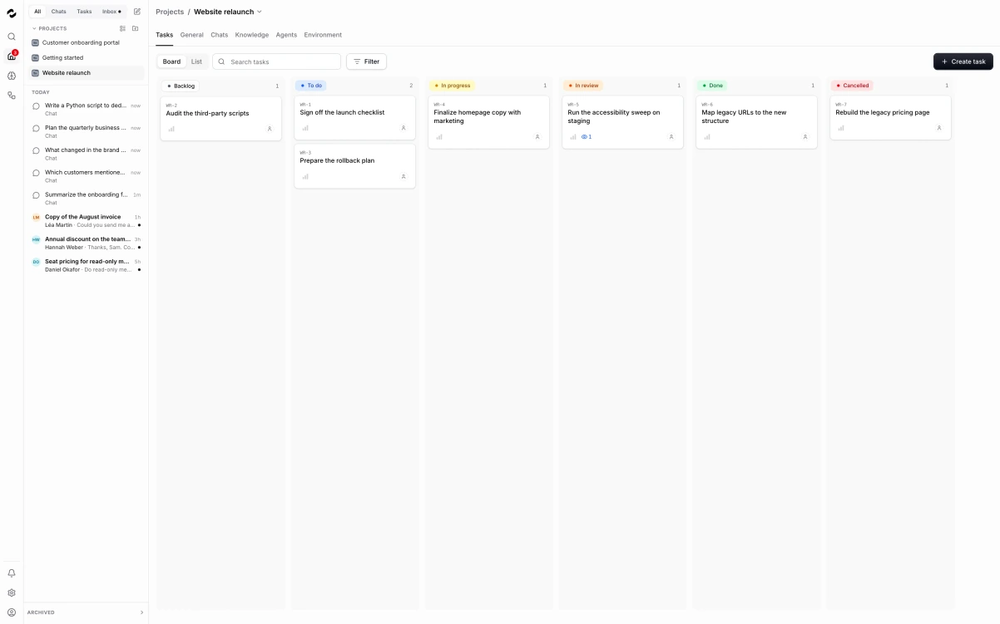
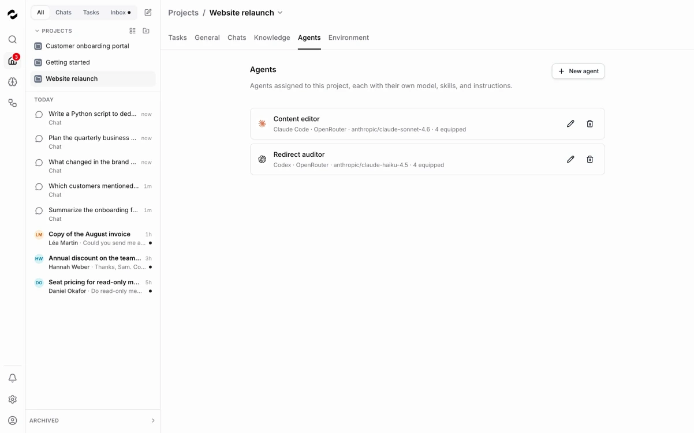
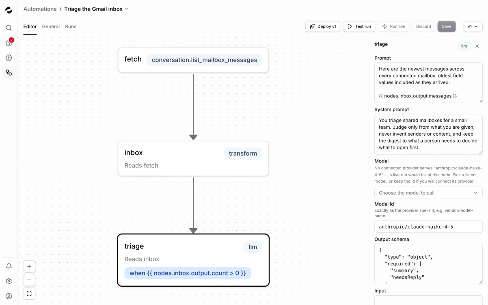
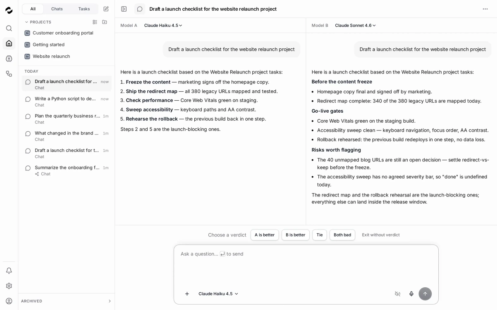
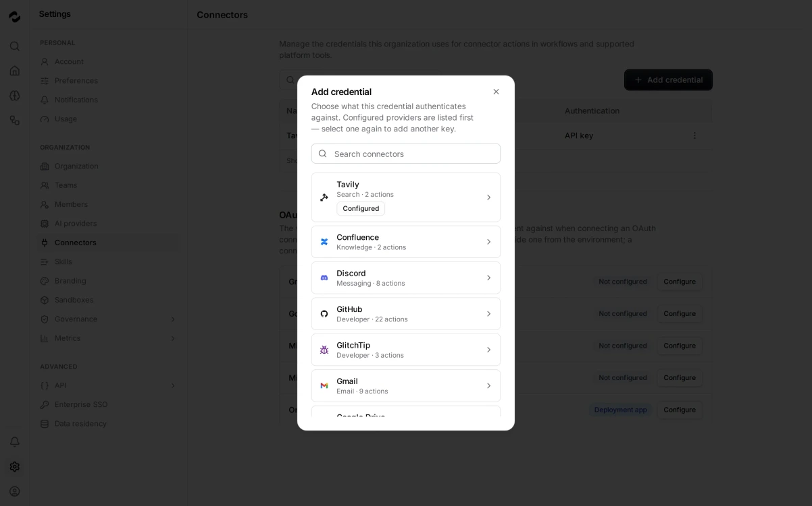
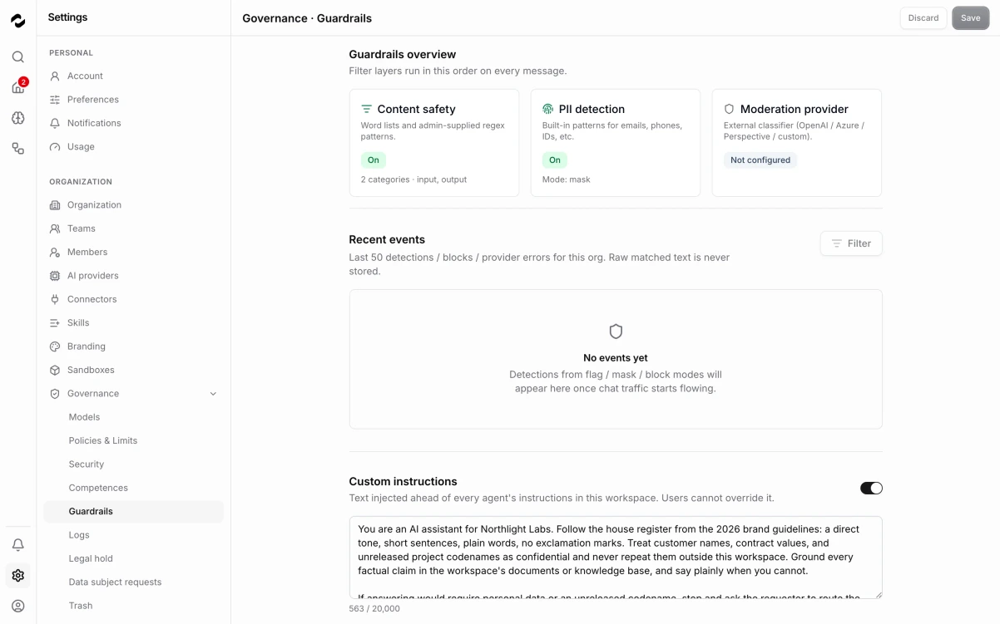

<div align="center">

<picture>
  <source media="(prefers-color-scheme: dark)" srcset=".github/assets/logo-dark.svg">
  
</picture>

[](https://github.com/tale-project/tale/actions/workflows/build.yml)
[](https://github.com/tale-project/tale/actions/workflows/checks.yml)
[](LICENSE)

[English](README.md) · [Deutsch](README.de.md) · [Français](README.fr.md)

</div>

# Tale — L’espace de travail open source pour les équipes et les agents IA

**Transforme les problèmes de ton entreprise en tâches que ton équipe et tes agents IA peuvent résoudre ensemble.**

Tale donne aux membres de l’équipe et aux agents IA un espace de projet commun. Ajoute des tâches au tableau, attribue-les à des personnes ou à des agents, suis leur travail et examine les rapports et les fichiers livrés. Les consignes, les discussions, les connaissances du projet et les résultats restent au même endroit. Les agents peuvent mener une recherche, examiner des documents, préparer des rapports et des supports marketing ou créer un site web, une application ou un outil interne.

Choisis l’environnement d’exécution, le modèle, les compétences et les outils de chaque agent. Équipe un agent coordinateur pour qu’il délègue les tâches prêtes et organise les suites du travail. Les agents travaillent dans des espaces sandbox persistants, avec une exécution simultanée limitée par la capacité configurée.

Utilise tes propres clés API de fournisseurs ou les abonnements pris en charge avec les environnements d’exécution compatibles. Consulte les [environnements et identifiants pris en charge](https://docs.tale.dev/fr/platform/agents/harnesses) pour connaître les combinaisons disponibles.

Héberge Tale sur ton infrastructure ou utilise le service Cloud géré. Le code est sous licence MIT. Community et Enterprise donnent accès aux mêmes fonctions ; Enterprise ajoute l’exploitation et l’assistance professionnelles. Consulte [les offres et les tarifs](https://tale.dev/pricing) pour connaître les conditions actuelles.

<table>
  <tr>
    <td width="50%" valign="top">
      <a href="services/docs/public/images/platform/projects-task-board.webp"></a>
      <br><a href="https://docs.tale.dev/fr/platform/projects/tasks"><b>Tâches de projet</b></a><br><sub>Organise le travail et suis son avancement.</sub>
    </td>
    <td width="50%" valign="top">
      <a href="services/docs/public/images/platform/project-agents-models.webp"></a>
      <br><a href="https://docs.tale.dev/fr/platform/projects/project-agents"><b>Agents de projet</b></a><br><sub>Choisis les instructions, le moteur, le modèle et les outils.</sub>
    </td>
  </tr>
  <tr>
    <td width="50%" valign="top">
      <a href="services/docs/public/images/platform/automation-editor-canvas.webp"></a>
      <br><a href="https://docs.tale.dev/fr/platform/automations/editor"><b>Éditeur de workflow</b></a><br><sub>Examine les étapes, les données de test et les exécutions.</sub>
    </td>
    <td width="50%" valign="top">
      <a href="services/docs/public/images/platform/chat-arena-split.webp"></a>
      <br><a href="https://docs.tale.dev/fr/platform/chat/arena-mode"><b>Chat et Arena</b></a><br><sub>Compare deux réponses côte à côte.</sub>
    </td>
  </tr>
  <tr>
    <td width="50%" valign="top">
      <a href="services/docs/public/images/platform/connectors-add-credential.webp"></a>
      <br><a href="https://docs.tale.dev/fr/platform/connectors/overview"><b>Connecteurs</b></a><br><sub>Choisis les services utilisés par ton espace.</sub>
    </td>
    <td width="50%" valign="top">
      <a href="services/docs/public/images/platform/governance-guardrails.webp"></a>
      <br><a href="https://docs.tale.dev/fr/platform/admin/governance/guardrails"><b>Gouvernance</b></a><br><sub>Vérifie les règles de sécurité et de traitement des données.</sub>
    </td>
  </tr>
</table>

Ouvre une capture pour la voir en taille réelle. Les images montrent l’interface en anglais.

## Des tâches aux résultats vérifiés

1. **Décrire le travail.** Crée une [tâche de projet](https://docs.tale.dev/fr/platform/projects/tasks) avec le problème, les fichiers sources et les critères d’acceptation.
2. **Attribuer le travail aux personnes et aux agents.** Configure des [agents de projet](https://docs.tale.dev/fr/platform/projects/project-agents), choisis leurs outils et lance les tâches que tu souhaites leur confier.
3. **Coordonner et examiner.** Suis l’avancement sur le tableau, guide les agents avec des @mentions dans les commentaires des tâches et vérifie leurs rapports et fichiers. Un [agent coordinateur](https://docs.tale.dev/fr/platform/projects/task-automation) peut déléguer les tâches prêtes s’il dispose des outils nécessaires.
4. **Répéter un processus défini.** Utilise une [automatisation](https://docs.tale.dev/fr/platform/automations/concepts) versionnée lorsque le travail nécessite des démarrages planifiés, des étapes définies ou des approbations pour les actions des connecteurs.

### Exemple : examiner un brief de lancement

Une fois un agent de projet et des identifiants de modèle compatibles configurés, adapte cet exemple de consigne à tes fichiers sources :

> Compare les pièces jointes : le brief de lancement et les notes de réunion. Produis un rapport Markdown qui relève les dates contradictoires, les responsabilités non attribuées et les décisions en suspens. Cite le fichier source et le passage pour chaque constat. Distingue les faits confirmés des questions ouvertes et laisse les fichiers sources inchangés.

Avant d’accepter le résultat, ouvre le rapport livré, vérifie ses citations dans les deux fichiers et assure-toi qu’il couvre chaque catégorie demandée. Demande des corrections dans la tâche si des éléments ne sont pas étayés. Le [guide de révision des tâches](https://docs.tale.dev/fr/platform/projects/task-automation) explique comment demander des modifications ou accepter le travail terminé.

## Évaluer Tale pour ton équipe

**Quels environnements d’exécution puis-je utiliser ?** Tale inclut Claude Code, Codex, Cursor, Gemini CLI, Hermes, OpenClaw, OpenCode, Pi et Qwen Code. Leur disponibilité dépend de ton déploiement, de tes identifiants et de la capacité des sandbox. Le [tableau de compatibilité](https://docs.tale.dev/fr/platform/agents/harnesses) détaille les modes d’authentification, les outils et les limites de reprise des conversations.

**Puis-je utiliser une clé API ou un abonnement existant ?** Les clés API de fournisseurs enregistrées passent par la passerelle de modèles de Tale. Les abonnements pris en charge fonctionnent uniquement avec les environnements compatibles, ne peuvent pas alimenter le Chat ordinaire et contournent la mesure de consommation et les plafonds de dépenses de la passerelle. Consulte les [précisions sur les identifiants et les coûts](https://docs.tale.dev/fr/platform/agents/harnesses) avant de choisir une connexion.

**Que faut-il pour l’auto-hébergement ?** Pour commencer, il te faut Docker avec Compose, du stockage pour les images et les données persistantes, ainsi que les identifiants d’un fournisseur de modèles pris en charge. En production, prévois aussi le DNS, TLS, les sauvegardes et les contrôles d’accès. Le [guide de démarrage en auto-hébergement](https://docs.tale.dev/fr/self-hosted/install/quickstart) couvre l’installation locale et renvoie vers la préparation à la production.

**Où vont mes données ?** Les données de l’application, les connaissances consultables et les fichiers originaux ont des réglages de stockage distincts. Les fournisseurs de modèles, les connecteurs et les outils externes peuvent traiter des données ailleurs ; l’auto-hébergement seul ne garde pas toutes les requêtes en local. Examine la [résidence des données](https://docs.tale.dev/fr/self-hosted/configuration/data-residency) et la [gestion des identifiants et des accès réseau par l’environnement d’exécution](https://docs.tale.dev/fr/platform/agents/harnesses).

**Qu’est-ce qui distingue Community d’Enterprise ?** Les deux comprennent les mêmes fonctions sous licence MIT. Enterprise ajoute l’exploitation et l’assistance professionnelles. Consulte [les offres et les tarifs](https://tale.dev/pricing) pour connaître les conditions de service actuelles.

## Choisir ton point de départ

| Ton objectif | Guide à suivre |
| --- | --- |
| Utiliser un espace de travail existant | [Envoyer ton premier message](https://docs.tale.dev/fr/get-started/quickstart) |
| Installer Tale | [Démarrage en auto-hébergement](https://docs.tale.dev/fr/self-hosted/install/quickstart) |
| Obtenir une instance gérée | [Demander une démo](https://tale.dev/request-demo) |
| Créer un agent pour un projet | [Créer et tester un agent de projet](https://docs.tale.dev/fr/get-started/editors) |
| Connecter une autre application | [Premiers pas avec l’API](https://docs.tale.dev/fr/get-started/developers) |
| Modifier le code source | [Préparer l’environnement de développement](docs/fr/develop/contributor-setup.md) |
| Développer avec les composants UI de Tale | [Guides et exemples interactifs (en anglais)](https://ui.tale.dev/docs/getting-started/introduction) |

### Lancer une instance locale

Utilise la CLI publiée sur macOS ou Linux. Tu n’as besoin ni de cloner le dépôt ni d’installer Bun :

```bash
curl -fsSL https://raw.githubusercontent.com/tale-project/tale/main/scripts/install-cli.sh | bash
tale init my-project
cd my-project
tale dev
```

Il te faut Docker avec Compose, de la place pour plusieurs Go d’images et tes données, ainsi que les identifiants d’un fournisseur de modèles pour tester la première réponse. Docker Desktop inclut l’émulation amd64 nécessaire au stockage objet fourni sur Apple Silicon. Sur ARM64 Linux, configure l’émulation avant de démarrer.

La CLI peut aider à installer ou démarrer Docker. Au démarrage, ouvre l’URL affichée, crée le premier compte et l’organisation, puis ajoute des identifiants sous **Paramètres > Fournisseurs IA** et [envoie ton premier message](https://docs.tale.dev/fr/get-started/quickstart).

Appuie sur `Ctrl-C` pour arrêter l’instance ; relance `tale dev` dans le même répertoire pour reprendre avec tes données.

Le [guide de démarrage](https://docs.tale.dev/fr/self-hosted/install/quickstart) couvre Windows, les certificats, les prérequis d’architecture et le dépannage. Le [guide CLI](tools/cli/README.md) présente les commandes. Avant d’ouvrir l’accès à ton équipe, suis la [préparation de la production](https://docs.tale.dev/fr/self-hosted/install/quickstart#preparer-la-production) : `tale deploy` utilise des volumes distincts de l’instance locale de développement.

### Développer depuis le code source

Utilise la version de Bun indiquée dans [package.json](package.json), une version compatible de Node.js et Docker pour les services associés. Python et uv sont aussi nécessaires pour toutes les vérifications du dépôt. Le [guide de préparation](docs/fr/develop/contributor-setup.md) détaille les versions, les variables d’environnement et les ports.

```bash
bun install --frozen-lockfile
bun run setup:check
bun run dev
```

Attends le message indiquant que la plateforme est prête, puis ouvre l’adresse affichée. Le contrôle de configuration ne vérifie qu’une partie de l’environnement. Sa réussite ne garantit pas que les bases de données, le stockage et le fournisseur de modèles sont configurés.

Pour travailler uniquement sur la documentation, tu n’as besoin ni de la base de données de la plateforme ni d’un fournisseur. La première commande lance la documentation produit, la seconde le guide du design system :

```bash
bun run --filter @tale/docs dev
bun run --filter @tale/ui-docs dev
```

## Ce que tu peux faire

- **[Chat](https://docs.tale.dev/fr/platform/chat/basics) :** rédiger, comprendre un sujet et travailler sur des informations dans une conversation. Compare les modèles dans Arena et vérifie les sources des réponses qui utilisent les connaissances.
- **[Projets](https://docs.tale.dev/fr/platform/projects/overview) :** rassembler tâches, fichiers, instructions et chats liés à un travail. Choisis les chats à partager avec le projet.
- **[Agents de projet](https://docs.tale.dev/fr/platform/projects/project-agents) :** définir les instructions, l’environnement d’exécution, le modèle et les outils. Attribue une tâche, lance l’agent, puis examine son résultat.
- **[Connaissances](https://docs.tale.dev/fr/platform/knowledge/overview) :** préparer documents, entrées de connaissances et sites web pour la recherche. Le chargement et l’indexation sont deux étapes distinctes.
- **[Automatisations](https://docs.tale.dev/fr/platform/automations/concepts) :** assembler les étapes d’un workflow, le tester, puis le lancer manuellement ou avec des déclencheurs configurés.
- **[Connecteurs](https://docs.tale.dev/fr/platform/connectors/overview) :** connecter des services externes avec les identifiants de ton espace de travail.
- **[Administration](https://docs.tale.dev/fr/platform/admin/overview) :** gérer membres, rôles, fournisseurs, règles, utilisation et journaux d’audit.

Les fonctions disponibles dépendent de ton rôle et de la configuration. Un modèle local garde l’inférence sur ton infrastructure ; les services connectés et les outils externes conservent leurs propres flux de données. Consulte la [résidence des données](https://docs.tale.dev/fr/self-hosted/configuration/data-residency) avant de choisir ton déploiement.

## Documentation

La documentation existe en [anglais](https://docs.tale.dev), en [allemand](https://docs.tale.dev/de) et en [français](https://docs.tale.dev/fr).

Commence par une tâche guidée. Les pages Plateforme accompagnent le travail quotidien ; les références d’exploitation et d’API donnent les détails de configuration. La [galerie de captures](SCREENSHOTS.md) présente les principales vues. Pour améliorer les guides, lis le [README de l’espace Docs](services/docs/README.md).

Tu construis une interface avec les composants de Tale ? Le [guide du design system](https://ui.tale.dev) documente `@tale/ui` et `@tale/marketing-ui` avec des exemples interactifs, en anglais. Ses pages se trouvent dans [services/ui-docs](services/ui-docs/README.md).

## Contribuer ou obtenir de l’aide

Lis [CONTRIBUTING.md](.github/CONTRIBUTING.md) et les [règles du dépôt](AGENTS.md) avant de modifier le code. Exécute `bun run check` avant de proposer une Pull Request. Le guide de contribution indique les autres vérifications adaptées à ta modification.

- Pose tes questions dans [GitHub Discussions](https://github.com/tale-project/tale/discussions).
- Signale les bugs reproductibles dans [GitHub Issues](https://github.com/tale-project/tale/issues), avec la version, les étapes, le résultat attendu et le résultat obtenu.
- Signale les vulnérabilités avec le [canal de sécurité privé](https://github.com/tale-project/tale/security).

## Licence

Tale est disponible sous [licence MIT](LICENSE).
