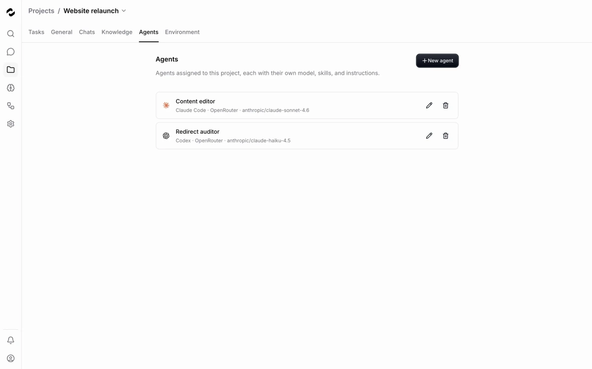

<div align="center">

<picture>
  <source media="(prefers-color-scheme: dark)" srcset=".github/assets/logo-dark.svg">
  
</picture>

[](https://github.com/tale-project/tale/actions/workflows/build.yml)
[](https://github.com/tale-project/tale/actions/workflows/checks.yml)
[](LICENSE)

[English](README.md) · [Deutsch](README.de.md) · [Français](README.fr.md)

</div>

# Tale

Tale brings AI chat, project work, knowledge, and automations into one workspace. Ask questions about your documents, give an agent a defined task, and review its work with your team. Choose your model providers and run Tale on your own infrastructure or use the managed Cloud service.

The code is MIT-licensed. Community and Enterprise include the same product features; Enterprise adds professional operation and support. See [plans and pricing](https://tale.dev/pricing) for the current offer.

<table>
  <tr>
    <td width="50%" valign="top">
      <a href="services/docs/public/images/platform/chat-arena-split.webp"></a>
      <br><a href="https://docs.tale.dev/platform/chat/arena-mode"><b>Chat and Arena</b></a><br><sub>Compare two model responses side by side.</sub>
    </td>
    <td width="50%" valign="top">
      <a href="services/docs/public/images/platform/projects-task-board.webp"></a>
      <br><a href="https://docs.tale.dev/platform/projects/tasks"><b>Project tasks</b></a><br><sub>Organize work and review its progress.</sub>
    </td>
  </tr>
  <tr>
    <td width="50%" valign="top">
      <a href="services/docs/public/images/platform/project-agents-models.webp"></a>
      <br><a href="https://docs.tale.dev/platform/projects/project-agents"><b>Project agents</b></a><br><sub>Choose instructions, runtime, model and tools.</sub>
    </td>
    <td width="50%" valign="top">
      <a href="services/docs/public/images/platform/automation-editor-canvas.webp"></a>
      <br><a href="https://docs.tale.dev/platform/automations/editor"><b>Workflow editor</b></a><br><sub>Inspect steps, test inputs and review runs.</sub>
    </td>
  </tr>
  <tr>
    <td width="50%" valign="top">
      <a href="services/docs/public/images/platform/connectors-add-credential.webp"></a>
      <br><a href="https://docs.tale.dev/platform/connectors/overview"><b>Connectors</b></a><br><sub>Choose the services your workspace uses.</sub>
    </td>
    <td width="50%" valign="top">
      <a href="services/docs/public/images/platform/governance-guardrails.webp"></a>
      <br><a href="https://docs.tale.dev/platform/admin/governance/guardrails"><b>Governance</b></a><br><sub>Review content safety and data policies.</sub>
    </td>
  </tr>
</table>

Select a screenshot to view it at full size. The captures show the English interface.

## Start here

| Your goal | Follow this guide |
| --- | --- |
| Use a workspace your team already has | [Send your first message](https://docs.tale.dev/get-started/quickstart) |
| Install Tale | [Self-hosted quickstart](https://docs.tale.dev/self-hosted/install/quickstart) |
| Get a managed instance | [Request a demo](https://tale.dev/request-demo) |
| Build an agent for a project | [Create and test a project agent](https://docs.tale.dev/get-started/editors) |
| Connect another application | [API getting started](https://docs.tale.dev/get-started/developers) |
| Change the source code | [Contributor setup](docs/en/develop/contributor-setup.md) |
| Build with Tale’s UI components | [Component guides and live examples](https://ui.tale.dev/docs/getting-started/introduction) |

### Run a local instance

Install the Tale CLI, create a project, and start its development stack:

```bash
curl -fsSL https://raw.githubusercontent.com/tale-project/tale/main/scripts/install-cli.sh | bash
tale init my-project
cd my-project
tale dev
```

The stack needs Docker. Follow the CLI’s setup prompts and wait for Docker to be running before starting Tale. The first start downloads container images; the CLI reports the address to open. Follow the setup wizard to create the first account and organization, then connect an AI provider to get model responses.

For Windows installation, platform prerequisites, and recovery when startup fails, follow the [installation guide](https://docs.tale.dev/self-hosted/install/quickstart). Use the [CLI reference](tools/cli/README.md) for commands and flags, and the [deployment guide](https://docs.tale.dev/self-hosted/install/cli-install) before moving to a server.

### Develop from source

Use the Bun version in [package.json](package.json), a compatible Node.js runtime, and Docker for the backing services. Python and uv are also needed for the full repository checks. The [contributor setup guide](docs/en/develop/contributor-setup.md) covers versions, environment variables, and ports.

```bash
bun install --frozen-lockfile
bun run setup:check
bun run dev
```

Wait for the platform’s readiness message, then open the address it prints. The setup check covers only part of the environment; a passing check does not establish that databases, storage, or a model provider are configured.

To work on documentation alone, no platform database or provider is needed:

```bash
bun run --filter @tale/docs dev
```

## What you can do

- **[Chat](https://docs.tale.dev/platform/chat/basics):** draft, explain, and work with information in a conversation. Compare models in Arena and inspect sources when an answer uses knowledge.
- **[Projects](https://docs.tale.dev/platform/projects/overview):** keep related tasks, files, instructions, and chats together. Choose which chats to share with the project.
- **[Project agents](https://docs.tale.dev/platform/projects/project-agents):** define an agent’s instructions, harness, model, and tools. Assign a task, start the agent, and review the result.
- **[Knowledge](https://docs.tale.dev/platform/knowledge/overview):** prepare documents, knowledge entries, and website content for retrieval. Upload completion and indexing are separate steps.
- **[Automations](https://docs.tale.dev/platform/automations/concepts):** connect steps into a workflow, test it, and run it manually or through configured triggers.
- **[Connectors](https://docs.tale.dev/platform/connectors/overview):** connect external services using credentials your workspace controls.
- **[Administration](https://docs.tale.dev/platform/admin/overview):** manage members, roles, providers, policies, usage, and audit records.

Features depend on your role and deployment configuration. A local model keeps inference on your infrastructure; connected services and external tools still have their own data flows. See [data residency](https://docs.tale.dev/self-hosted/configuration/data-residency) before choosing a deployment boundary.

## Documentation

The documentation is available in [English](https://docs.tale.dev), [German](https://docs.tale.dev/de), and [French](https://docs.tale.dev/fr).

Start with a guided task, use the Platform pages for everyday work, and consult the operator or API references when you need exact configuration details. The [screenshot gallery](SCREENSHOTS.md) gives a visual overview. To improve the docs, read [the docs workspace README](services/docs/README.md).

## Contribute or get help

Read [CONTRIBUTING.md](.github/CONTRIBUTING.md) and the [repository contract](AGENTS.md) before changing code. Run `bun run check` before submitting a pull request; follow the guide for additional checks appropriate to your change.

- Ask questions in [GitHub Discussions](https://github.com/tale-project/tale/discussions).
- Report reproducible bugs in [GitHub Issues](https://github.com/tale-project/tale/issues), including the version, steps, expected result, and actual result.
- Report vulnerabilities through [private security reporting](https://github.com/tale-project/tale/security).

## License

Tale is available under the [MIT license](LICENSE).
