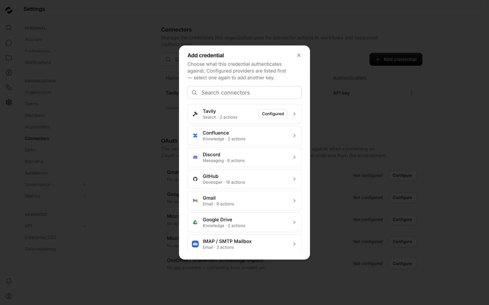

# Tale in screenshots

Explore six everyday workflows in the current platform. These are real captures from a local
installation using synthetic demo content. The interface is English; the guides are also available
in German and French. Select any image to open the full-resolution capture.

[Back to the README](README.md) · [Start with a guided task](https://docs.tale.dev/get-started/quickstart)

## Compare model answers

Arena answers the same prompt with two selected models. Read both replies, then choose a verdict before continuing the conversation.

[Open the guide](https://docs.tale.dev/platform/chat/arena-mode).

## Organize project work

The task board groups work by status. Open a card to inspect its instructions and progress; assigning an agent and starting its work are separate actions.

[Open the guide](https://docs.tale.dev/platform/projects/tasks).

## Configure project agents

Give each agent a clear responsibility, then choose its runtime, model and available tools. Test it with a small task before using it for broader work.

[Open the guide](https://docs.tale.dev/platform/projects/project-agents).

## Inspect a workflow

Select a step to inspect its inputs and configuration. Test a saved version with representative input, inspect the run, and deploy the version you want triggers to use.

[Open the guide](https://docs.tale.dev/platform/automations/editor).

## Connect a service

Choose the integration a credential belongs to. Available authentication methods depend on the connector; OAuth connections also need an application configured for that service.

[Open the guide](https://docs.tale.dev/platform/connectors/overview).

## Review organization controls

Check which guardrail layers are enabled and review their events. This example shows content filters before activation and a configured organization instruction; opening this page does not enable protection.

[Open the guide](https://docs.tale.dev/platform/admin/governance/guardrails).

## Refresh these images

The [screenshot pipeline](services/platform/tests/docs-screenshots/README.md) captures each screen
through the real UI and generates the README thumbnails. Retake the source images after changing
a featured screen, inspect them at full size, and rebuild the gallery.
