<!-- Images are the committed docs screenshots under services/docs/public/images/. When the
pipeline regenerates them, re-vet every frame here (no Failed badges, no loading skeletons,
no bare empty states) before shipping. The README gallery uses separate snapshot tiles in
.github/assets/ on purpose — keep it that way. -->

# Tale in screenshots

A visual lap around the platform. Every image is the real product, captured by the same
pipeline that illustrates the [docs](https://tale.dev/docs) — click any screenshot to view it
full-size, or follow a section's docs link for the guided version.

Back to the [README](README.md).

## Chat

The everyday entry point: agents, attachments, citations, voice — and Arena.
[Chat docs →](https://tale.dev/docs/platform/chat/overview)

<table>
  <tr>
    <td width="50%">
      <a href="services/docs/public/images/platform/chat-starters-empty.webp">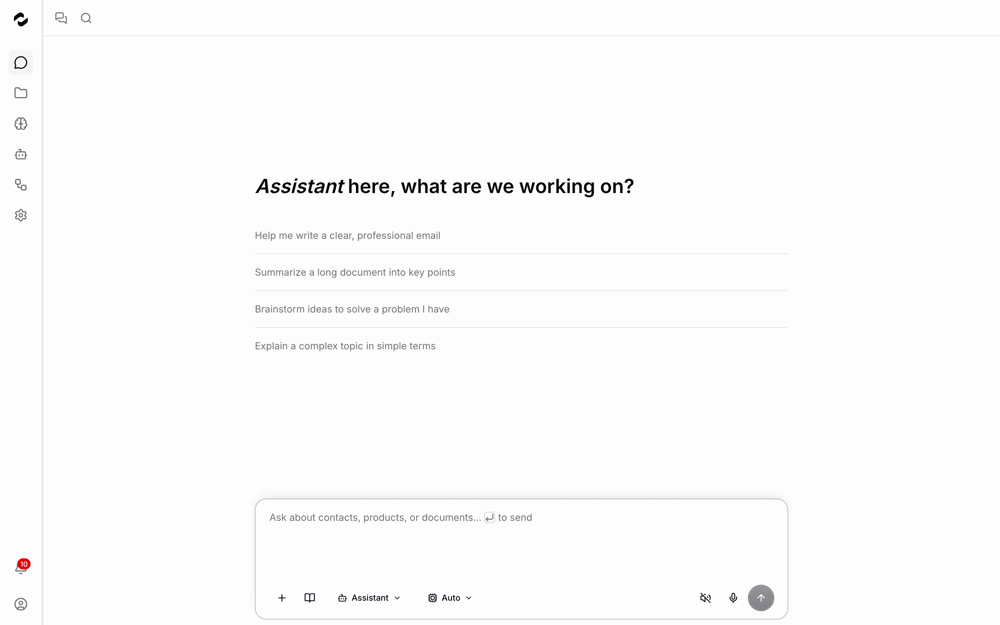</a>
       <b>New chat</b> — an agent's conversation starters, one click from work
    </td>
    <td width="50%">
      <a href="services/docs/public/images/platform/chat-arena-split.webp">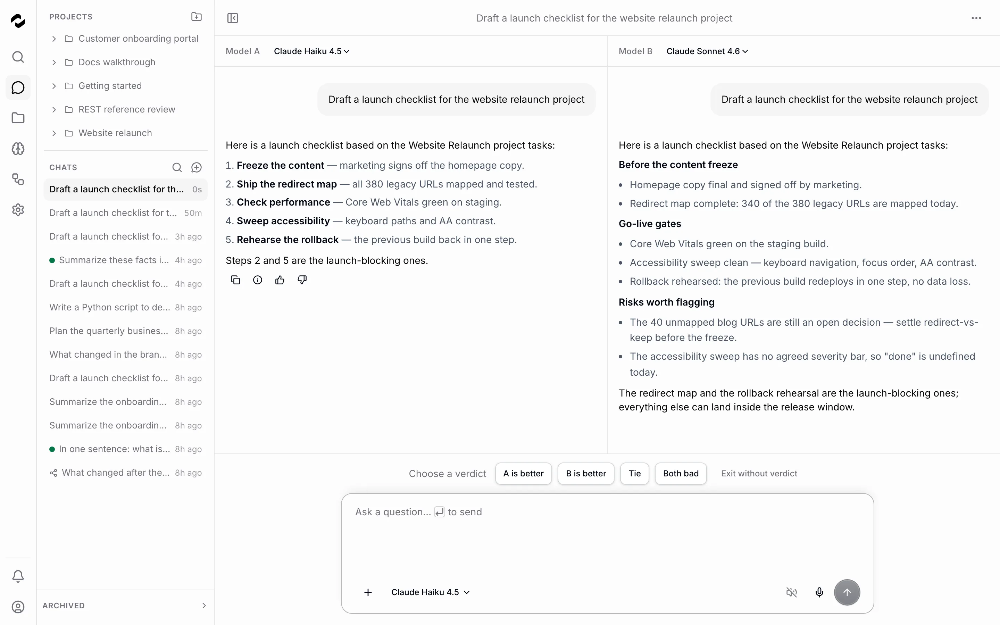</a>
       <b>Arena</b> — the same prompt streamed through two models, with a verdict bar
    </td>
  </tr>
  <tr>
    <td width="50%">
      <a href="services/docs/public/images/platform/chat-thread-reply.webp">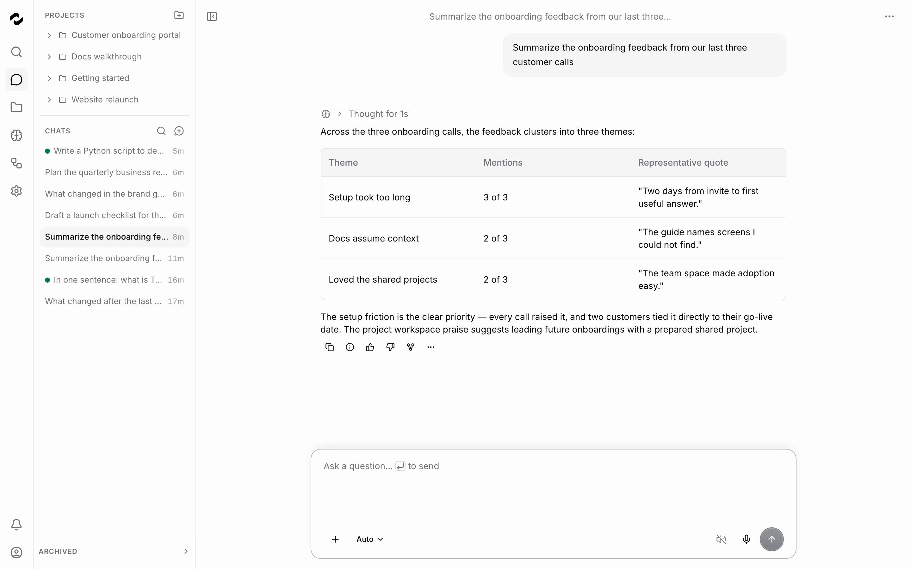</a>
       <b>Rich replies</b> — markdown tables, citations, and follow-up context
    </td>
    <td width="50%"></td>
  </tr>
</table>

## Projects and tasks

Shared workspaces that bundle the chats, files, instructions, and discussions around one piece
of work — with task boards agents work from.
[Projects docs →](https://tale.dev/docs/platform/projects/overview) ·
[Task automation docs →](https://tale.dev/docs/platform/projects/task-automation)

<table>
  <tr>
    <td width="50%">
      <a href="services/docs/public/images/platform/projects-task-board.webp">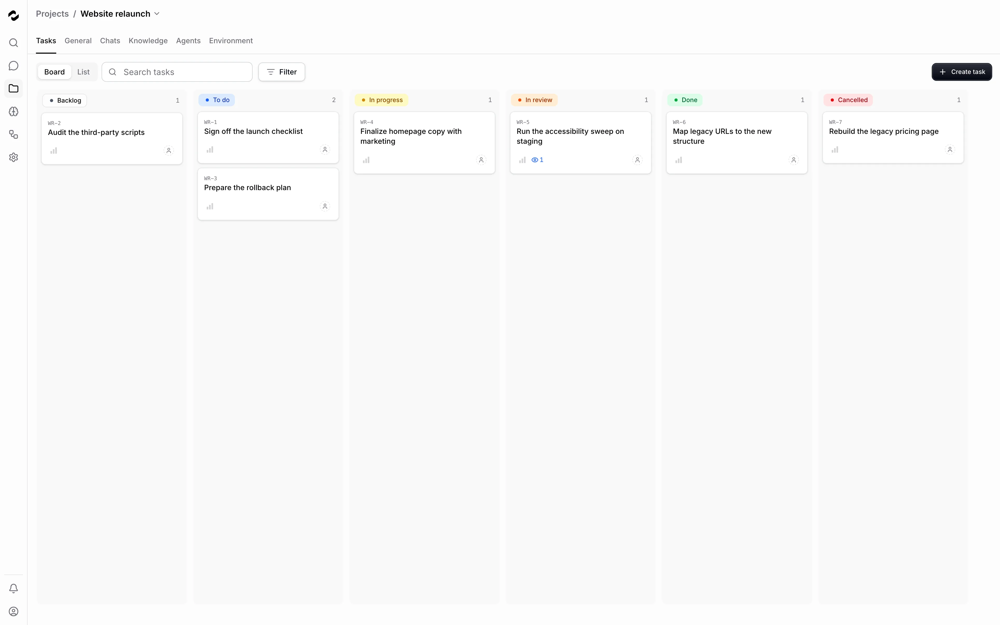</a>
       <b>Task board</b> — assign a card to an agent and it goes to work
    </td>
    <td width="50%">
      <a href="services/docs/public/images/platform/project-general-tab.webp">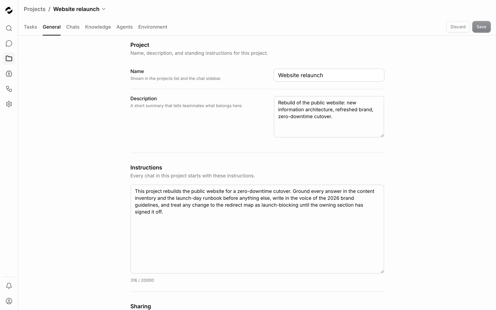</a>
       <b>Project home</b> — name, description, standing instructions, and sharing
    </td>
  </tr>
  <tr>
    <td width="50%">
      <a href="services/docs/public/images/platform/project-agents-models.webp">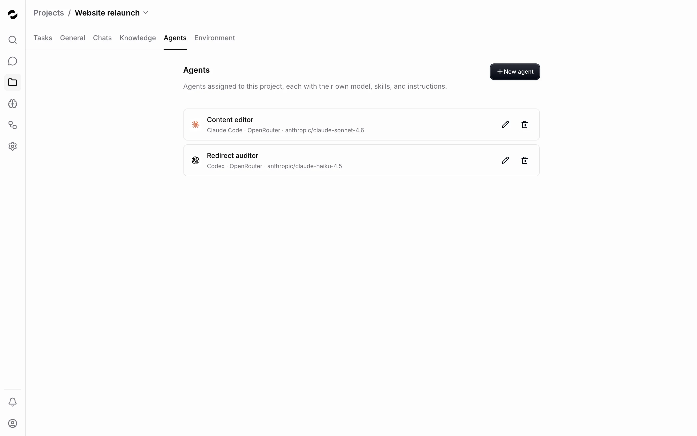</a>
       <b>Project agents</b> — a named crew, each with a harness, a model, and standing instructions
    </td>
    <td width="50%">
      <a href="services/docs/public/images/platform/project-knowledge-files.webp">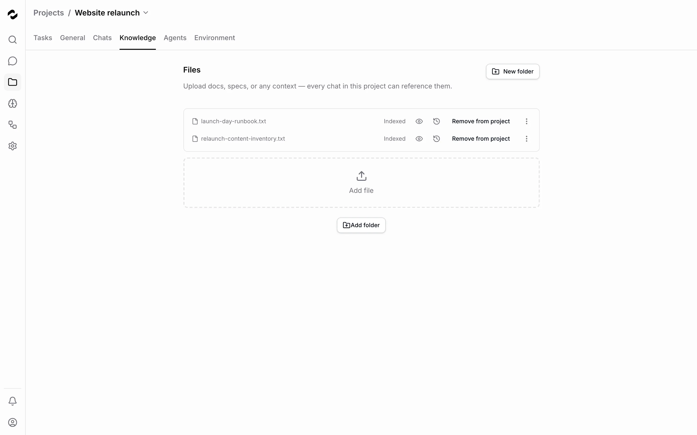</a>
       <b>Project files</b> — reference material available to every chat in the project
    </td>
  </tr>
</table>

## Knowledge

Documents, crawled websites, and typed records that agents retrieve and cite.
[Knowledge docs →](https://tale.dev/docs/platform/knowledge/overview)

<table>
  <tr>
    <td width="50%">
      <a href="services/docs/public/images/platform/websites-add-dialog.webp">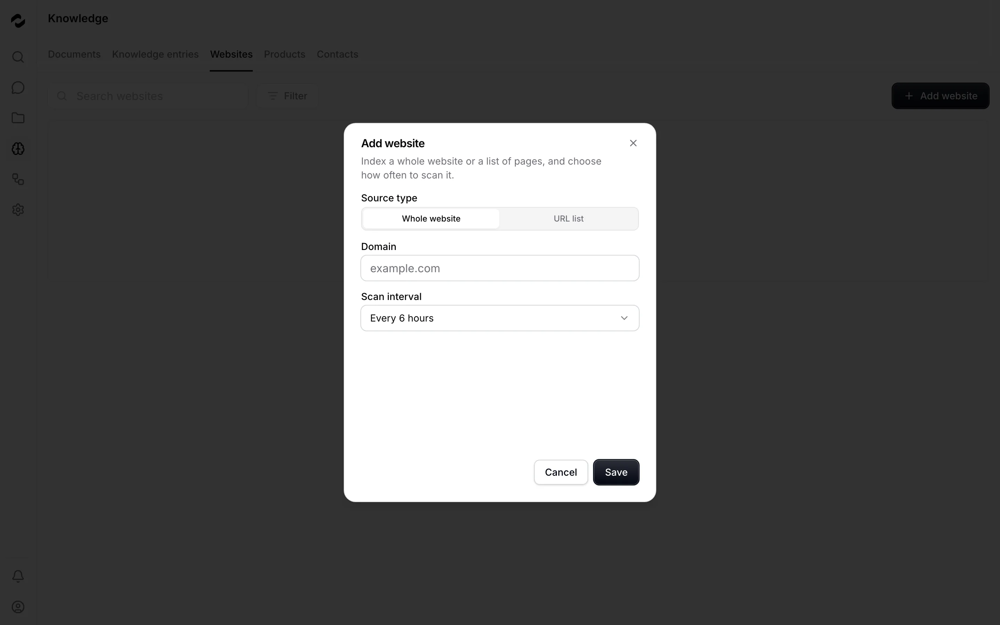</a>
       <b>Website crawling</b> — point Tale at a domain; it rescans on an interval
    </td>
    <td width="50%"></td>
  </tr>
</table>

## Automations

Typed workflows on schedules, webhooks, and events — with human approval gates.
[Automations docs →](https://tale.dev/docs/platform/automations/concepts)

<table>
  <tr>
    <td width="50%">
      <a href="services/docs/public/images/platform/automation-editor-canvas.webp">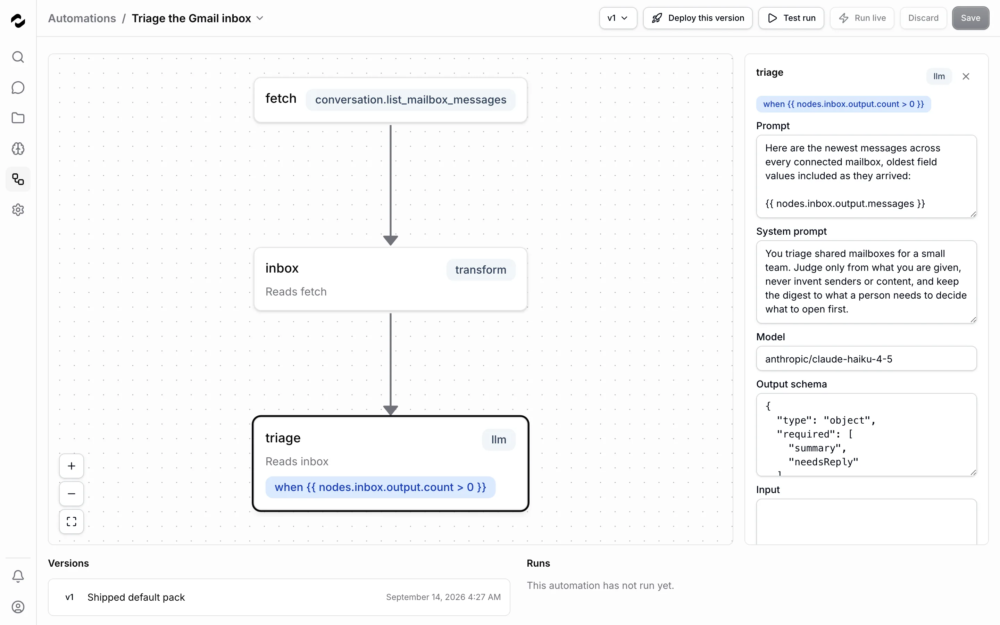</a>
       <b>Workflow editor</b> — the typed step graph, with the node inspector a click away
    </td>
    <td width="50%">
      <a href="services/docs/public/images/platform/automations-catalog.webp">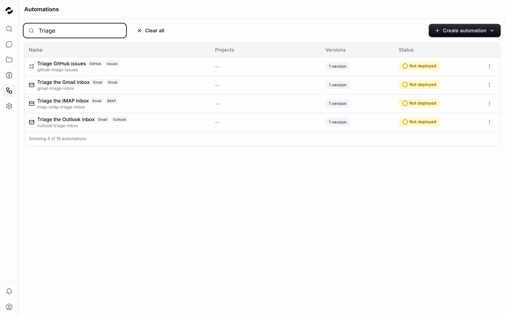</a>
       <b>Catalog</b> — ready-made automations, installable per organization
    </td>
  </tr>
</table>

## Connectors

Connect the systems your team already uses.
[Connectors docs →](https://tale.dev/docs/platform/connectors/overview)

<table>
  <tr>
    <td width="50%">
      <a href="services/docs/public/images/platform/settings-mcp-endpoint.webp">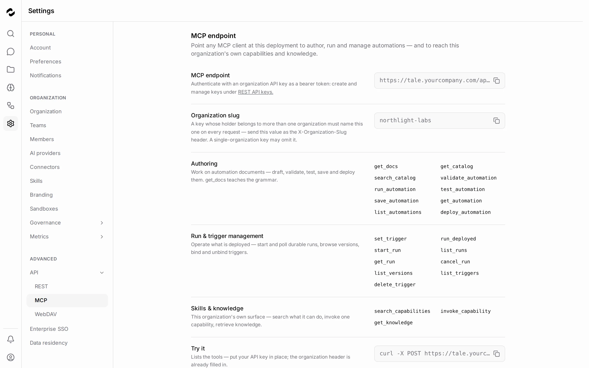</a>
       <b>MCP endpoint</b> — point any MCP client at the deployment to author and run automations
    </td>
    <td width="50%"></td>
  </tr>
</table>

## Governance

Approvals before actions ship — and the controls around them.
[Governance docs →](https://tale.dev/docs/platform/approvals/concepts)

<table>
  <tr>
    <td width="50%">
      <a href="services/docs/public/images/platform/governance-guardrails.webp">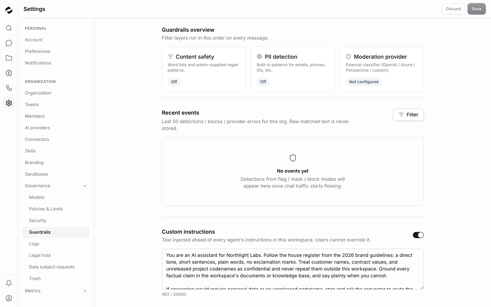</a>
       <b>Guardrails</b> — content safety, PII detection, and a moderation provider, layered per message
    </td>
    <td width="50%">
      <a href="services/docs/public/images/platform/governance-security-monitoring.webp">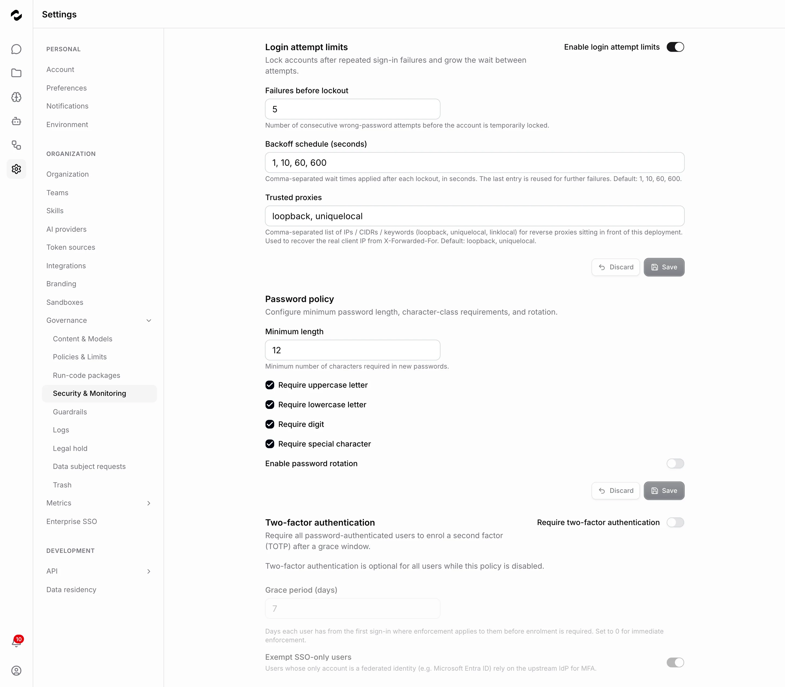</a>
       <b>Security & monitoring</b> — login-attempt limits and password policy
    </td>
  </tr>
  <tr>
    <td width="50%">
      <a href="services/docs/public/images/platform/governance-data-subject-requests.webp">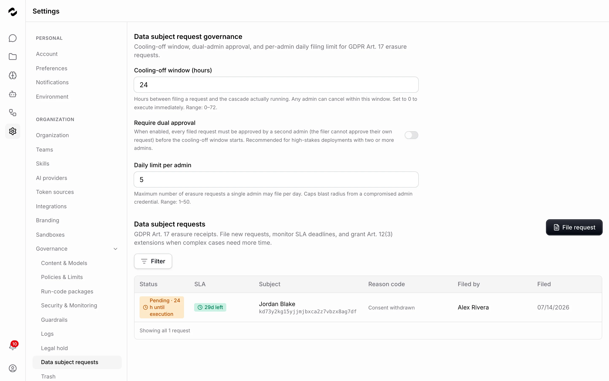</a>
       <b>Data subject requests</b> — GDPR Art. 17 erasure with cooling-off and dual approval
    </td>
    <td width="50%"></td>
  </tr>
</table>

## Admin and settings

The operator's side: models, members, branding, SSO, and your documents as a network drive.
[Platform reference →](https://tale.dev/docs/platform)

<table>
  <tr>
    <td width="50%">
      <a href="services/docs/public/images/get-started/settings-organization-members.webp">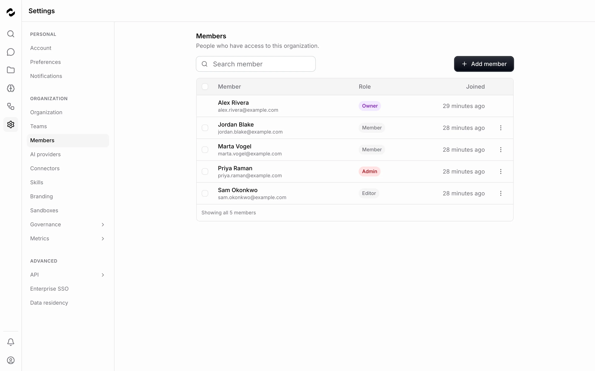</a>
       <b>Members</b> — the organization's people and their roles
    </td>
    <td width="50%">
      <a href="services/docs/public/images/platform/settings-branding.webp">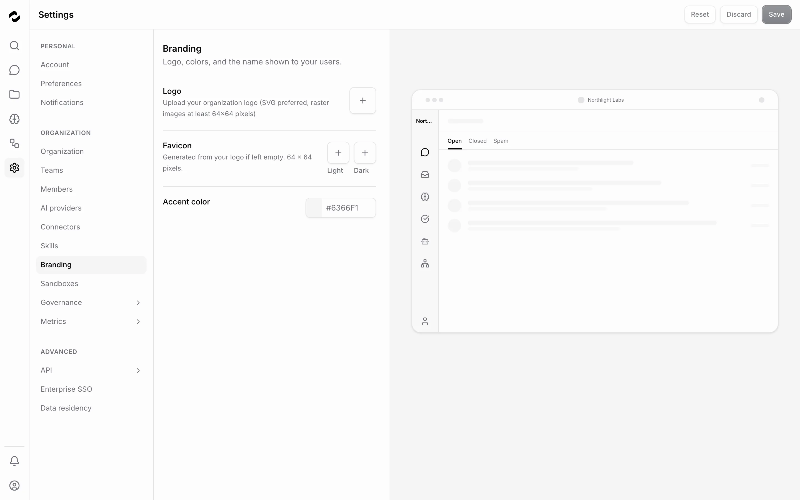</a>
       <b>Branding</b> — logo, favicon, accent color, live preview
    </td>
  </tr>
  <tr>
    <td width="50%">
      <a href="services/docs/public/images/platform/settings-enterprise-sso.webp">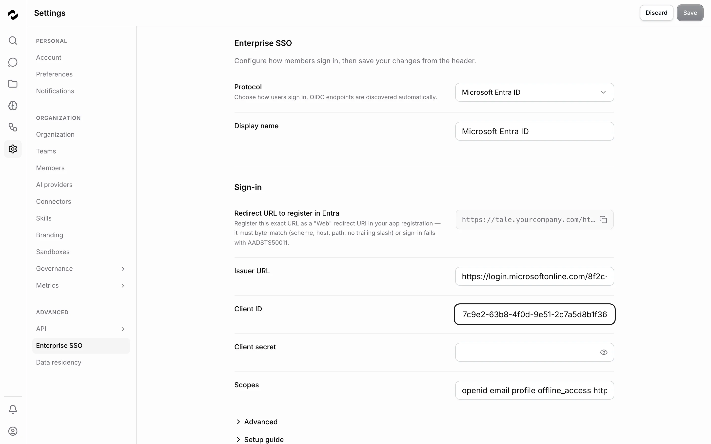</a>
       <b>Enterprise SSO</b> — Microsoft Entra ID or trusted headers
    </td>
    <td width="50%">
      <a href="services/docs/public/images/platform/settings-webdav.webp">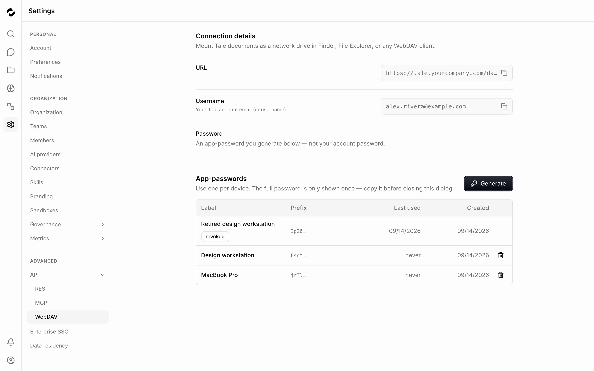</a>
       <b>WebDAV</b> — mount Tale documents as a network drive
    </td>
  </tr>
</table>

---

Want the guided version? Take the tour in the [docs](https://tale.dev/docs) — or head back to the
[README](README.md) to get Tale running in three commands.
