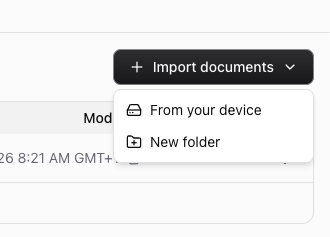

# Design comments

## Knowledge / Documents page

- [ ] "Import documents" dropdown button is missing — should show a button with "+ Import documents" text and a chevron-down, with a dropdown menu containing "From your device" and "New folder" options
- [ ] "Upload document" button context — the current button exists but lacks the dropdown menu state shown in the reference
  

## Documents page — Upload progress (#726)

- [ ] Need a design for the upload progress state inside the document upload dialog. Currently implemented with a basic progress bar and byte counter text, but needs a proper design pass.
  - Progress bar showing upload percentage (byte-level, not just per-file)
  - Text showing uploaded / total bytes (e.g. "12.4 MB / 54.2 MB")
  - For multi-file uploads: file completion count (e.g. "2 / 5 files completed")
  - States to cover: uploading single file, uploading multiple files, upload complete
