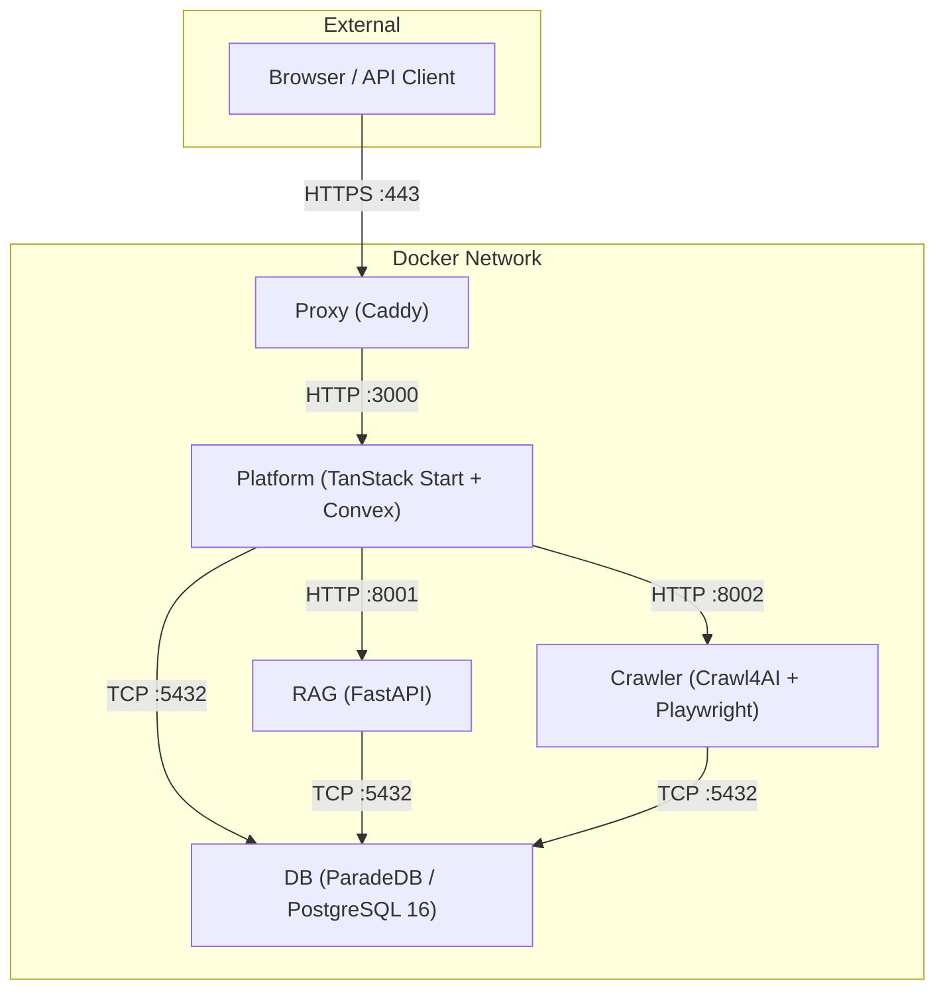

Tale runs as five Docker containers managed by Docker Compose. Each container has a single responsibility and communicates over an internal bridge network.

## Service overview

## Image details

| Service | Base image | Original size | Optimized size | Savings | Build strategy |
|---------|-----------|---------------|----------------|---------|----------------|
| Platform | `ghcr.io/get-convex/convex-backend` | ~2.98 GB | **2.58 GB** | 13% | 6-stage: deps → builder → pruner → dashboard → runner → squash |
| Crawler | `python:3.11-slim` | ~2.05 GB | **1.85 GB** | 10% | 3-stage: builder → runtime → squash. Chromium headless_shell only |
| RAG | `python:3.11-slim` | ~539 MB | **515 MB** | 4% | 3-stage: builder → runtime → squash. libpq5 only |
| DB | `paradedb/paradedb:0.22.5-pg16` | ~2.44 GB | **1.06 GB** | 57% | 3-stage: cleanup → runtime → squash. Debug symbols + LLVM stripped |
| Proxy | `caddy:2.11-alpine` | ~88 MB | **88 MB** | — | Single stage. Already minimal |
| **Total** | | **~10.1 GB** | **~6.1 GB** | **40%** | |

## Port mapping

### Development ports (`compose.yml`)

| Service | Host port | Container port | Protocol |
|---------|-----------|----------------|----------|
| DB | 5432 | 5432 | TCP (PostgreSQL) |
| Crawler | 8002 | 8002 | HTTP |
| RAG | 8001 | 8001 | HTTP |
| Platform | — | 3000, 3210 | HTTP (via proxy) |
| Proxy | 80, 443 | 80, 443 | HTTP/HTTPS |

### Test ports (`compose.test.yml`)

| Service | Host port | Container port |
|---------|-----------|----------------|
| DB | 15432 | 5432 |
| Crawler | 18002 | 8002 |
| RAG | 18001 | 8001 |
| Platform | 13000, 13210 | 3000, 3210 |
| Proxy | 10080, 10443 | 80, 443 |

## Volume mapping

| Volume | Mounted in | Path | Purpose |
|--------|-----------|------|---------|
| `db-data` | DB | `/var/lib/postgresql/data` | PostgreSQL data directory |
| `db-backup` | DB | `/var/lib/postgresql/backup` | Database backups |
| `rag-data` | RAG | `/app/data` | Temp files, document processing |
| `crawler-data` | Crawler | `/app/data` | Website registry, URL databases |
| `platform-data` | Platform | `/app/data` | Convex DB, agents, workflows |
| `platform-data` | Crawler, RAG | `/app/platform-config` | Shared provider config (read-only) |
| `caddy-data` | Proxy, Platform | `/data`, `/caddy-data` | TLS certificates |
| `caddy-config` | Proxy | `/config` | Caddy configuration |

> **Important:** Never run `docker compose down -v`. The `-v` flag deletes all Docker volumes, permanently erasing your database and all platform data.

## Build arguments

| Argument | Default | Used by | Description |
|----------|---------|---------|-------------|
| `VERSION` | `dev` | All | Image version tag (set by CI from git tag) |
| `INSTALL_CJK_FONTS` | `false` | Crawler | Install CJK font support (~100 MB) |

## Multi-stage build strategy

All services use a `FROM scratch` squash as their final stage. This flattens Docker layers so that file deletions in cleanup stages actually reclaim disk space, rather than just adding masking layers.

### Platform (6 stages)

1. **bun-bin** — Extracts Bun binary
2. **workspace-deps** — Installs all npm dependencies (including devDependencies)
3. **builder** — Runs `vite build` to produce the SPA
4. **pruner** — Reinstalls production-only deps, removes dev packages (`@vitest`, `@storybook`, `typescript`, etc.)
5. **runner** — Final runtime on Convex backend base with pruned `node_modules`, strips LLVM/Clang (~155 MB)
6. **squash** — `FROM scratch` + `COPY --from=runner`. Runs as root, drops to `app` user via `gosu` in entrypoint

### Crawler (3 stages)

1. **builder** — Installs Python deps via `uv`, downloads Chromium headless_shell, runs deep cleanup (removes full Chrome, FFmpeg, pip, `__pycache__`, `.so` debug symbols, test dirs)
2. **runtime** — Clean `python:3.11-slim` with only runtime system libs (Chromium deps, tini, curl). Strips LLVM/Adwaita icons
3. **squash** — `FROM scratch` + `COPY --from=runtime`. Pre-creates volume mountpoints for `/app/data` and `/app/platform-config`

### RAG (3 stages)

1. **builder** — Installs Python deps with `build-essential` + `libpq-dev` for compiling native packages, then strips pip/setuptools
2. **runtime** — Clean `python:3.11-slim` with only `libpq5` + `curl`. Pre-creates volume mountpoints
3. **squash** — `FROM scratch` + `COPY --from=runtime`

### DB (3 stages)

1. **cleanup** — Strips debug symbols (~888 MB), LLVM shared libraries (~127 MB), PostGIS extension files, locales, and docs from the ParadeDB base image
2. **runtime** — `FROM scratch` + `COPY --from=cleanup`. Fresh layer with only cleaned files
3. **squash** — Re-declares `PGDATA`, `PATH`, and other ENV vars lost during `FROM scratch`

## Health checks

| Service | Endpoint | Protocol | Start period |
|---------|----------|----------|-------------|
| DB | `pg_isready -U tale -d tale` | CLI | 60s |
| Crawler | `GET /health` on :8002 | HTTP | 40s |
| RAG | `GET /health` on :8001 | HTTP | 40s |
| Platform | `GET /api/health` + `GET :3210/version` | HTTP | 120s |
| Proxy | `GET /health` on :2020 (internal) | HTTP | 10s |

## Container testing

Tale includes three container test scripts:

| Script | Command | What it tests |
|--------|---------|---------------|
| `tests/container-smoke-test.sh` | `bun run docker:test` | Builds, starts, health checks, HTTP endpoints, inter-service connectivity |
| `tests/container-image-test.sh` | `bun run docker:test:image` | OCI labels, non-root user, no secrets, HEALTHCHECK instruction, size budgets |
| `tests/container-vulnerability-scan.sh` | `bun run docker:test:vulnerability` | Trivy vulnerability scan (HIGH + CRITICAL) |

See [Contributing Docker guide](/contributing-docker) for details on modifying Dockerfiles and running tests.
