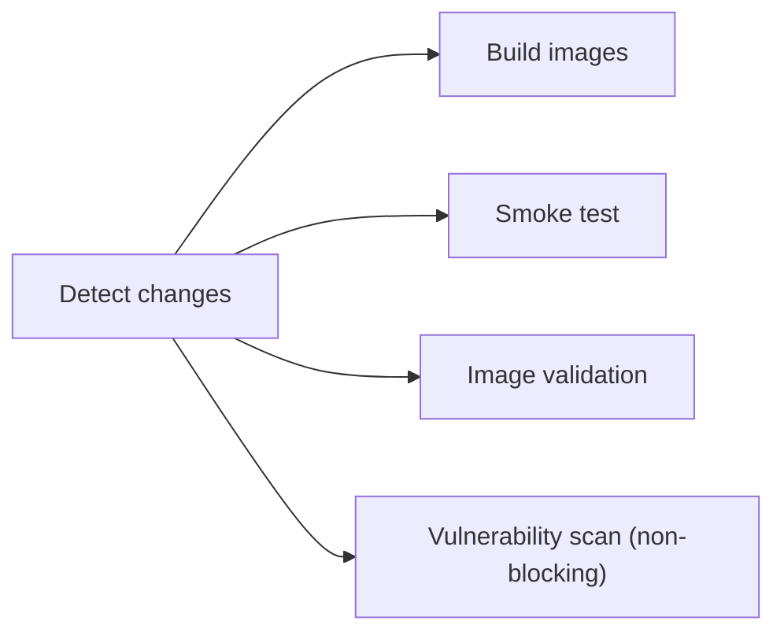
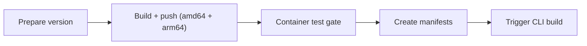

This guide covers the Docker development workflow for contributors who need to modify Dockerfiles, add dependencies, or debug container issues.

## Prerequisites

| Software | Minimum version |
|----------|----------------|
| Docker Desktop or Docker Engine | 24.0+ |
| Docker Compose | v2.20+ (included with Docker Desktop) |
| Trivy (optional) | Latest |

## Quick reference

```bash
# Build all images
docker compose build

# Build a single service
docker compose build platform

# Run container smoke tests (non-conflicting ports)
bun run docker:test

# Validate image structure (no secrets, OCI labels, size budgets)
bun run docker:test:image

# Vulnerability scan (requires trivy)
bun run docker:test:vulnerability

# Local development with hot-reload
docker compose -f compose.yml -f compose.dev.yml up --build
```

## Dockerfile conventions

### Multi-stage builds

All Python and Node.js images use multi-stage builds. The pattern is:

1. **Builder stage** — Install all build dependencies, compile native packages
2. **Runtime stage** — Copy only runtime artifacts into a clean base image
3. **Squash stage** — `FROM scratch` + `COPY --from=runtime / /` to flatten layers

The squash stage ensures that file deletions in cleanup steps actually reclaim disk space, rather than just adding masking layers. This keeps build tools (`gcc`, `build-essential`, `libpq-dev`) out of the final image.

> **Important:** When using `FROM scratch`, all ENV vars from upstream stages are lost and must be re-declared. Volume mountpoints must also be pre-created in the runtime stage before the squash.

### Layer caching

Order your `COPY` and `RUN` instructions from least-frequently-changed to most-frequently-changed:

```dockerfile
# Good: dependencies change less often than application code
COPY pyproject.toml .
RUN uv pip install --system --no-cache-dir .
COPY app/ ./app/
```

### No cache flags

Always use `--no-cache-dir` (pip/uv) and `--no-install-recommends` (apt-get):

```dockerfile
RUN apt-get update && apt-get install -y --no-install-recommends curl \
    && rm -rf /var/lib/apt/lists/*
RUN uv pip install --system --no-cache-dir .
```

### OCI labels

Every Dockerfile must include a version label:

```dockerfile
ARG VERSION=dev
LABEL org.opencontainers.image.version="${VERSION}"
```

### Health checks

Every Dockerfile must include a `HEALTHCHECK` instruction:

```dockerfile
HEALTHCHECK --interval=30s --timeout=10s --start-period=40s --retries=3 \
    CMD curl -f http://localhost:8001/health || exit 1
```

## Image size budgets

Each image has a size budget. CI will fail if an image exceeds its budget.

| Service | Budget | Current |
|---------|--------|---------|
| Crawler | 2,100 MB | ~1,850 MB |
| RAG | 600 MB | ~515 MB |
| Platform | 2,900 MB | ~2,580 MB |
| DB | 1,200 MB | ~1,060 MB |
| Proxy | 100 MB | ~88 MB |

### Common reasons for size increases

1. **Adding a new Python dependency** — Check if it pulls in large transitive deps
2. **Adding apt packages** — Use `--no-install-recommends` and clean up afterwards
3. **Forgetting to strip in builder** — Remove `__pycache__`, `.pyc`, test dirs, `.so` debug symbols
4. **Not using multi-stage** — Build tools must stay in the builder stage

### Reducing image size

```bash
# Check what's taking space in an image
docker run --rm -it <image> du -sh /* 2>/dev/null | sort -rh | head -20

# Check Python packages
docker run --rm <image> pip list 2>/dev/null || \
docker run --rm <image> python -c "import pkg_resources; [print(f'{p.key}: {p.location}') for p in pkg_resources.working_set]"

# Dive: visual layer analysis
# Install: https://github.com/wagoodman/dive
dive <image>
```

## Testing workflow

### 1. Build and smoke test

```bash
bun run docker:test
```

This runs `tests/container-smoke-test.sh` which:
- Builds all 5 images
- Starts services on non-conflicting ports (15432, 18001, 18002, etc.)
- Waits for health checks
- Validates HTTP endpoints
- Tests inter-service connectivity
- Tears down everything (including volumes)

### 2. Image validation

```bash
bun run docker:test:image
```

Checks each image for:
- OCI `org.opencontainers.image.version` label
- Non-root user (required for platform)
- No secrets baked into image env or filesystem
- `HEALTHCHECK` instruction present
- Image size within budget

### 3. Vulnerability scanning

```bash
bun run docker:test:vulnerability
```

Runs Trivy against each image. Reports are saved to `trivy-reports/`.

To suppress a known false positive, add the CVE ID to `.trivyignore`:

```
CVE-2023-12345    # false positive: function not reachable
```

## CI/CD pipeline

### On pull requests (`build.yml`)



### On release tags (`release.yml`)



The container test gate pulls the just-pushed images and runs smoke tests + image validation before manifests are created.

## Common pitfalls

### "parent snapshot does not exist"

Docker BuildKit cache corruption. Fix:

```bash
docker builder prune -f
```

### Port already in use

Use `compose.test.yml` which maps to non-conflicting ports:

```bash
docker compose -f compose.yml -f compose.test.yml --env-file .env.test -p tale-test up -d
```

### Python package not found at runtime

If a package is installed in the builder but not available in the runtime stage, check that:
1. You're copying from the correct path: `COPY --from=builder /usr/local/lib/python3.11/site-packages ...`
2. The package's `.dist-info` isn't being removed if something depends on metadata at runtime
3. The strip step isn't removing required `.so` files

### Node.js module not found at runtime

If a module is missing after the pruner stage, check:
1. Whether it's listed in `dependencies` (not `devDependencies`) in `package.json`
2. Whether the pruner step explicitly removes it in the `rm -rf` list
