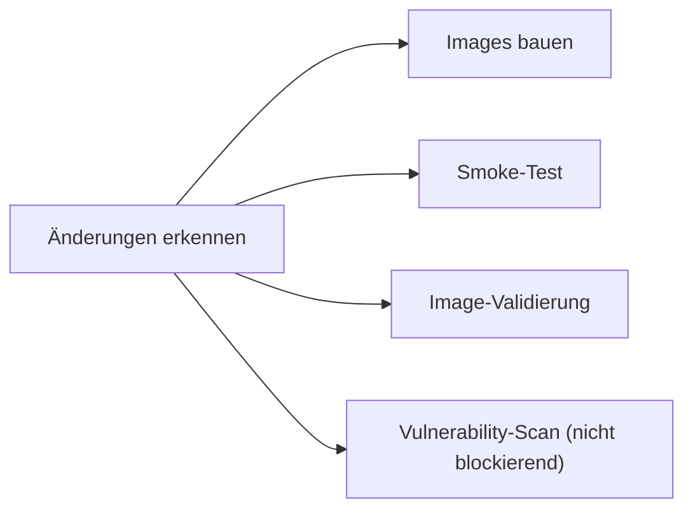
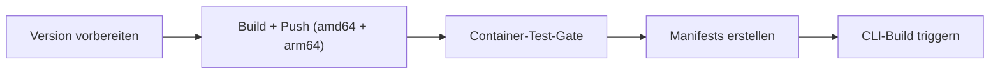

Dieser Leitfaden beschreibt den Docker-Entwicklungs-Workflow für Beitragende, die Dockerfiles anpassen, Abhängigkeiten ergänzen oder Container-Probleme debuggen.

## Voraussetzungen

| Software                          | Mindestversion                       |
| --------------------------------- | ------------------------------------ |
| Docker Desktop oder Docker Engine | 24.0+                                |
| Docker Compose                    | v2.20+ (in Docker Desktop enthalten) |
| Trivy (optional)                  | neueste Version                      |

## Schnellreferenz

```bash
# Alle Images bauen
docker compose build

# Einzelnen Dienst bauen
docker compose build platform

# Container-Smoke-Tests (nicht-konflikthafte Ports)
bun run docker:test

# Image-Struktur validieren (keine Secrets, OCI-Labels, Size-Budgets)
bun run docker:test:image

# Vulnerability-Scan (benötigt Trivy)
bun run docker:test:vulnerability

# Lokale Entwicklung mit Hot-Reload
docker compose -f compose.yml -f compose.dev.yml up --build
```

## Dockerfile-Konventionen

### Multi-Stage-Builds

Alle Python- und Node.js-Images nutzen Multi-Stage-Builds. Das Muster:

1. **Builder-Stage** — alle Build-Abhängigkeiten installieren, native Pakete kompilieren.
2. **Runtime-Stage** — nur Runtime-Artefakte in ein sauberes Basis-Image kopieren.
3. **Squash-Stage** — `FROM scratch` + `COPY --from=runtime / /`, um Layer abzuflachen.

Die Squash-Stage sorgt dafür, dass Dateilöschungen in Cleanup-Schritten wirklich Platz freigeben und nicht nur maskierende Layer hinzufügen. So bleiben Build-Tools (`gcc`, `build-essential`, `libpq-dev`) aus dem finalen Image draußen.

> **Wichtig:** Bei `FROM scratch` gehen alle ENV-Vars aus vorherigen Stages verloren und müssen neu deklariert werden. Volume-Mountpoints müssen ebenfalls in der Runtime-Stage vor dem Squash angelegt werden.

### Layer-Caching

`COPY`- und `RUN`-Anweisungen vom seltensten zum häufigsten Änderungsrhythmus ordnen:

```dockerfile
# Gut: Abhängigkeiten ändern sich seltener als Anwendungscode
COPY pyproject.toml .
RUN uv pip install --system --no-cache-dir .
COPY app/ ./app/
```

### Kein-Cache-Flags

Immer `--no-cache-dir` (pip/uv) und `--no-install-recommends` (apt-get) nutzen:

```dockerfile
RUN apt-get update && apt-get install -y --no-install-recommends curl \
    && rm -rf /var/lib/apt/lists/*
RUN uv pip install --system --no-cache-dir .
```

### OCI-Labels

Jedes Dockerfile muss ein Versions-Label enthalten:

```dockerfile
ARG VERSION=dev
LABEL org.opencontainers.image.version="${VERSION}"
```

### Health-Checks

Jedes Dockerfile muss eine `HEALTHCHECK`-Anweisung enthalten:

```dockerfile
HEALTHCHECK --interval=30s --timeout=10s --start-period=40s --retries=3 \
    CMD curl -f http://localhost:8001/health || exit 1
```

## Image-Size-Budgets

Jedes Image hat ein Size-Budget. CI schlägt fehl, wenn ein Image sein Budget überschreitet.

| Dienst    | Budget   | Aktuell   |
| --------- | -------- | --------- |
| Crawler   | 2.100 MB | ~1.850 MB |
| RAG       | 600 MB   | ~515 MB   |
| Platform  | 2.900 MB | ~2.580 MB |
| DB        | 1.200 MB | ~1.060 MB |
| Proxy     | 100 MB   | ~88 MB    |

### Häufige Ursachen für Größenzuwächse

1. **Neue Python-Abhängigkeit** — prüfe, ob sie große transitive Deps mitzieht.
2. **Neue apt-Pakete** — `--no-install-recommends` nutzen und danach aufräumen.
3. **Vergessenes Strippen in der Builder-Stage** — `__pycache__`, `.pyc`, Test-Verzeichnisse, `.so`-Debug-Symbole entfernen.
4. **Kein Multi-Stage** — Build-Tools müssen in der Builder-Stage bleiben.

### Image-Größe reduzieren

```bash
# Sehen, was im Image Platz frisst
docker run --rm -it <image> du -sh /* 2>/dev/null | sort -rh | head -20

# Python-Pakete prüfen
docker run --rm <image> pip list 2>/dev/null || \
docker run --rm <image> python -c "import pkg_resources; [print(f'{p.key}: {p.location}') for p in pkg_resources.working_set]"

# Dive: visuelle Layer-Analyse
# Installieren: https://github.com/wagoodman/dive
dive <image>
```

## Test-Workflow

### 1. Bauen und Smoke-Test

```bash
bun run docker:test
```

Das führt `tests/container-smoke-test.sh` aus und:

- baut alle fünf Images;
- startet Dienste auf nicht-konflikthaften Ports (15432, 18001, 18002 etc.);
- wartet auf Health-Checks;
- validiert HTTP-Endpoints;
- testet Inter-Service-Konnektivität;
- baut alles wieder ab (inkl. Volumes).

### 2. Image-Validierung

```bash
bun run docker:test:image
```

Prüft jedes Image auf:

- OCI-`org.opencontainers.image.version`-Label;
- Non-Root-User (für Platform Pflicht);
- keine in Image-Env oder Dateisystem eingebackenen Secrets;
- vorhandene `HEALTHCHECK`-Instruktion;
- Größe im Budget.

### 3. Vulnerability-Scanning

```bash
bun run docker:test:vulnerability
```

Führt Trivy gegen jedes Image aus. Berichte landen in `trivy-reports/`.

Um eine bekannte False Positive zu unterdrücken, die CVE-ID in `.trivyignore` eintragen:

```
CVE-2023-12345    # false positive: function not reachable
```

## CI/CD-Pipeline

### Bei Pull Requests (`build.yml`)



### Bei Release-Tags (`release.yml`)



Das Container-Test-Gate zieht die gerade gepushten Images und führt Smoke-Test + Image-Validierung aus, bevor Manifests erstellt werden.

## Häufige Fallstricke

### "parent snapshot does not exist"

Docker-BuildKit-Cache-Korruption. Fix:

```bash
docker builder prune -f
```

### Port bereits in Benutzung

Nutze `compose.test.yml`, das auf nicht-konflikthafte Ports mappt:

```bash
docker compose -f compose.yml -f compose.test.yml --env-file .env.test -p tale-test up -d
```

### Python-Paket zur Laufzeit nicht gefunden

Wenn ein Paket im Builder installiert, aber in der Runtime-Stage nicht verfügbar ist, prüfe:

1. Ob du aus dem richtigen Pfad kopierst: `COPY --from=builder /usr/local/lib/python3.11/site-packages ...`.
2. Ob der `.dist-info` des Pakets nicht entfernt wird (zur Laufzeit verlangen manche Pakete Metadaten).
3. Ob der Strip-Schritt keine benötigten `.so`-Dateien entfernt.

### Node.js-Modul zur Laufzeit nicht gefunden

Wenn nach der Pruner-Stage ein Modul fehlt, prüfe:

1. Ob es unter `dependencies` (nicht `devDependencies`) in `package.json` steht.
2. Ob der Pruner-Schritt es in seiner `rm -rf`-Liste explizit entfernt.
