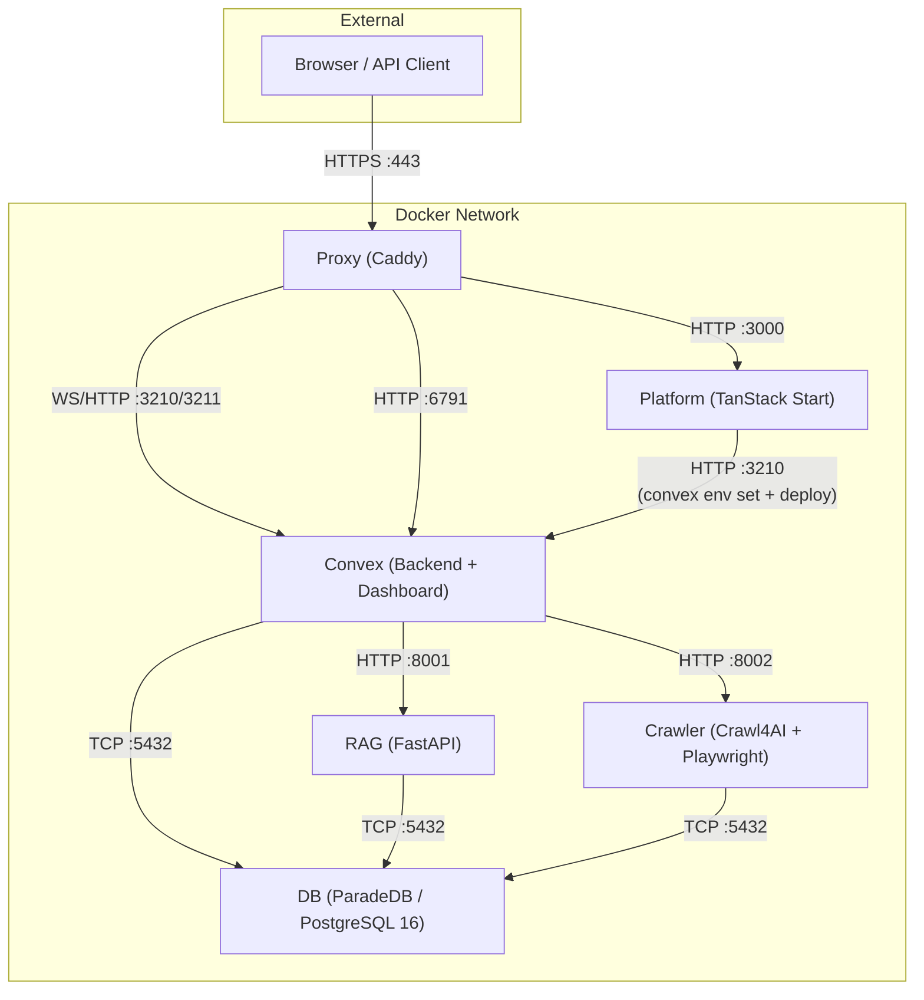

Tale läuft als **sechs** Docker-Container, die von Docker Compose verwaltet werden. Jeder Container hat genau eine Verantwortung und kommuniziert über ein internes Bridge-Netzwerk. Convex läuft als eigener Dienst (`convex`) und bedient WebSocket-Clients unabhängig vom Platform-Container; Platform ist ein schlanker Vite-Client, der Schema und Env über HTTP an Convex pusht.

## Dienst-Übersicht

## Image-Details

| Dienst   | Basis-Image                                                               | Optimierte Grösse       | Build-Strategie                                                    |
| -------- | ------------------------------------------------------------------------- | ----------------------- | ------------------------------------------------------------------ |
| Platform | `ghcr.io/get-convex/convex-backend` (für die glibc-Binary `generate_key`) | **~320 MB komprimiert** | 5-Stage: deps → builder → pruner → runner → squash                 |
| Convex   | `ghcr.io/get-convex/convex-backend`                                       | **~485 MB komprimiert** | 2-Stage: dashboard → runner (Dashboard aus Upstream-Image kopiert) |
| Crawler  | `python:3.11-slim`                                                        | **~650 MB komprimiert** | 3-Stage: builder → runtime → squash. Chromium headless_shell only  |
| RAG      | `python:3.11-slim`                                                        | **~515 MB**             | 3-Stage: builder → runtime → squash. libpq5 only                   |
| DB       | `paradedb/paradedb:0.22.5-pg16`                                           | **~1.06 GB**            | 3-Stage: cleanup → runtime → squash                                |
| Proxy    | `caddy:2.11-alpine`                                                       | **~88 MB**              | Einzel-Stage                                                       |

Das Abspalten von Convex aus Platform hat das Platform-Image von ca. 2,58 GB auf ca. 320 MB komprimiert reduziert; der Convex-Dienst ist ein neues ca. 485 MB grosses Image. In Summe ist der Plattenbedarf ähnlich, aber der Platform-Layer baut für reine App-Änderungen viel schneller.

## Port-Mapping

### Entwicklungs-Ports (`compose.yml`)

| Dienst   | Host-Port | Container-Port   | Protokoll            |
| -------- | --------- | ---------------- | -------------------- |
| DB       | 5432      | 5432             | TCP (PostgreSQL)     |
| Crawler  | 8002      | 8002             | HTTP                 |
| RAG      | 8001      | 8001             | HTTP                 |
| Convex   | —         | 3210, 3211, 6791 | WS/HTTP (über Proxy) |
| Platform | —         | 3000             | HTTP (über Proxy)    |
| Proxy    | 80, 443   | 80, 443          | HTTP/HTTPS           |

### Test-Ports (`compose.test.yml`)

| Dienst   | Host-Port           | Container-Port   |
| -------- | ------------------- | ---------------- |
| DB       | 15432               | 5432             |
| Crawler  | 18002               | 8002             |
| RAG      | 18001               | 8001             |
| Convex   | 13210, 13211, 16791 | 3210, 3211, 6791 |
| Platform | 13000               | 3000             |
| Proxy    | 10080, 10443        | 80, 443          |

## Volume-Mapping

| Volume          | Eingebunden in                | Pfad                                   | Zweck                                                                                                                                       |
| --------------- | ----------------------------- | -------------------------------------- | ------------------------------------------------------------------------------------------------------------------------------------------- |
| `db-data`       | DB                            | `/var/lib/postgresql/data`             | PostgreSQL-Datenverzeichnis                                                                                                                 |
| `db-backup`     | DB                            | `/var/lib/postgresql/backup`           | Datenbank-Backups                                                                                                                           |
| `rag-data`      | RAG                           | `/app/data`                            | Temp-Dateien, Dokument-Verarbeitung                                                                                                         |
| `crawler-data`  | Crawler                       | `/app/data`                            | Website-Register, URL-Datenbanken                                                                                                           |
| `convex-data`   | Convex                        | `/app/data`                            | Convex-DB (SQLite/pg-local), Such-Indizes, Dateien, agents/workflows/integrations/providers JSON                                            |
| `convex-data`   | Platform                      | `/app/data` **(read-only)**            | Config-SSE-Watcher + Branding-Bildausgabe                                                                                                   |
| `convex-data`   | Crawler, RAG                  | `/app/platform-config` **(read-only)** | gemeinsamer Anbieter-Config                                                                                                                 |
| `caddy-data`    | Proxy, Convex                 | `/data`, `/caddy-data`                 | TLS-Zertifikate                                                                                                                             |
| `caddy-config`  | Proxy                         | `/config`                              | Caddy-Konfiguration                                                                                                                         |
| `platform-data` | — _(Legacy, nicht gemountet)_ | —                                      | Nach Upgrade zur Rollback-Sicherheit erhalten; nach Verifikation des Splits manuell entfernen: `docker volume rm <projectId>_platform-data` |

> **Wichtig:** Führe niemals `docker compose down -v` aus. Das Flag `-v` löscht alle Docker-Volumes und vernichtet damit unwiderruflich deine Datenbank und sämtliche Plattform-Daten.

## Build-Argumente

| Argument            | Standard | Genutzt von | Beschreibung                                    |
| ------------------- | -------- | ----------- | ----------------------------------------------- |
| `VERSION`           | `dev`    | alle        | Image-Version-Tag (aus Git-Tag von CI gesetzt). |
| `INSTALL_CJK_FONTS` | `false`  | Crawler     | CJK-Font-Unterstützung installieren (~100 MB).  |

## Multi-Stage-Build-Strategie

Alle Dienste nutzen als letzte Stage ein `FROM scratch`-Squash. Das flacht Docker-Layer ab, sodass Dateilöschungen in Cleanup-Stages wirklich Platz freigeben und nicht nur maskierende Layer ergänzen.

### Platform (5 Stages, post-Split)

1. **bun-bin** — extrahiert das Bun-Binary.
2. **workspace-deps** — installiert alle npm-Abhängigkeiten (inkl. devDependencies).
3. **builder** — läuft `vite build` zur SPA.
4. **pruner** — reinstalliert nur Produktions-Deps, entfernt Dev-Pakete (`@vitest`, `@storybook`, `typescript`, etc.).
5. **runner** — finale Runtime auf dem `convex-backend`-Basis-Image (bleibt wegen der glibc-Binary `generate_key`, die Convex-Admin-Tokens signiert). Nur Vite-SPA + Bun-Server — kein Convex-Backend-Prozess.
6. **squash** — `FROM scratch` + `COPY --from=runner`. Läuft als root, wechselt via `gosu` im Entrypoint zum User `app`.

### Convex (2 Stages, neu in Phase 2)

1. **convex-dashboard** — `FROM ghcr.io/get-convex/convex-dashboard`, um den Next.js-Standalone-Build zu kopieren.
2. **runner** — `FROM ghcr.io/get-convex/convex-backend`. Enthält den `convex-local-backend`-Daemon, das Dashboard, eingebaute Seed-Assets (agents/workflows/integrations/providers/branding) und Entrypoint. Entfernt LLVM/Clang (~155 MB).

### Crawler (3 Stages)

1. **builder** — Python-Deps per `uv` installieren, Chromium headless_shell laden, tiefes Cleanup (entfernt vollständiges Chrome, FFmpeg, pip, `__pycache__`, `.so`-Debug-Symbole, Test-Verzeichnisse).
2. **runtime** — sauberes `python:3.11-slim` mit nur Runtime-System-Libs (Chromium-Deps, tini, curl). Entfernt LLVM/Adwaita-Icons.
3. **squash** — `FROM scratch` + `COPY --from=runtime`. Legt Volume-Mountpoints für `/app/data` und `/app/platform-config` im Voraus an.

### RAG (3 Stages)

1. **builder** — Python-Deps mit `build-essential` + `libpq-dev` zum Kompilieren nativer Pakete installieren, danach pip/setuptools entfernen.
2. **runtime** — sauberes `python:3.11-slim` nur mit `libpq5` + `curl`. Volume-Mountpoints im Voraus anlegen.
3. **squash** — `FROM scratch` + `COPY --from=runtime`.

### DB (3 Stages)

1. **cleanup** — entfernt Debug-Symbole (~888 MB), LLVM-Shared-Libraries (~127 MB), PostGIS-Extension-Files, Locales und Docs aus dem ParadeDB-Basis-Image.
2. **runtime** — `FROM scratch` + `COPY --from=cleanup`. Frischer Layer nur mit bereinigten Dateien.
3. **squash** — deklariert `PGDATA`, `PATH` und andere ENV-Vars neu, die bei `FROM scratch` verloren gingen.

## Health-Checks

| Dienst   | Endpoint                                              | Protokoll    | Startfenster |
| -------- | ----------------------------------------------------- | ------------ | ------------ |
| DB       | `pg_isready -U tale -d tale`                          | CLI          | 60 s         |
| Crawler  | `GET /health` auf :8002                               | HTTP         | 40 s         |
| RAG      | `GET /health` auf :8001                               | HTTP         | 40 s         |
| Convex   | `GET :3210/version` + `[ -f /tmp/convex-ready ]`      | HTTP + Datei | 60 s         |
| Platform | `GET :3000/api/health` + `[ -f /tmp/platform-ready ]` | HTTP + Datei | 180 s        |
| Proxy    | `GET /health` auf :2020 (intern)                      | HTTP         | 10 s         |

Die Marker `/tmp/<service>-ready` werden vom Entrypoint jedes Dienstes gesetzt, sobald dessen Einmal-Init-Arbeit abgeschlossen ist (Convex: Backend läuft + Builtin-Seed; Platform: Env-Sync + `convex deploy`). Das verhindert, dass Traffic geroutet wird, bevor der Dienst wirklich bereit ist.

## Container-Tests

Tale bringt drei Container-Testskripte mit:

| Skript                                  | Kommando                            | Prüft                                                                            |
| --------------------------------------- | ----------------------------------- | -------------------------------------------------------------------------------- |
| `tests/container-smoke-test.sh`         | `bun run docker:test`               | baut, startet, Health-Checks, HTTP-Endpoints, Inter-Service-Konnektivität.       |
| `tests/container-image-test.sh`         | `bun run docker:test:image`         | OCI-Labels, Non-Root-User, keine Secrets, HEALTHCHECK-Instruktion, Size-Budgets. |
| `tests/container-vulnerability-scan.sh` | `bun run docker:test:vulnerability` | Trivy-Vulnerability-Scan (HIGH + CRITICAL).                                      |

Siehe [Contributing Docker guide](/de/develop/contributing-docker) für Details zum Ändern von Dockerfiles und Ausführen der Tests.
