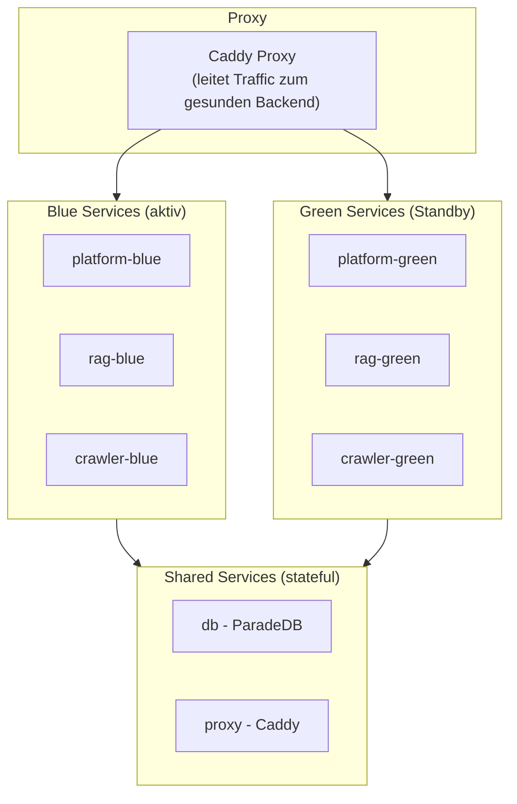

Tale ist eine Open-Source-Plattform für selbst gehostete KI, die Teams eine vollständige KI-Anwendung gibt, die sie besitzen, steuern und erweitern können. Sie umfasst einen intelligenten Chat-Assistenten, eine semantische Wissensdatenbank, Kundenkonversations-Verwaltung, visuelle Automatisierungs-Workflows und eine strukturierte API-Schicht.

Anders als Cloud-only-KI-Produkte läuft Tale vollständig auf deiner eigenen Infrastruktur. Deine Daten bleiben auf deinen Servern. Es gibt keine Per-Seat-Gebühren, keine Anbieter-Bindung und keine Modell-Einschränkungen, die über das hinausgehen, was dein API-Schlüssel unterstützt.

## Architektur im Überblick

Tale läuft als fünf Docker-Dienste, die über ein internes Netzwerk kommunizieren:

| Dienst   | Technologie                                  | Rolle                                                        | Lokaler Port      |
| -------- | -------------------------------------------- | ------------------------------------------------------------ | ----------------- |
| Platform | Bun + TanStack + Convex                      | Web-UI, Realtime-Backend, Auth, Daten, Workflows             | 3000 (über Proxy) |
| RAG      | Python + FastAPI                             | Dokumenten-Indizierung, Vektor-Suche, Antwort-Generierung    | 8001              |
| Crawler  | Python + Playwright + Crawl4AI               | Website-Crawling, URL-Discovery, Datei-zu-Text-Konvertierung | 8002              |
| Database | ParadeDB (PostgreSQL + pg_search + pgvector) | persistenter Speicher, Volltext-Suche, Vektor-Suche          | 5432              |
| Proxy    | Caddy                                        | TLS-Terminierung und Routing                                 | 80 / 443          |

> **Hinweis:** Die gesamte Kommunikation zwischen den Diensten bleibt im internen Docker-Netzwerk. Nach aussen sichtbar sind nur die Ports 80 und 443 über den Caddy-Proxy. Die Datenbank (5432) und API-Dienste (8001, 8002) sind nur für lokale Entwicklung auf dem Host exponiert.

## Kernfähigkeiten

- KI-Chat-Assistent mit mehrstufigen Konversationen, Datei-Anhängen, Agent-Auswahl, [Arena-Modus](/de/platform/chat/arena-mode) zum Modellvergleich, [Canvas](/de/platform/workspace/canvas) zur Inhaltsbearbeitung und eingebauten Tools.
- [Prompt-Bibliothek](/de/platform/workspace/prompt-library) zum Speichern und Teilen wiederverwendbarer Prompt-Vorlagen.
- Semantische Wissensdatenbank für Dokumente, Websites, Produkte, Kunden und Lieferanten mit [Dokumenten-Vergleich](/de/platform/workspace/document-comparison).
- Posteingang für Kundenkonversationen mit KI-gestützten Antworten und Sammelaktionen.
- Visueller Automatisierungs-Builder mit LLM-Schritten, Bedingungen, Schleifen und Zeitplänen.
- Eigene KI-Agents mit massgeschneiderten Anweisungen, Wissen und Tools.
- Rollenbasierte Zugriffskontrolle vom Nur-Lese-Zugriff bis zum vollständigen Admin.
- SSO und Integrationen mit Microsoft Entra ID, REST-APIs, OneDrive-Sync und SQL-Connectors.
- Produktions-Ops mit Zero-Downtime-Deployments, Prometheus-Metriken und Sentry-Fehlererfassung.
- WCAG-2.1-AA-Barrierefreiheit auf allen Seiten und Komponenten.

## Barrierefreiheit

Tale ist so gebaut, dass es [WCAG 2.1 Level AA](https://www.w3.org/TR/WCAG21/) erfüllt. Jede Seite und jede Komponente wird gegen diese Standards gestaltet und getestet, damit die Plattform für alle nutzbar ist — auch für Menschen, die auf Hilfstechnologien angewiesen sind.

Wichtige Barrierefreiheits-Merkmale:

- **Tastaturnavigation** — alle interaktiven Elemente sind per Tastatur erreichbar und bedienbar, mit sichtbaren Fokus-Indikatoren.
- **Screenreader-Unterstützung** — semantische HTML-Landmarks (`<main>`, `<nav>`, `<header>`), korrekte Überschriften-Hierarchie, ARIA-Labels und Live-Regionen für dynamischen Inhalt.
- **Skip-Navigation** — ein "Direkt zum Hauptinhalt"-Link lässt Tastaturnutzer wiederholte Navigation überspringen.
- **Farbe und Kontrast** — alle Texte erfüllen 4.5:1 Kontrast für Standardtext und 3:1 für grosse Texte. Informationen werden nie ausschliesslich über Farbe vermittelt.
- **Reduzierte Bewegung** — alle Animationen und Übergänge respektieren die Präferenz `prefers-reduced-motion`.
- **Formular-Barrierefreiheit** — Labels sind mit Inputs verknüpft, Fehlermeldungen benennen das Feld und sagen, wie zu beheben ist, und Validierungszustände werden über ARIA kommuniziert.
- **Dialoge und Overlays** — Fokus ist in geöffneten Dialogen gefangen und kehrt beim Schliessen zum Trigger zurück.
- **Touch-Targets** — interaktive Elemente erreichen die minimale Grösse von 24 × 24 CSS-Pixeln.

### Automatisierte Tests

Barrierefreiheits-Compliance wird auf mehreren Ebenen automatisiert durchgesetzt:

| Ebene             | Tool                                   | Was geprüft wird                                                |
| ----------------- | -------------------------------------- | --------------------------------------------------------------- |
| Linting           | oxlint mit jsx-a11y-Plugin (27 Regeln) | ARIA-Gültigkeit, semantisches HTML, Tastatur-Handler, Alt-Texte |
| Komponenten-Tests | vitest-axe (`checkAccessibility`)      | Axe-core-WCAG-2.1-AA-Audit auf gerenderten Komponenten          |
| Storybook         | @storybook/addon-a11y                  | Visuelles A11y-Panel mit WCAG-2.1-AA-Regelset                   |

Die Coding-Standards in `AGENTS.md` schreiben vor, dass jede neue UI-Komponente einen A11y-Test-Block mit `checkAccessibility()` aus den Shared-Test-Utilities enthält.
