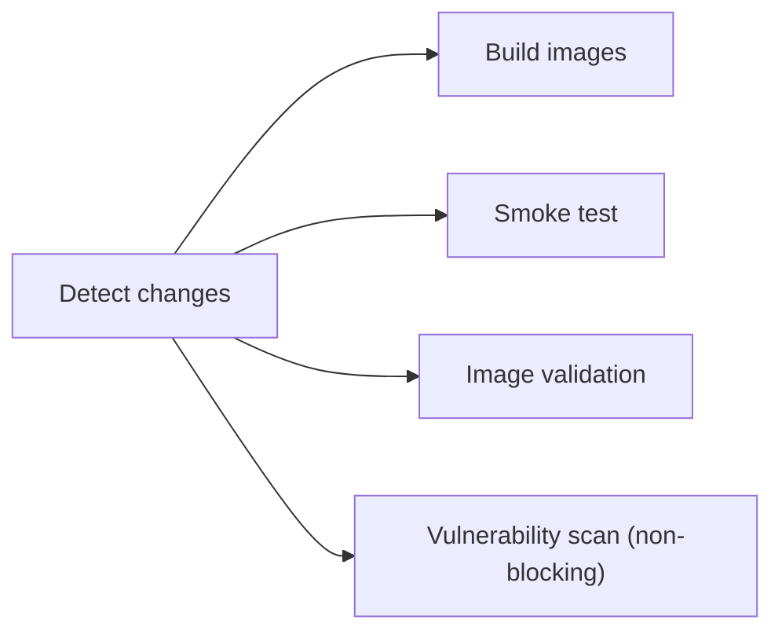
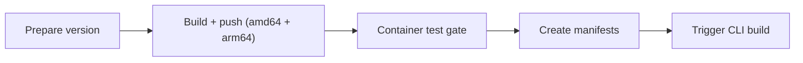

Diese Seite ist der Contributor-Workflow für die Docker-Seite des Tale-Build-Systems — Abhängigkeiten hinzufügen, die Multi-Stage-Form ändern, ein fehlschlagendes Image debuggen, auf Schwachstellen scannen. Die meisten Leser dieser Seite bearbeiten `Dockerfile.<service>`, die Compose-Dateien oder die Image-Budget-Tests, und die Regeln unten existieren, weil Produktions-Images und lokale Build-Zyklen in entgegengesetzte Richtungen ziehen: kleines End-Image versus schnelle Iteration. Das Ziel hier ist, beides am Laufen zu halten.

Wenn du Tale eher betreibst als baust, decken die Installationspfade unter [Quickstart](/de/self-hosted/install/quickstart) und [Linux-Server](/de/self-hosted/install/linux-server) alles ab, was du brauchst — diese Seite ist Contributor-Territorium.

## Voraussetzungen

| Software                          | Mindestversion                       |
| --------------------------------- | ------------------------------------ |
| Docker Desktop oder Docker Engine | 24.0+                                |
| Docker Compose                    | v2.20+ (in Docker Desktop enthalten) |
| Trivy (optional)                  | Aktuell                              |

## Schnellreferenz

Die Befehle, zu denen du täglich greifst, bevor irgendwelche Details unten:

```bash
# Alle Images bauen
docker compose build

# Einen einzelnen Service bauen
docker compose build platform

# Container-Smoke-Tests laufen lassen (nicht-kollidierende Ports)
bun run docker:test

# Image-Struktur validieren (keine Secrets, OCI-Labels, Größen-Budgets)
bun run docker:test:image

# Schwachstellen-Scan (braucht trivy)
bun run docker:test:vulnerability

# Lokale Entwicklung mit Hot-Reload
docker compose -f compose.yml -f compose.dev.yml up --build
```

Jeder dieser Befehle wird weiter unten ausgepackt — der Rest der Seite ist das Warum hinter den Regeln, die sie durchsetzen.

## Dockerfile-Konventionen

### Multi-Stage-Builds

Jedes Python- und Node.js-Image nutzt Multi-Stage-Builds. Das Muster sind drei Stages, jede mit einer Aufgabe:

1. **Builder-Stage** installiert Build-Abhängigkeiten und kompiliert native Pakete. Hier leben `gcc`, `build-essential` und sprachspezifische Build-Tools.
2. **Runtime-Stage** kopiert nur die Laufzeit-Artefakte in ein sauberes Base-Image — keine Build-Tools.
3. **Squash-Stage** nutzt `FROM scratch` plus `COPY --from=runtime / /`, um die Layer zu flachen.

Die Squash-Stage ist wichtig, weil Datei-Löschungen in Cleanup-Schritten den Speicherplatz nicht von sich aus zurückgewinnen — sie fügen maskierende Layer hinzu, die immer noch im finalen Image ausgeliefert werden. Squashing fasst die Löschungen in einen einzigen Layer zusammen, der die Dateien wirklich nicht enthält.

Eine Konsequenz, die man kennen sollte: `FROM scratch` verliert jede `ENV`- und `VOLUME`-Deklaration aus den vorgelagerten Stages. Re-deklariere sie in der Runtime-Stage vor dem Squash, oder sie sind weg.

### Layer-Caching

Ordne `COPY`- und `RUN`-Anweisungen vom am wenigsten zum am häufigsten geänderten. Abhängigkeiten ändern sich seltener als Anwendungscode, also sollte der Dependency-Install vor dem Anwendungs-Kopieren landen:

```dockerfile
# Abhängigkeiten zuerst — über die meisten Builds hinweg gecacht
COPY pyproject.toml .
RUN uv pip install --system --no-cache-dir .

# Anwendungscode zuletzt — installiert nur neu, wenn sich Deps ändern
COPY app/ ./app/
```

Eine falsche Reihenfolge erzwingt eine volle Neuinstallation bei jeder Code-Änderung, was der häufigste Grund ist, warum ein Build, der mal 30 Sekunden dauerte, jetzt fünf Minuten braucht.

### No-Cache-Flags

Nutze immer `--no-cache-dir` für pip und uv und `--no-install-recommends` für apt:

```dockerfile
RUN apt-get update && apt-get install -y --no-install-recommends curl \
    && rm -rf /var/lib/apt/lists/*
RUN uv pip install --system --no-cache-dir .
```

Die Cache-Verzeichnisse erfüllen in einem Produktions-Image keinen Zweck — sie nehmen nur Platz.

### OCI-Labels

Jedes Dockerfile trägt ein Versions-Label, damit die Registry zeigen kann, woher ein Tag kommt:

```dockerfile
ARG VERSION=dev
LABEL org.opencontainers.image.version="${VERSION}"
```

CI ersetzt `VERSION` beim Release durch das Git-Tag.

### Health-Checks

Jedes Dockerfile trägt einen `HEALTHCHECK`, damit Orchestratoren sehen, wann der Container wirklich serviert:

```dockerfile
HEALTHCHECK --interval=30s --timeout=10s --start-period=40s --retries=3 \
    CMD curl -f http://localhost:8001/health || exit 1
```

`start-period` ist entscheidend für langsam startende Dienste wie die Platform — ohne es wird der Container als unhealthy markiert, bevor er fertig hochgefahren ist.

## Image-Größen-Budgets

Jedes Image hat ein Budget. CI scheitert, wenn ein Image es überschreitet.

| Service  | Budget   | Aktuell   |
| -------- | -------- | --------- |
| Crawler  | 2.100 MB | ~1.850 MB |
| RAG      | 600 MB   | ~515 MB   |
| Platform | 2.900 MB | ~2.580 MB |
| DB       | 1.200 MB | ~1.060 MB |
| Proxy    | 100 MB   | ~88 MB    |

Wenn ein Budget bricht, sind die häufigsten Ursachen: eine neue Python-Abhängigkeit, die grosse transitive Deps mitzieht, ein apt-Paket ohne `--no-install-recommends`, Build-Artefakte vor der Squash-Stage nicht entfernt, oder die Multi-Stage-Form gebrochen, sodass Build-Tools im Runtime-Layer landen.

Um zu sehen, was in einem Image Platz nimmt:

```bash
# Plattenverbrauch auf oberster Ebene
docker run --rm -it <image> du -sh /* 2>/dev/null | sort -rh | head -20

# Python-Pakete und ihre Installationspfade
docker run --rm <image> pip list

# Visuelle Layer-Analyse — separat installieren
# https://github.com/wagoodman/dive
dive <image>
```

`dive` ist von den dreien das nützlichste Werkzeug, um verirrte Dateien in einem Layer zu finden, die hätten gelöscht werden sollen.

## Testing-Workflow

### Smoke-Tests

```bash
bun run docker:test
```

Das fährt `tests/container-smoke-test.sh`, das alle fünf Images baut, die Dienste auf nicht-kollidierenden Ports startet (15432, 18001, 18002, …), auf Health-Checks wartet, HTTP-Endpunkte validiert, Inter-Service-Konnektivität übt und alles inklusive Volumes wieder abreisst. Die nicht-kollidierenden Ports lassen die Test-Suite neben einer lokalen Dev-Umgebung laufen, ohne zu kollidieren.

### Image-Validierung

```bash
bun run docker:test:image
```

Für jedes Image prüft der Validator das OCI-`org.opencontainers.image.version`-Label, den Non-Root-Nutzer (für das Platform-Image Pflicht), die Abwesenheit von Secrets in Env oder Dateisystem, die `HEALTHCHECK`-Anweisung und das Größen-Budget. Jeder einzelne Fehlschlag lehnt das Image ab.

### Schwachstellen-Scanning

```bash
bun run docker:test:vulnerability
```

Lässt Trivy gegen jedes Image laufen. Reports landen in `trivy-reports/`. Bekannte False-Positives kommen in `.trivyignore`:

```
CVE-2023-12345    # false positive: function not reachable
```

Die Datei ist Klartext, eine CVE pro Zeile, optionaler Kommentar nach `#`.

## CI/CD-Pipeline

### Bei eingehenden Beiträgen (`build.yml`)



Der Schwachstellen-Scan ist auf PRs non-blocking — Trivys Rauschrate ist zu hoch, um jeden Merge zu gaten, also überfliegen Reviewer den Report bei Änderungen, die Abhängigkeiten berühren.

### Auf Release-Tags (`release.yml`)



Das Container-Test-Gate pullt die soeben gepushten Images und führt Smoke-Tests plus Image-Validierung aus, bevor Manifeste erstellt werden — das ist die letzte Chance, eine Regression vor dem Tag-Tagging zu fangen.

## Häufige Stolpersteine

### „parent snapshot does not exist"

Docker-BuildKit-Cache-Korruption. Pune den Builder-Cache:

```bash
docker builder prune -f
```

### Port bereits in Benutzung

Nutze `compose.test.yml`, das auf nicht-kollidierende Ports mappt:

```bash
docker compose -f compose.yml -f compose.test.yml --env-file .env.test -p tale-test up -d
```

### Python-Paket zur Laufzeit nicht gefunden

Ein Paket installiert sich sauber im Builder, ist aber in der Runtime-Stage nicht da. Meistens eines von drei Dingen:

1. Der `COPY --from=builder ...`-Pfad ist falsch — prüfe, dass `/usr/local/lib/python3.11/site-packages` zur Python-Version deines Base-Images passt.
2. Die `.dist-info` des Pakets wurde von einem Cleanup-Schritt entfernt, das etwas zur Import-Zeit braucht.
3. Ein Binary-Stripping-Schritt hat `.so`-Dateien entfernt, die das Paket braucht.

### Node-Modul nach Pruner-Stage fehlt

Ein Modul ist im Builder, fehlt aber in der Runtime. Meistens eines von zwei Dingen:

1. Das Modul ist in `devDependencies` statt `dependencies` in `package.json` — Nodes Pruner verwirft Dev-Deps.
2. Die `rm -rf`-Liste des Pruners entfernt das Verzeichnis des Moduls explizit.

## Vertrauensgrenze

Wenn du Dockerfiles bearbeitest, behandle den Image-Build als Überschreitung einer Vertrauensgrenze: die Eingaben (Dockerfile, Base-Image, Dependency-Liste) gehören Tale; die Ausgaben (das gepushte Image) werden von jedem Operator konsumiert, der Tale betreibt. Die Implikationen:

- **Base-Images.** In Produktions-Stages per Digest pinnen, nicht per Tag. Ein floating `python:3.11-slim` zieht jede Woche ein anderes Image.
- **Build-Secrets.** Niemals ein echtes Secret in ein Image kopieren. Der Image-Validierungs-Schritt lehnt Build-Arg-Secrets ab, die in den Runtime-Layer leaken.
- **Netzwerkzugriff während des Builds.** Builds erreichen das Internet für Abhängigkeiten; CI sollte Builds auf isolierten Workern ohne privilegierte Anmeldedaten laufen lassen.
- **Architektur-übergreifende Artefakte.** Wenn die Release-Pipeline amd64 und arm64 baut, müssen die beiden gleichwertige Images erzeugen. Eine plattformspezifische Abhängigkeit, die sich heimlich anders verhält, ist Monate später ein Debugging-Albtraum.

## Wo das einsetzt

Contributing-Docker ist der Source-Contributor-Ablauf für das Build-System, das Tales Container-Images produziert. Die Laufzeit-Architektur, in der diese Images laufen, ist unter [Container-Architektur](/de/self-hosted/operate/container-architecture) dokumentiert; für den operatorseitigen Installationspfad, der die Images konsumiert, sind [Quickstart](/de/self-hosted/install/quickstart) und [Linux-Server](/de/self-hosted/install/linux-server) die kanonischen Referenzen.

Für den breiteren Source-Contributor-Ablauf — Code-Konventionen, PR-Form, Test-Layout — trägt die Projekt-Wurzel `AGENTS.md` mit den bindenden Regeln.
