Governance ist der Ort, an dem Admins die Regeln für den KI-Einsatz in der Organisation festlegen. Sie ist in drei Gruppen organisiert, erreichbar über die linke Navigation unter **Einstellungen > Governance**, plus einer Audit-Log-Seite für Compliance.

## Content & Models

### System-Prompt

Setze einen globalen System-Prompt, der jeder KI-Konversation in der Organisation vorangestellt wird. Damit erzwingst du Ton, Umfang und Sicherheitsregeln, die jeder Agent erbt.

### Default-Modelle

Wähle die Standard-Modelle für Chat, Vision und Embedding, die benutzt werden, wenn Nutzer keines explizit wählen. Modelle kommen aus allen konfigurierten Anbietern — siehe [KI-Anbieter](/de/platform/admin/providers).

### Model Access

Steuere, welche Modelle bestimmten Teams oder Nutzern verfügbar sind. Beschränke teure Frontier-Modelle auf Senior Staff oder gib einem Team nur selbst gehostete Modelle frei.

## Policies & Limits

### Budgets

Setze Ausgabelimits pro Nutzer, pro Team oder für die ganze Organisation. Konfiguriere Zeitraum (täglich, wöchentlich, monatlich) und die Aktion bei Limit-Überschreitung — warnen, neue Anfragen blockieren oder Chat ganz deaktivieren.

### Upload-Richtlinie {#upload-policy}

Beschränke Datei-Uploads nach Typ, Größe oder Anzahl. Nützlich, wenn du große Binär-Uploads oder ausführbare Dateitypen verhindern willst. Pro MIME-Typ kannst du eine strengere Grenze setzen — z. B. `audio/*` auf 25 MB begrenzen, während das globale Limit bei 100 MB bleibt.

### Aufbewahrung

Konfiguriere, wie lange Konversationen, hochgeladene Dateien und Audit-Daten aufbewahrt werden, bevor sie automatisch gelöscht werden. Siehe [Aufbewahrung](/de/self-hosted/configuration/retention) für die passenden Environment-Standards auf Deployment-Ebene.

### Feature Controls

Schalte Plattform-Features organisationsweit ein oder aus: Datei-Uploads, Web-Suche, Bild-Generierung, Arena-Modus und mehr. Hier deaktivierte Features sind in der UI für alle Nutzer ausgeblendet.

## Security & Monitoring

### Guardrails

Guardrails sind drei Filter-Schichten, die Tale für jede Chat-Nachricht **bevor** sie das Modell erreicht und für jedes Modell-Token **bevor** es beim Nutzer ankommt nacheinander durchläuft. Jede Schicht wird unter **Einstellungen > Richtlinien > Guardrails** unabhängig konfiguriert; eine schreibgeschützte Karte **Guardrails-Übersicht** zeigt, welche Schicht aktiv ist. Die Reihenfolge ist fest:

```mermaid
flowchart LR
  user["Nutzer schickt eine Nachricht."] --> chatFilter["Tale prüft die Inhaltssicherheit."]
  chatFilter --> pii["Tale scannt nach personenbezogenen Daten."]
  pii --> moderation["Tale bewertet die Nachricht beim Moderations-Anbieter."]
  moderation --> model["Das Modell erzeugt eine Antwort."]
  model --> outChatFilter["Tale prüft die Inhaltssicherheit der Output-Tokens."]
  outChatFilter --> outPii["Tale scannt die Output-Tokens nach personenbezogenen Daten."]
  outPii --> outModeration["Tale bewertet die Output-Tokens beim Moderations-Anbieter."]
  outModeration --> reply["Tale streamt die freigegebene Antwort an den Nutzer."]
```

Eine blockierte Nachricht erreicht das Modell nie, ein blockiertes Token wird dem Nutzer nie ausgespielt. Jede Guardrail-Entscheidung (zulassen, maskieren, blockieren) schreibt einen strukturierten Eintrag ins Audit-Log; der rohe Treffer-Text wird nie gespeichert.

#### Inhaltssicherheit

Öffne **Einstellungen > Richtlinien > Inhaltssicherheit**. Lege Kategorien an (zum Beispiel _Vulgaritäten_, _Mitbewerber-Namen_, _vertrauliche Codenamen_), gib jeder eine Wortliste und wähle einen Durchsetzungsmodus — _Aus_, _Warnen_, _Maskieren_ oder _Blockieren_. Kategorien laufen als schnelle Regex-Treffer mit Schutz vor katastrophalem Backtracking, die Latenz dieser Schicht ist also vernachlässigbar. Nutze sie für organisationsspezifische Schlüsselwort-Regeln, die öffentliche Moderation-APIs nicht kennen können.

#### PII-Erkennung {#pii-detection}

Aktiviere automatische Erkennung personenbezogener Daten in Nachrichten. Eingebaute Muster decken **E-Mail, Telefon, Kreditkarte, IBAN, IP-Adresse, SSN, CVC, Geburtsdaten, Postadressen (43 Sprachen) sowie nationale Ausweise und Reisepässe** ab (Personalausweis, NIR, DNI/NIE, Codice Fiscale, BSN, PESEL, UK-NI-Nummer, kanadische SIN, irische PPS, Aadhaar, chinesischer 身份证, japanische My Number, koreanische RRN und 30+ weitere). Jeder Ausweistyp nutzt die kanonische Prüfsumme (ICAO 9303, Luhn, mod-11, Verhoeff, mod-23), damit zufällige Zeichenketten keine Treffer auslösen. Eigene Regex-Regeln ergänzen interne Formate (Mitarbeiter-ID, Ticket-Nummern, Produkt-SKUs). Erkannte PII in Anhängen durchläuft dieselbe Pipeline wie getippte Nachrichten.

Drei Durchsetzungsmodi:

- **Maskieren** — jeden Treffer durch einen festen Platzhalter ersetzen (`[EMAIL]`, `[PHONE]`, …). Empfohlen für Audit-Logs und gespeicherten Chat-Verlauf, in denen der Originalwert nicht mehr benötigt wird. Einbahnstraße: das Original ist weg.
- **Blockieren** — die gesamte Nachricht ablehnen. Empfohlen, wenn deine Richtlinie keinerlei PII an Upstream-Modelle erlaubt.
- **Tokenisieren** — jeden Treffer durch ein stabiles indiziertes Token ersetzen (`[EMAIL_1]`, `[PHONE_1]`) und eine pro-Nachricht-Zuordnung im Speicher halten. Das Modell sieht nur die Tokens; die Antwort enthält die Originaldaten wieder. Empfohlen für die natürlichste Nutzererfahrung ohne Schutzverlust. Die Zuordnung bleibt nur für den Round-Trip im Speicher und wird danach verworfen — niemals geloggt.

Ein eingebautes **Test-Playground** unter Einstellungen → Governance → PII zeigt den gesamten Round-Trip live: Tippe einen Satz und beobachte Erkennung → Tokenisierung → simulierte KI-Antwort → Wiederherstellung in Echtzeit. Fahre über eine markierte Stelle, um den erkannten Datentyp zu sehen (übersetzt).

#### Moderations-Anbieter

Schicke Chat-Nachrichten an einen externen Klassifikator — OpenAI Moderation, Azure Content Safety, Perspective oder einen beliebigen HTTPS-Endpunkt, der Kategorie-Scores zurückgibt. Wähle ein eingebautes Preset, dann sind URL, Kopfzeile, Anfrage-Template und Response-Parser für dich ausgefüllt; für alles andere wählst du _Custom JSONPath_ und mappst die Felder selbst. Der API-Schlüssel wird serverseitig AES-verschlüsselt gespeichert und in jedem Kopfzeile-Wert als `{secretPlaceholder}` referenziert. Mit dem Button **Verbindung testen** schickst du eine Beispielnachricht über den echten Anbieter-Pfad — er prüft Schlüssel, Endpunkt, Anfrage-Template, Response-Parser und Kategorie-Mappings in einem Round-Trip, ohne eine Konversation zu schreiben.

Aus SSRF-Schutz wird nur der konfigurierte Host kontaktiert; Redirects zu anderen Hosts werden abgewiesen. Parallele Aufrufe sind pro Organisation rate-limitiert, damit ein einzelner Chat-Burst dein Moderations-Kontingent nicht erschöpft.

### Usage Dashboard

Sieh Token-Verbrauch, Kosten-Aufschlüsselung und Nutzungs-Trends über die gesamte Organisation. Filter nach Team, Nutzer, Modell oder Zeitraum. Für tiefere Analytics siehe [Usage Analytics](/de/platform/admin/usage-analytics).

## Audit-Logs

Eine zeitlich geordnete Aufzeichnung wichtiger Aktionen in der Organisation. Kategorien umfassen Authentifizierungs-Events, Mitglieder-Änderungen, Daten-Operationen, Integrationen-Updates, Workflow-Publishings, Sicherheits-Events und Admin-Aktionen. Nützlich für Compliance und Fehlersuche.

Admins können Audit-Logs per Button über der Log-Tabelle als **CSV** oder **JSON** exportieren. Exports respektieren den aktuell aktiven Kategorie-Filter.

## Wo das hingehört

Governance ist der Vertrag zwischen der Richtlinie deiner Organisation und dem, was Tale physisch auf der Platte tut. Die Aufbewahrung grenzt ein, wie lange Daten leben. Anfragen betroffener Personen liefern die DSGVO-Maschinerie für Export und Löschung. Aufbewahrungspflichten setzen Löschungen während einer Ermittlung aus. Das Audit-Log beweist, was passiert ist. Jede dieser Schrauben ist eine Stellschraube; der Cleanup-Runner, der die Aufbewahrung durchsetzt, liest sie alle zu Beginn jedes Laufs.

Die Konfiguration auf dieser Seite ist organisationsbezogen (Admins setzen sie über die UI). Für die operatorbezogenen Schrauben, die den Cleanup-Runner selbst regeln — die Umgebungsvariablen, den Audit-Pepper für PII-Hashing, das Legal-Hold-Cooldown — siehe [Aufbewahrung](/de/self-hosted/configuration/retention).
