Richtlinien ist die Stelle, an der Admins die Regeln setzen, denen jede andere Oberfläche in Tale folgen muss. Sie ist in vier Gruppen gegliedert, sichtbar in der linken Navigation unter **Einstellungen > Richtlinien**: Inhalt und Modelle (was die Agents sagen und mit welchen Modellen), Richtlinien und Limits (wie viel sie kosten dürfen und wie lange ihre Ausgabe gehalten wird), Sicherheit und Monitoring (der dreistufige Guardrail-Stapel und das Audit-Log) plus Passwort- und Anmelde-Richtlinie. Mitglieder und Redakteure erreichen diese Seite nicht; Entwickler ebenso wenig. Nur Inhaber und Admin.

Eine derart dichte Seite existiert, weil jeder Knopf hier mit den anderen verflochten ist — eine strenge Aufbewahrungs-Richtlinie ist neben einem unbegrenzten Budget wirkungslos; ein Guardrail ohne Audit-Log lässt sich nicht überprüfen. Die Struktur unten spiegelt die Navigation, sodass Doku und Oberfläche im Gleichschritt scrollen.

## Inhalt und Modelle

### System-Prompt

Setze einen verbindlichen System-Prompt, der jeder Agent-Anweisung vorangestellt (und optional angehängt) wird. So erzwingst du Ton, Geltungsbereich und Sicherheits-Regeln, die kein einzelner Agent überstimmen kann. Die zwei Felder sind **Verbindlicher Prefix** und **Verbindlicher Suffix**; beide gehen durch dieselbe Zeichen-Limit-Prüfung und werden zur Laufzeit vor und nach dem Agent-eigenen Prompt angewandt.

### Standard-Modelle

Wähle die Standard-Modelle für Chat, Vision, Embedding, Bild-Generierung und Transkription, wenn Nutzer oder Agent kein eigenes wählen. Standards lassen sich auf die ganze Organisation, ein Team, eine Rolle oder einen bestimmten Nutzer abbilden; spezifischere Geltungsbereiche überstimmen breitere. Modelle stammen aus jedem konfigurierten Anbieter — siehe [KI-Anbieter](/de/platform/admin/providers).

Steht ein Standard im Konflikt mit der Modell-Zugriffs-Allowlist oder -Blocklist (unten), zeigt das Formular eine Warnung, damit der Richtlinien-Widerspruch vor dem Speichern sichtbar wird.

### Modell-Zugriff

Steuere, welche Modelle für welche Geltungsbereiche verfügbar sind. Die Allowlist exponiert nur eine kuratierte Auswahl von Frontier-Modellen für leitendes Personal, die Blocklist hält ein teures Modell aus einem Einstiegs-Team heraus. Wie Budgets komponieren sich Modell-Zugriffs-Regeln nach Geltungsbereich: Nutzer-Regeln gewinnen vor Team-Regeln, Team-Regeln vor Rollen-Regeln, Rollen-Regeln vor der Voreinstellung.

## Richtlinien und Limits

### Budgets

Setze Ausgabelimits je Nutzer, Team, Rolle oder für die ganze Organisation. Jede Regel benennt einen Zeitraum (täglich, wöchentlich, monatlich), eine Token- oder USD-Obergrenze (oder beides) und einen optionalen Warn-Schwellenwert. Der Override-Hinweis im Formular ist die Vorrang-Zusammenfassung: **Nutzer > Team > Rolle > Voreinstellung**, wobei Org-Limits immer als zusätzliche Obergrenze gelten.

Trifft ein Budget den Warn-Schwellenwert, sieht der betroffene Geltungsbereich ein In-Produkt-Banner; trifft es die harte Obergrenze, scheitern neue Modell-Aufrufe mit einem Budget-Fehler, der dem Nutzer sichtbar ist.

### Upload-Richtlinie {#upload-policy}

Schränke Datei-Uploads nach Erweiterung, MIME-Typ, Gesamtgröße und Gesamt-Volumen pro Nutzer ein. Nützlich, wenn die Richtlinie große Binär-Uploads oder bestimmte ausführbare Datei-Typen verbietet. Je-MIME-Typ-Obergrenzen lassen ein engeres Limit auf eine Inhalts-Klasse anwenden — etwa `audio/*` bei 25 MB, während das globale Limit bei 100 MB bleibt. Sowohl Erweiterungs- als auch MIME-Typ-Listen unterstützen Allowlist- und Blocklist-Modus; die Blocklist gewinnt, wenn eine Erweiterung in beiden steht.

### Aufbewahrung

Konfiguriere, wie lange jeder Datentyp lebt, bevor er automatisch gelöscht wird. Jede Kategorie — Chat-Verlauf, Dokumente, Nachrichten-Metadaten, Workflow-Logs, Audit-Logs, Nutzungs-Ledger, Anmeldeversuche und mehrere weitere — trägt eine eigene Aufbewahrungs-Dauer (Tage oder Stunden), einen optionalen `Aktiviert`-Schalter und eine Lösch-Schonfrist, die steuert, ob die Löschung durch ein Papierkorb-Fenster geht oder sofort erfolgt.

Selbst gehostete Operatoren können die org-weite Aufbewahrung über die Umgebung begrenzen, damit Cloud-artige Admin-Freiheit keine Compliance-Zusagen verletzt — siehe [Aufbewahrung](/de/self-hosted/configuration/retention) für die Env-Var-Unter- und Obergrenzen. Ändern sich die Operator-Grenzen, zeigt das Formular ein Banner, das den Admin auffordert, die neuen Grenzen anzuwenden oder abzulehnen, bevor irgendetwas anderes gespeichert wird.

### Funktionssteuerung

Schalte Funktionen je Geltungsbereich (Nutzer, Team, Rolle oder Voreinstellung) ein oder aus. Heute liegen drei Feature-Flags vor: **Websuche**, **Code-Ausführung** und **Datei-Upload**. Jede lässt sich da deaktivieren, wo die Richtlinie es verlangt, und das Feld **Maximale Kontext-Tokens** begrenzt, wie viel Kontext-Fenster ein Agent im Geltungsbereich nutzen darf. Für einen Geltungsbereich abgeschaltete Funktionen sind aus der Oberfläche der betroffenen Nutzer ausgeblendet; ein Wiedereinschalten stellt die Oberfläche sofort her.

## Sicherheit und Monitoring

### Guardrails

Guardrails sind drei Filter-Schichten, die Tale bei jeder Chat-Nachricht **vor** dem Modell und bei jedem Modell-Token **vor** dem Nutzer in fester Reihenfolge ausführt. Jede Schicht wird unabhängig konfiguriert, und eine schreibgeschützte **Guardrails-Übersicht** zeigt, ob jede Schicht aktiv ist. Die Reihenfolge steht fest:

```mermaid
flowchart LR
  user["Nutzer sendet eine Nachricht"] --> chatFilter["Inhalts-Sicherheit"]
  chatFilter --> pii["PII-Erkennung"]
  pii --> moderation["Moderations-Anbieter"]
  moderation --> model["Modell erzeugt Antwort"]
  model --> outChatFilter["Inhalts-Sicherheit (Ausgabe)"]
  outChatFilter --> outPii["PII-Erkennung (Ausgabe)"]
  outPii --> outModeration["Moderations-Anbieter (Ausgabe)"]
  outModeration --> reply["Tale streamt erlaubte Antwort"]
```

Eine blockierte Nachricht erreicht das Modell nie, und ein blockiertes Token wird dem Nutzer nie zugestellt. Jede Guardrail-Entscheidung (erlauben, maskieren, blockieren) schreibt einen strukturierten Eintrag ins Audit-Log; der rohe Treffer-Text wird nie gespeichert.

#### Inhalts-Sicherheit

Öffne **Einstellungen > Richtlinien > Inhalts-Sicherheit**. Definiere Kategorien (zum Beispiel _Profanität_, _Wettbewerbsnamen_, _vertrauliche Codenamen_), gib jeder eine Wortliste und wähle einen Erzwingungs-Modus — **Flag**, **Maskieren** oder **Blockieren**. Blockieren schlägt Maskieren, Maskieren schlägt Flag, wenn mehrere Kategorien auf dieselbe Nachricht passen. Kategorien laufen als schnelle Regex-Matches mit Schutz vor katastrophalem Backtracking, sodass diese Schicht vernachlässigbare Latenz hinzufügt. Nutze sie für organisationsspezifische Schlagwort-Richtlinien, die öffentliche Moderations-APIs nicht kennen können.

#### PII-Erkennung {#pii-detection}

Erkenne personenbezogene Daten in Nachrichten und Anhängen. Eingebaute Muster decken **E-Mail, Telefon, Kreditkarte, IBAN, IP-Adresse, US-SSN und CVC, Geburtsdatum, Postadressen (43 Locales) und nationale Ausweise und Pässe** ab (deutscher Personalausweis, französische NIR, spanische DNI und NIE, italienischer Codice Fiscale, niederländische BSN, polnische PESEL, britische National Insurance Number, kanadische SIN, irische PPS, indische Aadhaar, chinesische 身份证, japanische My Number, koreanische RRN und 30 weitere). Jeder Ausweis-Typ nutzt die kanonische Prüfsumme (ICAO 9303, Luhn, mod-11, Verhoeff, mod-23), sodass zufällig geformte Zeichenketten nicht fälschlich getroffen werden. Benutzerdefinierte Regex-Regeln lassen interne Formate hinzufügen (Mitarbeiter-ID, Ticket-Nummern, Produkt-SKUs).

Drei Erzwingungs-Modi:

- **Maskieren** — jeden Treffer durch einen festen Platzhalter ersetzen (`[EMAIL]`, `[PHONE]`). Empfohlen für gespeicherte Audit-Logs und Chat-Verlauf, wo der Rohwert nie wieder gebraucht wird. Einbahn: das Original ist weg.
- **Blockieren** — die gesamte Nachricht ablehnen. Nutze diesen Modus, wenn die Richtlinie jegliches PII zu Upstream-Modellen ausschließt.
- **Tokenisieren** — jeden Treffer durch ein stabiles, indiziertes Token ersetzen (`[EMAIL_1]`, `[PHONE_1]`) und je Nachricht eine Wiederherstellungs-Karte halten. Das Modell sieht die Tokens; der Nutzer sieht seine Originaldetails wieder in der Antwort. Die Karte liegt für den Hin-Rück-Weg im Speicher und wird danach verworfen — niemals geloggt.

Ein eingebauter **Test-Playground** im selben Bildschirm zeigt den vollen Hin-Rück-Weg live: tippe einen Satz und beobachte Erkennung, Tokenisierung, Mock-KI-Antwort und Wiederherstellung in Echtzeit. Beim Hovern über einen hervorgehobenen Bereich erscheint der erkannte Typ.

#### Moderations-Anbieter

Schicke Chat-Nachrichten an einen externen Klassifizierer — OpenAI Moderation, Azure Content Safety, Perspective oder einen beliebigen HTTPS-Endpunkt, der Kategorie-Scores zurückgibt. Wähle eine eingebaute Vorlage, und URL, Kopfzeilen, Anfrage-Template und Antwort-Parser sind ausgefüllt; für alles andere wähle **Eigene JSONPath** und mappe Felder von Hand. Der API-Schlüssel wird serverseitig AES-verschlüsselt gespeichert und in beliebigen Kopfzeilen-Werten als `{secretPlaceholder}` referenziert. **Verbindung testen** schickt eine Beispiel-Nachricht durch den echten Anbieter-Pfad — das prüft Schlüssel, Endpunkt, Anfrage-Template, Antwort-Parser und Kategorie-Mappings in einem Hin-Rück-Weg, ohne in einen Thread zu schreiben.

Aus SSRF-Sicherheits-Gründen wird nur der konfigurierte Host kontaktiert; Weiterleitungen auf andere Hosts werden abgelehnt. Parallele Aufrufe sind je Organisation rate-limitiert, damit ein einzelner Chat-Burst nicht das Moderations-Kontingent erschöpft.

### Passwort-Richtlinie

Konfiguriere minimale Passwortlänge, erforderliche Zeichen-Klassen (Großbuchstaben, Kleinbuchstaben, Ziffer, Sonderzeichen) und eine optionale Rotationsdauer. Ist die Rotation aktiv, beginnt das Schonfenster in dem Moment, in dem die Richtlinie erstmals aktiviert wird, sodass bestehende Nutzer nicht sofort zum Wechsel gezwungen werden. Dieselbe Richtlinie wird bei Anmeldung, Passwort-Wechsel und bei jeder Anmeldung nach Ablauf der Rotation geprüft.

### Anmelde-Richtlinie

Sperre Konten nach wiederholten Anmeldefehlern und vergrößere die Wartezeit zwischen Versuchen. Das Formular nimmt eine **Fehler-vor-Sperre**-Zahl, einen kommagetrennten **Backoff-Plan** in Sekunden (Voreinstellung `1, 10, 60, 600`) und die Liste **vertrauenswürdiger Proxies**, die Tale verwendet, um die echte Client-IP aus `X-Forwarded-For` zu gewinnen. Vertrauenswürdige Proxies akzeptieren einzelne IPs, CIDR-Bereiche und die Schlüsselwörter `loopback`, `uniquelocal` und `linklocal`. Die vollständigen Operator-Env-Pendants leben bei der übrigen Deployment-Konfiguration.

### Zwei-Faktor-Richtlinie

Die TOTP-Erzwingungs-Richtlinie lebt in einem eigenen Abschnitt und ist in voller Tiefe unter [Zwei-Faktor-Authentifizierung](/de/platform/admin/two-factor-authentication) dokumentiert — starte dort für Schonfenster, SSO-Ausnahme und Audit-Events.

### Nutzungs-Dashboard

Sieh Token-Verbrauch, Kosten-Aufschlüsselungen und Nutzungs-Trends quer durch die Organisation, gefiltert nach Team, Nutzer, Modell, Agent oder Zeitraum. Für tiefere Drilldowns (Top-Nutzer, Top-Teams, Modell-Mix, Workflow-Metriken) siehe [Nutzungsanalyse](/de/platform/admin/usage-analytics).

## Audit-Logs

Das Audit-Log ist eine zeitlich geordnete Aufzeichnung jeder relevanten Aktion in der Organisation. Kategorien sind **Auth**, **Mitglied**, **Daten**, **Integration**, **Workflow**, **Sicherheit**, **Admin** und **KI**. Die Tabelle ist suchbar und filterbar; die Detail-Schublade zeigt Akteur, Rolle, Ressource, Ziel, Vor- und Nachzustand, geänderte Felder und je-Event-Metadaten.

Admins können den aktiven Filter über die Schaltflächen oberhalb der Tabelle als CSV oder JSON exportieren. Exporte folgen dem aktiven Filter und nicht dem vollständigen Log, sodass ein einzelner Export auf eine Kategorie, einen Akteur oder eine Ressource eingegrenzt sein kann.

## Wo das hingehört

Richtlinien ist der Vertrag zwischen der Politik deiner Organisation und dem, was Tale physisch auf der Platte tut. Aufbewahrung begrenzt, wie lange Daten leben. Anfragen betroffener Personen geben dir die DSGVO-Maschine für Export und Löschung. Legal Holds suspendieren das Löschen während Untersuchungen. Das Audit-Log beweist, was passiert ist. Jede dieser Stellschrauben liest der Aufräum-Runner zu Beginn jedes Laufs.

Die Konfiguration auf dieser Seite ist org-bezogen — Admins setzen sie aus dem UI. Für die Operator-Stellschrauben am Aufräum-Runner selbst (Env-Var-Unter- und Obergrenzen, der Audit-Pepper für PII-Hashing, die Legal-Hold-Wartezeit) ist [Aufbewahrung](/de/self-hosted/configuration/retention) die Referenz. Für den GDPR-Art.-17-Antragsablauf, der auf demselben Aufbewahrungs-Runner aufsetzt, deckt [Anfragen betroffener Personen](/de/platform/admin/data-subject-requests) Dialog und SLA-Semantik ab.
