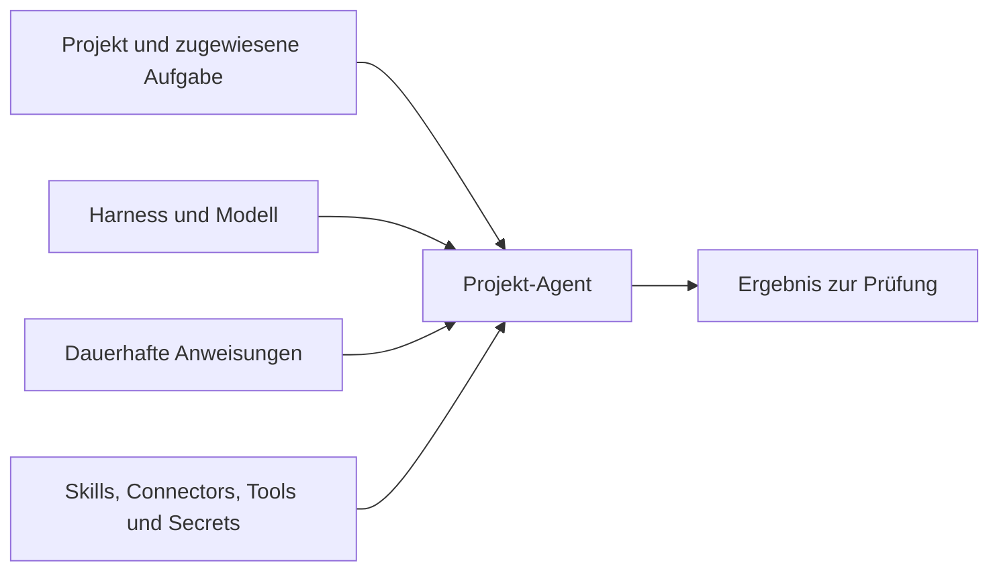

Ein Projekt-Agent übernimmt Aufgaben in einem bestimmten Projekt. Seine Konfiguration legt den Harness, das Modell, dauerhafte Anweisungen und die verfügbare Ausstattung fest. Hier entscheidest du, was dein Agent für seine Arbeit braucht; [Projekt-Agenten](/de/platform/projects/project-agents) beschreibt das Anlegen und Verwalten.

## Den Aufgabenbereich festlegen

Ein Agent gehört zu genau einem Projekt. Seine ID bezeichnet den Agenten dieses Projekts; eine Aufgabe lässt sich nur einem Agenten aus demselben Projekt zuweisen. Ein Projekt fasst bis zu 50 Agenten, deren Namen innerhalb des Projekts eindeutig sind.

Die Sichtbarkeit folgt dem Projektzugriff. Wer das Projekt lesen darf, sieht auch seine Agenten; wer es bearbeiten darf, verwaltet sie, solange das Projekt aktiv ist. Eine eigene Sichtbarkeit als privat oder organisationsweit gibt es für Agenten nicht.

## Die Ausführung wählen

Der **Harness** führt die Coding-Sitzung in einer Sandbox aus; **Modell** und Anbieter bestimmen, welche Engine antwortet. Diese Auswahl gehört zur Konfiguration des Projekt-Agenten. [Harnesses](/de/platform/agents/harnesses) erklärt die Ausführungsumgebungen, [Anbieter](/de/platform/admin/providers) die zugehörigen Zugangsdaten.

Dauerhafte **Anweisungen** halten Zuständigkeit und Grenzen fest, bis zu 20.000 Zeichen. Lege für einen Review-Agenten fest, was er prüfen soll, welche Änderungen eine Entscheidung erfordern und wie er das Ergebnis meldet. Anforderungen an die einzelne Aufgabe bleiben in der Aufgabe, damit derselbe Agent auch die nächste bearbeiten kann.

## Die passende Ausstattung vergeben

**Skills** liefern Referenzmaterial, **Connectors** erschließen angebundene Dienste und **Tools** erlauben Zugriffe auf die Plattform. Jede Liste fasst bis zu 25 Einträge. Vergib die Fähigkeiten, die der Auftrag braucht; ein freigegebenes Schreibwerkzeug darf im Rahmen seiner Zugriffsregeln Daten ändern.

**Secrets** verweisen auf organisationsweit gespeicherte Geheimnisse, höchstens 25 Namen pro Agent. Nur Inhaber und Admins der Organisation dürfen diese Freigaben ändern. Die Werte bleiben verschlüsselt im Geheimnisspeicher; die Agentenkonfiguration enthält Namen, und der Lauf erhält die freigegebenen Werte.

## Die Auswahl zusammenführen

Ein Review-Agent kann mit einem Coding-Harness, einem Modell eines freigegebenen Anbieters, dem Review-Skill des Teams und dem Repository-Connector arbeiten. Seine Anweisungen verlangen belegbare Fehlerberichte. Er bearbeitet eine Aufgabe seines Projekts und legt das Ergebnis einer Person zur Prüfung vor. Ein zweites Projekt braucht einen eigenen Agenten, auch wenn Name und Anweisungen übereinstimmen.

## Die passende Arbeitsform wählen

| Nutze | Wenn du Folgendes brauchst |
| --- | --- |
| Chat | Ein Gespräch mit dem eingebauten Assistenten für Fragen, Recherche oder Entwürfe. |
| Einen Projekt-Agenten | Einen konfigurierten Bearbeiter für eine Projektaufgabe mit anschließender Prüfung. |
| Eine Automatisierung | Feste Schritte, Zeitplanung oder Freigaben zwischen den Schritten. |

Im direkten Chat arbeitet der eingebaute Assistent. Projektkontext wählt dort keinen Projekt-Agenten aus; ein Agent-Knoten in einer Automatisierung trägt eine eigene Ausführungskonfiguration.

## Das Projekt besetzen

Wähle zuerst Projekt und Aufgabe, dann die Ausführung, Anweisungen und Ausstattung des Agenten. [Projekt-Agenten](/de/platform/projects/project-agents) führt durch die Einrichtung, [Agenten aus Admin-Sicht](/de/platform/admin/agents) erklärt die Berechtigungen und die [API-Referenz](/de/develop/api-reference#agenten-eines-projekts-verwalten) die Verwaltung aus einer Integration.
