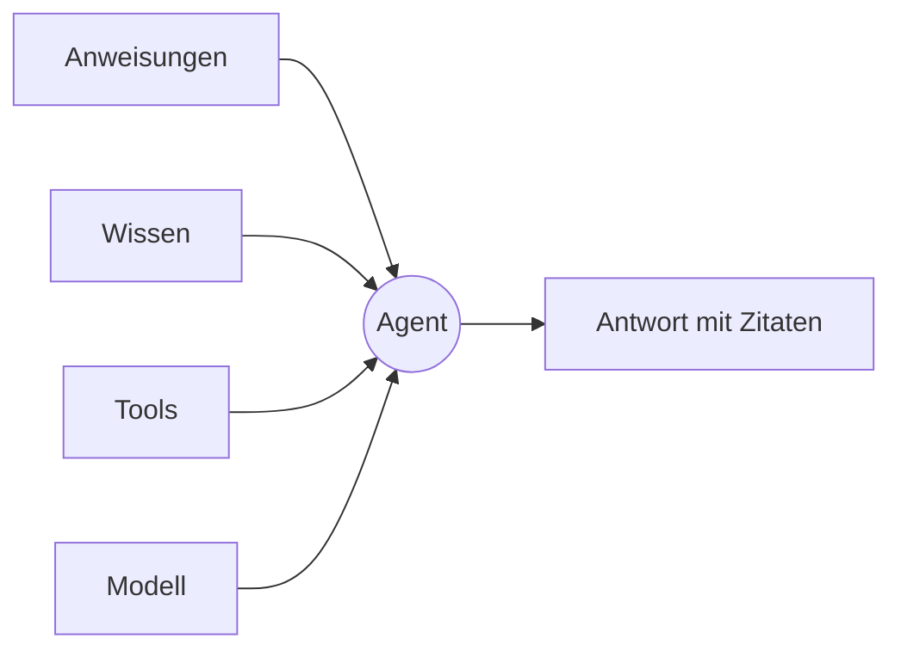

Ein Agent ist die Einheit, zu der Tale greift, wenn dieselbe Frage immer wiederkommt. Er ist die Vier-Knöpfe-Kombination aus Anweisungen, Wissen, Tools und einem Modell — die vier Dinge, an denen du drehst, damit der Agent sich anders verhält. Redakteure und Entwickler bauen sie; Mitglieder und andere Rollen führen sie aus.

Diese Seite vermittelt dir das mentale Modell, das der Rest des Abschnitts voraussetzt. Lies sie einmal, bevor du deinen ersten Agent baust; komm zurück, wenn du nicht mehr weißt, ob ein Verhalten, das du ändern willst, in den Anweisungen, im Wissen, in den Tools oder im Modell sitzt.

Lieber erst zusehen? Episode 4 baut einen Agenten in gut drei Minuten von Anfang bis Ende — alle vier Entscheidungen, dann der Live-Test, mit Untertiteln.

<Video src="/videos/tutorials/ep4-agent.de.mp4" poster="/videos/tutorials/ep4-agent.de.webp" captions="/videos/tutorials/ep4-agent.de.vtt" lang="de" title="Episode 4 — Dein erster Agent" caption="Episode 4 — Dein erster Agent (3:18)">

</Video>

## Die vier Knöpfe

**Anweisungen** sind das System-Prompt — die Prosa, die jede Antwort rahmt. Halte Anweisungen kurz, meinungsstark und konkret; lange Anweisungen verwässern in langen Konversationen. Benenne die Stimme, die Einschränkungen und die Ablehnungsfälle.

**Wissen** ist das, was der Agent aus der Wissensdatenbank der Organisation abrufen kann. Ein Abrufmodus entscheidet, ob der Agent bei Bedarf sucht, ob relevante Chunks in jede Antwort injiziert werden, ob beides passiert oder keines — und Scope-Schalter entscheiden, ob Team-Dokumente, Organisationsdokumente und die eigenen Uploads des Agents durchsuchbar sind. Wissen außerhalb dieser Scopes ist für den Agent unsichtbar — es gibt kein implizites Ziehen aus allem, was die Organisation besitzt.

**Tools** sind das, was der Agent über Text-Antworten hinaus tun kann. Der Tab **Tools** des Agents ist eine Checkliste pro Tool, gruppiert nach Kategorie — Kunden- und Produktdaten, Dateien, Workflows, Websuche, Code-Ausführung und mehr. Schalte jedes Tool einzeln frei; jedes Tool, das du gewährst, weitet die Vertrauensgrenze, also halte die Liste kurz.

**Modell** ist das LLM hinter jeder Antwort. Modelle sind eine geordnete Liste: der erste Eintrag ist das primäre Modell, der Rest sind Fallbacks, die Tale der Reihe nach probiert, wenn das primäre nicht verfügbar ist. Ein Modellwechsel trainiert nichts neu — die anderen drei Knöpfe des Agents sind das „Gedächtnis“ des Modells für den Job.

## Skills als Bündel

Ein Skill verpackt Anweisungen — und optional Skripte und Referenzdateien — in ein wiederverwendbares Bündel, das du an einen Agent bindest. Greif zu einem Skill, wenn dasselbe Muster über mehrere Agenten auftaucht: eine Schreibstimme, eine Berechnung, eine mehrstufige Aufgabe. Skills komponieren mit den vier Knöpfen; ein Agent kann bis zu zehn binden und liest jeden zur Laufzeit.

Die Skills-Seite beleuchtet den Trade-off zwischen einem Skill und Inline-Anweisungen im Detail: siehe [Agent-Skills](/de/platform/agents/skills).

## Zusammengesetzt — ein Support-Triage-Agent

Ein erster nützlicher Agent ist der Support-Triage-Agent: er liest die eingehende Frage, beantwortet, was er kann, und eskaliert den Rest. Die vier Knöpfe:

- Anweisungen: ein Absatz Stimme plus drei explizite Ablehnungsfälle.
- Wissen: Abruf bei Bedarf über die Produktdokumentation; keine eigenen Uploads für den Agent.
- Tools: Websuche und die Konversations-Tools. Keine Code-Ausführung.
- Modell: ein fähiges primäres Modell mit einem günstigeren Fallback direkt dahinter.

Die Konversation läuft dann so: User-Nachricht → Anweisungen rahmen die Antwort → das Wissens-Retrieval findet die relevanten Chunks → Tools füllen die Lücken → die Antwort landet mit Zitaten. Die Eskalation an einen Spezialisten ist kein Tool-Schalter — sie folgt Delegationsbeziehungen zwischen Agents. Siehe [Agent Workers](/de/platform/agents/delegation).

## Wann du danach greifst

Ein einzelner Agent ist die richtige Form, wenn die Konversation in einer Domäne und einer Stimme bleibt. Greif zu einer [Automatisierung](/de/platform/automations/concepts), wenn die Arbeit mehrstufig ist und du Genehmigungen oder Zeitpläne dazwischen willst; greif zu einem rohen Chat (ohne Agent), wenn du eine Antwort selbst erkundest und die Modell-Defaults reichen.

| Nutze … wenn                                                | Agent | Roher Chat | Automatisierung |
| ----------------------------------------------------------- | ----- | ---------- | --------------- |
| Dieselbe Frage kehrt wieder                                 | ✓     |            |                 |
| Die Stimme oder die Einschränkungen sind wichtig            | ✓     |            |                 |
| Du brauchst Genehmigungen oder Zeitpläne zwischen Schritten |       |            | ✓               |
| Du erkundest eine Antwort einmalig                          |       | ✓          |                 |

## Bau einen

Die vier Knöpfe sind das, woraus jeder Tale-Agent besteht: dreh an einem, und du hast das Verhalten des Agents verändert; dreh an dreien, und du hast ein neues Produkt gebaut. Die natürliche nächste Lektüre ist [Bau deinen ersten Agent](/de/tutorials/editor/first-agent-end-to-end) — sie geht die vier Knöpfe auf einer frischen Instanz von Anfang bis Ende durch.
