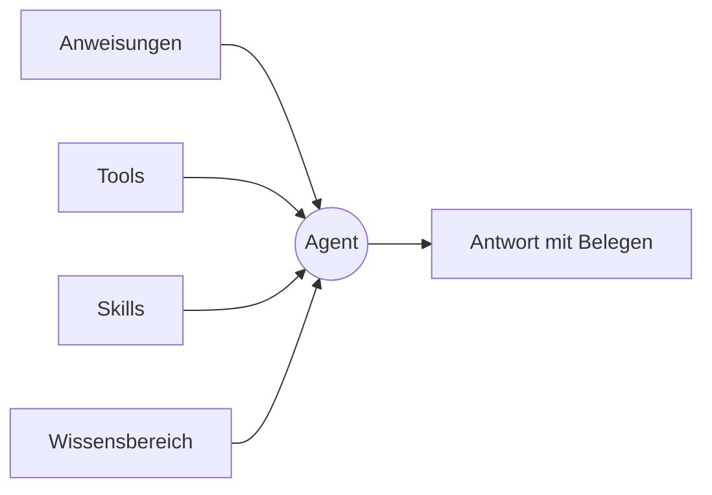

Zu einem Agenten greift Tale, wenn dieselbe Frage immer wiederkommt. Er ist eine **Persona** und keine Laufzeitumgebung: Er sagt, wer da antwortet — Name, Anweisungen, wonach er greifen darf und wer in der Organisation ihn benutzen darf — und nichts darüber, wie ein Zug abläuft. Gebaut wird er von Editoren und Developern, benutzt von allen Mitgliedern.

Diese Seite gibt dir das Denkmodell, das der Rest des Kapitels voraussetzt. Lies sie einmal, bevor du deinen ersten Agenten baust, und komm zurück, wenn du nicht mehr weißt, ob das Verhalten, das du ändern willst, in den Anweisungen, den Tools, den Skills oder dem Wissensbereich steckt.

Lieber erst zusehen? Episode 4 baut einen Agenten in gut drei Minuten von Anfang bis Ende, mit Untertiteln.

<Video src="/videos/de/tutorials/ep4-agent/ep4-agent.de.mp4" poster="/videos/de/tutorials/ep4-agent/ep4-agent.de.webp" captions="/videos/de/tutorials/ep4-agent/ep4-agent.de.vtt" lang="de" title="Episode 4 — Dein erster Agent" caption="Episode 4 — Dein erster Agent (3:18)">

</Video>

## Was ein Agent mitbringt

**Identität.** Den Slug, unter dem der Agent abgelegt ist, den Anzeigenamen, unter dem ihm die Leute begegnen, eine kurze Beschreibung seines Zwecks und optional Fassungen dieser Texte pro Sprache, damit deutsche und französische Leser den Agenten in ihrer eigenen Sprache antreffen. Der Slug steht fest, sobald der Agent existiert; den Anzeigenamen änderst du, wann immer sich die Aufgabe verschiebt.

**Anweisungen.** Die Prosa, die jedem Zug vorangestellt wird, den der Agent beantwortet. Halte sie kurz, meinungsstark und konkret — lange Anweisungen verwässern in langen Gesprächen. Benenne die Stimme, die Grenzen und die Fälle, in denen der Agent ablehnen soll.

**Tools und Skills.** Zwei Erlaubnislisten. Die Tools benennen die Fähigkeiten, die der Agent aufrufen darf, und Plattform-Tools, angebundene Integrationen und die Automatisierungen der Organisation stehen alle in dieser einen Liste. Die Skills benennen die Wissenspakete, die er aufklappen darf, höchstens zehn davon. Für beide gilt dieselbe Regel: Rührst du eine Liste nicht an, ist der Agent nicht eingeschränkt; nennst du eine, gilt genau das Genannte.

**Wissensbereich.** Eine einzige Einstellung dafür, welchen Bestand die Suche des Agenten lesen darf — die eigenen Dokumente der Organisation, die für sie geholten Webseiten, beides zusammen oder gar nichts. Gesucht wird nur, wenn der Agent es für nötig hält, also landet nichts in einer Antwort, wonach er nicht selbst gesucht hat.

**Sichtbarkeit.** `private`, sodass nur der Besitzer herankommt, oder `org`, sodass jedes Mitglied es tut. Ein privater Agent nennt einen Besitzer, denn ein privater Agent ohne Besitzer wäre für niemanden erreichbar.

## Worüber der Agent nicht entscheidet

Das Modell gehört nicht zum Agenten. Wer den Zug abschickt, wählt es jedes Mal ausdrücklich — die Auswahl im Composer gliedert sich in **Models** und **Sandbox agents**, und nichts wählt an deiner Stelle. Es gibt keinen automatischen Eintrag und kein Routing dahinter. Ein Agent, der ein Modell festnagelt, würde stillschweigend die Wahl überschreiben, die gerade jemand vor dem Bildschirm getroffen hat, also hält er keines.

Aus derselben Überlegung sind einige Einstellungen weggefallen, nach denen du vielleicht suchst. Ein Agent hat keinen Typ: Ob ein Zug in einer Sandbox läuft, klärt sich im Gespräch, und manche Provider-Zugänge erzwingen es. Er trägt keine Zeitgrenze, denn eine Obergrenze gehört zu dem Host, der den Zug ausführt, und nicht zu einer Persona. Er hält keine Umgebungsvariablen und keine eigenen Zugangsdaten — die liegen bei den Provider-Einträgen der Organisation, wo sie an einer Stelle rotiert und geprüft werden. Und er bringt keine fertigen Gesprächseinstiege mit, weil der Composer der Einstieg ist.

## Zusammengesetzt — ein Agent für die Support-Triage

Ein erster nützlicher Agent ist der für die Support-Triage: Er liest die eingehende Frage, beantwortet, was er kann, und reicht den Rest weiter. Die Entscheidungen:

- Anweisungen: ein Absatz zur Stimme, dazu drei ausdrückliche Fälle, in denen er ablehnt.
- Tools: Websuche und die Gesprächs-Tools. Keine Codeausführung.
- Skills: das hauseigene Bundle für den Antwortton, damit die Formulierung überall gleich klingt.
- Wissen: auf die Dokumente der Organisation eingegrenzt, das gecrawlte Web bleibt außen vor.
- Sichtbarkeit: `org`, damit das ganze Support-Team ihn im Composer auswählen kann.

Danach läuft das Gespräch so ab: Deine Nachricht kommt an, die Anweisungen rahmen die Antwort, die Suche findet die Passagen, die sie stützen, die erlaubten Tools füllen die Lücken, und die Antwort landet mit Belegen. Die Weitergabe an eine Spezialistin ist kein Schalter, sondern folgt den Worker-Beziehungen zwischen Agenten — nachzulesen unter [Agent-Worker](/de/platform/agents/delegation).

## Wann du dazu greifst

Ein einzelner Agent ist die richtige Form, solange das Gespräch in einer Domäne und einer Stimme bleibt. Zu einer [Automatisierung](/de/platform/automations/concepts) greifst du, wenn die Arbeit feste Stufen hat und du Freigaben oder Zeitpläne dazwischen willst; zu einem einfachen Chat ohne Agenten, wenn du selbst eine Antwort erkundest und die Voreinstellungen des Modells reichen.

| Nimm … wenn                                            | Agent | Einfacher Chat | Automatisierung |
| ------------------------------------------------------ | ----- | -------------- | --------------- |
| Dieselbe Frage wiederkehrt                             | ✓     |                |                 |
| Die Stimme oder die Grenzen zählen                     | ✓     |                |                 |
| Zwischen Schritten Freigaben oder Zeitpläne nötig sind |       |                | ✓               |
| Du eine Antwort einmalig erkundest                     |       | ✓              |                 |

## Bau einen

Ein Agent besteht aus Identität, Anweisungen, zwei Erlaubnislisten, einem Wissensbereich und einer Sichtbarkeit — änderst du eines davon, hat er ein anderes Verhalten, änderst du drei, hast du ein anderes Produkt. Alles, was den Ablauf eines Zuges betrifft, bleibt außerhalb der Persona und entscheidet sich pro Gespräch. Der nächste sinnvolle Schritt ist [Einen Agenten anlegen](/de/platform/agents/create) — dort geht es Tab für Tab durch den Editor.
