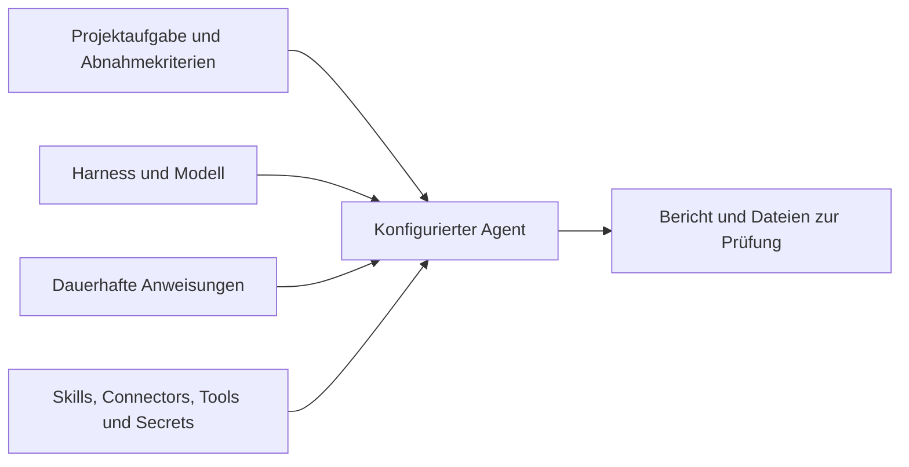

Ein Projektagent bearbeitet Aufgaben in einem bestimmten Projekt. Du legst fest, wie er arbeitet und worauf er zugreifen darf, und gibst ihm eine Aufgabe mit einem prüfbaren Ergebnis. In seiner Sandbox kann er Dateien bearbeiten und Befehle ausführen. Eine Person prüft das Ergebnis, bevor sie die Aufgabe abschließt.

## Die passende Arbeitsform wählen

| Arbeitsform | Geeignete Arbeit | Was du festlegst |
| --- | --- | --- |
| Chat | Fragen stellen, Wissen abrufen oder einen Text entwerfen. | Nachricht, Modell und gegebenenfalls Projektkontext. |
| Projektagent | Ein Repository prüfen, Dateien erstellen oder eine Aufgabe über mehrere Durchläufe bearbeiten. | Einen wiederverwendbaren Agenten im Projekt. |
| Automatisierung | Festgelegte Schritte ausführen, auf Ereignisse reagieren oder zwischen Aktionen eine Freigabe einholen. | Einen versionierten Workflow und seine Eingaben. |

Auch ein Projektchat verwendet den eingebauten Chat-Assistenten. Die Wahl eines Projekts im Chat aktiviert keinen Projektagenten. Eine Agent-Node in einer Automatisierung hat wiederum ihre eigene Konfiguration.

## Eine klare Verantwortung festlegen

Beginne mit einer Verantwortung, deren Ergebnis du beurteilen kannst, etwa: „Prüfe Änderungen auf Regressionen und belege deine Befunde.“ Das gehört in die dauerhaften Anweisungen des Agenten. Das konkrete Repository, Dateien, Abnahmekriterien und einen Termin beschreibst du in der jeweiligen Aufgabe.

Ein Agent gehört genau einem Projekt. Wer das Projekt lesen darf, sieht seine Agenten; wer es bearbeiten darf, kann sie im aktiven Projekt verwalten. Namen müssen innerhalb des Projekts eindeutig sein. Bis zu 50 Agenten sind möglich. Ein anderes Projekt braucht eine eigene Konfiguration, auch bei gleichem Namen und gleichen Anweisungen.

## Die Konfiguration verstehen

| Bestandteil | Was er bestimmt | Beispiel für deine Entscheidung |
| --- | --- | --- |
| Harness | Das Coding-Programm, das die Sitzung in einer Sandbox ausführt. | Wähle eine Laufzeit, die zum verfügbaren Zugang passt. |
| Modell und Provider | Das aufgerufene Modell und den bereitstellenden Provider. | Wähle eine für die Arbeit freigegebene Kombination. |
| Anweisungen | Wiederverwendbare Verantwortung und Arbeitsregeln, bis zu 20.000 Zeichen. | Verlange Belege und einen Bericht über durchgeführte Prüfungen. |
| Skills | Anweisungs-Bundles und ergänzende Dateien. | Ordne die Review-Checkliste des Teams zu. |
| Connectors und Tools | Verbundene Dienste und erlaubte Plattformoperationen. | Vergib Repository-Zugriff und nur die benötigten Aufgaben-Tools. |
| Secrets | Benannte Zugangsdaten der Organisation für die laufende Sitzung. | Nutze ein eng begrenztes Token für einen Dienst ohne Connector. |

Die Listen für Skills, Connectors, Tools und Secret-Namen erlauben jeweils bis zu 25 Einträge. Ein freigegebenes Schreib-Tool darf im Rahmen seiner Zugriffsregeln Daten ändern. Eine Anweisung zu vorsichtigem Vorgehen entzieht diese Berechtigung nicht. Nur Inhaber oder Admins dürfen Secret-Zuordnungen ändern.

## Vor der Zuweisung die Voraussetzungen prüfen

Die Provider-Zugangsdaten müssen zur gewählten Laufzeit und zum Modell passen. Außerdem muss Sandbox-Kapazität verfügbar sein. Eine erfolgreiche Chat-Antwort belegt diese Voraussetzungen nicht. Beschreibe in der Aufgabe das erwartete Ergebnis und füge das zu prüfende Material hinzu.

Sind diese Entscheidungen getroffen, [erstelle einen Projektagenten](/de/platform/projects/project-agents). Die [Aufgaben-Automatisierung](/de/platform/projects/task-automation) erklärt Start, Steuerung und Prüfung seiner Arbeit.
