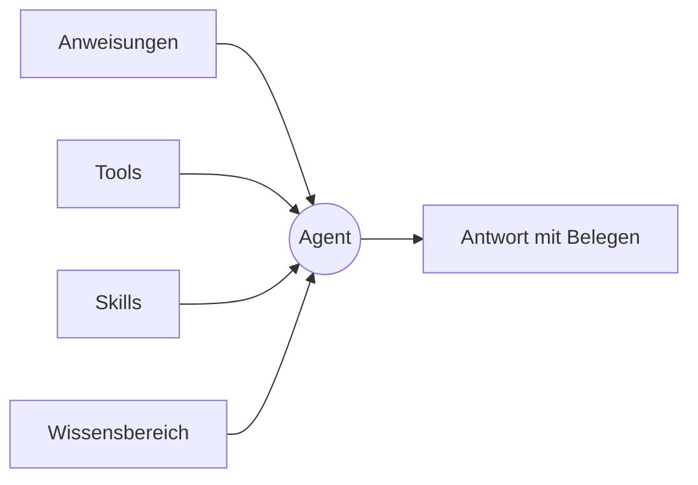

Zu einem Agenten greift Tale, wenn dieselbe Frage immer wiederkommt. Er ist eine **Persona** und keine Laufzeitumgebung: Er sagt, wer da antwortet — Name, Anweisungen, wonach er greifen darf und wer in der Organisation ihn benutzen darf — und nichts darüber, wie ein Zug abläuft. In dieser Version ist eine Persona eine YAML-Datei in der Konfiguration der Organisation, die die Plattform über ihre eigene API ausliefert und bearbeitet; keine Ansicht listet oder bearbeitet sie, und der Chat-Composer bietet keine zur Auswahl an. Die Agenten, denen du auf einer Ansicht begegnest, sind **Projekt-Agenten** — die benannte Crew im Tab **Agenten** eines Projekts, dieselben Entscheidungen, verpackt für Board-Aufgaben.

Diese Seite gibt dir das Denkmodell, das der Rest des Kapitels voraussetzt. Lies sie einmal, bevor du deine erste Persona-Datei schreibst oder dein erstes Projekt besetzt, und komm zurück, wenn du nicht mehr weißt, ob das Verhalten, das du ändern willst, in den Anweisungen, den Tools, den Skills oder dem Wissensbereich steckt.

Lieber erst zusehen? Episode 4 wurde im früheren Agenten-Editor aufgenommen — einer Ansicht, die es in dieser Version nicht gibt —, aber die Entscheidungen, die sie in gut drei Minuten mit Untertiteln durchgeht, sind die, die eine Persona weiterhin trägt.

<Video src="/videos/de/tutorials/ep4-agent/ep4-agent.de.mp4" poster="/videos/de/tutorials/ep4-agent/ep4-agent.de.webp" captions="/videos/de/tutorials/ep4-agent/ep4-agent.de.vtt" lang="de" title="Episode 4 — Dein erster Agent" caption="Episode 4 — Dein erster Agent (3:18)">

</Video>

## Was ein Agent mitbringt

Eine Persona-Datei trägt fünf Dinge. Jedes wird beim Speichern der Datei geprüft, und keines wird in dieser Version auf einer Ansicht gesetzt — [Agents (Admin-Sicht)](/de/platform/admin/agents) beschreibt, wer eine Datei bearbeiten darf und wie die Sichtbarkeit durchgesetzt wird.

**Identität.** Den Slug, unter dem der Agent abgelegt ist — er ist der Dateiname und steht fest, sobald der Agent existiert —, den Anzeigenamen, unter dem ihm die Leute begegnen, eine kurze Beschreibung seines Zwecks und optional Fassungen dieser Texte pro Sprache, damit deutsche und französische Leser den Agenten in ihrer eigenen Sprache antreffen. Den Anzeigenamen änderst du, wann immer sich die Aufgabe verschiebt.

**Anweisungen.** Die Prosa, die die Persona jedem Zug beisteuert, den sie rahmt — bis zu 20.000 Zeichen, auf oberster Ebene oder pro Sprache. Halte sie kurz, meinungsstark und konkret — lange Anweisungen verwässern in langen Gesprächen. Benenne die Stimme, die Grenzen und die Fälle, in denen der Agent ablehnen soll.

**Tools und Skills.** Zwei Erlaubnislisten. Die Tools benennen die Fähigkeiten, die der Agent aufrufen darf — bis zu hundert —, und Plattform-Tools, angebundene Connectors und die Automatisierungen der Organisation stehen alle in dieser einen Liste. Die Skills benennen die Skill-Bundles, die er aufklappen darf, höchstens zehn davon. Für beide gilt dieselbe Regel: Lässt du eine Liste weg, ist der Agent nicht eingeschränkt; nennst du eine, gilt genau das Genannte — eine leere Liste heißt gar nichts.

**Wissensbereich.** Eine einzige Einstellung dafür, welchen Bestand die Suche des Agenten lesen darf — die eigenen Dokumente der Organisation, die für sie geholten Webseiten, beides zusammen (die Voreinstellung) oder gar nichts. Jeder Bestand gehört der Organisation selbst, ein weiterer Bereich überschreitet also nie die Grenze zu einer anderen Organisation.

**Sichtbarkeit.** `private`, sodass nur der Besitzer herankommt, oder `org`, sodass jedes Mitglied es tut. Ein privater Agent nennt einen Besitzer, denn ein privater Agent ohne Besitzer wäre für niemanden erreichbar; eine über die API angelegte Persona gehört ihrem Autor und startet privat, und sie zu teilen ist eine ausdrückliche Änderung.

## Worüber der Agent nicht entscheidet

Das Modell gehört nicht zum Agenten. Wem der Zug gehört, dem gehört auch diese Wahl — die Auswahl im Chat-Composer ist nur Modelle: Sie startet auf **Auto** (Tale wählt pro Nachricht ein Modell, und die Antwort hält fest, welches lief), und jedes direkt bediente Modell steht daneben zum Festnageln bereit. Ein Agent, der ein Modell festnagelt, würde stillschweigend die Wahl überschreiben, die gerade jemand vor dem Bildschirm getroffen hat, also hält er keines.

Aus derselben Überlegung sind einige Einstellungen weggefallen, nach denen du vielleicht suchst. Eine Persona hat keinen Typ und keinen Harness-Picker: Ob Arbeit auf einem Coding-[Harness](/de/platform/agents/harnesses) läuft, entscheidest du beim Anlegen eines **Projekt-Agenten** oder eines Automation-**Agent**-Knotens (beide nennen das Feld **Agent-Laufzeit**), und manche Provider-Zugänge erzwingen eines. Sie trägt keine Zeitgrenze, denn eine Obergrenze gehört zu dem Host, der den Zug ausführt, und nicht zu einer Persona. Sie hält keine Umgebungsvariablen und keine eigenen Zugangsdaten — die liegen bei den Provider-Einträgen der Organisation, wo sie an einer Stelle rotiert und geprüft werden. Und sie bringt keine fertigen Gesprächseinstiege mit — nichts in dieser Version bietet eine Persona als Einstieg in den Chat an.

## Zusammengesetzt — ein Agent für die Support-Triage

Ein erster nützlicher Agent ist der für die Support-Triage: Er liest die eingehende Frage, beantwortet, was er kann, und reicht den Rest weiter. Die Entscheidungen, egal ob du sie in eine Persona-Datei oder in den Dialog eines Projekt-Agenten schreibst:

- Anweisungen: ein Absatz zur Stimme, dazu drei ausdrückliche Fälle, in denen er ablehnt.
- Tools: so wenige, wie die Aufgabe zulässt — für einen Agenten, der eine Nachricht liest und zwei Zeilen schreibt, keine.
- Skills: das hauseigene Bundle für den Antwortton, damit die Formulierung überall gleich klingt.
- Wissen: die Dokumente der Organisation, das gecrawlte Web bleibt außen vor — beim Projekt-Agenten die Lese-Tools für Wissen und Dokumente.
- Sichtbarkeit: `org`, damit das ganze Support-Team die Persona lesen kann; ein Projekt-Agent gehört zu seinem Projekt, und wer es bearbeiten darf, verwaltet ihn.

Der Agent, der in dieser Version tatsächlich läuft, ist der Projekt-Agent: Leg ihn im Tab **Agenten** des Projekts mit genau diesen Anweisungen an, weis ihm eine Aufgabe zu, klick auf **Agent starten** und lies die zwei Zeilen, die er unter **In Prüfung** zurückmeldet — [Deinen ersten Agent bauen](/de/tutorials/editor/first-agent-end-to-end) geht genau das durch. Die Weitergabe an eine Spezialistin ist keine Einstellung der Persona: Arbeit weiterzureichen ist eine weitere Aufgabe, einem weiteren Agenten zugewiesen — nachzulesen unter [Agent-Worker](/de/platform/agents/delegation).

## Wann du dazu greifst

Eine Persona ist Konfiguration, die festlegt, wer antwortet; die Bahnen, aus denen du tatsächlich wählst, sind der Chat, ein Projekt-Agent und eine Automatisierung. Zum Chat greifst du, wenn du selbst eine Antwort erkundest — der eingebaute Assistent recherchiert und entwirft und erzeugt keine Dateien. Zum Projekt-Agenten greifst du, wenn die Arbeit eine Aufgabe ist, deren Ergebnis ein Mensch prüfen soll. Zu einer [Automatisierung](/de/platform/automations/concepts) greifst du, wenn die Arbeit feste Stufen hat und du Freigaben oder Zeitpläne dazwischen willst.

| Nimm … wenn                                               | Chat | Projekt-Agent | Automatisierung |
| --------------------------------------------------------- | ---- | ------------- | --------------- |
| Du eine Antwort erkundest oder einen Entwurf willst       | ✓    |               |                 |
| Das Ergebnis eine Datei oder eine Änderung zum Prüfen ist |      | ✓             |                 |
| Stimme und Grenzen jedes Mal gelten müssen                |      | ✓             | ✓               |
| Zwischen Schritten Freigaben oder Zeitpläne nötig sind    |      |               | ✓               |

## Bau einen

Ein Agent besteht aus Identität, Anweisungen, zwei Erlaubnislisten, einem Wissensbereich und einer Sichtbarkeit — änderst du eines davon, hat er ein anderes Verhalten, änderst du drei, hast du ein anderes Produkt. Alles, was den Ablauf eines Zuges betrifft, bleibt außerhalb der Persona und entscheidet sich in der Bahn, die ihn ausführt: die Modellauswahl des Chat-Composers, Agent-Laufzeit und Modell eines Projekt-Agenten, die Einstellungen eines Automation-Knotens. Die Agenten, die du auf einer Ansicht baust, sind Projekt-Agenten — [Projekt-Agenten](/de/platform/projects/project-agents) geht den Dialog Feld für Feld durch, [Einen Agent erstellen](/de/platform/agents/create) sagt, was den Editor ersetzt hat, und [Agents (Admin-Sicht)](/de/platform/admin/agents) behandelt die Persona-Dateien und wer sie ändern darf.
