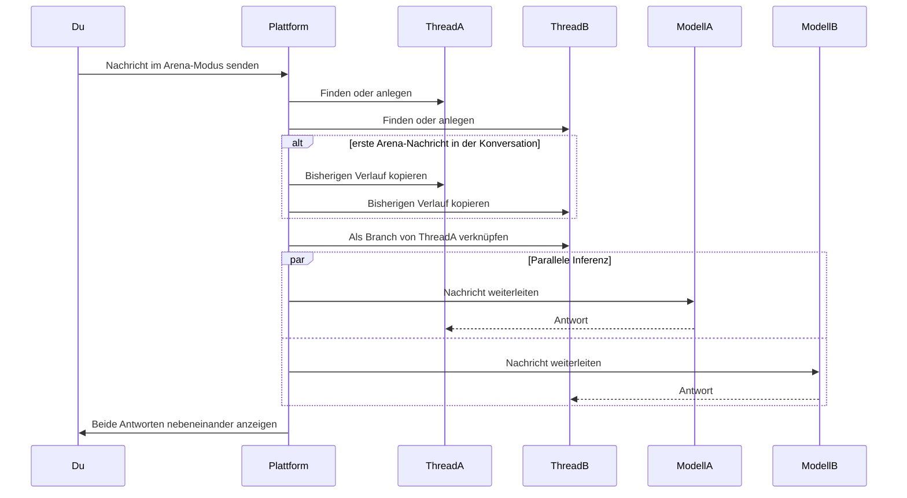

Arena-Modus sendet dieselbe Nachricht gleichzeitig an zwei verschiedene KI-Modelle und vergleicht ihre Antworten in einer geteilten Ansicht. Nutze ihn, um Modellqualität zu bewerten, neue Modelle gegen deinen aktuellen Standard zu testen oder Präferenzdaten in deinem Team zu sammeln.

## Arena-Modus aktivieren

1. Öffne eine beliebige Chat-Konversation.
2. Klicke auf das **Schwerter**-Icon in der Toolbar der Chat-Eingabe. Das Icon leuchtet, wenn Arena-Modus aktiv ist.
3. Zwei Modell-Dropdowns erscheinen über dem Eingabefeld, mit den Labels **A** und **B** und **vs** dazwischen.
4. Wähle für jede Seite ein Modell. Die Dropdowns zeigen alle Modelle, die dir basierend auf den Governance-Einstellungen deiner Organisation und den unterstützten Modellen des aktiven Agents verfügbar sind.
5. Tippe eine Nachricht und sende sie ab.

Um Arena-Modus zu deaktivieren, klicke erneut auf das Schwerter-Icon. Der gesamte Arena-Zustand (Modellauswahl, Threads, Verdikt) wird zurückgesetzt.

> **Hinweis:** Arena-Modus benötigt mindestens zwei verfügbare Modelle. Ist nur ein Modell konfiguriert, wird der Selector ausgeblendet und der Schalter deaktiviert.

## Geteilte Ansicht

Nach dem Senden einer Nachricht teilt sich der Chat-Bereich in zwei Spalten:

| Spalte     | Inhalt                                  |
| ---------- | --------------------------------------- |
| Links (A)  | Nachrichten aus dem Thread von Modell A |
| Rechts (B) | Nachrichten aus dem Thread von Modell B |

Jede Spalte hat einen Header mit Label und Modellnamen. Beide Spalten scrollen unabhängig voneinander und unterstützen alle Chat-Funktionen inklusive Freigaben, Datei-Anhängen und Nachrichten-Aktionen.

Du kannst im Arena-Modus weiter Nachrichten senden. Jede neue Nachricht geht parallel an beide Modelle.

## Verdikt abgeben

Sobald beide Modelle geantwortet haben, erscheint eine Verdikt-Leiste unter der geteilten Ansicht mit vier Optionen:

| Verdikt            | Wirkung                                                               |
| ------------------ | --------------------------------------------------------------------- |
| **A ist besser**   | Markiert Modell A als bevorzugte Antwort.                             |
| **B ist besser**   | Markiert Modell B als bevorzugt und macht Thread B zum aktiven Zweig. |
| **Unentschieden**  | Markiert beide Antworten als gleich gut.                              |
| **Beide schlecht** | Markiert keine der Antworten als zufriedenstellend.                   |

Verdikte werden als Feedback mit Metadaten (Auswahl, ID von Modell A, ID von Modell B) gespeichert. Nach dem Eintragen sind die Verdikt-Buttons für diese Vergleichsrunde deaktiviert.

## So funktioniert es

Wenn du eine Nachricht im Arena-Modus sendest, tut die Plattform Folgendes:

1. Sie erstellt zwei separate Threads (oder verwendet vorhandene Arena-Threads wieder).
2. Sie kopiert den Konversationsverlauf in beide Threads, falls das die erste Arena-Nachricht in einer bestehenden Konversation ist.
3. Sie sendet dieselbe Nachricht parallel an beide Modelle. Jedes antwortet im eigenen Thread, ohne die Ausgabe des anderen zu sehen.
4. Sie legt einen Branch-Link an, sodass Thread B als Variante von Thread A geführt wird.

So ist ein fairer Vergleich sichergestellt — kein Modell wird von der Antwort des anderen beeinflusst.
