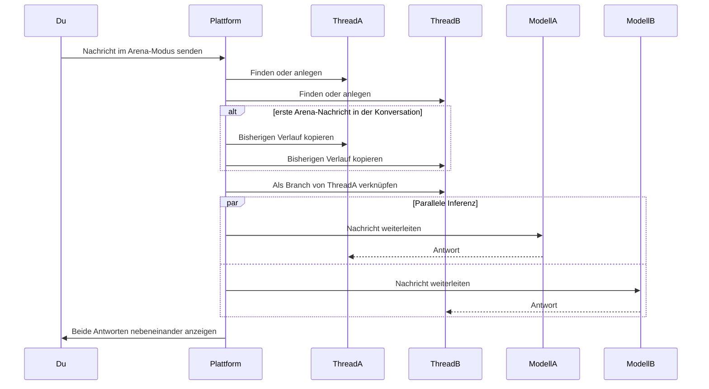

Arena-Modus sendet dieselbe Nachricht zur gleichen Zeit an zwei KI-Modelle und rendert die Antworten in einer geteilten Ansicht. Nutze ihn, um ein Kandidaten-Modell gegen deinen aktuellen Standard zu evaluieren, Präferenzdaten quer durchs Team vor einem Modell-Rollout zu sammeln oder zu zeigen, warum ein Modell eine bestimmte Prompt-Klasse besser behandelt als ein anderes. Jedes Mitglied mit Chat-Zugriff kann den Arena-Modus laufen lassen; die Modell-Dropdowns sind auf das gefiltert, was die Organisation unter [KI-Anbieter](/de/platform/admin/providers) konfiguriert hat und was der aktive Agent unterstützt.

Diese Seite behandelt die Laufzeit: Modus einschalten, geteilte Ansicht, Verdikt aufzeichnen und wie die parallele Inferenz unter der Haube funktioniert.

## Arena-Modus einschalten

Öffne eine beliebige Chat-Konversation und klicke auf das **Schwerter**-Icon in der Eingabe-Toolbar — das Icon leuchtet, wenn der Arena-Modus aktiv ist. Zwei Modell-Dropdowns erscheinen über dem Eingabefeld, beschriftet mit **Modell A** und **Modell B** mit **vs** dazwischen. Wähle auf jeder Seite ein Modell und sende eine Nachricht; beide Antworten streamen in eine geteilte Ansicht. Um den Modus wieder abzuschalten, klicke das Schwerter-Icon erneut — der gesamte Arena-Zustand (Modellauswahl, Threads, Verdikt) wird zurückgesetzt.

Der Arena-Modus braucht mindestens zwei verfügbare Modelle im Anbieter-Set der Organisation. Ist nur ein Chat-Modell konfiguriert, werden die Dropdowns ausgeblendet und der Schalter deaktiviert — füge zuerst einen zweiten Anbieter unter [KI-Anbieter](/de/platform/admin/providers) hinzu.

## Die geteilte Ansicht

Nachdem du eine Nachricht gesendet hast, teilt sich der Chat-Bereich in zwei Spalten. Die linke Spalte streamt die Antwort aus dem Thread von Modell A; die rechte streamt die von Modell B. Jede Spalte hat eine Kopfzeile mit dem Modellnamen; beide scrollen unabhängig und unterstützen den vollen Funktionsumfang des Chats inklusive Genehmigungen, Anhängen und Nachrichten-Aktionen. Schreibst du im selben View weiter, geht jede neue Nachricht parallel an beide Modelle.

## Verdikt aufzeichnen

Sobald beide Modelle geantwortet haben, erscheint unter der geteilten Ansicht eine Verdikt-Leiste. Vier Optionen:

| Verdikt            | Wirkung                                                                   |
| ------------------ | ------------------------------------------------------------------------- |
| **A ist besser**   | Zeichnet Modell A als bevorzugte Antwort auf.                             |
| **B ist besser**   | Zeichnet Modell B als bevorzugt auf und macht Thread B zum aktiven Zweig. |
| **Unentschieden**  | Zeichnet auf, dass beide Antworten gleich gut waren.                      |
| **Beide schlecht** | Zeichnet auf, dass keine der Antworten zufriedenstellend war.             |

Verdikte werden als Feedback mit der Wahl und beiden Modell-IDs gespeichert. Einmal eingetragen, sind die Verdikt-Buttons für diese Vergleichsrunde deaktiviert, sodass jedes Paar genau ein Urteil bekommt. Die Verdikte sammeln sich als Präferenzdaten — dein Nutzungsanalytik-Dashboard zeigt Eins-gegen-Eins-Siege je Paar und aggregierte Modell-Ranglisten über die Zeit.

## Wie die parallele Inferenz funktioniert

Wenn du im Arena-Modus eine Nachricht sendest, erstellt die Plattform zwei separate Threads (oder verwendet die bestehenden Arena-Threads wieder), kopiert den Konversationsverlauf in beide, falls dies die erste Arena-Nachricht in der Konversation ist, verknüpft Thread B als Branch von Thread A und leitet dieselbe Nachricht parallel an beide Modelle weiter. Kein Modell sieht die Ausgabe des anderen, das Verdikt spiegelt also, was jedes Modell unabhängig produziert hat.

Der Branch-Link ist, was dich die siegreiche Antwort behalten lässt: wenn du **B ist besser** wählst, wird Thread B zum aktiven Zweig, und nachfolgende Nicht-Arena-Nachrichten knüpfen dort an.

## Wo das einsetzt

Der Arena-Modus ist die Evaluations-Oberfläche im Chat — der schnellste Weg von „Ich will wissen, wie diese beiden Modelle auf meinen echten Prompts abschneiden" zu einem aufgezeichneten Verdikt. Nutze die Verdikte, die er liefert, um zu entscheiden, welches Modell du als **Standard**-Preset unter [KI-Anbieter](/de/platform/admin/providers) zuweist und welches Modell jeder Agent unter [Agent erstellen](/de/platform/agents/create) verwendet. Für aggregierte Trends zeigt das Nutzungsanalytik-Dashboard Arena-Verdikte nach Paar und nach Agent gruppiert.
