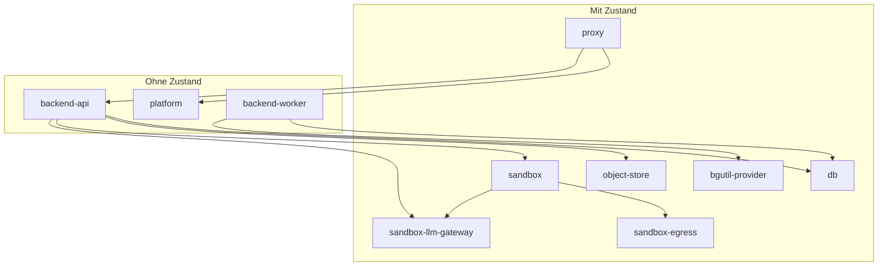

Diese Seite ist, was ein Stack reproduzieren muss, wenn du Compose oder Kubernetes selbst schreibst statt `tale deploy` zu laufen: welche Services Zustand halten, die DNS-Namen, die Probes, die Volumes. Der CLI-Weg bleibt in [Quickstart](/de/self-hosted/install/quickstart) und [Upgrades](/de/self-hosted/operate/upgrades).

## Wann dieser Weg der richtige ist

Nimm die CLI, wenn du sie fahren kannst. Nimm diese Seite, wenn du Compose schreibst, oder wenn du denselben Vertrag auf Kubernetes abbildest.

| Diese Seite, wenn | Die CLI, wenn |
| ----------------- | ------------- |
| Du Produktions-Compose schreibst oder ein Cluster-Mapping — Air-Gap, bestehende Automation, keine CLI auf dem Host | [Quickstart](/de/self-hosted/install/quickstart) plus `tale deploy`, wenn du Blue-Green, `tale backup` und `tale rollback` willst |

Es gibt kein offizielles Helm-Chart.

## Mit Zustand und ohne

Zehn Services, zwei Arten. Wer Zustand hält, trägt Platten und feste Identität — erzeugst du sie neu, verlierst du Daten oder bricht DNS. Zustandslose Services sind austauschbare Replicas eines Images; die erzeugst du beim Upgrade in place neu. Eine Compose-Datei ist der Default. Getrennte Dateien oder Kubernetes gehören dir, solange die DNS-Namen, das isolierte Sandbox-Netz und die Boot-Reihenfolge bleiben.



`sandbox-llm-gateway` ist der Harness-Pfad: die API provisioniert ihn, und ein Session-Container erreicht ihn als `llm-gateway`. `bgutil-provider` ist der YouTube-PO-Token-Sidecar des Workers und best-effort — Video-Link-Ingest fällt ohne ihn zurück.

Die drei zustandslosen Services teilen sich ein Image (`ghcr.io/tale-project/tale/tale-platform:<version>`). `TALE_ROLE` wählt beim Boot `api` oder `worker`; der Web-Tier ist dasselbe Image ohne diese Rolle. Pinne jedes `tale-*`-Image auf denselben Release-Tag, damit die Wire-Contracts nicht auseinanderlaufen.

| Art | Services |
| --- | -------- |
| Mit Zustand | `proxy`, `db`, `object-store`, `sandbox`, `sandbox-egress`, `sandbox-llm-gateway`, `bgutil-provider` |
| Ohne Zustand | `platform`, `backend-api`, `backend-worker` |

## Die Images

Jedes `tale-*`-Image liegt in der GitHub Container Registry unter demselben Release-Tag, eine Versionsnummer pinnt also den ganzen Stack. Zwei Services fahren Upstream-Images mit eigenen Versionen.

| Service | Image |
| ------- | ----- |
| `platform`, `backend-api`, `backend-worker` | `ghcr.io/tale-project/tale/tale-platform:<version>` |
| `proxy` | `ghcr.io/tale-project/tale/tale-proxy:<version>` |
| `db` | `ghcr.io/tale-project/tale/tale-db:<version>` |
| `sandbox` | `ghcr.io/tale-project/tale/tale-sandbox:<version>` |
| `sandbox-egress` | `ghcr.io/tale-project/tale/tale-sandbox-egress:<version>` |
| `sandbox-llm-gateway` | `ghcr.io/tale-project/tale/tale-sandbox-llm-gateway:<version>` |
| `object-store` | `minio/minio:RELEASE.2025-04-22T22-12-26Z` |
| `bgutil-provider` | `brainicism/bgutil-ytdlp-pot-provider:1.3.1` |

Ein Image ist kein Compose-Service: Der Spawner erzeugt jeden Session-Container aus `ghcr.io/tale-project/tale/tale-sandbox-runtime:<version>`, und sein eingebauter Default ist der lokale Tag, den der Entwicklungs-Stack baut — ein Host, der ihn nie gebaut hat, nennt das Registry-Image in `SANDBOX_RUNTIME_IMAGE`, sonst scheitern `Run code`, Web-Rendering und Dokumentgenerierung an einem fehlenden Image. Die Beispiele unten pinnen den Release, den diese Seite dokumentiert; ersetz den Tag durch den Release, den du installierst.

## Die zustandslosen Services

Unten stehen die drei zustandslosen Rollen — Aliase, `/ping` als Liveness, `TALE_ROLE`, `NET_ADMIN`. Leg die Services mit Zustand in dieselbe Datei oder woanders hin; die Tabellen auf dieser Seite sagen, was sie trotzdem tun müssen. Pinne den Image-Tag und füll `.env` aus der [Umgebungsreferenz](/de/self-hosted/configuration/environment-reference).

```yaml
# Stateless app tier. No container_name: --scale needs free names.
# Add db, proxy, sandbox, … in this file or another — your call. In one file,
# add depends_on: { db: { condition: service_healthy }, … } as well.
services:
  platform:
    image: ghcr.io/tale-project/tale/tale-platform:0.5.11
    env_file: [.env]
    volumes: ['config-data:/app/data:ro']
    restart: unless-stopped
    stop_grace_period: 45s
    healthcheck:
      test:
        [
          'CMD-SHELL',
          'curl -sf http://localhost:3000/api/health && [ -f /tmp/platform-ready ]',
        ]
      interval: 5s
      timeout: 3s
      retries: 3
      start_period: 180s
    networks:
      internal:
        aliases: [platform]
  backend-api:
    image: ghcr.io/tale-project/tale/tale-platform:0.5.11
    environment:
      TALE_ROLE: api
      PORT: '3005'
      TALE_CONFIG_DIR: /app/data
      DATABASE_URL: postgresql://tale:${DB_PASSWORD}@db:5432/tale_app
      SANDBOX_URL: http://sandbox:8003
      SANDBOX_HTTP_API_BASE_URL: http://backend-api:3005
      OBJECT_STORE_ENDPOINT: http://object-store:9000
    env_file: [.env]
    volumes: ['config-data:/app/data']
    cap_add: [NET_ADMIN]
    restart: unless-stopped
    healthcheck:
      test: ['CMD-SHELL', 'curl -sf http://localhost:3005/ping']
      interval: 10s
      timeout: 3s
      retries: 3
      start_period: 30s
    networks:
      internal:
        aliases: [backend-api]
      sandbox:
        aliases: [backend-api]
  backend-worker:
    image: ghcr.io/tale-project/tale/tale-platform:0.5.11
    environment:
      TALE_ROLE: worker
      TALE_CONFIG_DIR: /app/data
      DATABASE_URL: postgresql://tale:${DB_PASSWORD}@db:5432/tale_app
      SANDBOX_URL: http://sandbox:8003
      SANDBOX_HTTP_API_BASE_URL: http://backend-api:3005
      OBJECT_STORE_ENDPOINT: http://object-store:9000
    env_file: [.env]
    volumes: ['config-data:/app/data']
    cap_add: [NET_ADMIN]
    restart: unless-stopped
    healthcheck: { disable: true }
    networks: [internal]
volumes:
  config-data:
networks:
  internal:
  sandbox:
    name: tale-sandbox-net
    internal: true
    enable_ipv6: false
```

Es gibt kein eingechecktes Produktions-Compose zum Kopieren. Die CLI erzeugt ein geteiltes Dateipaar und löscht es nach `up`. Deine Datei muss nicht so aussehen.

## Secrets, die du vor dem ersten Boot erzeugst

`tale init` erzeugt jedes Secret und schreibt die `.env`; ohne die CLI ist das dein Job. Die [Umgebungsreferenz](/de/self-hosted/configuration/environment-reference) sagt, was jede Variable tut — die vier unten sind die, die ein selbst gebauter Stack am häufigsten vergisst, weil die Beispieldatei sie auskommentiert lässt, damit die CLI sie füllt.

| Variable | Wert | Was ohne sie bricht |
| -------- | ---- | ------------------- |
| `SANDBOX_TOKEN` | `openssl rand -hex 32` | Der Spawner beendet sich beim Start. Er hält den Docker-Socket des Hosts und antwortet jedem Session-Container, also gibt es keinen unsignierten Modus; das Backend signiert jeden Spawner-Aufruf mit demselben Wert. |
| `OBJECT_STORE_ACCESS_KEY` | `tale` oder ein eigener Name | Das Backend loggt beim Boot `object store (skipped)` und verweigert jeden Upload. Einen Image-Default dafür gibt es nicht — der Root-User des Stores trägt denselben Wert. |
| `OBJECT_STORE_SECRET_KEY` | `openssl rand -hex 32` | Dasselbe Überspringen, dieselbe Stille. Rotierst du ihn später, verwaisen alle Blobs, die unter dem alten Credential geschrieben wurden. |
| `OBJECT_STORE_PUBLIC_ENDPOINT` | deine `SITE_URL` | Uploads scheitern im Browser mit einem Netzwerkfehler: Die presignte URL, die das Backend ausgibt, zeigt auf das interne `http://object-store:9000`, das kein Browser erreicht. |

Den Public-Endpoint bringst du vor dem Start in Ordnung, nicht danach. Das Backend seedet die Deployment-Default-Blob-Verbindung beim ersten Boot ins Config-Volume (`default/object-storage/connection.json`) und überschreibt einen bereits vorhandenen Default nie — die Variable auf einer schon gebooteten Instanz zu setzen, ändert also nichts. Zum Reparieren trägst du `"publicEndpoint": "<deine SITE_URL>"` in diese Datei ein und startest das Backend neu.

## Netze und DNS-Namen

Zwei Docker-Netze tragen jeden Hop. Ein gewöhnliches Compose-Netz reicht für die interne Ebene. Die Sandbox-Bridge muss `tale-sandbox-net` heißen und `internal` sein, damit der Spawner `docker run --network tale-sandbox-net` kann und ein Session-Container das Internet nicht ohne `sandbox-egress` erreicht. Eine Bridge ohne `internal` ist ein offener Weg nach draußen.

| Name, den der Prozess auflöst | Wer antwortet | Netze |
| ----------------------------- | ------------- | ----- |
| `backend-api` | Jede gesunde API-Replica, die noch hängt | `internal`, `sandbox` |
| `platform` | Jede gesunde Web-Tier-Replica, die noch hängt | `internal` |
| `knowledge-db` | Der `db`-Service (Produktion faltet den Korpus in dasselbe Postgres) | `internal` |
| `object-store` | MinIO | `internal` |
| `sandbox` | Der Sandbox-Spawner | `internal`, `sandbox` |
| `sandbox-egress` | Der Egress-Proxy | `internal`, `sandbox` |
| `llm-gateway` | `sandbox-llm-gateway` | `internal`, `sandbox` |
| `HOST` (dein öffentlicher Hostname) | `proxy`, damit ein Container zur öffentlichen URL hairpinnen kann | `internal` |

Worker haben keinen geteilten Alias. Nichts adressiert einen Worker per Name; sie holen Jobs nur aus der Queue. Farb-suffigierte Aliase (`backend-api-blue`, `platform-green`) sind nur für ein Blue-Green, während zwei Versionen gleichzeitig oben sind.

Der Proxy schickt App-API-Lanes an `backend-api:3005` (`BACKEND_UPSTREAM`). `/api/health` und die SPA gehen an `platform:3000`, und er prüft `platform` auf `/api/health`. Fällt diese Probe auf einer drainenden Web-Replica aus, markiert Caddy die ganze Site als down.

## Volumes

Nenn diese logischen Volumes in deinem Compose. Eine Datei kann Compose sie anlegen lassen. Markier sie nur als external, wenn etwas außerhalb dieser Datei dieselben Disks mounten muss.

| Volume | Wer mountet | Was drauf liegt |
| ------ | ----------- | --------------- |
| `config-data` | Backend lesen/schreiben, Platform nur lesen, Sandbox nur lesen unter `/app/platform-config` | Org-Config: Agents, Skills, Anbieter, Governance, SSO, Branding |
| `db-data` | `db` unter `/var/lib/postgresql/data` | `tale_app` und `tale_knowledge` |
| `db-backup` | `db` unter `/var/lib/postgresql/backup` | Postgres-Backup-Ziel im Container |
| `object-store-data` | `object-store` unter `/data` | Blobs |
| `caddy-data`, `caddy-config` | `proxy` | Zertifikate und Caddy-Zustand |
| `llm-gateway-data` | `sandbox-llm-gateway` unter `/app/data` | Virtuelle Keys pro Session |

Instanzen, die vor 0.5.11 upgraded wurden, haben neben `config-data` oft noch ein `convex-data`-Volume. Die CLI kopiert den Store einmal rüber und löscht das alte Volume nie. Ein handgeschriebenes First-Boot auf einem frischen Host braucht `convex-data` nicht.

## Health-Probes

Liveness und Readiness sind verschiedene Fragen. Wer sie vertauscht, schneidet eine drainende Replica aus dem DNS, bevor In-flight-Arbeit fertig ist — oder lässt eine unfertige Replica im Pool.

| Service | Probe | Was sie bedeutet |
| ------- | ----- | ---------------- |
| `backend-api` | `GET /ping` auf `:3005` | Liveness. Bleibt 200, während die Replica drainet. Docker und Caddy nutzen das. |
| `backend-api` | `GET /ready` auf `:3005` | Readiness. 503, sobald diese Replica drainet. Der Deploy fragt das; Docker und Caddy nicht. |
| `platform` | `GET /api/health` und Datei `/tmp/platform-ready` | Bereit, die SPA zu servieren. Halt das auf 200, solange die Replica den `platform`-Alias noch hält. |
| `backend-worker` | Keine | Der Worker exponiert kein HTTP. Schalt den eingebackenen Web-Healthcheck des Images aus, sonst gilt die Replica dauerhaft als unhealthy. |
| `proxy` | `http://127.0.0.1:2020/health` | Caddy-Admin-Health. |
| `db` | `pg_isready` und Datei `/tmp/.db_ready` | Postgres nimmt Verbindungen an und Init ist fertig (Wissensdatenbank und Extensions). `start_period` 120s. Stopp den Container mit `SIGINT`, nicht `SIGTERM`. |
| `object-store` | `mc ready local` | MinIO nimmt Writes an. |
| `sandbox` | `GET /health` auf `:8003` | Spawner ist oben. Veröffentliche diesen Port nicht auf einem öffentlichen Host. |
| `sandbox-egress` | TCP `127.0.0.1:3128` | tinyproxy lauscht. Probe kein externes Host. |
| `sandbox-llm-gateway` | `GET /health` auf `:8080` | Gateway ist oben. |

## Env, die Compose setzen muss

Die [Umgebungsreferenz](/de/self-hosted/configuration/environment-reference) ist jede Variable, die der Prozess aus `.env` liest. Die Zeilen darunter muss die Compose-Datei selbst setzen — Image-Defaults zeigen den Prozess auf den falschen Host.

| Name | Wert auf einem Produktions-Stack |
| ---- | -------------------------------- |
| `TALE_ROLE` | `api` auf `backend-api`, `worker` auf `backend-worker`. Unset auf `platform`. |
| `PORT` | `3005` auf der API. Der Proxy-Default für `BACKEND_UPSTREAM` ist `backend-api:3005`. |
| `TALE_CONFIG_DIR` | `/app/data` |
| `DATABASE_URL` | `postgresql://tale:${DB_PASSWORD}@db:5432/tale_app` |
| `SANDBOX_URL` | `http://sandbox:8003` |
| `SANDBOX_HTTP_API_BASE_URL` | `http://backend-api:3005` |
| `OBJECT_STORE_ENDPOINT` | `http://object-store:9000` |
| `SANDBOX_EGRESS_NETWORK` | `tale-sandbox-net` |
| `SANDBOX_EGRESS_PROXY` | `http://sandbox-egress:3128` |
| `SANDBOX_TOKEN` | Überall derselbe Wert. `sandbox` startet ohne ihn nicht; das Backend signiert seine Spawner-Aufrufe damit. |
| `SANDBOX_RUNTIME_IMAGE` | `ghcr.io/tale-project/tale/tale-sandbox-runtime:<version>` auf `sandbox`. Der Default ist ein lokaler Build-Tag, den ein Produktions-Host nicht hat. |
| `BACKEND_UPSTREAM` | `backend-api:3005` auf `proxy`. |
| `OBJECT_STORE_UPSTREAM` | `object-store:9000` auf `proxy`, damit presignte URLs unter `/<bucket>/*` weitergereicht werden. |
| `OBJECT_STORE_BUCKET` | Standardmäßig `tale-blobs`. Benennst du ihn um, muss derselbe Name `proxy` und beide Backend-Rollen erreichen. |
| `MINIO_ROOT_USER`, `MINIO_ROOT_PASSWORD` | Auf `object-store`: Der Store liest seine eigenen Namen, also mappst du `OBJECT_STORE_ACCESS_KEY` und `OBJECT_STORE_SECRET_KEY` darauf. |
| `TALE_DB_ROLE` | Unset auf der gefalteten `db`. Die Default-Rolle legt `tale_knowledge` an und wendet die Korpus-Migrationen an; `platform` überspringt sie und lässt den Korpus ohne Tabellen. |

## Capabilities und Mounts, die ohne sie brechen

Die sehen optional aus und gehen geschlossen kaputt, wenn sie fehlen.

| Service | Muss haben | Was ohne sie bricht |
| ------- | ---------- | ------------------- |
| `backend-api`, `backend-worker` | `cap_add: [NET_ADMIN]` | Der Entrypoint kann den SSRF-iptables-Zaun nicht setzen (IMDS, Link-Local, RFC1918). |
| `sandbox-egress` | `cap_drop: [ALL]`, dann `NET_ADMIN`, `DAC_OVERRIDE`, `CHOWN`, `SETUID`, `SETGID`, `NET_BIND_SERVICE` | Kein IMDS/RFC1918-Zaun; tinyproxy kann nicht binden oder Privilegien abgeben. |
| `sandbox` | `/var/run/docker.sock` und `/var/lib/tale-sandbox` 1:1 bind-gemountet | Der Spawner kann keine Session-Container anlegen; Workspace-Pfade, die der Daemon mountet, passen nicht. |
| `db` | `stop_signal: SIGINT`, `stop_grace_period: 60s`, `shm_size: 256mb` | Ein `SIGTERM`-Warten-auf-Clients endet in `SIGKILL` und kann den BM25-Index mit einer genullten Page hinterlassen. |
| `platform` | `stop_grace_period: 45s` | Dockers Default-Grace von 10s `SIGKILL`t den Web-Tier mitten im Drain und kappt In-flight-HTTP/SSE. |
| `object-store` | Keine veröffentlichten Ports | Presigned URLs laufen durch den Proxy. MinIO zu veröffentlichen ist eine zusätzliche öffentliche Fläche. |

Veröffentliche nur `80` und `443` auf `proxy`. Alles andere bleibt im internen Netz.

## Boot-Reihenfolge

Fahr die Stores zuerst hoch, dann die Sandbox-Ebene, dann den App-Tier. Eine API, die startet, bevor `db` und `object-store` healthy sind, crash-loopt auf `ENOTFOUND` und auf einer fehlenden Datenbank. In einer Datei reicht `depends_on` mit `service_healthy`.

```bash
docker compose up -d
# Wait until db, object-store, proxy, sandbox, sandbox-egress, sandbox-llm-gateway
# report healthy. bgutil-provider is best-effort — YouTube ingest degrades without it.
```

Gib jedem Service eine Restart-Policy (`restart: unless-stopped`). Nichts sonst holt einen Container nach einem Host-Reboot oder einem OOM-Kill zurück, und ein Stack, der einmal bootet und danach nie wieder, ist der Fehler, den Operatoren Wochen später finden.

Schema-Migrationen laufen im Backend beim Boot, unter einem Advisory-Lock. Es gibt keinen eigenen Migrate-Schritt. Eine Replica, die eine Migration nicht anwenden kann, startet nicht; lass die vorherige API laufen, bis die neue healthy ist.

## Kubernetes

Es gibt kein Helm-Chart und kein offizielles Manifest. Map den Docker-Vertrag; erfinde keine zweite Architektur.

| Docker | Cluster |
| ------ | ------- |
| Zustandslos `platform`, `backend-api`, `backend-worker` | Deployments. Dasselbe Image; `TALE_ROLE` wählt den Prozess. Die skalierst du. |
| Mit Zustand `db`, `object-store`, `proxy`, Sandbox-Ebene | StatefulSets (oder gleichwertig) plus die Volumes auf dieser Seite. Lass nicht zwei Schreiber auf eine Disk. |
| Compose-DNS-Namen (`backend-api`, `platform`, `knowledge-db`, `sandbox`, `llm-gateway`, …) | Services mit diesen Namen. Proxy und Sandbox lösen sie auf. |
| `tale-sandbox-net` als `internal` | Eine NetworkPolicy (oder isoliertes CNI), die einem Session-Pod den Weg ins Internet außer durch `sandbox-egress` sperrt. |
| `GET /ping` auf der API | Liveness. Bleibt 200, während die Replica drainet. |
| `GET /ready` auf der API | Die Readiness-Frage deines Rollouts. Zeig den Service nicht auf `/ready`, wenn du drainst. |
| Sandbox-`docker.sock` und `/var/lib/tale-sandbox` 1:1 bind-gemountet | Der harte Teil. Der Spawner legt Session-Container an; der Workspace-Pfad, den der Daemon mountet, muss zum Pfad im Spawner passen. Ein Cluster ohne Docker-Socket (oder ein Äquivalent) kann die Sandbox-Ebene nicht fahren. |
| `cap_add: [NET_ADMIN]` auf dem Backend | Der SSRF-iptables-Zaun. Ohne ihn kann der Entrypoint IMDS und RFC1918 nicht sperren. |

Veröffentliche nur 80 und 443. Lass Postgres, MinIO und den Sandbox-Port von der öffentlichen Service-Liste.

Ein In-place-Recreate der zustandslosen Deployments ist der Default. Zero-Downtime ist ein Rolling Update, den du selbst baust.

## Was du ohne die CLI aufgibst

`tale deploy` ist kein Compose-Up. Die Kommandos darunter haben kein Äquivalent in einer Datei, die du pflegst.

| CLI-Verhalten | Was du stattdessen tust |
| ------------- | ----------------------- |
| Blue-Green-Kipp: inaktive Farbe starten, auf jede Replica warten, alte API drainen, dann `docker network disconnect` | In-place neu erzeugen, oder den Kipp selbst bauen. Disconnect kappt lebende Verbindungen — zuerst drainen. |
| `tale backup` / `tale rollback` | Eigene Volume-Snapshots. Rollback eines Minor oder Major ist ein Snapshot-Restore, keine Down-Migration. |
| Flip-pending-Resume nach einem gekillten Deploy | Dein eigener Satz, welche Farbe live ist. |
| Config-Volume-Kopie von `convex-data` auf einem Host vor 0.5.11 | Den Store selbst kopieren, oder frisch starten. |
| Sandbox-`/v1/drain` vor einem In-place-Spawner-Roll | `SIGTERM` plus 30s Stop-Grace ist die Hintertür; laufende Runs sterben trotzdem, wenn du ohne Drain neu erzeugst. |

Ein In-place-Recreate der zustandslosen Services ist der Default. Zero-Downtime ist der Teil, den du selbst nachbaust.

## Was Produktion nicht tun darf

Die sehen lokal aus und zerlegen eine öffentliche Instanz.

| Nicht | Warum |
| ----- | ----- |
| `5432`, `8003` oder MinIO veröffentlichen | Zusätzliche öffentliche Fläche. Presigned URLs laufen durch den Proxy. |
| Ein zweites Postgres für den Korpus | Produktion faltet `tale_knowledge` in `db` und aliasiert diesen Service `knowledge-db`. |
| Namen auf dem App-Tier pinnen | Replicas können sich keinen Container-Namen teilen. |
| Auf einem öffentlichen Host aus dem Quellcode bauen | Pinne `ghcr.io/tale-project/tale/<image>:<tag>`. |
| Platzhalter-Secrets ausliefern | Generier sie vor dem ersten Up. |
| Session-Containern einen Weg ins Internet geben | Das Sandbox-Netz (oder seine NetworkPolicy) muss isoliert sein. |

## Wo das hingehört

Du hast jetzt den Vertrag: welche Services Zustand halten, zwei Netze, die DNS-Namen, die Proxy und Sandbox auflösen, die Probes, die du nicht tauschen darfst, und was Kubernetes trotzdem tun muss. Die [Umgebungsreferenz](/de/self-hosted/configuration/environment-reference) ist jede Variable, die die Container lesen. [Container-Architektur](/de/self-hosted/operate/container-architecture) ist, was jeder Container besitzt, wenn einer stirbt. Die meisten Teams wollen weiter den [Quickstart](/de/self-hosted/install/quickstart) und `tale deploy` — diese Seite ist der Weg, wenn genau dieser Wrapper das ist, was du nicht fahren kannst.
