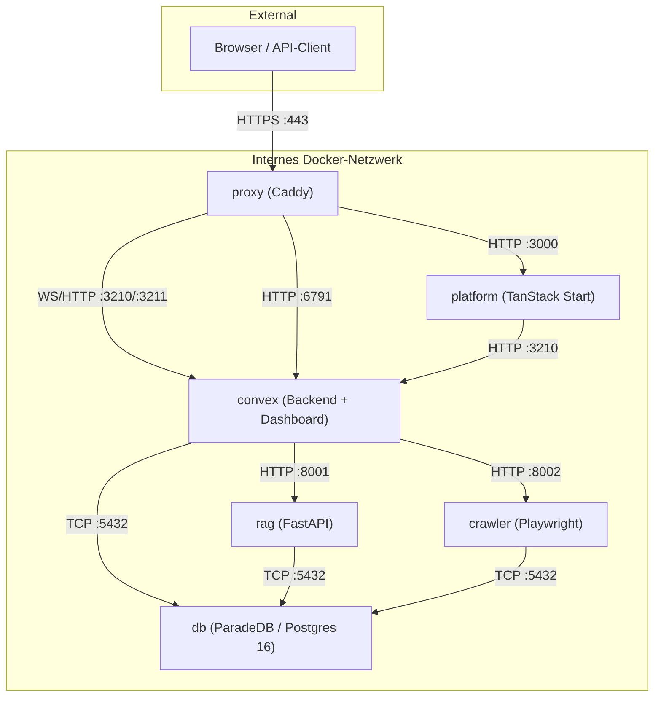

Selbst gehostetes Tale läuft als sechs-Container-Docker-Compose-Stack auf Infrastruktur, die du kontrollierst. Keine Per-Seat-Gebühren, keine Modell-Einschränkungen jenseits dessen, was dein API-Schlüssel erlaubt, und keine Daten verlassen je dein Netzwerk, außer du richtest einen Anbieter auf einen externen Endpunkt aus. Diese Seite ist die Momentaufnahme, die ein Operator vor der Installation liest: was die Container sind, wo die Ports landen, was die Architektur an RAM und Festplatte kostet.

Wenn du hier bist, um zu installieren, sind der [Lokale Quickstart](/de/self-hosted/install/quickstart) und das [Produktions-Deployment](/de/self-hosted/install/linux-server) der nächste Halt. Der Überblick unten ist für den Leser, der noch entscheidet, ob selbst gehostetes Tale in seine Umgebung passt.

## Sechs Container, ein Netzwerk

Tale läuft als sechs Docker-Container hinter einem einzigen Caddy-Proxy. Der Proxy ist der einzige Dienst, der auf einem öffentlichen Port lauscht; jeder andere Dienst spricht mit seinen Peers auf einem internen Docker-Bridge-Netzwerk. Das Bündel bleibt gleich, ob du es auf einem Entwickler-Laptop oder einem Produktionsserver fährst — nur der TLS-Modus und der Hostname ändern sich.

| Container  | Image-Basis                         | Rolle                                                                      | Interner Port    |
| ---------- | ----------------------------------- | -------------------------------------------------------------------------- | ---------------- |
| `proxy`    | Caddy                               | TLS-Terminierung, Routing, ACME für Let's Encrypt                          | 80, 443          |
| `platform` | Convex Backend (für `generate_key`) | TanStack-Start-App, Vite-SPA, Bun-Server                                   | 3000             |
| `convex`   | Convex Backend                      | Convex-Local-Backend, Convex Dashboard, eingebauter Seed                   | 3210, 3211, 6791 |
| `rag`      | `python:3.11-slim`                  | FastAPI-Dienst für Dokumenten-Chunking, Embeddings, semantische Suche      | 8001             |
| `crawler`  | `python:3.11-slim`                  | Crawl4AI + Playwright für Website-Crawling und Datei-zu-Text-Konvertierung | 8002             |
| `db`       | `paradedb/paradedb:0.22.5-pg16`     | PostgreSQL 16 mit pgvector + pg_search für Vektor- und Volltextsuche       | 5432             |

Der `platform`-Container ist eine schlanke Laufzeit — die SPA plus der Bun-Server, der davor steht. Convex steckt in einem eigenen Container, weil es das Realtime-Backend, die Funktionsmenge und das lokale Dashboard besitzt; das Aufspalten brachte das Platform-Image von rund 2,58 GB komprimiert auf rund 320 MB runter und machte reine App-Rebuilds deutlich schneller. Die vollständige Image-Größen- und Multi-Stage-Build-Tabelle steht unter [Container-Architektur](/de/self-hosted/operate/container-architecture).

## Wie die Dienste reden

Der Proxy verteilt eingehenden Verkehr zwischen der Platform-SPA und den Convex-WebSocket-Endpunkten. Convex ist die Wahrheitsquelle für den Anwendungszustand — es schiebt Mutationen, Lesungen und Funktionsergebnisse über WebSocket an die Platform — und es spricht direkt mit der Datenbank und mit den beiden Python-Diensten. Die Platform berührt Postgres nie; alles fließt durch Convex.

## Was du zum Betrieb brauchst

Für eine Laptop-Installation ist die einzige Voraussetzung Docker Desktop 24 oder neuer. Für einen Produktionsserver deckt die Seite [Produktions-Deployment](/de/self-hosted/install/linux-server) die vollständige Voraussetzungsliste ab; die Schlagzahlen sind:

- **RAM** — 8 GB zum Laufen, 12 GB für ein Blue-Green-Deploy. Blue-Green fährt die neue Farbe kurz parallel zur alten, bis die Health-Checks bestehen, also existiert jeder zustandslose Dienst kurzzeitig doppelt.
- **Festplatte** — rund 4,4 GB komprimiert für den ersten Image-Pull, plus was deine Wissensdatenbank und dein Chat-Verlauf wachsen.
- **Netzwerk** — Ports 80 und 443 öffentlich, jeder andere Port bleibt auf der Docker-Bridge. Ausgehendes HTTPS zu KI-Anbietern (oder zu deinem internen Inferenz-Backend) ist der einzige externe Verkehr.

Die gebündelte Datenbank reicht für die meisten Installationen. Wenn du einen verwalteten Postgres willst oder Datenresidenz in einem bestimmten Cluster brauchst, unterstützt die Architektur das Ausrichten jedes Dienstes auf eine externe Postgres-Instanz — die Schritte stehen auf der Seite [Produktions-Deployment](/de/self-hosted/install/linux-server#using-an-external-database).

## Was das Produkt abdeckt

Tale liefert jede Funktion, die unter [Platform](/de/platform) dokumentiert ist — Chat mit mehrstufigen Konversationen und Datei-Anhängen, eigene Agents mit eigenen Anweisungen und Tools, Automatisierungs-Workflows mit LLM-Schritten und Bedingungen, eine semantische Wissensdatenbank für Dokumente und Websites, einen Posteingang für Kundenkonversationen, rollenbasierte Zugriffskontrolle über sechs Rollen und Microsoft Entra SSO. Die rollenindizierten Seiten unter [Platform](/de/platform) gelten in der Cloud und im Selbsthosting identisch; die einzigen Unterschiede leben in diesem Bereich — Installation, Konfigurationsdateien, Container-Architektur, Observability, der Pfad für Authentifizierung über vertrauenswürdige HTTP-Kopfzeilen.

Barrierefreiheit gehört zum gleichen Bündel. Tale zielt auf [WCAG 2.1 Level AA](https://www.w3.org/TR/WCAG21/) — Tastaturnavigation, Screenreader-Landmarks, sichtbare Fokus-Indikatoren, 4,5:1 Kontrast auf Fließtext, Unterstützung für reduzierte Bewegung und ein Mindest-Touch-Target von 24 × 24. Die CI-Pipeline setzt das durch über die jsx-a11y-Regeln in oxlint, vitest-axe-Asserts auf gerenderten Komponenten und das a11y-Addon in Storybook.

## Wo das einsetzt

Der Überblick ist das Architekturbild, das ein Operator einmal liest. Von hier aus bringen [Lokaler Quickstart](/de/self-hosted/install/quickstart) und [Produktions-Deployment](/de/self-hosted/install/linux-server) eine frische Box auf eine laufende Instanz; [Container-Architektur](/de/self-hosted/operate/container-architecture) ist die tiefere Referenz für die Ports, Volumes und die Health-Check-Form, die oben skizziert sind; und [Betrieb](/de/self-hosted/operate/observability/operations) katalogisiert, was zu scrapen, zu loggen und zu alarmieren ist, sobald Traffic fließt. Das Produkt selbst — Chat, Agents, Automatisierungen, Wissen — lebt einmal unter [Platform](/de/platform) und liest sich in der Cloud identisch.
