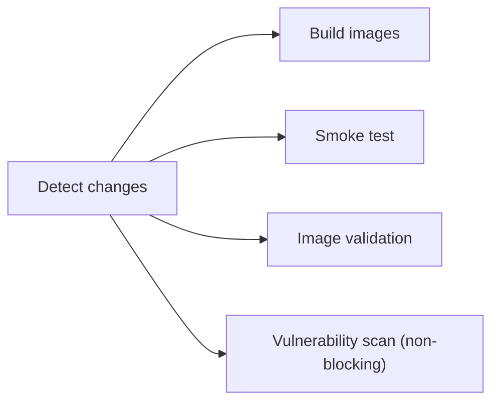
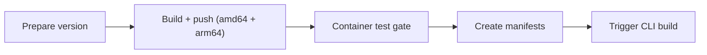

This page is the contributor workflow for the Docker side of the Tale build system — adding dependencies, changing the multi-stage shape, debugging a failing image, scanning for vulnerabilities. Most readers of this page are touching `Dockerfile.<service>`, the compose files, or the image-budget tests, and the rules below exist because production images and local build cycles pull in opposite directions: small final image versus fast iteration. The goal here is to keep both working.

If you're running Tale rather than building it, the install paths at [Quickstart](/self-hosted/install/quickstart) and [Linux server](/self-hosted/install/linux-server) cover everything you need — this page is contributor territory.

## Prerequisites

| Software                        | Minimum version                       |
| ------------------------------- | ------------------------------------- |
| Docker Desktop or Docker Engine | 24.0+                                 |
| Docker Compose                  | v2.20+ (included with Docker Desktop) |
| Trivy (optional)                | Latest                                |

## Quick reference

The commands you reach for daily, before any of the details below:

```bash
# Build all images
docker compose build

# Build a single service
docker compose build platform

# Run container smoke tests (non-conflicting ports)
bun run docker:test

# Validate image structure (no secrets, OCI labels, size budgets)
bun run docker:test:image

# Vulnerability scan (requires trivy)
bun run docker:test:vulnerability

# Local development with hot-reload
docker compose -f compose.yml -f compose.dev.yml up --build
```

Each of these commands is unpacked further down — the rest of the page is the why behind the rules they enforce.

## Dockerfile conventions

### Multi-stage builds

Every Python and Node.js image uses multi-stage builds. The pattern is three stages, each with a single job:

1. **Builder stage** installs build dependencies and compiles native packages. This is where `gcc`, `build-essential`, and language-specific build tools live.
2. **Runtime stage** copies only the runtime artifacts into a clean base image — no build tools.
3. **Squash stage** uses `FROM scratch` plus `COPY --from=runtime / /` to flatten the layers.

The squash stage matters because file deletions in cleanup steps don't reclaim disk space by themselves — they add masking layers that still ship in the final image. Squashing collapses the deletes into a single layer that genuinely doesn't include the files.

A consequence worth knowing: `FROM scratch` loses every `ENV` and `VOLUME` declaration from upstream stages. Re-declare them in the runtime stage before squash, or they're gone.

### Layer caching

Order `COPY` and `RUN` instructions from least-frequently-changed to most-frequently-changed. Dependencies change less often than application code, so the dependency install should land before the application copy:

```dockerfile
# Dependencies first — cached across most builds
COPY pyproject.toml .
RUN uv pip install --system --no-cache-dir .

# Application code last — reinstalls only when deps change
COPY app/ ./app/
```

A wrong order forces a full reinstall on every code change, which is the most common reason a build that used to take 30 seconds now takes five minutes.

### No-cache flags

Always use `--no-cache-dir` for pip and uv, and `--no-install-recommends` for apt:

```dockerfile
RUN apt-get update && apt-get install -y --no-install-recommends curl \
    && rm -rf /var/lib/apt/lists/*
RUN uv pip install --system --no-cache-dir .
```

The cache dirs serve no purpose in a production image — they only take space.

### OCI labels

Every Dockerfile carries a version label so the registry can show where a tag came from:

```dockerfile
ARG VERSION=dev
LABEL org.opencontainers.image.version="${VERSION}"
```

CI substitutes `VERSION` with the git tag at release time.

### Health checks

Every Dockerfile carries a `HEALTHCHECK` so orchestrators can tell when the container is actually serving:

```dockerfile
HEALTHCHECK --interval=30s --timeout=10s --start-period=40s --retries=3 \
    CMD curl -f http://localhost:8001/health || exit 1
```

`start-period` is critical for slow-starting services like the platform — without it, the container is marked unhealthy before it finishes booting.

## Image size budgets

Each image has a budget. CI fails when an image exceeds it.

| Service  | Budget   | Current   |
| -------- | -------- | --------- |
| Crawler  | 2,100 MB | ~1,850 MB |
| RAG      | 600 MB   | ~515 MB   |
| Platform | 2,900 MB | ~2,580 MB |
| DB       | 1,200 MB | ~1,060 MB |
| Proxy    | 100 MB   | ~88 MB    |

When a budget breaks, the most common causes are: a new Python dependency pulling large transitive deps, an apt package added without `--no-install-recommends`, build artifacts not stripped before the squash stage, or the multi-stage shape broken so build tools land in the runtime layer.

To see what's taking space inside an image:

```bash
# Top-level disk usage
docker run --rm -it <image> du -sh /* 2>/dev/null | sort -rh | head -20

# Python packages and their install paths
docker run --rm <image> pip list

# Visual layer analysis — installs separately
# https://github.com/wagoodman/dive
dive <image>
```

`dive` is the most useful of the three for finding stray files in a layer that should have been deleted.

## Testing workflow

### Smoke tests

```bash
bun run docker:test
```

This runs `tests/container-smoke-test.sh`, which builds all five images, starts the services on non-conflicting ports (15432, 18001, 18002, …), waits for health checks, validates HTTP endpoints, exercises inter-service connectivity, and tears everything down including volumes. The non-conflicting ports let the test suite run alongside a local dev environment without colliding.

### Image validation

```bash
bun run docker:test:image
```

For each image, the validator checks the OCI `org.opencontainers.image.version` label, the non-root user (required for the platform image), the absence of secrets in env or filesystem, the `HEALTHCHECK` instruction, and the size budget. Any single failure rejects the image.

### Vulnerability scanning

```bash
bun run docker:test:vulnerability
```

Runs Trivy against each image. Reports land in `trivy-reports/`. Known false positives go in `.trivyignore`:

```text
CVE-2023-12345    # false positive: function not reachable
```

The file is plain text, one CVE per line, an optional comment after `#`.

## CI/CD pipeline

### On pull requests (`build.yml`)



The vulnerability scan is non-blocking on PRs — Trivy's noise rate is too high to gate every merge, so reviewers skim the report on changes that touch dependencies.

### On release tags (`release.yml`)



The container test gate pulls the newly pushed images and runs smoke tests plus image validation before manifests are created — that's the last chance to catch a regression before the tag is tagged.

## Common pitfalls

### "parent snapshot does not exist"

Docker BuildKit cache corruption. Prune the builder cache:

```bash
docker builder prune -f
```

### Port already in use

Use `compose.test.yml`, which maps to non-conflicting ports:

```bash
docker compose -f compose.yml -f compose.test.yml --env-file .env.test -p tale-test up -d
```

### Python package missing at runtime

A package installs cleanly in the builder but isn't there in the runtime stage. Usually one of three things:

1. The `COPY --from=builder ...` path is wrong — confirm `/usr/local/lib/python3.11/site-packages` matches your base image's Python version.
2. The package's `.dist-info` was removed by a cleanup step that something depends on at import time.
3. A binary stripping step removed `.so` files the package needs.

### Node module missing after pruner stage

A module is in the builder but missing in the runtime. Usually one of two things:

1. The module is in `devDependencies` instead of `dependencies` in `package.json` — Node's pruner drops dev deps.
2. The pruner's `rm -rf` list explicitly removes the module's directory.

## Trust boundary

When you're modifying Dockerfiles, treat the image build as crossing a trust boundary: the inputs (Dockerfile, base image, dependency list) are owned by Tale; the outputs (the pushed image) are consumed by every operator that runs Tale. The implications:

- **Base images.** Pin by digest in production stages, not by tag. A floating `python:3.11-slim` pulls a different image every week.
- **Build secrets.** Never copy a real secret into an image. The image validation step refuses build-arg secrets that leak into the runtime layer.
- **Network access during build.** Builds reach the internet for dependencies; CI should run builds on isolated workers with no privileged credentials.
- **Cross-architecture artifacts.** When the release pipeline builds amd64 and arm64, the two must produce equivalent images. A platform-specific dependency that quietly behaves differently is a debugging nightmare months later.

## Where this fits

Contributing Docker is the source-contributor flow for the build system that produces Tale's container images. The runtime architecture those images run inside is documented at [Container architecture](/self-hosted/operate/container-architecture); for the operator-side install path that consumes the images, [Quickstart](/self-hosted/install/quickstart) and [Linux server](/self-hosted/install/linux-server) are the canonical references.

For the broader source-contributor flow — code conventions, PR shape, test layout — the project root carries `AGENTS.md` with the binding rules.
