Governance is where admins set the rules for how AI is used across the organisation. It's organised into three groups accessible from the left-hand navigation under **Settings > Governance**, plus an audit log page for compliance.

## Content & models

### System prompt

Set a global system prompt that is prepended to every AI conversation in the organisation. Use it to enforce tone, scope, and safety rules that every agent inherits.

### Default models

Choose the default chat, vision, and embedding models used when users don't pick one explicitly. Models come from any configured provider — see [AI providers](/platform/admin/providers).

### Model access

Control which models are available to specific teams or users. Restrict expensive frontier models to senior staff, or expose only self-hosted models to a particular team.

## Policies & limits

### Budgets

Set spending limits per user, per team, or for the whole organisation. Configure the period (daily, weekly, monthly) and the action to take when the limit is hit — warn, block new requests, or disable chat entirely.

### Upload policy {#upload-policy}

Restrict file uploads by type, size, or count. Useful when you want to prevent large binary uploads or block executable file types. Per-MIME-type size caps let you apply a tighter limit to specific kinds of content — for example, `audio/*` at 25 MB while leaving the global limit at 100 MB.

### Retention

Configure how long conversations, uploaded files, and audit records are kept before automatic deletion. Self-hosted operators can set environment-level defaults in [Retention](/self-hosted/configuration/retention); Cloud tenants manage this directly here.

### Feature controls

Toggle platform features on or off organisation-wide: file uploads, web search, image generation, arena mode, and more. Features disabled here are hidden from the UI for all users.

## Security & monitoring

### Guardrails

Guardrails are three filter layers Tale runs in sequence on every chat message **before** it reaches the model and on every model token **before** it reaches the user. Each layer is configured independently under **Settings > Governance > Guardrails** and a read-only **Guardrails overview** card shows whether each layer is active. The order is fixed:

```mermaid
flowchart LR
  user["User sends a message."] --> chatFilter["Tale applies content-safety checks."]
  chatFilter --> pii["Tale scans for personally identifiable information."]
  pii --> moderation["Tale evaluates the message with the moderation provider."]
  moderation --> model["The model generates a response."]
  model --> outChatFilter["Tale applies content-safety checks to output tokens."]
  outChatFilter --> outPii["Tale scans output tokens for personally identifiable information."]
  outPii --> outModeration["Tale evaluates output tokens with the moderation provider."]
  outModeration --> reply["Tale streams the allowed reply to the user."]
```

A blocked message never reaches the model, and a blocked token is never streamed to the user. Every guardrail decision (allow, mask, block) writes a structured event to the audit log; the raw matched text is never stored.

#### Content safety

Open **Settings > Governance > Content safety**. Define categories (for example _profanity_, _competitor names_, _confidential codenames_), give each a word list, and pick an enforcement mode — _Off_, _Warn_, _Mask_, or _Block_. Categories run as fast regex matches with safety guards against catastrophic backtracking, so this layer adds negligible latency. Use it for organisation-specific keyword policies that the public moderation APIs cannot know about.

#### PII detection {#pii-detection}

Enable automatic detection of personally identifiable information in messages. Built-in patterns cover **email, phone, credit-card, IBAN, IP address, SSN, CVC, dates of birth, postal addresses (43 locales), and national IDs / passports** (German Personalausweis, French NIR, Spanish DNI/NIE, Italian Codice Fiscale, Dutch BSN, Polish PESEL, UK National Insurance Number, Canadian SIN, Irish PPS, Indian Aadhaar, Chinese 身份证, Japanese My Number, Korean RRN, and 30+ more). Each ID type uses the canonical checksum (ICAO 9303, Luhn, mod-11, Verhoeff, mod-23) so randomly-shaped strings don't false-positive. Custom regex rules let you add internal formats (employee ID, ticket numbers, product SKUs). Detected PII in attachments goes through the same pipeline as typed messages.

Three enforcement modes:

- **Mask** — replace each match with a fixed placeholder (`[EMAIL]`, `[PHONE]`, …). Recommended for audit logs and stored chat history where the raw value is never needed again. One-way: the original is gone.
- **Block** — reject the entire message. Recommended when your policy forbids any PII reaching upstream models, full stop.
- **Tokenize** — replace each match with a stable indexed token (`[EMAIL_1]`, `[PHONE_1]`) and keep a per-message restore mapping. The model sees the tokens; the user sees their original details restored in the response. Recommended for the most natural UX without losing protection. The mapping is held in memory for the round-trip and discarded after — never written to logs.

A built-in **test playground** in Settings → Governance → PII shows the full round-trip live: type any sentence and watch detection → tokenization → mock AI response → restoration in real time. Hover any highlighted span to see its detected type (translated).

#### Moderation provider

Send chat messages to an external classifier — OpenAI Moderation, Azure Content Safety, Perspective, or any custom HTTPS endpoint that returns category scores. Pick a built-in preset and the URL, headers, request template, and response parser are filled in for you; for everything else, choose _Custom JSONPath_ and map fields by hand. The API key is stored AES-encrypted server-side and referenced as `{secretPlaceholder}` in any header value. Use the **Test connection** button to send a sample message through the real provider path — it verifies the key, endpoint, request template, response parser, and category mappings in one round-trip without writing to a thread.

For SSRF safety only the configured host is contacted; redirects to other hosts are rejected. Concurrent calls are rate-limited per organisation so a single chat burst cannot exhaust your moderation quota.

### Usage dashboard

View token consumption, cost breakdowns, and usage trends across the organisation. Filter by team, user, model, or time period. For deeper analytics see [Usage analytics](/platform/admin/usage-analytics).

## Audit logs

A time-ordered record of significant actions taken in the organisation. Categories include authentication events, member changes, data operations, integration updates, workflow publications, security events, and admin actions. Useful for compliance and troubleshooting.

Admins can export audit logs as **CSV** or **JSON** using the export buttons above the log table. Exports respect the currently active category filter.

## Where this fits

Governance is the contract between your organisation's policy and what Tale physically does on disk. Retention bounds how long data lives. Data-subject requests give you the GDPR machinery for export and erasure. Legal holds suspend deletion under investigation. The audit log proves what happened. Each of these is a knob; the cleanup runner that enforces retention reads them all at the start of every run.

The configuration this page describes is org-scoped (admins set it from the UI). For the operator-scoped knobs that govern the cleanup runner itself — the environment variables, the audit pepper for PII hashing, the legal-hold cooldown — see [Retention](/self-hosted/configuration/retention).
