Governance is where Admins set the rules every other surface in Tale has to obey. It is organised into four groups visible from the left-hand navigation under **Settings > Governance**: content and models (what the agents say and which models they say it with), policies and limits (how much they spend and how long their output is kept), security and monitoring (the three-layer guardrail stack and audit log), plus password and sign-in policy. Members and Editors cannot reach this page; Developers cannot either. Owner and Admin only.

A page this dense exists because each knob here interacts with the others — a tight retention policy is useless next to an unbounded budget; a guardrail without an audit log cannot be reviewed. The structure below mirrors the navigation so the doc and the UI scroll in step.

## Content and models

### System prompt

Set a mandatory system prompt that is prepended (and optionally suffixed) to every agent's instructions. Use it to enforce tone, scope, and safety rules that no individual agent can override. The two fields are **Mandatory prefix** and **Mandatory suffix**; both go through the same character-limit check and are applied before the agent's own prompt at runtime.

### Default models

Choose the default chat, vision, embedding, image-generation, and transcription models used when a user or agent does not pick one explicitly. Defaults can be scoped to the whole organisation, to a team, to a role, or to a specific user; more specific scopes override broader ones. Models come from any configured provider — see [AI providers](/platform/admin/providers).

When a default conflicts with the model-access allowlist or blocklist (below), the form surfaces a warning so the policy contradiction is visible before save.

### Model access

Control which models are available to which scopes. Use the allowlist to expose only a curated subset of frontier models to senior staff, or the blocklist to keep one expensive model out of an entry-level team. Like budgets, model access composes by scope: user-level rules win over team rules, team rules win over role rules, role rules win over the default.

## Policies and limits

### Budgets

Set spending limits per user, per team, per role, or for the whole organisation. Each rule names a period (daily, weekly, monthly), a token cap or USD cap (or both), and an optional warning threshold. The override hint on the form is the precedence summary: **user > team > role > default**, with org limits always applied as an additional cap.

When a budget hits the warning threshold the affected scope sees an in-product banner; when it hits the hard cap, new model calls fail with a budget error visible to the user.

### Upload policy {#upload-policy}

Restrict file uploads by extension, MIME type, total size, and total per-user volume. Useful when policy forbids large binary uploads or specific executable file types. Per-MIME-type caps let you apply a tighter limit to one kind of content — for example, `audio/*` at 25 MB while leaving the global cap at 100 MB. Both extension and MIME-type lists support allow-list and block-list modes; the block list wins when an extension matches both.

### Retention

Configure how long each data type lives before automatic deletion. Each category — chat history, documents, message metadata, workflow logs, audit logs, usage ledger, login attempts, and several more — carries its own retention period (days or hours), an optional `Enabled` toggle, and a deletion grace period that controls whether deletion goes through a trash window or is immediate.

Self-hosted operators can bound the org-wide retention from the environment so Cloud-style Admin freedom does not violate compliance commitments — see [Retention](/self-hosted/configuration/retention) for the env-var floors and ceilings. When operator bounds change, the form shows a banner that requires the Admin to apply or reject the new bounds before saving anything else.

### Feature controls

Toggle features on or off per scope (user, team, role, or default). Three feature flags ship today: **Web search**, **Code execution**, and **File upload**. Each can be disabled where the policy demands it, and the **Max context tokens** field caps how much context window any agent in the scope can use. Features turned off for a scope are hidden from the affected users' UI; turning them back on restores the surface immediately.

## Security and monitoring

### Guardrails

Guardrails are three filter layers Tale runs in sequence on every chat message **before** it reaches the model and on every model token **before** it reaches the user. Each layer is configured independently and a read-only **Guardrails overview** card shows whether each layer is active. The order is fixed:

```mermaid
flowchart LR
  user["User sends a message"] --> chatFilter["Content safety"]
  chatFilter --> pii["PII detection"]
  pii --> moderation["Moderation provider"]
  moderation --> model["Model generates a response"]
  model --> outChatFilter["Content safety (output)"]
  outChatFilter --> outPii["PII detection (output)"]
  outPii --> outModeration["Moderation provider (output)"]
  outModeration --> reply["Tale streams the allowed reply"]
```

A blocked message never reaches the model, and a blocked token is never streamed to the user. Every guardrail decision (allow, mask, block) writes a structured event to the audit log; the raw matched text is never stored.

#### Content safety

Open **Settings > Governance > Content safety**. Define categories (for example _profanity_, _competitor names_, _confidential codenames_), give each a word list, and pick an enforcement mode — **Flag**, **Mask**, or **Block**. Block wins over mask wins over flag when several categories match the same message. Categories run as fast regex matches with safeguards against catastrophic backtracking, so this layer adds negligible latency. Use it for organisation-specific keyword policies the public moderation APIs cannot know about.

#### PII detection {#pii-detection}

Detect personally identifiable information in messages and attachments. Built-in patterns cover **email, phone, credit card, IBAN, IP address, US SSN and CVC, date of birth, postal addresses (43 locales), and national IDs and passports** (German Personalausweis, French NIR, Spanish DNI and NIE, Italian Codice Fiscale, Dutch BSN, Polish PESEL, UK National Insurance Number, Canadian SIN, Irish PPS, Indian Aadhaar, Chinese 身份证, Japanese My Number, Korean RRN, and 30 more). Each ID type uses the canonical checksum (ICAO 9303, Luhn, mod-11, Verhoeff, mod-23) so randomly shaped strings do not false-positive. Custom regex rules let you add internal formats (employee ID, ticket numbers, product SKUs).

Three enforcement modes:

- **Mask** — replace each match with a fixed placeholder (`[EMAIL]`, `[PHONE]`). Recommended for stored audit logs and chat history where the raw value is never needed again. One-way: the original is gone.
- **Block** — reject the entire message. Use it when policy forbids any PII reaching upstream models, full stop.
- **Tokenize** — replace each match with a stable indexed token (`[EMAIL_1]`, `[PHONE_1]`) and keep a per-message restore mapping. The model sees the tokens; the user sees their original details restored in the response. The mapping is held in memory for the round-trip and discarded after — never written to logs.

A built-in **test playground** under the same screen shows the full round-trip live: type a sentence and watch detection, tokenisation, mock AI response, and restoration in real time. Hover any highlighted span to see its detected type.

#### Moderation provider

Send chat messages to an external classifier — OpenAI Moderation, Azure Content Safety, Perspective, or any custom HTTPS endpoint that returns category scores. Pick a built-in preset and the URL, headers, request template, and response parser are filled in for you; for everything else, choose **Custom JSONPath** and map fields by hand. The API key is stored AES-encrypted server-side and referenced as `{secretPlaceholder}` in any header value. **Test connection** sends a sample message through the real provider path — it verifies the key, endpoint, request template, response parser, and category mappings in one round-trip without writing to a thread.

For SSRF safety, only the configured host is contacted; redirects to other hosts are rejected. Concurrent calls are rate-limited per organisation so a single chat burst cannot exhaust your moderation quota.

### Password policy

Configure minimum password length, the required character classes (uppercase, lowercase, digit, special), and an optional rotation period. When rotation is enabled, the grace window starts the moment the policy is first turned on, so existing users are not forced to change immediately. The same policy is checked at sign-up, password change, and at every sign-in after the rotation period elapses.

### Login policy

Lock accounts after repeated sign-in failures and grow the wait between attempts. The form takes a **failures-before-lockout** count, a comma-separated **backoff schedule** in seconds (default `1, 10, 60, 600`), and the list of **trusted proxies** Tale uses to recover the real client IP from `X-Forwarded-For`. Trusted proxies accept individual IPs, CIDR ranges, and the keywords `loopback`, `uniquelocal`, and `linklocal`. The full operator-side env equivalents live with the rest of the deployment configuration.

### Two-factor policy

The TOTP enforcement policy lives in its own section and is documented in full under [Two-factor authentication](/platform/admin/two-factor-authentication) — start there for the grace window, the SSO exemption, and the audit events.

### Usage dashboard

View token consumption, cost breakdowns, and usage trends across the organisation, filtered by team, user, model, agent, or time period. For deeper drill-downs (top users, top teams, model mix, workflow metrics), see [Usage analytics](/platform/admin/usage-analytics).

## Audit logs

The audit log is a time-ordered record of every significant action in the organisation. Categories include **Auth**, **Member**, **Data**, **Integration**, **Workflow**, **Security**, **Admin**, and **AI**. The table is searchable and filterable; the detail drawer shows actor, role, resource, target, previous and new state, changed fields, and per-event metadata.

Admins can export the active filter as CSV or JSON using the buttons above the table. Exports follow the active filter rather than the full log, so a single export can be scoped to one category, one actor, or one resource.

## Where this fits

Governance is the contract between your organisation's policy and what Tale physically does on disk. Retention bounds how long data lives. Data-subject requests give you the GDPR machinery for export and erasure. Legal holds suspend deletion during investigation. The audit log proves what happened. Each of these is a knob; the cleanup runner that enforces retention reads them all at the start of every run.

The configuration this page describes is org-scoped — Admins set it from the UI. For the operator-scoped knobs that govern the cleanup runner itself (env-var floors and ceilings, the audit pepper for PII hashing, the legal-hold cooldown), [Retention](/self-hosted/configuration/retention) is the reference. For the GDPR Art. 17 filing flow that piggybacks on the same retention runner, [Data subject requests](/platform/admin/data-subject-requests) covers the dialog and the SLA semantics.
