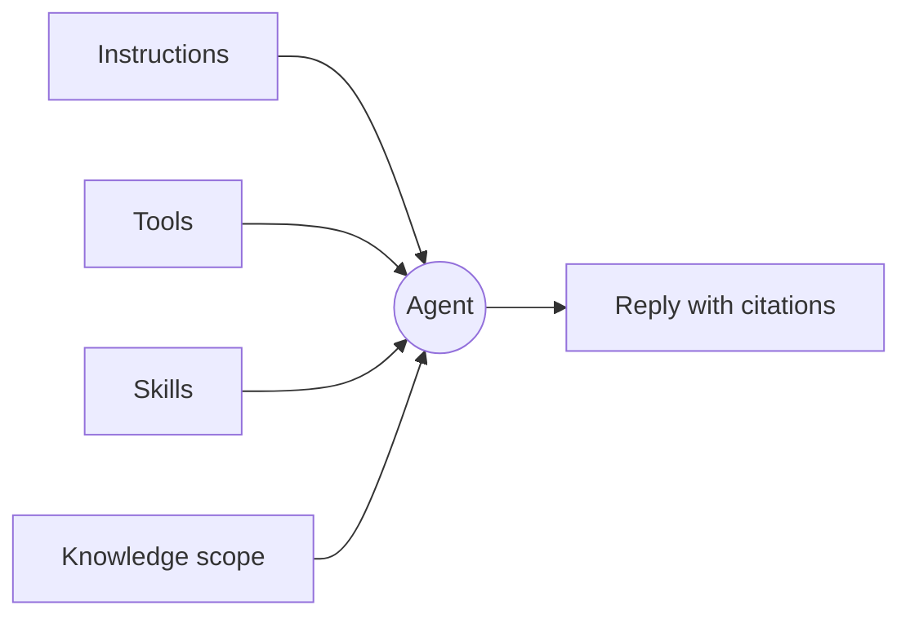

An agent is the unit Tale reaches for when the same question keeps coming back. It is a **persona** rather than a runtime: it says who is answering — a name, instructions, what it may reach for, and who in the organization may use it — and nothing about how a turn executes. In this version a persona is a YAML file in the organization's configuration, served and edited through the platform's own API; no screen lists or edits one, and the chat composer does not offer one to pick. The agents you meet on a screen are **project agents**, the named crew on a project's **Agents** tab — the same decisions, packaged for board tasks.

This page hands you the mental model the rest of the section assumes. Read it once before you write your first persona file or staff your first project, and come back to it when you cannot remember whether the behaviour you want to change lives in the instructions, the tools, the skills, or the knowledge scope.

Prefer to watch first? Episode 4 was recorded on the earlier agent editor — a screen this version does not ship — but the decisions it walks through, in under three minutes with captions, are the ones a persona still carries.

<Video src="/videos/en/tutorials/ep4-agent/ep4-agent.en.mp4" poster="/videos/en/tutorials/ep4-agent/ep4-agent.en.webp" captions="/videos/en/tutorials/ep4-agent/ep4-agent.en.vtt" lang="en" title="Episode 4 — Your first agent" caption="Episode 4 — Your first agent (2:46)">

</Video>

## What an agent carries

A persona file carries five things. Each is validated when the file is saved, and none is set from a screen in this version — [Agents (admin view)](/platform/admin/agents) covers who may edit a file and how visibility is enforced.

**Identity.** The slug the agent is filed under — it is the file name, fixed once the agent exists — the display name people meet it by, a short description of what it is for, and optional per-locale versions of those strings so a German or French reader gets the agent in their own language. The display name is yours to change whenever the job shifts.

**Instructions.** The prose the persona contributes to every turn it frames, up to 20,000 characters, top-level or per locale. Keep it short, opinionated, and concrete — long instructions get diluted in long conversations. Name the voice, the constraints, and the cases where the agent should decline.

**Tools and skills.** Two allowlists. Tools name the capabilities the agent may call — up to a hundred — and platform tools, connected connectors, and the organization's automations all appear as capabilities in that one list. Skills name the skill bundles it may expand, up to ten of them. Both follow the same rule: leave a list out and the agent is not narrowed, state a list and it is limited to exactly what you named — an empty list means none at all.

**Knowledge scoping.** One setting deciding which corpus the agent's retrieval may read — the organization's own documents, the pages fetched on its behalf, both together (the default), or nothing at all. Every corpus is the organization's own, so widening the scope never crosses a tenant boundary.

**Visibility.** `private`, so only its owner reaches it, or `org`, so every member does. A private agent names an owner, because an ownerless private agent would be reachable by nobody; a persona created through the API belongs to its author and starts private, and sharing it is an explicit edit.

## What the agent does not decide

The model is not part of the agent. Whoever composes the turn owns that choice — the chat composer's picker is models only, opening on **Auto** (Tale picks a model per message, and the reply records which one ran) with every directly-served model there to pin instead. An agent that pinned a model would quietly override the choice the person in front of the screen just made, so it holds none.

The same reasoning retires several settings you might go looking for. A persona has no type and no harness picker: whether work runs on a coding [harness](/platform/agents/harnesses) is decided when you create a **project agent** (its dialog calls the field **Agent type**) or an automation **agent** node (there it is labeled **Harness**), and some provider credentials force one. It carries no execution deadline, because a ceiling belongs to the host running the turn rather than to a persona. It holds no environment variables and no credentials of its own — those live on the organization's provider records, where they can be rotated and audited in one place. And it ships no canned openers — nothing in this version presents a persona as a chat entry point.

## Putting it together — a support-triage agent

A first useful agent is the support-triage one: it reads the inbound question, answers what it can, and hands the rest on. The decisions, whether you write them into a persona file or into a project agent's dialog:

- Instructions: a one-paragraph voice, plus three explicit cases where it declines.
- Tools: as few as the job allows — for an agent that reads a message and writes two lines, none.
- Skills: the house reply-tone bundle, so the wording matches everywhere it is used.
- Knowledge: the organization's documents, with the crawled web left out — on a project agent, the knowledge and document read tools.
- Visibility: `org`, so the whole support team may read the persona; a project agent belongs to its project and is managed by whoever may edit it.

The agent that actually runs in this version is the project agent: create it on the project's **Agents** tab with those instructions, assign it a task, click **Start agent**, and read the two lines it posts back at **In review** — [Build your first agent](/tutorials/editor/first-agent-end-to-end) walks exactly that. Escalation to a specialist is not a persona setting: handing work on is another task, assigned to another agent, as [Agent workers](/platform/agents/delegation) explains.

## When to reach for it

A persona is configuration that names who answers; the lanes you actually pick from are chat, a project agent, and an automation. Reach for chat when you are exploring an answer yourself — the built-in assistant retrieves and drafts, and produces no files. Reach for a project agent when the work is a task with a result a person should review. Reach for an [automation](/platform/automations/concepts) when the work has fixed stages and you want approvals or scheduling between them.

| Use … when                                        | Chat | Project agent | Automation |
| ------------------------------------------------- | ---- | ------------- | ---------- |
| You are exploring an answer, or want a draft      | ✓    |               |            |
| The result is a file or a change someone reviews  |      | ✓             |            |
| The voice and the boundaries must hold every time |      | ✓             | ✓          |
| You need approvals or scheduling between steps    |      |               | ✓          |

## Build one

An agent is identity, instructions, two allowlists, a knowledge scope, and a visibility setting — change one of them and you have changed how it behaves, change three and you have a different product. Everything about how a turn actually runs stays outside the persona, decided by the lane that runs it: the chat composer's model picker, a project agent's harness and model, an automation node's settings. The agents you build on a screen are project agents — [Project agents](/platform/projects/project-agents) walks the dialog field by field, [Create an agent](/platform/agents/create) says what replaced the editor, and [Agents (admin view)](/platform/admin/agents) covers the persona files and who may change them.
