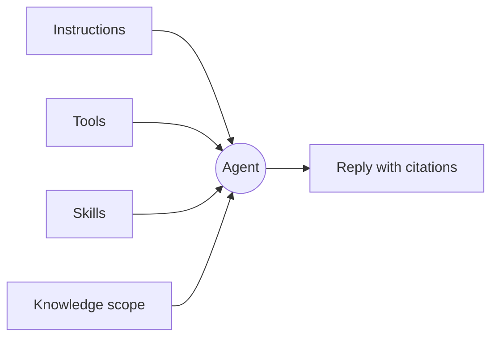

An agent is the unit Tale reaches for when the same question keeps coming back. It is a **persona** rather than a runtime: it says who is answering — a name, instructions, what it may reach for, and who in the organization may use it — and nothing about how a turn executes. Editors and Developers build them; every member runs them.

This page hands you the mental model the rest of the section assumes. Read it once before you build your first agent, and come back to it when you cannot remember whether the behaviour you want to change lives in the instructions, the tools, the skills, or the knowledge scope.

Prefer to watch first? Episode 4 builds an agent end to end in under three minutes, captions included.

<Video src="/videos/en/tutorials/ep4-agent/ep4-agent.en.mp4" poster="/videos/en/tutorials/ep4-agent/ep4-agent.en.webp" captions="/videos/en/tutorials/ep4-agent/ep4-agent.en.vtt" lang="en" title="Episode 4 — Your first agent" caption="Episode 4 — Your first agent (2:46)">

</Video>

## What an agent carries

**Identity.** The slug the agent is filed under, the display name people meet it by, a short description of what it is for, and optional per-locale versions of those strings so a German or French reader gets the agent in their own language. The slug is fixed once the agent exists; the display name is yours to change whenever the job shifts.

**Instructions.** The prose prepended to every turn the agent answers. Keep it short, opinionated, and concrete — long instructions get diluted in long conversations. Name the voice, the constraints, and the cases where the agent should decline.

**Tools and skills.** Two allowlists. Tools name the capabilities the agent may call, and platform tools, connected connectors, and the organization's automations all appear as capabilities in that one list. Skills name the knowledge bundles it may expand, up to ten of them. Both follow the same rule: leave a list untouched and the agent is not narrowed, state a list and it is limited to exactly what you named.

**Knowledge scoping.** One setting deciding which corpus the agent's retrieval may read — the organization's own documents, the pages fetched on its behalf, both together, or nothing at all. Retrieval runs only when the agent calls for it, so nothing lands in a reply that the agent did not go looking for.

**Visibility.** `private`, so only its owner reaches it, or `org`, so every member does. A private agent names an owner, because an ownerless private agent would be reachable by nobody.

## What the agent does not decide

The model is not part of the agent. Whoever composes the turn owns that choice — the composer's picker is models only, opening on **Auto** (Tale picks a model per message, and the reply records which one ran) with every directly-served model there to pin instead. An agent that pinned a model would quietly override the choice the person in front of the screen just made, so it holds none.

The same reasoning retires several settings you might go looking for. A chat agent has no type and no harness picker: whether work runs on a coding [harness](/platform/agents/harnesses) is decided when you create a **project agent** (its dialog calls the field **Agent type**) or an automation **agent** node (there it is labeled **Harness**), and some provider credentials force one. It carries no execution deadline, because a ceiling belongs to the host running the turn rather than to a persona. It holds no environment variables and no credentials of its own — those live on the organization's provider records, where they can be rotated and audited in one place. And it ships no canned openers, because the composer is the entry point.

## Putting it together — a support-triage agent

A first useful agent is the support-triage one: it reads the inbound question, answers what it can, and hands the rest on. The decisions:

- Instructions: a one-paragraph voice, plus three explicit cases where it declines.
- Tools: web search and the conversation tools. No code execution.
- Skills: the house reply-tone bundle, so the wording matches everywhere it is used.
- Knowledge: scoped to the organization's documents, with the crawled web left out.
- Visibility: `org`, so the whole support team can pick it in the composer.

The conversation then flows: your message arrives, the instructions frame the reply, retrieval finds the passages that support it, the granted tools fill the gaps, and the answer lands with citations. Escalation to a specialist is not a tool you toggle — it follows the worker relationships between agents, covered in [Agent workers](/platform/agents/delegation).

## When to reach for it

A single agent is the right shape when the conversation stays in one domain and one voice. Reach for an [automation](/platform/automations/concepts) when the work has fixed stages and you want approvals or scheduling between them; reach for a plain chat with no agent when you are exploring an answer yourself and the model's own defaults are fine.

| Use … when                                     | Agent | Plain chat | Automation |
| ---------------------------------------------- | ----- | ---------- | ---------- |
| The same question recurs                       | ✓     |            |            |
| The voice or the constraints matter            | ✓     |            |            |
| You need approvals or scheduling between steps |       |            | ✓          |
| You are exploring an answer one time           |       | ✓          |            |

## Build one

An agent is identity, instructions, two allowlists, a knowledge scope, and a visibility setting — change one of them and you have changed how it behaves, change three and you have a different product. Everything about how a turn actually runs stays outside the persona, decided per conversation. The natural next read is [Create an agent](/platform/agents/create), which walks that editor tab by tab on a fresh instance.
