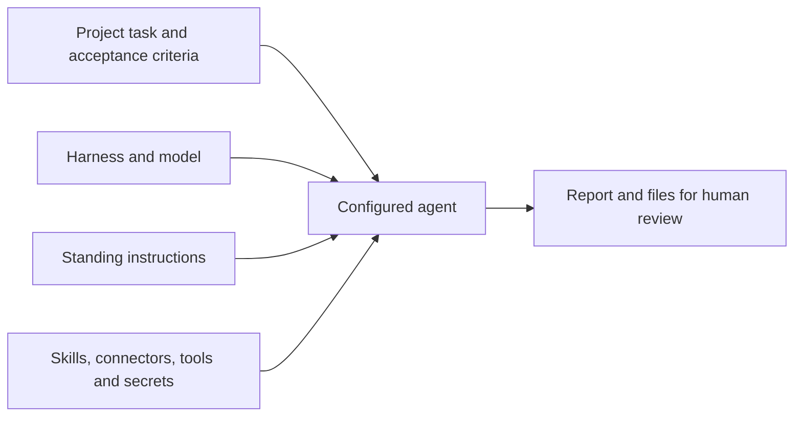

A project agent is a named worker for tasks in one project. You configure how it runs and what it may use, then give it a task with a reviewable outcome. It can work on files and commands in a sandbox; a person reviews the result before completing the task.

## Choose the right working mode

| Use | Suitable work | What you configure |
| --- | --- | --- |
| Chat | Ask a question, retrieve knowledge or draft text in a conversation. | The message, model and optional project context. |
| Project agent | Review a repository, prepare files or carry out a task over several turns. | A reusable worker in the project. |
| Automation | Run defined steps, react to events or wait for an approval between actions. | A versioned workflow and its inputs. |

A project chat still uses the built-in chat assistant. Adding a project to a chat does not select one of the project’s agents. An automation’s agent node has its own configuration.

## Give the agent a clear responsibility

Start with a responsibility you can evaluate, such as “Review changes for regressions and report evidence.” Keep that in the agent’s standing instructions. Put the particular repository, files, acceptance criteria and deadline in each task.

An agent belongs to exactly one project. People who can read the project can see its agents; people with project edit access can manage them while the project is active. Names must be unique within the project, and a project can contain up to 50 agents. Another project needs its own configuration even if it uses the same name and instructions.

## Understand the configuration

| Part | What it controls | Example decision |
| --- | --- | --- |
| Harness | The coding program that runs the session in a sandbox. | Choose a runtime supported by the available credential. |
| Model and provider | The model called and the provider serving it. | Select the provider/model pair approved for the work. |
| Instructions | The agent’s reusable responsibility and working rules, up to 20,000 characters. | Require evidence and a report of checks performed. |
| Skills | Instruction bundles and supporting files. | Add the team’s review checklist. |
| Connectors and tools | Connected services and allowed platform operations. | Grant repository access and only the task tools needed. |
| Secrets | Named organization credentials supplied to the running session. | Use a narrowly scoped token for a service without a connector. |

The skills, connectors, tools and secret-name lists each allow up to 25 entries. A grant to a write tool authorizes its supported writes within its access rules; an instruction asking the agent to be careful does not remove that permission. Only an Owner or Admin may change secret grants.

## Check readiness before assigning work

The provider credential must support the selected harness and model, and sandbox capacity must be available. Success in ordinary Chat proves neither condition. A task should explain what success looks like and include the material the agent needs to inspect.

[Create a project agent](/platform/projects/project-agents) once those choices are clear. [Task automation](/platform/projects/task-automation) explains starting, steering and reviewing its work.
