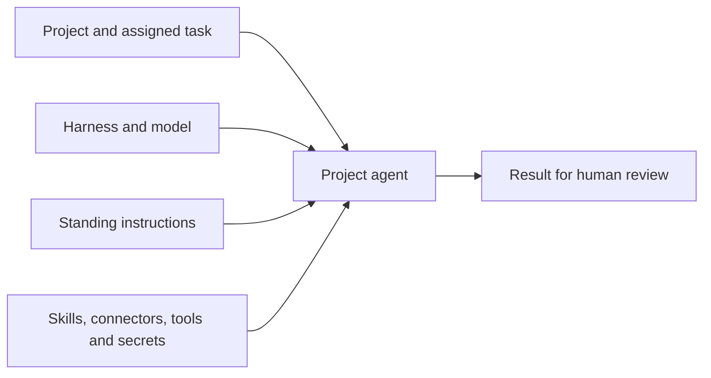

A project agent is a named worker for one project's tasks. Its configuration brings together the harness that runs the work, the model it uses, standing instructions and the equipment it may reach for. Use this page to decide what belongs in that configuration before staffing a project; [Project agents](/platform/projects/project-agents) covers creating and managing the roster.

## Choose what the agent owns

An agent belongs to exactly one project. Its ID identifies that project's worker, and a task can only be assigned an agent from the same project. A project holds up to 50 agents, with names unique within that project.

Visibility follows project access. People who can read the project can read its roster; people with project edit access can manage it while the project is active. An agent does not have a separate private or organization-wide visibility setting.

## Choose how the work runs

The **harness** runs the coding session in a sandbox; the **model** and its provider determine which engine answers. These choices are part of the project agent. [Harnesses](/platform/agents/harnesses) explains the available execution environments, and [Providers](/platform/admin/providers) covers their credentials.

Standing **instructions** describe the agent's responsibility and boundaries, up to 20,000 characters. For a review agent, specify what to inspect, which changes need a person's decision and how to report the result. Keep task-specific requirements in the assigned task so the same agent can handle the next one.

## Equip it for the task

**Skills** supply reference bundles, **connectors** provide connected services and **tools** grant platform capabilities. Each list holds up to 25 entries. Grant the capabilities the job needs; granting a write tool authorizes its writes within the tool's access rules.

**Secrets** reference organization-owned secret names, up to 25 per agent. Only an organization Owner or Admin may change those grants. Secret values remain encrypted in the organization's secret store; the agent configuration carries names, and its run receives the granted values.

## Put the choices together

A review agent might use a coding harness and a model served by an approved provider, a house review skill, the connector for the repository and instructions to report defects with evidence. It works on a task in its own project, then returns the result for a person to review. A second project needs its own agent configuration, even when the name and instructions match.

## Choose the right kind of work

| Use | When you need |
| --- | --- |
| Chat | A conversation with the built-in assistant for questions, retrieval or drafting. |
| A project agent | A configured worker for a project task whose result a person reviews. |
| An automation | Defined stages, scheduling or approvals between steps. |

Direct chat uses the built-in assistant. Adding project context to a chat does not select a project agent; an automation's agent node has its own execution configuration.

## Staff the project

Choose the project and the task first, then set the agent's execution, instructions and equipment around that work. [Project agents](/platform/projects/project-agents) walks the setup, [Agents (admin view)](/platform/admin/agents) explains who may change it, and the [API reference](/develop/api-reference#manage-a-projects-agents) covers project-scoped management from an integration.
