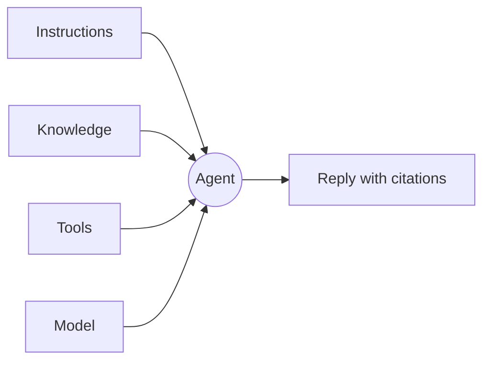

An agent is the unit Tale reaches for when the same question is going to come back. It is the four-knob combination of instructions, knowledge, tools, and a model — the four things you change to make the agent behave differently. Editors and Developers build them; Members and other roles run them.

This page hands you the mental model the rest of the section assumes. Read it once before you build your first agent; come back to it when you can't remember whether a behaviour you want to change lives in the instructions, the knowledge, the tools, or the model.

Prefer to watch first? Episode 4 builds an agent end to end in under three minutes — all four decisions, then a live test, captions included.

<Video src="/videos/tutorials/ep4-agent/ep4-agent.en.mp4" poster="/videos/tutorials/ep4-agent/ep4-agent.en.webp" captions="/videos/tutorials/ep4-agent/ep4-agent.en.vtt" lang="en" title="Episode 4 — Your first agent" caption="Episode 4 — Your first agent (2:46)">

</Video>

## The four knobs

**Instructions** are the system prompt — the prose that frames every reply. Keep instructions short, opinionated, and concrete; long instructions get diluted in long conversations. Specify the voice, the constraints, and the refusal cases.

**Knowledge** is what the agent can retrieve from the org's knowledge base. A retrieval mode decides whether the agent searches on demand, has relevant chunks injected into every reply, does both, or neither — and scope switches decide whether team documents, organization documents, and the agent's own uploads are searchable. Knowledge outside those scopes is invisible to the agent — there is no implicit pull from everything the org owns.

**Tools** are what the agent can do beyond replying with text. The agent's **Tools** tab is a per-tool checklist grouped by category — customer and product data, files, workflows, web search, code execution, and more. Toggle each tool individually; every tool you grant widens the trust boundary, so keep the list short.

**Model** is the LLM behind every reply. Models are an ordered list: the first entry is the primary, and the rest are fallbacks Tale tries in order when the primary is unavailable. Switching the model does not re-train anything — the agent's other three knobs are the model's "memory" of the job.

## Skills as a bundle

A skill packages instructions — and optionally scripts and reference files — into a reusable bundle you bind to an agent. Reach for a skill when the same pattern appears across multiple agents: a writing voice, a calculation, a multi-step task. Skills compose with the four knobs; an agent can bind up to ten and reads each one at runtime.

The skills page covers the trade-off between a skill and inline instructions in detail: see [Agent skills](/platform/agents/skills).

## Putting it together — a support-triage agent

A first useful agent is the support-triage one: it reads the inbound question, answers what it can, and escalates the rest. The four knobs:

- Instructions: a one-paragraph voice plus three explicit refusal cases.
- Knowledge: retrieval on demand over the product documentation; nothing agent-specific uploaded.
- Tools: web search and the conversation tools. No code execution.
- Model: a capable primary with a cheaper fallback next in the list.

The conversation then flows: user message → instructions frame the reply → knowledge retrieval finds the relevant chunks → tools fill the gaps → the reply lands with citations. Escalation to a specialist is not a tool toggle — it follows delegate relationships between agents. See [Agent workers](/platform/agents/delegation).

## When to reach for it

A single agent is the right shape when the conversation stays in one domain and one voice. Reach for a [workflow](/platform/automations/concepts) when the work is multi-step and you want approvals or scheduling in between; reach for a raw chat (no agent) when you are exploring an answer yourself and the model's defaults are fine.

| Use … when                                     | Agent | Raw chat | Workflow |
| ---------------------------------------------- | ----- | -------- | -------- |
| Same question recurs                           | ✓     |          |          |
| The voice or constraints matter                | ✓     |          |          |
| You need approvals or scheduling between steps |       |          | ✓        |
| You are exploring an answer one time           |       | ✓        |          |

## Build one

The four knobs are what every Tale agent is made of: change one of them and you have changed the agent's behaviour, change three and you have made a new product. The natural next read is [Build your first agent](/tutorials/editor/first-agent-end-to-end) — it walks the four knobs end to end on a fresh instance.
