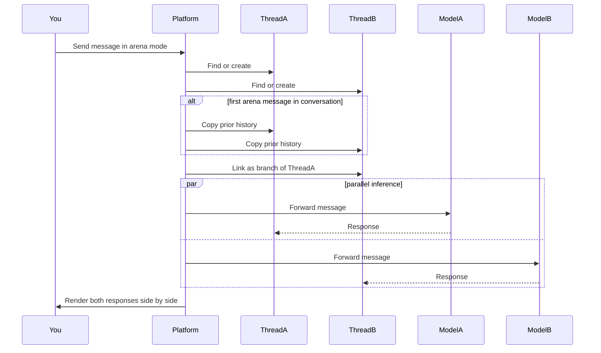

Arena Mode sends the same message to two AI models at the same time and renders the responses in a split view. Use it to evaluate a candidate model against your current default, to gather preference data across the team before a model rollout, or to demonstrate why one model handles a particular prompt class better than another. Every Member with chat access can run Arena Mode; the model dropdowns are filtered to whatever the organisation has configured under [AI providers](/platform/admin/providers) and whatever the active agent supports.

This page covers the runtime: turning the mode on, the split view, recording a verdict, and how the parallel inference works under the hood.

## Turn Arena Mode on

Open any chat conversation and click the **Swords** icon in the input toolbar — the icon highlights when Arena Mode is active. Two model dropdowns appear above the input, labelled **Model A** and **Model B** with **vs** between them. Pick a model on each side and send a message; both responses stream into a split view. To turn the mode back off, click the Swords icon again — all arena state (model selections, threads, verdict) clears.

Arena Mode needs at least two available models in the organisation's provider set. If only one chat model is configured, the model dropdowns are hidden and the toggle is disabled — add a second provider under [AI providers](/platform/admin/providers) first.

## The split view

After you send a message, the chat area splits into two columns. The left column streams the response from Model A's thread; the right column streams Model B's. Each column has a header showing the model name; both scroll independently and support the full set of chat features including approvals, attachments, and message actions. Continue sending messages in the same view and every new message goes to both models in parallel.

## Record a verdict

Once both models have responded, a verdict bar appears below the split view. Four options:

| Verdict         | Effect                                                                         |
| --------------- | ------------------------------------------------------------------------------ |
| **A is better** | Records Model A as the preferred response                                      |
| **B is better** | Records Model B as the preferred response and makes Thread B the active branch |
| **Tie**         | Records that both responses were equally good                                  |
| **Both bad**    | Records that neither response was satisfactory                                 |

Verdicts are stored as feedback with the verdict choice plus both model IDs. Once recorded, the verdict buttons are disabled for that comparison round, so each pair gets one judgement. The verdicts accumulate as preference data — your usage-analytics dashboard surfaces head-to-head wins per pair and aggregate model rankings over time.

## How parallel inference works

When you send a message in Arena Mode, the platform creates two separate threads (or reuses the existing arena threads), copies the conversation history to both if this is the first arena message in the conversation, links Thread B as a branch of Thread A, and forwards the same message to both models in parallel. Neither model sees the other's output, so the verdict reflects what each model produced independently.

The branch link is what lets you keep the winning response: when you pick **B is better**, Thread B becomes the active branch and subsequent non-arena messages continue from it.

## Where this fits

Arena Mode is the evaluation surface inside chat — the fastest path from "I want to know how these two models compare on my real prompts" to a recorded verdict. Use the verdicts it produces to inform which model you assign as the **Standard** preset on [AI providers](/platform/admin/providers) and which model each agent uses at [Create an agent](/platform/agents/create). For aggregate trends, the usage-analytics dashboard shows arena verdicts grouped by pair and by agent.
