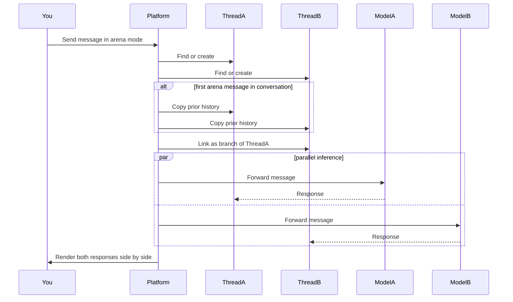

Arena Mode sends the same message to two AI models at the same time and renders the responses in a split view. Use it to evaluate a new model against your current default, to gather preference data across the team before a model rollout, or to demo why one model handles a particular prompt class better than another. Every Member with access to chat can run Arena Mode; the model dropdowns are filtered to what the organisation has configured under [AI providers](/platform/admin/providers) and what the active agent supports.

This page covers the runtime: enabling the mode, the split view, recording a verdict, and the parallel-inference sequence under the hood.

## Enabling arena mode

1. Open any chat conversation.
2. Click the **Swords** icon in the chat input toolbar. The icon highlights when Arena Mode is active.
3. Two model dropdowns appear above the input, labeled **A** and **B** with **vs** between them.
4. Select a model for each side. The dropdowns show all models available to you based on your organization's governance settings and the active agent's supported models.
5. Type a message and send it.

To disable Arena Mode, click the Swords icon again. All arena state (model selections, threads, verdict) is cleared.

> **Note:** Arena Mode requires at least two available models. If only one model is configured, the model selector is hidden and the toggle is disabled.

## Split view

After sending a message, the chat area splits into two columns:

| Column    | Content                        |
| --------- | ------------------------------ |
| Left (A)  | Messages from Model A's thread |
| Right (B) | Messages from Model B's thread |

Each column has a header showing the model label and name. Both columns scroll independently and support the full set of chat features including approvals, file attachments, and message actions.

You can continue sending messages while in Arena Mode. Each new message is sent to both models in parallel.

## Recording a verdict

Once both models have responded, a verdict bar appears below the split view with four options:

| Verdict         | Effect                                                                         |
| --------------- | ------------------------------------------------------------------------------ |
| **A is better** | Records Model A as the preferred response                                      |
| **B is better** | Records Model B as the preferred response and makes Thread B the active branch |
| **Tie**         | Records that both responses were equally good                                  |
| **Both bad**    | Records that neither response was satisfactory                                 |

Verdicts are stored as feedback with metadata including the verdict choice, Model A ID, and Model B ID. Once recorded, the verdict buttons are disabled for that comparison round.

## How it works

When you send a message in Arena Mode, the platform:

1. Creates two separate threads (or reuses existing arena threads).
2. Copies conversation history to both threads if this is the first arena message in an existing conversation.
3. Sends the same message to both models in parallel. Each model responds in its own thread without seeing the other's output.
4. Creates a branch link so Thread B is tracked as a variant of Thread A.

This keeps the comparison fair — neither model is influenced by the other's response, and the verdict reflects the response each model produced independently.

## Where this fits

Arena Mode is the evaluation surface inside chat. Use the verdicts it records to inform which model becomes the **Standard** preset on [AI providers](/platform/admin/providers), and which models you wire to specific agents at [Create an agent](/platform/agents/create). The verdict log accumulates as feedback under the conversation — your usage-analytics dashboard surfaces aggregate preference data across agents and time.
