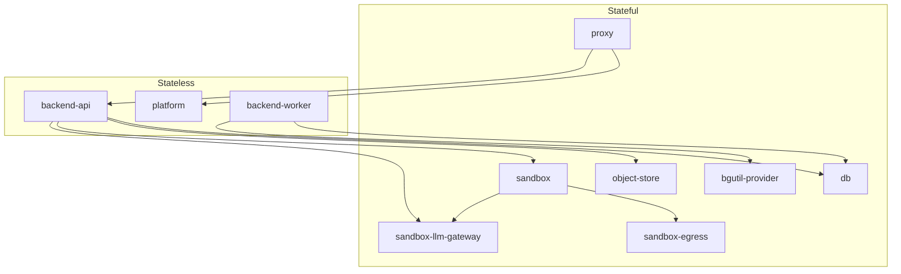

This page is what a stack must reproduce when you write Compose or Kubernetes yourself instead of running `tale deploy`: which services hold state, the DNS names, the probes, the volumes. The CLI path stays in [Quickstart](/self-hosted/install/quickstart) and [Upgrades](/self-hosted/operate/upgrades).

## When this path is the right one

Use the CLI when you can run it. Use this page when you write Compose, or when you map the same contract onto Kubernetes.

| Use this page when | Use the CLI when |
| ------------------ | ---------------- |
| You write production Compose, or a cluster mapping — air-gap, existing automation, no CLI on the host | [Quickstart](/self-hosted/install/quickstart) plus `tale deploy` when you want blue-green, `tale backup`, and `tale rollback` |

There is no official Helm chart.

## Stateful and stateless

Ten services, two kinds. Stateful services hold disks and fixed identity — recreate them and you lose data or break DNS. Stateless services are interchangeable replicas of one image; recreate them in place on upgrade. One compose file is the default. Split files or Kubernetes is yours, as long as the DNS names, the isolated sandbox network, and the boot order stay.



`sandbox-llm-gateway` is the harness path: the api provisions it, and a session container reaches it as `llm-gateway`. `bgutil-provider` is the worker's YouTube PO-token sidecar and is best-effort — video-link ingest degrades without it.

The three stateless services share one image (`ghcr.io/tale-project/tale/tale-platform:<version>`). `TALE_ROLE` picks `api` or `worker` at boot; the web tier is the same image without that role. Pin every `tale-*` image to the same release tag so the wire contracts cannot skew.

| Kind | Services |
| ---- | -------- |
| Stateful | `proxy`, `db`, `object-store`, `sandbox`, `sandbox-egress`, `sandbox-llm-gateway`, `bgutil-provider` |
| Stateless | `platform`, `backend-api`, `backend-worker` |

## The stateless services

Below are the three stateless roles — aliases, `/ping` as liveness, `TALE_ROLE`, `NET_ADMIN`. Put the stateful services in the same file or elsewhere; the tables on this page are what they must still do. Pin the image tag and fill `.env` from the [Environment reference](/self-hosted/configuration/environment-reference).

```yaml
# Stateless app tier. No container_name: --scale needs free names.
# Add db, proxy, sandbox, … in this file or another — your call.
services:
  platform:
    image: ghcr.io/tale-project/tale/tale-platform:0.5.11
    env_file: [.env]
    volumes: ['config-data:/app/data:ro']
    stop_grace_period: 45s
    healthcheck:
      test:
        [
          'CMD-SHELL',
          'curl -sf http://localhost:3000/api/health && [ -f /tmp/platform-ready ]',
        ]
      interval: 5s
      timeout: 3s
      retries: 3
      start_period: 180s
    networks:
      internal:
        aliases: [platform]
  backend-api:
    image: ghcr.io/tale-project/tale/tale-platform:0.5.11
    environment:
      TALE_ROLE: api
      PORT: '3005'
      TALE_CONFIG_DIR: /app/data
      DATABASE_URL: postgresql://tale:${DB_PASSWORD}@db:5432/tale_app
      SANDBOX_URL: http://sandbox:8003
      SANDBOX_HTTP_API_BASE_URL: http://backend-api:3005
      OBJECT_STORE_ENDPOINT: http://object-store:9000
    env_file: [.env]
    volumes: ['config-data:/app/data']
    cap_add: [NET_ADMIN]
    healthcheck:
      test: ['CMD-SHELL', 'curl -sf http://localhost:3005/ping']
      interval: 10s
      timeout: 3s
      retries: 3
      start_period: 30s
    networks:
      internal:
        aliases: [backend-api]
      sandbox:
        aliases: [backend-api]
  backend-worker:
    image: ghcr.io/tale-project/tale/tale-platform:0.5.11
    environment:
      TALE_ROLE: worker
      TALE_CONFIG_DIR: /app/data
      DATABASE_URL: postgresql://tale:${DB_PASSWORD}@db:5432/tale_app
      SANDBOX_URL: http://sandbox:8003
      SANDBOX_HTTP_API_BASE_URL: http://backend-api:3005
      OBJECT_STORE_ENDPOINT: http://object-store:9000
    env_file: [.env]
    volumes: ['config-data:/app/data']
    cap_add: [NET_ADMIN]
    healthcheck: { disable: true }
    networks: [internal]
volumes:
  config-data:
networks:
  internal:
  sandbox:
    name: tale-sandbox-net
    internal: true
    enable_ipv6: false
```

There is no checked-in production compose to copy. The CLI generates a split file pair and deletes it after `up`. Your file does not have to look like that.

## Networks and DNS names

Two Docker networks carry every hop. An ordinary compose network is enough for the internal plane. The sandbox bridge must be named `tale-sandbox-net` and marked `internal` so the spawner can `docker run --network tale-sandbox-net` and a session container cannot reach the internet without going through `sandbox-egress`. A bridge without `internal` is an open path out.

| Name the process resolves | Who answers | Networks |
| ------------------------- | ----------- | -------- |
| `backend-api` | Every healthy api replica still attached | `internal`, `sandbox` |
| `platform` | Every healthy web-tier replica still attached | `internal` |
| `knowledge-db` | The `db` service (production folds the corpus into the same Postgres) | `internal` |
| `object-store` | MinIO | `internal` |
| `sandbox` | The sandbox spawner | `internal`, `sandbox` |
| `sandbox-egress` | The egress proxy | `internal`, `sandbox` |
| `llm-gateway` | `sandbox-llm-gateway` | `internal`, `sandbox` |
| `HOST` (your public hostname) | `proxy`, so a container can hairpin to the public URL | `internal` |

Workers have no shared alias. Nothing addresses a worker by name; they only claim jobs from the queue. Colour-suffixed aliases (`backend-api-blue`, `platform-green`) are only for a blue-green while two versions are up at once.

The proxy sends app API lanes to `backend-api:3005` (`BACKEND_UPSTREAM`). It sends `/api/health` and the SPA to `platform:3000`, and it health-checks `platform` on `/api/health`. Fail that probe on a draining web replica and Caddy marks the whole site down.

## Volumes

Name these logical volumes in your compose. One file can let compose create them. Mark them external only if something outside this file must mount the same disks.

| Volume | Who mounts it | What it holds |
| ------ | ------------- | ------------- |
| `config-data` | Backend read-write, platform read-only, sandbox read-only at `/app/platform-config` | Org config: agents, skills, providers, governance, SSO, branding |
| `db-data` | `db` at `/var/lib/postgresql/data` | `tale_app` and `tale_knowledge` |
| `db-backup` | `db` at `/var/lib/postgresql/backup` | In-container Postgres backup target |
| `object-store-data` | `object-store` at `/data` | Blobs |
| `caddy-data`, `caddy-config` | `proxy` | Certificates and Caddy state |
| `llm-gateway-data` | `sandbox-llm-gateway` at `/app/data` | Per-session virtual keys |

Instances upgraded from before 0.5.11 may still have a `convex-data` volume beside `config-data`. The CLI copies the store across once and never deletes the old volume. A hand-rolled first boot on a fresh host does not need `convex-data`.

## Health probes

Liveness and readiness are different questions. Mixing them cuts a draining replica out of DNS before in-flight work finishes, or keeps an unready replica in the pool.

| Service | Probe | What it means |
| ------- | ----- | ------------- |
| `backend-api` | `GET /ping` on `:3005` | Liveness. Stays 200 while the replica drains. Docker and Caddy use this. |
| `backend-api` | `GET /ready` on `:3005` | Readiness. 503 once this replica is draining. The deploy asks this; Docker and Caddy do not. |
| `platform` | `GET /api/health` and file `/tmp/platform-ready` | Ready to serve the SPA. Keep this 200 while the replica still holds the `platform` alias. |
| `backend-worker` | None | The worker exposes no HTTP. Disable the image's baked web healthcheck or the replica reads permanently unhealthy. |
| `proxy` | `http://127.0.0.1:2020/health` | Caddy admin health. |
| `db` | `pg_isready` and file `/tmp/.db_ready` | Postgres accepts connections and init finished (the knowledge database and extensions). `start_period` 120s. Stop the container with `SIGINT`, not `SIGTERM`. |
| `object-store` | `mc ready local` | MinIO is accepting writes. |
| `sandbox` | `GET /health` on `:8003` | Spawner is up. Do not publish this port on a public host. |
| `sandbox-egress` | TCP `127.0.0.1:3128` | tinyproxy is bound. Do not probe an external host. |
| `sandbox-llm-gateway` | `GET /health` on `:8080` | Gateway is up. |

## Environment the compose must inject

The [Environment reference](/self-hosted/configuration/environment-reference) is every variable the process reads from `.env`. The rows below are what the compose file itself must set — image defaults point the process at the wrong host.

| Name | Value on a production stack |
| ---- | --------------------------- |
| `TALE_ROLE` | `api` on `backend-api`, `worker` on `backend-worker`. Unset on `platform`. |
| `PORT` | `3005` on the api. The proxy's `BACKEND_UPSTREAM` default is `backend-api:3005`. |
| `TALE_CONFIG_DIR` | `/app/data` |
| `DATABASE_URL` | `postgresql://tale:${DB_PASSWORD}@db:5432/tale_app` |
| `SANDBOX_URL` | `http://sandbox:8003` |
| `SANDBOX_HTTP_API_BASE_URL` | `http://backend-api:3005` |
| `OBJECT_STORE_ENDPOINT` | `http://object-store:9000` |
| `SANDBOX_EGRESS_NETWORK` | `tale-sandbox-net` |
| `SANDBOX_EGRESS_PROXY` | `http://sandbox-egress:3128` |

## Capabilities and mounts that break if omitted

These look optional and fail closed when they are missing.

| Service | Must have | What breaks without it |
| ------- | --------- | ---------------------- |
| `backend-api`, `backend-worker` | `cap_add: [NET_ADMIN]` | The entrypoint cannot install the SSRF iptables fence (IMDS, link-local, RFC1918). |
| `sandbox-egress` | `cap_drop: [ALL]` then `NET_ADMIN`, `DAC_OVERRIDE`, `CHOWN`, `SETUID`, `SETGID`, `NET_BIND_SERVICE` | No IMDS/RFC1918 fence; tinyproxy cannot bind or drop privileges. |
| `sandbox` | `/var/run/docker.sock` and `/var/lib/tale-sandbox` bind-mounted 1:1 | The spawner cannot create session containers; workspace paths the daemon mounts will not match. |
| `db` | `stop_signal: SIGINT`, `stop_grace_period: 60s`, `shm_size: 256mb` | A `SIGTERM` wait-for-clients stop ends in `SIGKILL` and can leave the BM25 index with a zeroed page. |
| `platform` | `stop_grace_period: 45s` | Docker's default 10s grace `SIGKILL`s the web tier mid-drain and cuts in-flight HTTP/SSE. |
| `object-store` | No published ports | Presigned URLs go through the proxy. Publishing MinIO is an extra public surface. |

Publish only `80` and `443` on `proxy`. Everything else stays on the internal network.

## Boot order

Bring the stores up first, then the sandbox plane, then the app tier. An api that starts before `db` and `object-store` are healthy crash-loops on `ENOTFOUND` and on a missing database. In one file, `depends_on` with `service_healthy` is enough.

```bash
docker compose up -d
# Wait until db, object-store, proxy, sandbox, sandbox-egress, sandbox-llm-gateway
# report healthy. bgutil-provider is best-effort — YouTube ingest degrades without it.
```

Schema migrations run inside the backend at boot, under an advisory lock. There is no separate migrate step. A replica that cannot apply a migration fails to start; leave the previous api running until the new one is healthy.

## Kubernetes

There is no Helm chart and no official manifest. Map the Docker contract; do not invent a second architecture.

| Docker | Cluster |
| ------ | ------- |
| Stateless `platform`, `backend-api`, `backend-worker` | Deployments. Same image; `TALE_ROLE` picks the process. Scale these. |
| Stateful `db`, `object-store`, `proxy`, sandbox plane | StatefulSets (or equivalent) plus the volumes on this page. Do not run two writers against one disk. |
| Compose DNS names (`backend-api`, `platform`, `knowledge-db`, `sandbox`, `llm-gateway`, …) | Services with those names. The proxy and the sandbox resolve them. |
| `tale-sandbox-net` marked `internal` | A NetworkPolicy (or isolated CNI) that blocks a session pod from the internet except through `sandbox-egress`. |
| `GET /ping` on the api | Liveness. Stays 200 while the replica drains. |
| `GET /ready` on the api | Your rollout's readiness question. Do not point the Service at `/ready` if you drain. |
| Sandbox `docker.sock` and `/var/lib/tale-sandbox` bind-mounted 1:1 | The hard part. The spawner creates session containers; the workspace path the daemon mounts must match the path inside the spawner. A cluster that cannot offer a Docker socket (or an equivalent) cannot run the sandbox plane. |
| `cap_add: [NET_ADMIN]` on the backend | The SSRF iptables fence. Without it the entrypoint cannot lock IMDS and RFC1918. |

Publish only 80 and 443. Leave Postgres, MinIO, and the sandbox port off the public Service list.

In-place recreate of the stateless Deployments is the default. Zero-downtime is a rolling update you own.

## What you give up without the CLI

`tale deploy` is not a compose up. The commands below have no equivalent in a file you maintain.

| CLI behaviour | What you do instead |
| ------------- | ------------------- |
| Blue-green flip: start the idle colour, wait for every replica, drain the old api, then `docker network disconnect` | In-place recreate, or implement the flip yourself. Disconnect severs live connections — drain first. |
| `tale backup` / `tale rollback` | Your own volume snapshots. Rollback of a minor or major is a snapshot restore, not a down-migration. |
| Flip-pending resume after a killed deploy | Your own record of which colour is live. |
| Config-volume copy from `convex-data` on a pre-0.5.11 host | Copy the store yourself, or start fresh. |
| Sandbox `/v1/drain` before an in-place spawner roll | `SIGTERM` plus a 30s stop grace is the backstop; in-flight runs still die if you recreate without draining. |

An in-place recreate of the stateless services is the default. Zero-downtime is the part you reimplement.

## What production must not do

These look local and break a public instance.

| Don't | Why |
| ----- | --- |
| Publish `5432`, `8003`, or MinIO | Extra public surface. Presigned URLs go through the proxy. |
| Run a second Postgres for the corpus | Production folds `tale_knowledge` into `db` and aliases that service `knowledge-db`. |
| Pin names on the app tier | Replicas cannot share a container name. |
| Build from source on a public host | Pin `ghcr.io/tale-project/tale/<image>:<tag>`. |
| Ship placeholder secrets | Generate them before the first up. |
| Give session containers a path to the internet | The sandbox network (or its NetworkPolicy) must be isolated. |

## Where this fits

You now have the contract: which services hold state, two networks, the DNS names the proxy and the sandbox resolve, the probes that must not be swapped, and what Kubernetes must still do. [Environment reference](/self-hosted/configuration/environment-reference) is every variable the containers read. [Container architecture](/self-hosted/operate/container-architecture) is what each container owns when one of them dies. Most teams still want the [quickstart](/self-hosted/install/quickstart) and `tale deploy` — this page is the path when that wrapper is the thing you cannot run.
