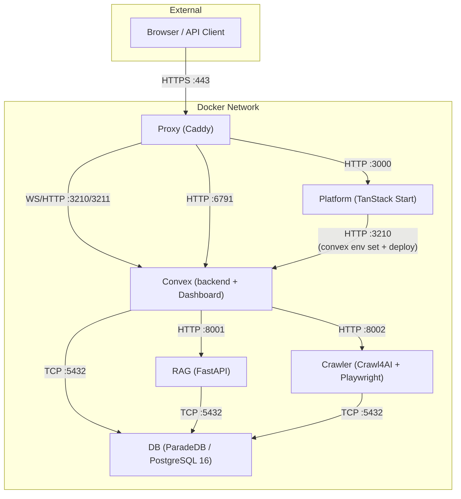

Tale runs as **six** Docker containers managed by Docker Compose. Each container has a single responsibility and communicates over an internal bridge network. Convex runs as its own service (`convex`) and serves WebSocket clients independently of the platform container; platform is a thin Vite client that pushes schema and env to Convex over HTTP.

## Service overview

## Image details

| Service  | Base image                                                            | Optimized size         | Build strategy                                                      |
| -------- | --------------------------------------------------------------------- | ---------------------- | ------------------------------------------------------------------- |
| Platform | `ghcr.io/get-convex/convex-backend` (for `generate_key` glibc binary) | **~320 MB compressed** | 5-stage: deps → builder → pruner → runner → squash                  |
| Convex   | `ghcr.io/get-convex/convex-backend`                                   | **~485 MB compressed** | 2-stage: dashboard → runner (Dashboard COPY-ed from upstream image) |
| Crawler  | `python:3.11-slim`                                                    | **~650 MB compressed** | 3-stage: builder → runtime → squash. Chromium headless_shell only   |
| RAG      | `python:3.11-slim`                                                    | **~515 MB**            | 3-stage: builder → runtime → squash. libpq5 only                    |
| DB       | `paradedb/paradedb:0.22.5-pg16`                                       | **~1.06 GB**           | 3-stage: cleanup → runtime → squash                                 |
| Proxy    | `caddy:2.11-alpine`                                                   | **~88 MB**             | Single stage                                                        |

Splitting Convex out of platform reduced the platform image from ~2.58 GB to ~320 MB compressed; the convex service is a new ~485 MB image. Net image disk is similar but the platform layer rebuilds much faster for app-only changes.

## Port mapping

### Development ports (`compose.yml`)

| Service  | Host port | Container port   | Protocol            |
| -------- | --------- | ---------------- | ------------------- |
| DB       | 5432      | 5432             | TCP (PostgreSQL)    |
| Crawler  | 8002      | 8002             | HTTP                |
| RAG      | 8001      | 8001             | HTTP                |
| Convex   | —         | 3210, 3211, 6791 | WS/HTTP (via proxy) |
| Platform | —         | 3000             | HTTP (via proxy)    |
| Proxy    | 80, 443   | 80, 443          | HTTP/HTTPS          |

### Test ports (`compose.test.yml`)

| Service  | Host port           | Container port   |
| -------- | ------------------- | ---------------- |
| DB       | 15432               | 5432             |
| Crawler  | 18002               | 8002             |
| RAG      | 18001               | 8001             |
| Convex   | 13210, 13211, 16791 | 3210, 3211, 6791 |
| Platform | 13000               | 3000             |
| Proxy    | 10080, 10443        | 80, 443          |

## Volume mapping

| Volume          | Mounted in              | Path                                   | Purpose                                                                                                                              |
| --------------- | ----------------------- | -------------------------------------- | ------------------------------------------------------------------------------------------------------------------------------------ |
| `db-data`       | DB                      | `/var/lib/postgresql/data`             | PostgreSQL data directory                                                                                                            |
| `db-backup`     | DB                      | `/var/lib/postgresql/backup`           | Database backups                                                                                                                     |
| `rag-data`      | RAG                     | `/app/data`                            | Temp files, document processing                                                                                                      |
| `crawler-data`  | Crawler                 | `/app/data`                            | Website registry, URL databases                                                                                                      |
| `convex-data`   | Convex                  | `/app/data`                            | Convex DB (SQLite/pg-local), search indexes, files, agents/workflows/integrations/providers JSON                                     |
| `convex-data`   | Platform                | `/app/data` **(read-only)**            | Config SSE watcher + branding image serving                                                                                          |
| `convex-data`   | Crawler, RAG            | `/app/platform-config` **(read-only)** | Shared provider config                                                                                                               |
| `caddy-data`    | Proxy, Convex           | `/data`, `/caddy-data`                 | TLS certificates                                                                                                                     |
| `caddy-config`  | Proxy                   | `/config`                              | Caddy configuration                                                                                                                  |
| `platform-data` | — _(legacy, unmounted)_ | —                                      | Preserved after upgrade for rollback safety; remove manually after verifying the split: `docker volume rm <projectId>_platform-data` |

> **Important:** Never run `docker compose down -v`. The `-v` flag deletes all Docker volumes, permanently erasing your database and all platform data.

## Build arguments

| Argument            | Default | Used by | Description                                |
| ------------------- | ------- | ------- | ------------------------------------------ |
| `VERSION`           | `dev`   | All     | Image version tag (set by CI from git tag) |
| `INSTALL_CJK_FONTS` | `false` | Crawler | Install CJK font support (~100 MB)         |

## Multi-stage build strategy

All services use a `FROM scratch` squash as their final stage. This flattens Docker layers so that file deletions in cleanup stages actually reclaim disk space, rather than just adding masking layers.

### Platform (5 stages, post-split)

1. **bun-bin** — Extracts Bun binary
2. **workspace-deps** — Installs all npm dependencies (including devDependencies)
3. **builder** — Runs `vite build` to produce the SPA
4. **pruner** — Reinstalls production-only deps, removes dev packages (`@vitest`, `@storybook`, `typescript`, etc.)
5. **runner** — Final runtime on the `convex-backend` base image (kept for the `generate_key` glibc binary used to sign Convex admin tokens). Vite SPA + Bun server only — no Convex backend process.
6. **squash** — `FROM scratch` + `COPY --from=runner`. Runs as root, drops to `app` user via `gosu` in entrypoint.

### Convex (2 stages, new in Phase 2)

1. **convex-dashboard** — `FROM ghcr.io/get-convex/convex-dashboard` to COPY the Next.js standalone build.
2. **runner** — `FROM ghcr.io/get-convex/convex-backend`. Contains `convex-local-backend` daemon, Dashboard, builtin seed assets (agents/workflows/integrations/providers/branding), entrypoint. Strips LLVM/Clang (~155 MB).

### Crawler (3 stages)

1. **builder** — Installs Python deps via `uv`, downloads Chromium headless_shell, runs deep cleanup (removes full Chrome, FFmpeg, pip, `__pycache__`, `.so` debug symbols, test dirs)
2. **runtime** — Clean `python:3.11-slim` with only runtime system libs (Chromium deps, tini, curl). Strips LLVM/Adwaita icons
3. **squash** — `FROM scratch` + `COPY --from=runtime`. Pre-creates volume mountpoints for `/app/data` and `/app/platform-config`

### RAG (3 stages)

1. **builder** — Installs Python deps with `build-essential` + `libpq-dev` for compiling native packages, then strips pip/setuptools
2. **runtime** — Clean `python:3.11-slim` with only `libpq5` + `curl`. Pre-creates volume mountpoints
3. **squash** — `FROM scratch` + `COPY --from=runtime`

### DB (3 stages)

1. **cleanup** — Strips debug symbols (~888 MB), LLVM shared libraries (~127 MB), PostGIS extension files, locales, and docs from the ParadeDB base image
2. **runtime** — `FROM scratch` + `COPY --from=cleanup`. Fresh layer with only cleaned files
3. **squash** — Re-declares `PGDATA`, `PATH`, and other ENV vars lost during `FROM scratch`

## Health checks

| Service  | Endpoint                                              | Protocol    | Start period |
| -------- | ----------------------------------------------------- | ----------- | ------------ |
| DB       | `pg_isready -U tale -d tale`                          | CLI         | 60s          |
| Crawler  | `GET /health` on :8002                                | HTTP        | 40s          |
| RAG      | `GET /health` on :8001                                | HTTP        | 40s          |
| Convex   | `GET :3210/version` + `[ -f /tmp/convex-ready ]`      | HTTP + file | 60s          |
| Platform | `GET :3000/api/health` + `[ -f /tmp/platform-ready ]` | HTTP + file | 180s         |
| Proxy    | `GET /health` on :2020 (internal)                     | HTTP        | 10s          |

The `/tmp/<service>-ready` markers are touched by each service's entrypoint after its one-shot initialization work completes (Convex: backend up + builtin seed; Platform: env sync + `convex deploy`). This prevents traffic from being routed before the service is truly ready to serve requests.

## Container testing

Tale includes three container test scripts:

| Script                                  | Command                             | What it tests                                                                |
| --------------------------------------- | ----------------------------------- | ---------------------------------------------------------------------------- |
| `tests/container-smoke-test.sh`         | `bun run docker:test`               | Builds, starts, health checks, HTTP endpoints, inter-service connectivity    |
| `tests/container-image-test.sh`         | `bun run docker:test:image`         | OCI labels, non-root user, no secrets, HEALTHCHECK instruction, size budgets |
| `tests/container-vulnerability-scan.sh` | `bun run docker:test:vulnerability` | Trivy vulnerability scan (HIGH + CRITICAL)                                   |

See [Contributing Docker guide](/develop/contributing-docker) for details on modifying Dockerfiles and running tests.

## Where this fits

Container architecture is the mental model for what's running, where, and how the services talk. Reach for it when something doesn't reach where you expect — a metrics endpoint that's unreachable, a port that's accidentally exposed, a blue-green switch that didn't drain cleanly. For the per-service observability surfaces, [Operations](/self-hosted/operate/observability/operations) is the next page; for environment-variable knobs, [Environment reference](/self-hosted/configuration/environment-reference) is exhaustive.
