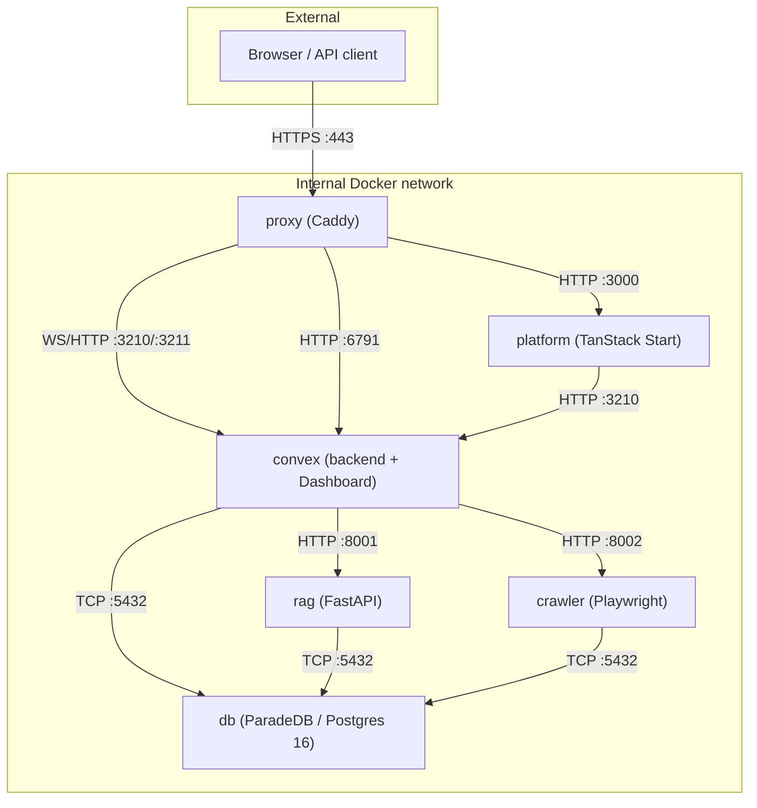

Self-hosted Tale runs as a six-container Docker Compose stack on infrastructure you control. There are no per-seat fees, no model restrictions beyond what your API key allows, and no data ever leaves your network unless you point a provider at an external endpoint. This page is the snapshot an operator reads before installing: what the containers are, where the ports land, what the architecture costs in RAM and disk.

If you came here to install, the [Local quickstart](/self-hosted/install/quickstart) and [Production deployment](/self-hosted/install/linux-server) pages are the next stop. The overview below is for the reader still deciding whether self-hosted Tale fits their environment.

## Six containers, one network

Tale runs as six Docker containers behind a single Caddy proxy. The proxy is the only service that listens on a public port; every other service talks to its peers on an internal Docker bridge network. The bundle stays the same whether you run it on a developer laptop or a production server — only the TLS mode and the host name change.

| Container  | Image base                          | Role                                                                    | Internal port    |
| ---------- | ----------------------------------- | ----------------------------------------------------------------------- | ---------------- |
| `proxy`    | Caddy                               | TLS termination, routing, ACME for Let's Encrypt                        | 80, 443          |
| `platform` | Convex Backend (for `generate_key`) | TanStack Start app, Vite SPA, Bun server                                | 3000             |
| `convex`   | Convex Backend                      | Convex local backend, Convex Dashboard, builtin seed                    | 3210, 3211, 6791 |
| `rag`      | `python:3.11-slim`                  | FastAPI service for document chunking, embeddings, semantic search      | 8001             |
| `crawler`  | `python:3.11-slim`                  | Crawl4AI + Playwright for website crawling and file-to-text conversion  | 8002             |
| `db`       | `paradedb/paradedb:0.22.5-pg16`     | PostgreSQL 16 with pgvector + pg_search for vector and full-text search | 5432             |

The `platform` container is a thin runtime — the SPA plus the Bun server that fronts it. Convex is split out into its own container because it owns the realtime backend, the function set, and the local dashboard; splitting brought the platform image from around 2.58 GB compressed down to around 320 MB and made app-only rebuilds much faster. The full image-size and multi-stage build table lives on [Container architecture](/self-hosted/operate/container-architecture).

## How the services talk

The proxy fans inbound traffic between the platform SPA and the Convex WebSocket endpoints. Convex is the source of truth for application state — it pushes mutations, reads, and function results to the platform over WebSocket — and it talks directly to the database and to the two Python services. The platform never touches Postgres; everything funnels through Convex.

## What you need to run it

For a laptop install, the only requirement is Docker Desktop 24 or newer. For a production server, the [Production deployment](/self-hosted/install/linux-server) page covers the full prerequisite list, but the headline numbers are:

- **RAM** — 8 GB to run, 12 GB to support a blue-green deploy. Blue-green runs the new color alongside the old one until health checks pass, so two of every stateless service exist briefly.
- **Disk** — about 4.4 GB compressed for the initial image pull, plus whatever your knowledge base and chat history grow to.
- **Network** — ports 80 and 443 public, every other port stays on the Docker bridge. Outbound HTTPS to AI providers (or to your internal inference backend) is the only external traffic.

The bundled database is fine for most installs. If you want a managed Postgres or you need data residency in a specific cluster, the architecture supports pointing every service at an external Postgres instance — the steps are on the [Production deployment](/self-hosted/install/linux-server#using-an-external-database) page.

## What the product covers

Tale ships every feature documented under [Platform](/platform) — chat with multi-turn conversations and file attachments, custom agents with their own instructions and tools, automation workflows with LLM steps and conditionals, a semantic knowledge base for documents and websites, a customer-conversation inbox, role-based access control across six roles, and Microsoft Entra SSO. The role-indexed pages under [Platform](/platform) apply identically on Cloud and self-hosted; the only differences live in this tab — install, configuration files, container architecture, observability, the trusted-header authentication path.

Accessibility is part of the same bundle. Tale targets [WCAG 2.1 Level AA](https://www.w3.org/TR/WCAG21/) — keyboard navigation, screen-reader landmarks, visible focus indicators, 4.5:1 contrast on body text, reduced-motion support, and a 24×24 minimum touch target. The CI pipeline enforces it through oxlint's jsx-a11y rules, vitest-axe assertions on rendered components, and Storybook's a11y addon.

## Where this fits

The overview is the architectural picture an operator reads once. From here, [Local quickstart](/self-hosted/install/quickstart) and [Production deployment](/self-hosted/install/linux-server) take a fresh box to a running instance; [Container architecture](/self-hosted/operate/container-architecture) is the deeper reference for the ports, volumes, and health-check shape sketched above; and [Operations](/self-hosted/operate/observability/operations) catalogues what to scrape, log, and alert on once traffic starts flowing. The product itself — chat, agents, automations, knowledge — lives once under [Platform](/platform) and reads identically on Cloud.
