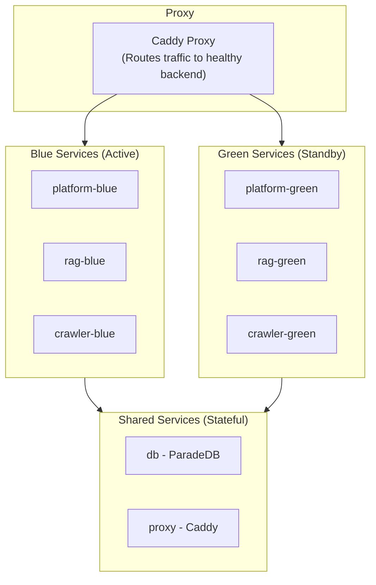

Tale is an open-source, self-hosted AI platform for teams that want a full-stack AI application they can own, control, and extend. It includes an intelligent chat assistant, a semantic knowledge base, customer conversation management, visual automation workflows, and a structured API layer.

Unlike cloud-only AI products, Tale runs entirely on your own infrastructure. Your data stays on your servers. There are no per-seat fees, no vendor lock-in, and no model restrictions beyond what your API key supports.

## Architecture at a glance

Tale runs as five Docker services that communicate over an internal network:

| Service  | Technology                                   | Role                                                     | Local port       |
| -------- | -------------------------------------------- | -------------------------------------------------------- | ---------------- |
| Platform | Bun + TanStack + Convex                      | Web UI, real-time backend, auth, data, workflows         | 3000 (via proxy) |
| RAG      | Python + FastAPI                             | Document indexing, vector search, answer generation      | 8001             |
| Crawler  | Python + Playwright + Crawl4AI               | Website crawling, URL discovery, file-to-text conversion | 8002             |
| Database | ParadeDB (PostgreSQL + pg_search + pgvector) | Persistent storage, full-text search, vector search      | 5432             |
| Proxy    | Caddy                                        | TLS termination and routing                              | 80 / 443         |

> **Note:** All communication between services stays on the internal Docker network. Only ports 80 and 443 are exposed publicly through the Caddy proxy. The database (5432) and API services (8001, 8002) are exposed on the host for local development only.

## Key capabilities

- AI chat assistant with multi-turn conversations, file attachments, agent selection, [arena mode](/platform/chat/arena-mode) for model comparison, [canvas](/platform/workspace/canvas) for content editing, and built-in tools
- [Prompt library](/platform/workspace/prompt-library) for saving and sharing reusable prompt templates
- Semantic knowledge base for documents, websites, products, customers, and vendors with [document comparison](/platform/workspace/document-comparison)
- Customer conversations inbox with AI-assisted replies and bulk actions
- Visual automation builder with LLM steps, conditionals, loops, and scheduling
- Custom AI agents with tailored instructions, knowledge, and tools
- Role-based access control from read-only Member to full Admin
- SSO and integrations including Microsoft Entra ID, REST APIs, OneDrive sync, and SQL connectors
- Production operations with zero-downtime deployments, Prometheus metrics, and Sentry error tracking
- WCAG 2.1 Level AA accessibility across all pages and components

## Accessibility

Tale is built to conform to [WCAG 2.1 Level AA](https://www.w3.org/TR/WCAG21/). Every page and component is designed and tested against these standards so the platform is usable by everyone, including people who rely on assistive technologies.

Key accessibility features:

- **Keyboard navigation** — all interactive elements are reachable and operable via keyboard with visible focus indicators.
- **Screen reader support** — semantic HTML landmarks (`<main>`, `<nav>`, `<header>`), proper heading hierarchy, ARIA labels, and live regions for dynamic content.
- **Skip navigation** — a skip-to-main-content link lets keyboard users bypass repeated navigation.
- **Color and contrast** — all text meets the 4.5:1 contrast ratio for normal text and 3:1 for large text. Information is never conveyed by color alone.
- **Reduced motion** — all animations and transitions respect the `prefers-reduced-motion` user preference.
- **Form accessibility** — labels are associated with inputs, error messages identify the field and describe how to fix the issue, and validation states are communicated via ARIA attributes.
- **Dialogs and overlays** — focus is trapped inside open dialogs and returns to the trigger element on close.
- **Touch targets** — interactive elements meet the minimum 24×24 CSS pixel target size.

### Automated testing

Accessibility compliance is enforced through automated tooling at multiple levels:

| Layer           | Tool                                   | What it checks                                            |
| --------------- | -------------------------------------- | --------------------------------------------------------- |
| Linting         | oxlint with jsx-a11y plugin (27 rules) | ARIA validity, semantic HTML, keyboard handlers, alt text |
| Component tests | vitest-axe (`checkAccessibility`)      | Axe-core WCAG 2.1 AA audit on rendered components         |
| Storybook       | @storybook/addon-a11y                  | Visual a11y panel with WCAG 2.1 AA ruleset                |

The coding standards in `AGENTS.md` require every new UI component to include an accessibility test block using `checkAccessibility()` from the shared test utilities.
