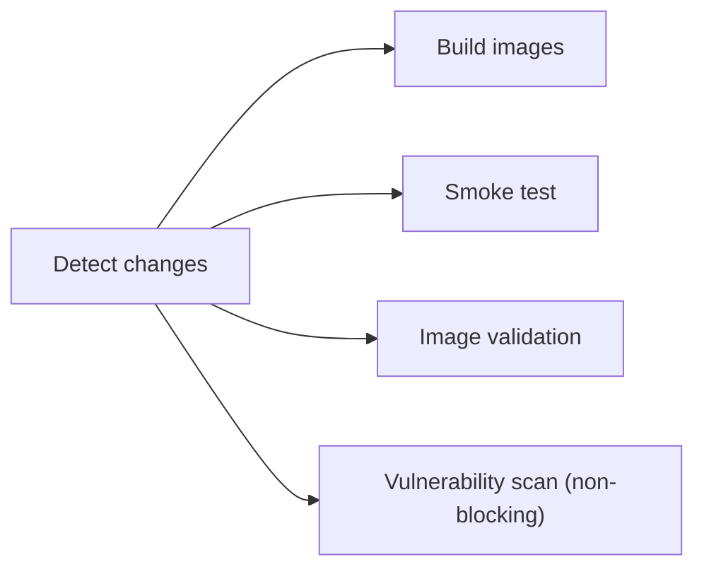
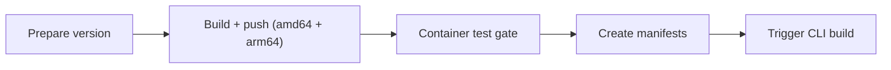

Cette page est le workflow de contribution pour le côté Docker du système de build Tale — ajouter des dépendances, changer la forme multi-étapes, déboguer une image qui échoue, scanner les vulnérabilités. La plupart des lecteurs de cette page touchent `Dockerfile.<service>`, les fichiers compose ou les tests de budget d'image, et les règles ci-dessous existent parce que les images de production et les cycles de build locaux tirent dans des directions opposées : petite image finale contre itération rapide. Le but ici est de garder les deux en bon état.

Si tu fais tourner Tale plutôt que de le construire, les chemins d'installation sous [Démarrage rapide](/fr/self-hosted/install/quickstart) et [Serveur Linux](/fr/self-hosted/install/linux-server) couvrent tout ce qu'il te faut — cette page est du territoire de contribution.

## Prérequis

| Logiciel                        | Version minimale                    |
| ------------------------------- | ----------------------------------- |
| Docker Desktop ou Docker Engine | 24.0+                               |
| Docker Compose                  | v2.20+ (inclus avec Docker Desktop) |
| Trivy (optionnel)               | Dernière                            |

## Référence rapide

Les commandes que tu utilises au quotidien, avant les détails plus bas :

```bash
# Construire toutes les images
docker compose build

# Construire un service unique
docker compose build platform

# Tests de fumée conteneurs (ports sans conflit)
bun run docker:test

# Validation de structure d'image (pas de secrets, labels OCI, budgets de taille)
bun run docker:test:image

# Scan de vulnérabilités (nécessite trivy)
bun run docker:test:vulnerability

# Développement local avec hot-reload
docker compose -f compose.yml -f compose.dev.yml up --build
```

Chacune de ces commandes est déballée plus loin — le reste de la page est le pourquoi derrière les règles qu'elles imposent.

## Conventions Dockerfile

### Builds multi-étapes

Chaque image Python et Node.js utilise un build multi-étapes. Le motif est en trois étapes, chacune avec un seul rôle :

1. **Étape builder** installe les dépendances de build et compile les paquets natifs. C'est là que vivent `gcc`, `build-essential` et les outils de build par langage.
2. **Étape runtime** copie uniquement les artefacts d'exécution dans une image de base propre — pas d'outils de build.
3. **Étape squash** utilise `FROM scratch` plus `COPY --from=runtime / /` pour aplatir les couches.

L'étape squash compte parce que les suppressions de fichiers dans les étapes de nettoyage ne libèrent pas d'espace par elles-mêmes — elles ajoutent des couches masquantes qui sont toujours livrées dans l'image finale. Le squash regroupe les suppressions en une seule couche qui ne contient vraiment pas les fichiers.

Une conséquence à connaître : `FROM scratch` perd chaque déclaration `ENV` et `VOLUME` des étapes amont. Re-déclare-les dans l'étape runtime avant le squash, sinon elles disparaissent.

### Mise en cache des couches

Ordonne les instructions `COPY` et `RUN` du moins fréquemment modifié au plus fréquemment modifié. Les dépendances changent moins souvent que le code applicatif, donc l'installation de dépendances doit atterrir avant la copie de l'application :

```dockerfile
# Dépendances d'abord — mises en cache sur la plupart des builds
COPY pyproject.toml .
RUN uv pip install --system --no-cache-dir .

# Code applicatif ensuite — ne se réinstalle que si les deps changent
COPY app/ ./app/
```

Un mauvais ordre force une réinstallation complète à chaque changement de code, ce qui est la raison la plus fréquente pour qu'un build qui durait 30 secondes en prenne maintenant cinq minutes.

### Drapeaux no-cache

Utilise toujours `--no-cache-dir` pour pip et uv, et `--no-install-recommends` pour apt :

```dockerfile
RUN apt-get update && apt-get install -y --no-install-recommends curl \
    && rm -rf /var/lib/apt/lists/*
RUN uv pip install --system --no-cache-dir .
```

Les répertoires de cache ne servent à rien dans une image de production — ils ne prennent que de la place.

### Labels OCI

Chaque Dockerfile porte un label de version pour que le registre puisse montrer d'où vient un tag :

```dockerfile
ARG VERSION=dev
LABEL org.opencontainers.image.version="${VERSION}"
```

La CI substitue `VERSION` par le tag git au moment de la release.

### Health checks

Chaque Dockerfile porte un `HEALTHCHECK` pour que les orchestrateurs voient quand le conteneur sert réellement :

```dockerfile
HEALTHCHECK --interval=30s --timeout=10s --start-period=40s --retries=3 \
    CMD curl -f http://localhost:8001/health || exit 1
```

`start-period` est critique pour les services à démarrage lent comme la plateforme — sans lui, le conteneur est marqué unhealthy avant la fin du boot.

## Budgets de taille d'image

Chaque image a un budget. La CI échoue quand une image le dépasse.

| Service  | Budget   | Actuel    |
| -------- | -------- | --------- |
| Crawler  | 2 100 Mo | ~1 850 Mo |
| RAG      | 600 Mo   | ~515 Mo   |
| Platform | 2 900 Mo | ~2 580 Mo |
| DB       | 1 200 Mo | ~1 060 Mo |
| Proxy    | 100 Mo   | ~88 Mo    |

Quand un budget casse, les causes les plus fréquentes sont : une nouvelle dépendance Python qui tire de grosses deps transitives, un paquet apt ajouté sans `--no-install-recommends`, des artefacts de build non strippés avant l'étape squash, ou la forme multi-étapes cassée de sorte que les outils de build atterrissent dans la couche runtime.

Pour voir ce qui prend de la place dans une image :

```bash
# Usage disque au premier niveau
docker run --rm -it <image> du -sh /* 2>/dev/null | sort -rh | head -20

# Paquets Python et leurs chemins d'installation
docker run --rm <image> pip list

# Analyse visuelle des couches — à installer séparément
# https://github.com/wagoodman/dive
dive <image>
```

`dive` est de loin le plus utile des trois pour trouver des fichiers égarés dans une couche qui auraient dû être supprimés.

## Workflow de test

### Tests de fumée

```bash
bun run docker:test
```

Lance `tests/container-smoke-test.sh`, qui construit les cinq images, démarre les services sur des ports sans conflit (15432, 18001, 18002, …), attend les health checks, valide les points de terminaison HTTP, exerce la connectivité inter-services, et démantèle tout y compris les volumes. Les ports sans conflit laissent la suite de tests tourner à côté d'un environnement de dev local sans se cogner.

### Validation d'image

```bash
bun run docker:test:image
```

Pour chaque image, le validateur vérifie le label OCI `org.opencontainers.image.version`, l'utilisateur non-root (obligatoire pour l'image platform), l'absence de secrets dans l'env ou le système de fichiers, l'instruction `HEALTHCHECK` et le budget de taille. Tout échec unique rejette l'image.

### Scan de vulnérabilités

```bash
bun run docker:test:vulnerability
```

Lance Trivy contre chaque image. Les rapports atterrissent dans `trivy-reports/`. Les faux positifs connus vont dans `.trivyignore` :

```
CVE-2023-12345    # false positive: function not reachable
```

Le fichier est en texte brut, une CVE par ligne, commentaire optionnel après `#`.

## Pipeline CI/CD

### Sur les pull requests (`build.yml`)



Le scan de vulnérabilités est non bloquant sur les PR — le taux de bruit de Trivy est trop élevé pour gater chaque merge, donc les reviewers parcourent le rapport sur les changements qui touchent les dépendances.

### Sur les tags de release (`release.yml`)



La porte de test conteneurs tire les images qui viennent d'être push et lance tests de fumée plus validation d'image avant que les manifestes soient créés — c'est la dernière chance d'attraper une régression avant le tag.

## Pièges fréquents

### « parent snapshot does not exist »

Corruption du cache Docker BuildKit. Nettoie le cache du builder :

```bash
docker builder prune -f
```

### Port déjà utilisé

Utilise `compose.test.yml`, qui mappe sur des ports sans conflit :

```bash
docker compose -f compose.yml -f compose.test.yml --env-file .env.test -p tale-test up -d
```

### Paquet Python manquant à l'exécution

Un paquet s'installe proprement dans le builder mais n'est pas là dans l'étape runtime. Souvent l'une de trois choses :

1. Le chemin `COPY --from=builder ...` est faux — confirme que `/usr/local/lib/python3.11/site-packages` correspond à la version Python de ton image de base.
2. Le `.dist-info` du paquet a été retiré par une étape de nettoyage dont quelque chose dépend au moment de l'import.
3. Une étape de stripping a retiré des `.so` dont le paquet a besoin.

### Module Node manquant après l'étape pruner

Un module est dans le builder mais manque dans le runtime. Souvent l'une de deux choses :

1. Le module est dans `devDependencies` au lieu de `dependencies` dans `package.json` — le pruner Node jette les deps de dev.
2. La liste `rm -rf` du pruner retire explicitement le répertoire du module.

## Limite de confiance

Quand tu modifies des Dockerfiles, traite la construction d'image comme un franchissement de limite de confiance : les entrées (Dockerfile, image de base, liste de dépendances) appartiennent à Tale ; les sorties (l'image poussée) sont consommées par chaque opérateur qui fait tourner Tale. Les implications :

- **Images de base.** Épingle par digest dans les étapes de production, pas par tag. Un `python:3.11-slim` flottant tire une image différente chaque semaine.
- **Secrets de build.** Ne jamais copier un vrai secret dans une image. L'étape de validation d'image rejette les secrets de build-arg qui fuitent dans la couche runtime.
- **Accès réseau pendant le build.** Les builds atteignent l'internet pour les dépendances ; la CI doit faire tourner les builds sur des workers isolés sans identifiants privilégiés.
- **Artefacts inter-architectures.** Quand la pipeline de release construit amd64 et arm64, les deux doivent produire des images équivalentes. Une dépendance plateforme-spécifique qui se comporte silencieusement différemment est un cauchemar de débogage des mois plus tard.

## Où ça s'inscrit

La contribution Docker est le flux de contribution source pour le système de build qui produit les images conteneurs Tale. L'architecture d'exécution dans laquelle ces images tournent est documentée sous [Architecture conteneur](/fr/self-hosted/operate/container-architecture) ; pour le chemin d'installation côté opérateur qui consomme les images, [Démarrage rapide](/fr/self-hosted/install/quickstart) et [Serveur Linux](/fr/self-hosted/install/linux-server) sont les références canoniques.

Pour le flux plus large de contribution source — conventions de code, forme de PR, organisation des tests — la racine du projet porte `AGENTS.md` avec les règles contraignantes.
