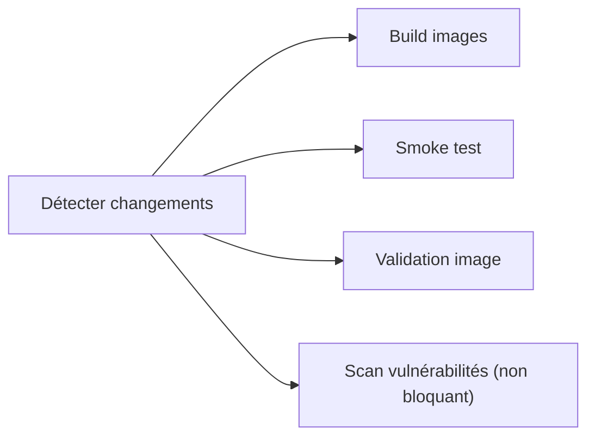
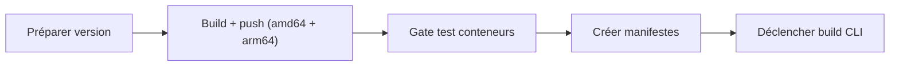

Ce guide couvre le workflow Docker pour les contributeurs qui doivent modifier les Dockerfiles, ajouter des dépendances ou déboguer des problèmes conteneurs.

## Prérequis

| Logiciel                        | Version minimale                    |
| ------------------------------- | ----------------------------------- |
| Docker Desktop ou Docker Engine | 24.0+                               |
| Docker Compose                  | v2.20+ (inclus dans Docker Desktop) |
| Trivy (optionnel)               | dernière version                    |

## Référence rapide

```bash
# Build toutes les images
docker compose build

# Build un seul service
docker compose build platform

# Smoke tests conteneurs (ports non conflictuels)
bun run docker:test

# Validation d'image (pas de secrets, labels OCI, budgets de taille)
bun run docker:test:image

# Scan de vulnérabilités (nécessite Trivy)
bun run docker:test:vulnerability

# Développement local avec hot-reload
docker compose -f compose.yml -f compose.dev.yml up --build
```

## Conventions Dockerfile

### Multi-stage builds

Toutes les images Python et Node.js utilisent des builds multi-stage :

1. **Stage builder** — installer toutes les deps de build, compiler les paquets natifs.
2. **Stage runtime** — copier uniquement les artefacts runtime dans une image base propre.
3. **Stage squash** — `FROM scratch` + `COPY --from=runtime / /` pour aplatir les layers.

Le squash fait que les suppressions dans les étapes de cleanup libèrent vraiment l’espace, au lieu d’ajouter des layers masquants. Ça garde les outils de build (`gcc`, `build-essential`, `libpq-dev`) hors de l’image finale.

> **Important :** Avec `FROM scratch`, toutes les ENV des stages précédents sont perdues et doivent être redéclarées. Les mountpoints de volume doivent aussi être pré-créés dans le stage runtime avant le squash.

### Cache de layers

Ordonne tes `COPY` et `RUN` du moins fréquemment modifié au plus :

```dockerfile
# Bon : les deps changent moins souvent que le code app
COPY pyproject.toml .
RUN uv pip install --system --no-cache-dir .
COPY app/ ./app/
```

### Flags no-cache

Toujours utiliser `--no-cache-dir` (pip/uv) et `--no-install-recommends` (apt-get) :

```dockerfile
RUN apt-get update && apt-get install -y --no-install-recommends curl \
    && rm -rf /var/lib/apt/lists/*
RUN uv pip install --system --no-cache-dir .
```

### Labels OCI

Chaque Dockerfile doit inclure un label de version :

```dockerfile
ARG VERSION=dev
LABEL org.opencontainers.image.version="${VERSION}"
```

### Health checks

Chaque Dockerfile doit inclure une instruction `HEALTHCHECK` :

```dockerfile
HEALTHCHECK --interval=30s --timeout=10s --start-period=40s --retries=3 \
    CMD curl -f http://localhost:8001/health || exit 1
```

## Budgets de taille d’image

Chaque image a un budget de taille. CI échoue si dépassé.

| Service  | Budget   | Actuel    |
| -------- | -------- | --------- |
| Crawler  | 2 100 Mo | ~1 850 Mo |
| RAG      | 600 Mo   | ~515 Mo   |
| Platform | 2 900 Mo | ~2 580 Mo |
| DB       | 1 200 Mo | ~1 060 Mo |
| Proxy    | 100 Mo   | ~88 Mo    |

### Causes courantes d’augmentation

1. **Nouvelle dépendance Python** — vérifie si elle tire de grosses deps transitives.
2. **Nouveaux paquets apt** — utiliser `--no-install-recommends` et nettoyer après.
3. **Strip oublié dans builder** — retirer `__pycache__`, `.pyc`, répertoires de test, symboles debug `.so`.
4. **Pas de multi-stage** — les outils de build doivent rester en stage builder.

### Réduire la taille

```bash
# Voir ce qui prend de la place
docker run --rm -it <image> du -sh /* 2>/dev/null | sort -rh | head -20

# Vérifier les paquets Python
docker run --rm <image> pip list 2>/dev/null || \
docker run --rm <image> python -c "import pkg_resources; [print(f'{p.key}: {p.location}') for p in pkg_resources.working_set]"

# Dive : analyse visuelle des layers
# Installer : https://github.com/wagoodman/dive
dive <image>
```

## Workflow de test

### 1. Build et smoke test

```bash
bun run docker:test
```

Lance `tests/container-smoke-test.sh` qui :

- build les 5 images ;
- démarre les services sur des ports non conflictuels (15432, 18001, 18002, etc.) ;
- attend les health checks ;
- valide les endpoints HTTP ;
- teste la connectivité inter-services ;
- tear down tout (y compris les volumes).

### 2. Validation d’image

```bash
bun run docker:test:image
```

Vérifie pour chaque image :

- label OCI `org.opencontainers.image.version` ;
- user non-root (requis pour platform) ;
- pas de secrets embarqués dans l’env ou le filesystem ;
- instruction `HEALTHCHECK` présente ;
- taille dans le budget.

### 3. Scan de vulnérabilités

```bash
bun run docker:test:vulnerability
```

Lance Trivy contre chaque image. Rapports dans `trivy-reports/`.

Pour supprimer un faux positif connu, ajoute l’ID CVE dans `.trivyignore` :

```
CVE-2023-12345    # false positive: function not reachable
```

## Pipeline CI/CD

### Sur les pull requests (`build.yml`)



### Sur les tags de release (`release.yml`)



Le gate de test conteneurs tire les images fraîchement poussées et lance smoke test + validation image avant création des manifestes.

## Pièges courants

### "parent snapshot does not exist"

Corruption cache Docker BuildKit. Fix :

```bash
docker builder prune -f
```

### Port déjà utilisé

Utilise `compose.test.yml` qui mappe sur des ports non conflictuels :

```bash
docker compose -f compose.yml -f compose.test.yml --env-file .env.test -p tale-test up -d
```

### Paquet Python introuvable à l’exécution

Si un paquet est installé en builder mais pas disponible en runtime, vérifie :

1. Que tu copies depuis le bon chemin : `COPY --from=builder /usr/local/lib/python3.11/site-packages ...`.
2. Que `.dist-info` du paquet n’est pas supprimé si quelque chose dépend des métadonnées à l’exécution.
3. Que le strip ne retire pas des `.so` requis.

### Module Node.js introuvable à l’exécution

Si un module manque après le pruner, vérifie :

1. S’il est listé en `dependencies` (pas `devDependencies`) dans `package.json`.
2. Si le pruner le retire explicitement dans son `rm -rf`.
