Gouvernance est l'endroit où les Admins posent les règles que toute autre surface dans Tale doit suivre. Elle est organisée en quatre groupes visibles depuis la navigation gauche sous **Paramètres > Gouvernance** : contenu et modèles (ce que les agents disent et avec quels modèles), politiques et limites (combien ils dépensent et combien de temps leur sortie est gardée), sécurité et monitoring (la pile de garde-fous à trois étages et le journal d'audit), plus la politique de mot de passe et de connexion. Membres et Éditeurs n'atteignent pas cette page ; Développeurs non plus. Propriétaire et Admin uniquement.

Une page aussi dense existe parce que chaque réglage ici interagit avec les autres — une politique de rétention serrée est inutile à côté d'un budget illimité ; un garde-fou sans journal d'audit ne peut pas être passé en revue. La structure ci-dessous reflète la navigation, de sorte que la doc et l'interface défilent en pas.

## Contenu et modèles

### System prompt

Pose un system prompt obligatoire qui est préfixé (et optionnellement suffixé) aux instructions de chaque agent. Sers-t'en pour faire respecter le ton, le périmètre et les règles de sécurité qu'aucun agent individuel ne peut surcharger. Les deux champs sont **Préfixe obligatoire** et **Suffixe obligatoire** ; ils passent par la même vérification de limite de caractères et sont appliqués avant et après le prompt propre à l'agent à l'exécution.

### Modèles par défaut

Choisis les modèles par défaut de chat, vision, embedding, génération d'image et transcription utilisés quand un utilisateur ou un agent n'en choisit pas un explicitement. Les défauts peuvent être bornés à l'organisation entière, à une équipe, à un rôle ou à un utilisateur précis ; les bornes plus spécifiques l'emportent sur les plus larges. Les modèles viennent de n'importe quel fournisseur configuré — voir [Fournisseurs IA](/fr/platform/admin/providers).

Quand un défaut entre en conflit avec l'allowlist ou la blocklist d'accès aux modèles (ci-dessous), le formulaire fait remonter un avertissement, de sorte que la contradiction de politique soit visible avant l'enregistrement.

### Accès aux modèles

Contrôle quels modèles sont disponibles pour quelles bornes. Sers-toi de l'allowlist pour n'exposer qu'un sous-ensemble curé de modèles frontière au personnel senior, ou de la blocklist pour tenir un modèle coûteux hors d'une équipe junior. Comme les budgets, l'accès aux modèles se compose par borne : les règles utilisateur l'emportent sur les règles équipe, les règles équipe sur les règles rôle, les règles rôle sur le défaut.

## Politiques et limites

### Budgets

Pose des limites de dépense par utilisateur, par équipe, par rôle ou pour l'organisation entière. Chaque règle nomme une période (quotidienne, hebdomadaire, mensuelle), un plafond de tokens ou USD (ou les deux), et un seuil d'avertissement optionnel. L'indication d'override sur le formulaire est le résumé de précédence : **utilisateur > équipe > rôle > défaut**, les limites org s'appliquant toujours comme plafond supplémentaire.

Quand un budget atteint le seuil d'avertissement, la borne concernée voit une bannière in-produit ; quand il atteint le plafond dur, les nouveaux appels de modèle échouent avec une erreur budget visible à l'utilisateur.

### Politique de téléversement {#upload-policy}

Restreins les téléversements de fichiers par extension, type MIME, taille totale et volume total par utilisateur. Utile quand la politique interdit les gros téléversements binaires ou des types de fichiers exécutables précis. Des plafonds par type MIME laissent appliquer une limite plus stricte à une catégorie de contenu — par exemple, `audio/*` à 25 Mo en laissant le plafond global à 100 Mo. Les listes d'extensions comme de types MIME supportent les modes allowlist et blocklist ; la blocklist gagne quand une extension correspond aux deux.

### Rétention

Configure combien de temps chaque type de donnée vit avant suppression automatique. Chaque catégorie — historique de chat, documents, métadonnées de messages, logs de workflow, journaux d'audit, registre d'usage, tentatives de connexion et plusieurs autres — porte sa propre durée de rétention (jours ou heures), un interrupteur `Activé` optionnel et une période de grâce de suppression qui contrôle si la suppression passe par une corbeille ou est immédiate.

Les opérateurs auto-hébergés peuvent borner la rétention org-wide depuis l'environnement, de sorte que la liberté Admin façon Cloud ne viole pas les engagements de conformité — voir [Rétention](/fr/self-hosted/configuration/retention) pour les planchers et plafonds par variable d'env. Quand les bornes opérateur changent, le formulaire affiche une bannière qui exige que l'Admin applique ou refuse les nouvelles bornes avant d'enregistrer quoi que ce soit d'autre.

### Contrôle des fonctionnalités

Active ou désactive des fonctionnalités par borne (utilisateur, équipe, rôle ou défaut). Trois flags de fonctionnalité sont livrés aujourd'hui : **Recherche web**, **Exécution de code** et **Téléversement de fichiers**. Chacune peut être désactivée là où la politique l'exige, et le champ **Tokens de contexte max** plafonne la fenêtre de contexte qu'un agent dans la borne peut utiliser. Les fonctionnalités coupées pour une borne sont cachées de l'interface des utilisateurs touchés ; les réactiver restaure la surface immédiatement.

## Sécurité et monitoring

### Garde-fous

Les garde-fous sont trois couches de filtre que Tale fait tourner en séquence sur chaque message de chat **avant** qu'il n'atteigne le modèle et sur chaque token modèle **avant** qu'il n'atteigne l'utilisateur. Chaque couche se configure indépendamment, et une carte **Aperçu des garde-fous** en lecture seule montre si chaque couche est active. L'ordre est figé :

```mermaid
flowchart LR
  user["L'utilisateur envoie un message"] --> chatFilter["Sécurité du contenu"]
  chatFilter --> pii["Détection PII"]
  pii --> moderation["Fournisseur de modération"]
  moderation --> model["Le modèle génère une réponse"]
  model --> outChatFilter["Sécurité du contenu (sortie)"]
  outChatFilter --> outPii["Détection PII (sortie)"]
  outPii --> outModeration["Fournisseur de modération (sortie)"]
  outModeration --> reply["Tale stream la réponse autorisée"]
```

Un message bloqué n'atteint jamais le modèle, et un token bloqué n'est jamais streamé à l'utilisateur. Chaque décision de garde-fou (autoriser, masquer, bloquer) écrit un événement structuré au journal d'audit ; le texte brut correspondant n'est jamais stocké.

#### Sécurité du contenu

Ouvre **Paramètres > Gouvernance > Sécurité du contenu**. Définis des catégories (par exemple _grossièreté_, _noms de concurrents_, _noms de code confidentiels_), donne à chacune une liste de mots, et choisis un mode d'application — **Flag**, **Masquer** ou **Bloquer**. Bloquer l'emporte sur Masquer, qui l'emporte sur Flag quand plusieurs catégories correspondent au même message. Les catégories tournent comme des correspondances regex rapides avec des garde-fous contre le backtracking catastrophique, de sorte que cette couche ajoute une latence négligeable. Sers-t'en pour des politiques de mots-clés propres à l'organisation que les API publiques de modération ne peuvent pas connaître.

#### Détection PII {#pii-detection}

Détecte les informations personnelles identifiables dans les messages et les pièces jointes. Les patterns intégrés couvrent **courriel, téléphone, carte de crédit, IBAN, adresse IP, SSN US et CVC, date de naissance, adresses postales (43 locales), et pièces d'identité et passeports nationaux** (Personalausweis allemand, NIR français, DNI et NIE espagnols, Codice Fiscale italien, BSN néerlandais, PESEL polonais, National Insurance Number britannique, SIN canadien, PPS irlandais, Aadhaar indien, 身份证 chinois, My Number japonais, RRN coréen, et 30 de plus). Chaque type d'ID utilise la somme de contrôle canonique (ICAO 9303, Luhn, mod-11, Verhoeff, mod-23), de sorte que des chaînes de forme aléatoire ne déclenchent pas de faux positifs. Des règles regex personnalisées laissent ajouter des formats internes (ID employé, numéros de ticket, SKU produits).

Trois modes d'application :

- **Masquer** — remplacer chaque correspondance par un placeholder fixe (`[EMAIL]`, `[PHONE]`). Recommandé pour les journaux d'audit stockés et l'historique de chat où la valeur brute ne sera plus jamais nécessaire. Sens unique : l'original est perdu.
- **Bloquer** — refuser le message entier. Sers-t'en quand la politique interdit tout PII vers les modèles en amont.
- **Tokeniser** — remplacer chaque correspondance par un token stable indexé (`[EMAIL_1]`, `[PHONE_1]`) et tenir une table de restauration par message. Le modèle voit les tokens ; l'utilisateur voit ses détails originaux restaurés dans la réponse. La table reste en mémoire le temps de l'aller-retour et est jetée après — jamais écrite dans les logs.

Un **bac à essai** intégré sous le même écran montre l'aller-retour complet en direct : tape une phrase et regarde la détection, la tokenisation, la réponse IA factice et la restauration en temps réel. Survole un span surligné pour voir le type détecté.

#### Fournisseur de modération

Envoie les messages de chat à un classifieur externe — OpenAI Moderation, Azure Content Safety, Perspective ou n'importe quel endpoint HTTPS personnalisé qui renvoie des scores de catégorie. Choisis un préréglage intégré et l'URL, les en-têtes, le template de requête et le parser de réponse sont remplis ; pour le reste, choisis **JSONPath personnalisé** et mappe les champs à la main. La clé API est stockée chiffrée AES côté serveur et référencée comme `{secretPlaceholder}` dans n'importe quelle valeur d'en-tête. **Tester la connexion** envoie un message d'exemple par le vrai chemin du fournisseur — ça vérifie la clé, l'endpoint, le template de requête, le parser de réponse et les correspondances de catégories en un seul aller-retour sans écrire dans un thread.

Pour la sécurité SSRF, seul l'hôte configuré est contacté ; les redirections vers d'autres hôtes sont rejetées. Les appels concurrents sont rate-limités par organisation, de sorte qu'une rafale de chat ne puisse pas vider ton quota de modération.

### Politique de mot de passe

Configure la longueur minimale du mot de passe, les classes de caractères requises (majuscule, minuscule, chiffre, spécial) et une période de rotation optionnelle. Quand la rotation est active, la fenêtre de grâce commence au moment où la politique est activée pour la première fois, de sorte que les utilisateurs existants ne soient pas forcés de changer tout de suite. La même politique est vérifiée à l'inscription, au changement de mot de passe et à chaque connexion après l'expiration de la rotation.

### Politique de connexion

Verrouille les comptes après des échecs de connexion répétés et fais grandir l'attente entre les tentatives. Le formulaire prend un nombre d'**échecs avant verrouillage**, un **plan de backoff** séparé par virgules en secondes (défaut `1, 10, 60, 600`) et la liste des **proxies de confiance** que Tale utilise pour récupérer la vraie IP du client depuis `X-Forwarded-For`. Les proxies de confiance acceptent des IP individuelles, des plages CIDR et les mots-clés `loopback`, `uniquelocal` et `linklocal`. Les équivalents complets côté opérateur en variables d'env vivent avec le reste de la configuration de déploiement.

### Politique à double facteur

La politique d'application TOTP vit dans sa propre section et est documentée en détail sous [Authentification à double facteur](/fr/platform/admin/two-factor-authentication) — commence là pour la fenêtre de grâce, l'exemption SSO et les événements d'audit.

### Tableau de bord d'usage

Vois la consommation de tokens, les répartitions de coût et les tendances d'usage à l'échelle de l'organisation, filtrées par équipe, utilisateur, modèle, agent ou période. Pour des drill-downs plus profonds (top utilisateurs, top équipes, mix de modèles, métriques de workflow), voir [Analyse d'usage](/fr/platform/admin/usage-analytics).

## Journaux d'audit

Le journal d'audit est un enregistrement ordonné chronologiquement de chaque action significative dans l'organisation. Les catégories incluent **Auth**, **Membre**, **Données**, **Intégration**, **Workflow**, **Sécurité**, **Admin** et **IA**. La table est cherchable et filtrable ; le tiroir de détail affiche acteur, rôle, ressource, cible, état précédent et nouvel état, champs modifiés et métadonnées par événement.

Les Admins peuvent exporter le filtre actif en CSV ou JSON via les boutons au-dessus de la table. Les exports suivent le filtre actif plutôt que le journal entier, de sorte qu'un seul export peut être borné à une catégorie, un acteur ou une ressource.

## Où cela s'insère

Gouvernance est le contrat entre la politique de ton organisation et ce que Tale fait physiquement sur disque. La rétention borne combien de temps les données vivent. Les demandes des personnes concernées te donnent la machinerie RGPD pour l'export et l'effacement. Les holds légaux suspendent la suppression pendant les enquêtes. Le journal d'audit prouve ce qui s'est passé. Chacun de ces réglages, le runner de nettoyage qui applique la rétention les lit au début de chaque exécution.

La configuration que cette page décrit est bornée à l'organisation — les Admins la posent depuis l'interface. Pour les réglages côté opérateur qui gouvernent le runner de nettoyage lui-même (planchers et plafonds des variables d'env, le pepper d'audit pour le hachage PII, le délai de hold légal), [Rétention](/fr/self-hosted/configuration/retention) est la référence. Pour le flux de dépôt RGPD Art. 17 qui s'appuie sur le même runner de rétention, [Demandes des personnes concernées](/fr/platform/admin/data-subject-requests) couvre la boîte et la sémantique du SLA.
