La gouvernance est l’endroit où les Admins définissent les règles d’usage de l’IA dans l’organisation. Elle est organisée en trois groupes accessibles via la navigation de gauche sous **Paramètres > Gouvernance**, plus une page d’audit logs pour la conformité.

## Contenu et modèles

### Prompt système

Définis un prompt système global ajouté en tête de chaque conversation IA dans l’organisation. Utilise-le pour imposer le ton, le périmètre et des règles de sécurité héritées par tous les agents.

### Modèles par défaut

Choisis les modèles par défaut chat, vision et embedding utilisés quand les utilisateurs n’en choisissent pas explicitement. Les modèles viennent de tout fournisseur configuré — voir [Fournisseurs IA](/fr/platform/admin/providers).

### Accès aux modèles

Contrôle quels modèles sont disponibles à des équipes ou utilisateurs précis. Restreins les modèles frontières coûteux à des staffs senior, ou n’expose que des modèles auto-hébergés à une équipe.

## Politiques et limites

### Budgets

Définis des limites de dépenses par utilisateur, par équipe ou pour l’organisation. Configure la période (quotidien, hebdo, mensuel) et l’action en cas de dépassement — avertir, bloquer les nouvelles requêtes ou désactiver le chat.

### Politique d’upload {#upload-policy}

Restreins les téléversements par type, taille ou nombre. Utile pour empêcher de gros uploads binaires ou bloquer des types exécutables. Des plafonds de taille par type MIME permettent d’appliquer une limite plus stricte à certains contenus — par exemple `audio/*` à 25 Mo tout en laissant la limite globale à 100 Mo.

### Rétention

Configure combien de temps les conversations, fichiers téléversés et enregistrements d’audit sont conservés avant suppression automatique. Voir [Rétention](/fr/self-hosted/configuration/retention) pour les valeurs par défaut au niveau environnement qui s’appliquent aux déploiements auto-hébergés.

### Contrôles de fonctionnalités

Active/désactive des fonctionnalités à l’échelle de l’organisation : téléversement de fichiers, recherche web, génération d’image, Mode Arène, etc. Les fonctionnalités désactivées ici sont masquées de l’UI pour tous les utilisateurs.

## Sécurité et monitoring

### Guardrails

Les guardrails sont trois couches de filtrage que Tale exécute en séquence sur chaque message de chat **avant** qu’il atteigne le modèle, et sur chaque token du modèle **avant** qu’il ne parvienne à l’utilisateur. Chaque couche se configure indépendamment dans **Paramètres > Gouvernance > Guardrails** ; une carte en lecture seule **Vue d’ensemble des guardrails** indique quelles couches sont actives. L’ordre est fixe :

```mermaid
flowchart LR
  user["L'utilisateur envoie un message."] --> chatFilter["Tale applique les contrôles de sûreté du contenu."]
  chatFilter --> pii["Tale détecte les données personnelles."]
  pii --> moderation["Tale évalue le message via le fournisseur de modération."]
  moderation --> model["Le modèle génère une réponse."]
  model --> outChatFilter["Tale applique les contrôles de sûreté du contenu aux tokens de sortie."]
  outChatFilter --> outPii["Tale scanne les tokens de sortie pour détecter les données personnelles."]
  outPii --> outModeration["Tale évalue les tokens de sortie via le fournisseur de modération."]
  outModeration --> reply["Tale diffuse la réponse autorisée à l'utilisateur."]
```

Un message bloqué n’atteint jamais le modèle, et un token bloqué n’est jamais transmis à l’utilisateur. Chaque décision (autoriser, masquer, bloquer) écrit un événement structuré dans l’audit log ; le texte brut correspondant n’est jamais stocké.

#### Sécurité du contenu

Ouvre **Paramètres > Gouvernance > Sécurité du contenu**. Définis des catégories (par exemple _grossièretés_, _noms de concurrents_, _noms de code confidentiels_), associe une liste de mots à chacune et choisis un mode d’application — _Désactivé_, _Avertir_, _Masquer_ ou _Bloquer_. Les catégories sont évaluées comme de simples regex protégées contre le backtracking catastrophique, donc la latence de cette couche reste négligeable. C’est la couche idéale pour des règles de mots-clés propres à ton organisation que les API de modération publiques ne peuvent pas connaître.

#### Détection DCP {#pii-detection}

Active la détection automatique des données à caractère personnel dans les messages. Les patterns intégrés couvrent **email, téléphone, carte bancaire, IBAN, adresse IP, SSN, cryptogramme, dates de naissance, adresses postales (43 langues), ainsi que pièces d'identité et passeports nationaux** (Personalausweis, NIR, DNI/NIE, Codice Fiscale, BSN, PESEL, NI Number britannique, NAS canadien, PPS irlandais, Aadhaar, 身份证 chinois, My Number japonais, RRN coréen, et 30+ autres). Chaque type d'identifiant utilise la somme de contrôle canonique (ICAO 9303, Luhn, mod-11, Verhoeff, mod-23) pour éviter les faux positifs sur des chaînes aléatoires. Des regex personnalisées ajoutent des formats internes (matricule, numéros de ticket, références produit). Les DCP détectées dans les pièces jointes passent par la même pipeline que les messages saisis.

Trois modes d'application :

- **Masquer** — remplacer chaque correspondance par un espace réservé fixe (`[EMAIL]`, `[PHONE]`, …). Recommandé pour les journaux d'audit et l'historique de chat conservé, où la valeur d'origine n'est plus nécessaire. Sens unique : l'original est perdu.
- **Bloquer** — rejeter l'intégralité du message. Recommandé lorsque ta politique interdit toute DCP en amont des modèles.
- **Tokeniser** — remplacer chaque correspondance par un jeton indexé stable (`[EMAIL_1]`, `[PHONE_1]`) et conserver une table de restauration par message en mémoire. Le modèle ne voit que les jetons ; la réponse restitue les détails d'origine. Recommandé pour la meilleure expérience utilisateur sans perte de protection. La table de correspondance reste en mémoire le temps du round-trip puis est détruite — jamais journalisée.

Un **playground de test** intégré dans Paramètres → Gouvernance → DCP montre tout le round-trip en direct : tapez une phrase et observez détection → tokenisation → réponse IA simulée → restauration en temps réel. Survolez chaque surlignage pour voir le type de donnée détecté (traduit).

#### Fournisseur de modération

Envoie les messages de chat vers un classifieur externe — OpenAI Moderation, Azure Content Safety, Perspective ou tout endpoint HTTPS qui renvoie des scores par catégorie. Choisis un préréglage intégré et l’URL, les headers, le request template et le response parser sont remplis automatiquement ; pour tout le reste, choisis _Custom JSONPath_ et mappe les champs à la main. La clé API est stockée chiffrée AES côté serveur et se référence comme `{secretPlaceholder}` dans n’importe quel header. Le bouton **Tester la connexion** envoie un message d’exemple via le vrai chemin du fournisseur — il vérifie la clé, l’endpoint, le request template, le response parser et le mapping des catégories en un seul aller-retour, sans écrire dans une conversation.

Pour la protection SSRF, seul l’hôte configuré est contacté ; les redirections vers d’autres hôtes sont refusées. Les appels concurrents sont rate-limités par organisation pour qu’un pic de chat ne sature pas ton quota de modération.

### Tableau de bord d’utilisation

Vois la consommation de tokens, la ventilation des coûts et les tendances d’usage. Filtre par équipe, utilisateur, modèle ou période. Pour une analyse plus poussée, voir [Analyses d’utilisation](/fr/platform/admin/usage-analytics).

## Audit logs

Enregistrement chronologique des actions significatives dans l’organisation. Catégories : événements d’authentification, changements de membres, opérations sur données, mises à jour d’intégrations, publications de workflows, événements de sécurité, actions admin. Utile pour la conformité et le dépannage.

Les admins peuvent exporter les audit logs en **CSV** ou **JSON** depuis les boutons au-dessus de la table. Les exports respectent le filtre de catégorie actif.
