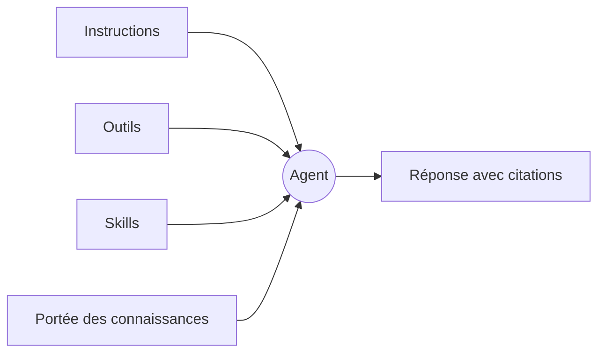

C’est vers un agent que Tale se tourne quand la même question ne cesse de revenir. Il s’agit d’une **persona** plutôt que d’un environnement d’exécution : il dit qui répond — un nom, des instructions, ce qu’il a le droit de solliciter et qui dans l’organisation peut s’en servir — et rien sur la façon dont un tour s’exécute. Les éditeurs et les développeurs les construisent, tous les membres les utilisent.

Cette page te donne le modèle mental que le reste du chapitre présuppose. Lis-la une fois avant de construire ton premier agent, puis reviens-y quand tu ne sais plus si le comportement que tu veux changer tient aux instructions, aux outils, aux skills ou à la portée des connaissances.

Tu préfères regarder d’abord ? L’épisode 4 construit un agent de bout en bout en moins de trois minutes, sous-titres compris.

<Video src="/videos/fr/tutorials/ep4-agent/ep4-agent.fr.mp4" poster="/videos/fr/tutorials/ep4-agent/ep4-agent.fr.webp" captions="/videos/fr/tutorials/ep4-agent/ep4-agent.fr.vtt" lang="fr" title="Épisode 4 — Ton premier agent" caption="Épisode 4 — Ton premier agent (2:42)">

</Video>

## Ce que porte un agent

**L’identité.** Le slug sous lequel l’agent est rangé, le nom affiché sous lequel les gens le rencontrent, une courte description de son objet, et au besoin des versions de ces textes par langue, pour qu’un lecteur allemand ou français tombe sur l’agent dans sa propre langue. Le slug est figé dès que l’agent existe ; le nom affiché, tu le changes chaque fois que le travail se déplace.

**Les instructions.** La prose placée en tête de chaque tour auquel l’agent répond. Garde-la courte, tranchée et concrète : de longues instructions se diluent dans les longues conversations. Nomme la voix, les limites, et les cas où l’agent doit refuser.

**Les outils et les skills.** Deux listes d’autorisation. Les outils nomment les capacités que l’agent peut appeler, et les outils de la plateforme, les intégrations connectées et les automatisations de l’organisation figurent tous dans cette même liste. Les skills nomment les paquets de connaissances qu’il peut déplier, dix au plus. La même règle vaut pour les deux : laisse une liste intacte et l’agent n’est pas restreint, remplis-la et il s’en tient exactement à ce que tu as nommé.

**La portée des connaissances.** Un seul réglage décide quel corpus la recherche de l’agent a le droit de lire : les documents propres à l’organisation, les pages récupérées pour son compte, les deux ensemble, ou rien du tout. La recherche ne part que lorsque l’agent la juge nécessaire, si bien que rien n’atterrit dans une réponse sans qu’il soit allé le chercher.

**La visibilité.** `private`, et seul son propriétaire l’atteint ; `org`, et tous les membres l’atteignent. Un agent privé nomme un propriétaire, faute de quoi personne ne pourrait l’atteindre.

## Ce dont l’agent ne décide pas

Le modèle ne fait pas partie de l’agent. Celui qui compose le tour le choisit explicitement, à chaque fois : le sélecteur du composer range ses entrées sous **Models** et **Sandbox agents**, et rien ne choisit à ta place. Il n’y a ni entrée automatique ni routage derrière. Un agent qui épinglerait un modèle écraserait en silence le choix que quelqu’un vient de faire devant l’écran, alors il n’en porte aucun.

Le même raisonnement écarte plusieurs réglages que tu pourrais chercher. Un agent n’a pas de type : savoir si un tour s’exécute dans une sandbox se règle dans la conversation, et certains accès fournisseur l’imposent. Il ne porte aucun délai d’exécution, parce qu’un plafond appartient à l’hôte qui exécute le tour et non à une persona. Il ne détient ni variables d’environnement ni identifiants propres — ceux-là vivent sur les fiches fournisseur de l’organisation, où ils se font tourner et auditer au même endroit. Et il ne livre aucune amorce toute faite, puisque le composer est le point d’entrée.

## Mis bout à bout — un agent de tri du support

Un premier agent utile, c’est celui du tri du support : il lit la question entrante, répond à ce qu’il peut et transmet le reste. Les décisions :

- Instructions : un paragraphe pour la voix, plus trois cas explicites où il refuse.
- Outils : la recherche web et les outils de conversation. Pas d’exécution de code.
- Skills : le bundle maison pour le ton des réponses, afin que la formulation soit la même partout.
- Connaissances : limitées aux documents de l’organisation, le web collecté reste dehors.
- Visibilité : `org`, pour que toute l’équipe support puisse le choisir dans le composer.

La conversation se déroule ensuite ainsi : ton message arrive, les instructions cadrent la réponse, la recherche trouve les passages qui l’étayent, les outils accordés comblent les trous, et la réponse arrive avec ses citations. Passer la main à un spécialiste n’est pas un interrupteur : cela suit les relations de worker entre agents, décrites dans [Workers d’agent](/fr/platform/agents/delegation).

## Quand y recourir

Un agent seul est la bonne forme tant que la conversation reste dans un domaine et une voix. Tourne-toi vers une [automatisation](/fr/platform/automations/concepts) quand le travail a des étapes fixes et que tu veux des validations ou une planification entre elles ; vers une simple conversation sans agent quand tu explores toi-même une réponse et que les réglages par défaut du modèle suffisent.

| Choisis … quand                                       | Agent | Conversation simple | Automatisation |
| ----------------------------------------------------- | ----- | ------------------- | -------------- |
| La même question revient                              | ✓     |                     |                |
| La voix ou les limites comptent                       | ✓     |                     |                |
| Il faut des validations ou un calendrier entre étapes |       |                     | ✓              |
| Tu explores une réponse une seule fois                |       | ✓                   |                |

## Construis-en un

Un agent, c’est une identité, des instructions, deux listes d’autorisation, une portée de connaissances et une visibilité — change l’un d’eux et tu as changé son comportement, change-en trois et tu as un autre produit. Tout ce qui touche au déroulé d’un tour reste hors de la persona et se décide par conversation. La suite naturelle est [Créer un agent](/fr/platform/agents/create), qui parcourt cet éditeur tab par tab.
