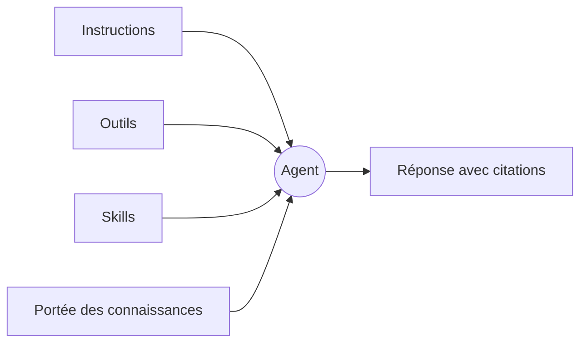

C’est vers un agent que Tale se tourne quand la même question ne cesse de revenir. Il s’agit d’une **persona** plutôt que d’un environnement d’exécution : il dit qui répond — un nom, des instructions, ce qu’il a le droit de solliciter et qui dans l’organisation peut s’en servir — et rien sur la façon dont un tour s’exécute. Dans cette version, une persona est un fichier YAML dans la configuration de l’organisation, servi et modifié par l’API de la plateforme ; aucun écran n’en liste ni n’en modifie une, et le composer du chat n’en propose aucune à choisir. Les agents que tu rencontres à l’écran sont des **agents de projet**, l’équipe nommée de l’onglet **Agents** d’un projet — les mêmes décisions, emballées pour les tâches du tableau.

Cette page te donne le modèle mental que le reste du chapitre présuppose. Lis-la une fois avant d’écrire ton premier fichier de persona ou de doter ton premier projet, puis reviens-y quand tu ne sais plus si le comportement que tu veux changer tient aux instructions, aux outils, aux skills ou à la portée des connaissances.

Tu préfères regarder d’abord ? L’épisode 4 a été enregistré dans l’ancien éditeur d’agent — un écran que cette version ne livre pas —, mais les décisions qu’il parcourt, en moins de trois minutes et sous-titres compris, sont celles qu’une persona porte toujours.

<Video src="/videos/fr/tutorials/ep4-agent/ep4-agent.fr.mp4" poster="/videos/fr/tutorials/ep4-agent/ep4-agent.fr.webp" captions="/videos/fr/tutorials/ep4-agent/ep4-agent.fr.vtt" lang="fr" title="Épisode 4 — Ton premier agent" caption="Épisode 4 — Ton premier agent (2:42)">

</Video>

## Ce que porte un agent

Un fichier de persona porte cinq choses. Chacune est validée à l’enregistrement du fichier, et aucune ne se règle depuis un écran dans cette version — [Agents (vue Admin)](/fr/platform/admin/agents) dit qui peut modifier un fichier et comment la visibilité est appliquée.

**L’identité.** Le slug sous lequel l’agent est rangé — c’est le nom du fichier, figé dès que l’agent existe —, le nom affiché sous lequel les gens le rencontrent, une courte description de son objet, et au besoin des versions de ces textes par langue, pour qu’un lecteur allemand ou français tombe sur l’agent dans sa propre langue. Le nom affiché, tu le changes chaque fois que le travail se déplace.

**Les instructions.** La prose que la persona apporte à chaque tour qu’elle cadre — jusqu’à 20 000 caractères, au niveau racine ou par langue. Garde-la courte, tranchée et concrète : de longues instructions se diluent dans les longues conversations. Nomme la voix, les limites, et les cas où l’agent doit refuser.

**Les outils et les skills.** Deux listes d’autorisation. Les outils nomment les capacités que l’agent peut appeler — jusqu’à cent —, et les outils de la plateforme, les connectors connectés et les automatisations de l’organisation figurent tous dans cette même liste. Les skills nomment les bundles de skills qu’il peut déplier, dix au plus. La même règle vaut pour les deux : omets une liste et l’agent n’est pas restreint, remplis-la et il s’en tient exactement à ce que tu as nommé — une liste vide veut dire rien du tout.

**La portée des connaissances.** Un seul réglage décide quel corpus la recherche de l’agent a le droit de lire : les documents propres à l’organisation, les pages récupérées pour son compte, les deux ensemble (le défaut), ou rien du tout. Chaque corpus appartient à l’organisation elle-même, si bien qu’élargir la portée ne franchit jamais la frontière d’une autre organisation.

**La visibilité.** `private`, et seul son propriétaire l’atteint ; `org`, et tous les membres l’atteignent. Un agent privé nomme un propriétaire, faute de quoi personne ne pourrait l’atteindre ; une persona créée par l’API appartient à son auteur et démarre privée, et la partager est une modification explicite.

## Ce dont l’agent ne décide pas

Le modèle ne fait pas partie de l’agent. Ce choix appartient à qui compose le tour : le sélecteur du composer du chat ne propose que des modèles — il s’ouvre sur **Auto** (Tale choisit un modèle par message, et la réponse enregistre lequel a tourné), avec chaque modèle servi en direct à portée d’épingle. Un agent qui épinglerait un modèle écraserait en silence le choix que quelqu’un vient de faire devant l’écran, alors il n’en porte aucun.

Le même raisonnement écarte plusieurs réglages que tu pourrais chercher. Une persona n’a ni type ni sélecteur de harness : savoir si le travail tourne sur un [harness](/fr/platform/agents/harnesses) de code se décide quand tu crées un **agent de projet** ou un nœud **agent** d’automatisation (les deux nomment le champ **Harness**), et certains accès fournisseur en imposent un. Elle ne porte aucun délai d’exécution, parce qu’un plafond appartient à l’hôte qui exécute le tour et non à une persona. Elle ne détient ni variables d’environnement ni identifiants propres — ceux-là vivent sur les fiches fournisseur de l’organisation, où ils se font tourner et auditer au même endroit. Et elle ne livre aucune amorce toute faite — rien dans cette version ne présente une persona comme point d’entrée du chat.

## Mis bout à bout — un agent de tri du support

Un premier agent utile, c’est celui du tri du support : il lit la question entrante, répond à ce qu’il peut et transmet le reste. Les décisions, que tu les écrives dans un fichier de persona ou dans la boîte de dialogue d’un agent de projet :

- Instructions : un paragraphe pour la voix, plus trois cas explicites où il refuse.
- Outils : aussi peu que le travail le permet — pour un agent qui lit un message et écrit deux lignes, aucun.
- Skills : le bundle maison pour le ton des réponses, afin que la formulation soit la même partout.
- Connaissances : les documents de l’organisation, le web collecté reste dehors — sur un agent de projet, les outils de lecture des connaissances et des documents.
- Visibilité : `org`, pour que toute l’équipe support puisse lire la persona ; un agent de projet appartient à son projet, et quiconque peut le modifier le gère.

L’agent qui tourne réellement dans cette version, c’est l’agent de projet : crée-le dans l’onglet **Agents** du projet avec ces instructions, assigne-lui une tâche, clique sur **Démarrer l'agent** et lis les deux lignes qu’il renvoie en **En revue** — [Construire ton premier agent](/fr/tutorials/editor/first-agent-end-to-end) parcourt exactement cela. Passer la main à un spécialiste n’est pas un réglage de la persona : transmettre du travail, c’est une autre tâche, assignée à un autre agent, comme l’explique [Automatisation des tâches](/fr/platform/projects/task-automation).

## Quand y recourir

Une persona est une configuration qui dit qui répond ; les voies parmi lesquelles tu choisis vraiment sont le chat, un agent de projet et une automatisation. Prends le chat quand tu explores toi-même une réponse — l’assistant intégré cherche et rédige, et ne produit aucun fichier. Prends un agent de projet quand le travail est une tâche dont une personne doit relire le résultat. Prends une [automatisation](/fr/platform/automations/concepts) quand le travail a des étapes fixes et que tu veux des validations ou une planification entre elles.

| Choisis … quand                                       | Chat | Agent de projet | Automatisation |
| ----------------------------------------------------- | ---- | --------------- | -------------- |
| Tu explores une réponse ou veux un brouillon          | ✓    |                 |                |
| Le résultat est un fichier ou un changement à relire  |      | ✓               |                |
| La voix et les limites doivent tenir à chaque fois    |      | ✓               | ✓              |
| Il faut des validations ou un calendrier entre étapes |      |                 | ✓              |

## Construis-en un

Un agent, c’est une identité, des instructions, deux listes d’autorisation, une portée de connaissances et une visibilité — change l’un d’eux et tu as changé son comportement, change-en trois et tu as un autre produit. Tout ce qui touche au déroulé d’un tour reste hors de la persona et se décide dans la voie qui l’exécute : le sélecteur de modèle du composer, le harness et le modèle d’un agent de projet, les réglages d’un nœud d’automatisation. Les agents que tu construis à l’écran sont des agents de projet — [Agents de projet](/fr/platform/projects/project-agents) parcourt la boîte de dialogue champ par champ, et [Agents (vue Admin)](/fr/platform/admin/agents) couvre les fichiers de persona et qui peut les modifier.
