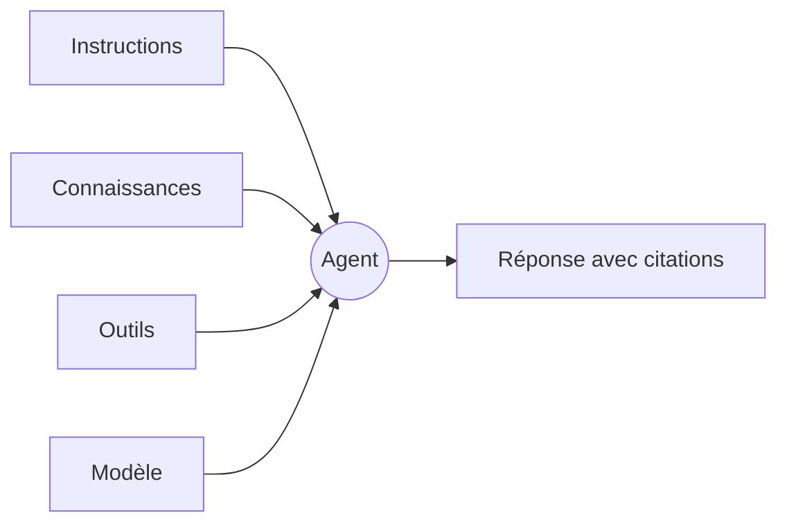

Un agent est l’unité vers laquelle Tale se tourne quand la même question va revenir. C’est la combinaison à quatre boutons — instructions, connaissances, outils et modèle — les quatre choses que tu changes pour faire varier son comportement. Les Éditeurs et les Développeurs les construisent ; les Membres et les autres rôles les exécutent.

Cette page te donne le modèle mental que le reste de la section présuppose. Lis-la une fois avant de construire ton premier agent ; reviens-y quand tu ne sais plus si un comportement à changer vit dans les instructions, les connaissances, les outils ou le modèle.

## Les quatre boutons

Les **instructions** sont le prompt système — la prose qui encadre chaque réponse. Garde-les courtes, opiniâtres et concrètes ; de longues instructions se diluent dans les longues conversations. Précise la voix, les contraintes et les cas de refus.

Les **connaissances** sont ce que l’agent peut récupérer depuis la base de connaissances de l’organisation. Un mode de récupération décide si l’agent cherche à la demande, reçoit les extraits pertinents injectés dans chaque réponse, fait les deux, ou rien — et des interrupteurs de portée décident si les documents d’équipe, les documents d’organisation et les documents téléversés pour l’agent lui-même sont interrogeables. Une connaissance hors de ces portées est invisible pour l’agent — il n’y a pas de tirage implicite sur tout ce que possède l’organisation.

Les **outils** sont ce que l’agent peut faire au-delà de répondre par du texte. L’onglet **Outils** de l’agent est une liste de cases à cocher, outil par outil, groupée par catégorie — données contacts et produits, fichiers, workflows, recherche web, exécution de code, et plus. Active chaque outil individuellement ; chaque outil accordé élargit la frontière de confiance, donc garde la liste courte.

Le **modèle** est le LLM derrière chaque réponse. Les modèles forment une liste ordonnée : la première entrée est le primaire, et les suivantes sont des fallbacks que Tale essaie dans l’ordre quand le primaire est indisponible. Changer de modèle ne ré-entraîne rien — les trois autres boutons de l’agent sont la « mémoire » que le modèle a du travail.

## Les skills comme bundle

Un skill empaquette des instructions — et optionnellement des scripts et des fichiers de référence — dans un bundle réutilisable que tu lies à un agent. Va vers un skill quand le même motif apparaît sur plusieurs agents : une voix d’écriture, un calcul, une tâche en plusieurs étapes. Les skills composent avec les quatre boutons ; un agent peut en lier jusqu’à dix et lit chacun à l’exécution.

La page des skills détaille l’arbitrage entre un skill et des instructions inline : voir [Skills d’agent](/fr/platform/agents/skills).

## Mis bout à bout — un agent de tri du support

Un premier agent utile est celui du tri de support : il lit la question entrante, répond à ce qu’il peut et escalade le reste. Les quatre boutons :

- Instructions : une voix en un paragraphe, plus trois cas de refus explicites.
- Connaissances : la récupération à la demande sur la documentation produit ; rien de téléversé côté agent.
- Outils : la recherche web et les outils de conversation. Pas d’exécution de code.
- Modèle : un primaire capable, avec un fallback moins cher juste après dans la liste.

La conversation coule ensuite : message de l’utilisateur → les instructions cadrent la réponse → la récupération de connaissances trouve les extraits pertinents → les outils comblent les trous → la réponse arrive avec ses citations. Escalader vers un spécialiste n’est pas un interrupteur d’outil — cela suit les relations de délégation entre agents. Voir [Agents workers](/fr/platform/agents/delegation).

## Quand y recourir

Un agent seul est la bonne forme quand la conversation reste dans un domaine et une voix. Va vers une [automatisation](/fr/platform/automations/concepts) quand le travail est multi-étapes et que tu veux des approbations ou de la planification entre les étapes ; va vers un chat brut (sans agent) quand tu explores une réponse toi-même et que les réglages par défaut du modèle suffisent.

| Utilise … quand                                                 | Agent | Chat brut | Automatisation |
| --------------------------------------------------------------- | ----- | --------- | -------------- |
| La même question revient                                        | ✓     |           |                |
| La voix ou les contraintes comptent                             | ✓     |           |                |
| Il te faut des approbations ou de la planification entre étapes |       |           | ✓              |
| Tu explores une réponse une seule fois                          |       | ✓         |                |

## Construis-en un

Les quatre boutons sont ce dont chaque agent Tale est fait : changes-en un et tu as changé le comportement de l’agent, changes-en trois et tu as fabriqué un nouveau produit. La lecture suivante naturelle est [Construis ton premier agent](/fr/tutorials/editor/first-agent-end-to-end) — elle parcourt les quatre boutons de bout en bout sur une instance neuve.
