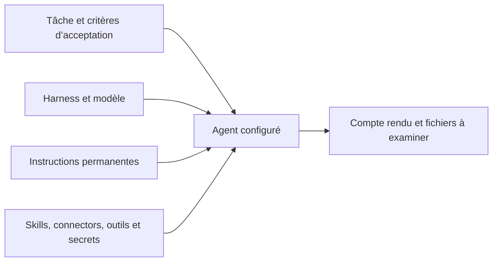

Un agent de projet travaille sur les tâches d’un projet précis. Tu définis son mode d’exécution et ses accès, puis tu lui confies une tâche dont le résultat peut être vérifié. Il peut modifier des fichiers et lancer des commandes dans une sandbox. Une personne examine son travail avant de terminer la tâche.

## Choisir la forme de travail

| Forme | Travail adapté | Ce que tu définis |
| --- | --- | --- |
| Chat | Poser une question, rechercher des connaissances ou rédiger un texte. | Le message, le modèle et, si nécessaire, le contexte du projet. |
| Agent de projet | Examiner un dépôt, préparer des fichiers ou poursuivre une tâche sur plusieurs échanges. | Un agent réutilisable dans le projet. |
| Automatisation | Exécuter des étapes définies, réagir à un événement ou demander une approbation entre deux actions. | Un workflow versionné et ses données d’entrée. |

Un chat de projet utilise toujours l’assistant de chat intégré. Choisir un projet dans Chat ne sélectionne pas un agent du projet. Le nœud agent d’une automatisation possède sa propre configuration.

## Définir une responsabilité précise

Commence par une responsabilité dont tu peux évaluer le résultat, par exemple : « Examine les modifications, recherche les régressions et appuie tes constats sur des preuves. » Place-la dans les instructions permanentes. Le dépôt concerné, les fichiers, les critères d’acceptation et l’échéance appartiennent à chaque tâche.

Un agent appartient à un seul projet. Les personnes qui peuvent lire le projet voient ses agents ; celles qui peuvent le modifier les gèrent tant qu’il est actif. Les noms doivent être uniques dans le projet, qui peut contenir jusqu’à 50 agents. Un autre projet demande une configuration distincte, même si le nom et les instructions sont identiques.

## Comprendre la configuration

| Élément | Ce qu’il détermine | Exemple de décision |
| --- | --- | --- |
| Harness | Le programme de code qui exécute la session dans une sandbox. | Choisir un environnement compatible avec les identifiants disponibles. |
| Modèle et fournisseur | Le modèle appelé et le fournisseur qui le sert. | Choisir une combinaison autorisée pour ce travail. |
| Instructions | La responsabilité et les règles réutilisables, jusqu’à 20 000 caractères. | Exiger des preuves et un compte rendu des vérifications. |
| Skills | Des instructions regroupées avec leurs fichiers complémentaires. | Ajouter la liste de vérification de l’équipe. |
| Connectors et outils | Les services connectés et les opérations autorisées dans Tale. | Accorder l’accès au dépôt et les seuls outils de tâches nécessaires. |
| Secrets | Des identifiants de l’organisation, référencés par nom et fournis à la session. | Utiliser un jeton limité pour un service sans connector. |

Les listes de skills, connectors, outils et noms de secrets acceptent chacune jusqu’à 25 entrées. Accorder un outil d’écriture autorise ses opérations dans les limites de ses règles d’accès. Une instruction demandant de la prudence ne retire pas cette permission. Seuls un Propriétaire ou un Admin peuvent modifier les secrets accordés.

## Vérifier les prérequis avant l’affectation

Les identifiants du fournisseur doivent être compatibles avec le harness et le modèle choisis. Une sandbox doit aussi être disponible. Une réponse réussie dans Chat ne prouve aucune de ces conditions. La tâche doit préciser le résultat attendu et fournir les éléments à examiner.

Une fois ces choix établis, [crée un agent de projet](/fr/platform/projects/project-agents). Le guide d’[automatisation des tâches](/fr/platform/projects/task-automation) explique comment démarrer, guider et examiner son travail.
