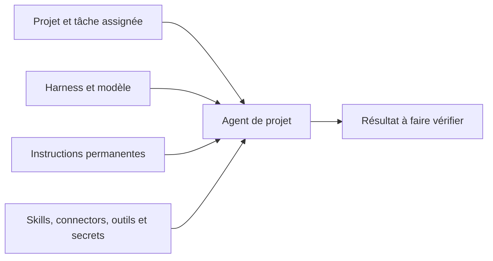

Un agent de projet prend en charge les tâches d’un projet précis. Sa configuration réunit le harness qui exécute le travail, le modèle, les instructions permanentes et l’équipement autorisé. Cette page t’aide à choisir ce dont ton agent a besoin ; [Agents de projet](/fr/platform/projects/project-agents) explique comment le créer et le gérer.

## Définir sa responsabilité

Un agent appartient à un seul projet. Son ID désigne l’agent de ce projet, et une tâche ne peut recevoir qu’un agent du même projet. Chaque projet accueille jusqu’à 50 agents, avec des noms distincts dans ce projet.

La visibilité suit les droits du projet. Les personnes qui peuvent lire le projet voient ses agents ; celles qui peuvent le modifier les gèrent tant que le projet est actif. L’agent n’a pas de réglage distinct de visibilité privée ou à l’échelle de l’organisation.

## Choisir l’exécution

Le **harness** exécute la session de code dans une sandbox ; le **modèle** et son fournisseur déterminent le moteur qui répond. Ces choix font partie de la configuration de l’agent. [Harnesses](/fr/platform/agents/harnesses) présente les environnements d’exécution, et [Fournisseurs](/fr/platform/admin/providers) leurs identifiants.

Les **instructions** permanentes définissent la responsabilité et les limites de l’agent, jusqu’à 20 000 caractères. Pour un agent de revue, précise les points à vérifier, les changements qui demandent une décision et la forme du compte rendu. Garde les exigences propres à une tâche dans cette tâche pour réutiliser l’agent sur la suivante.

## Donner l’équipement utile

Les **skills** apportent des documents de référence, les **connectors** donnent accès aux services connectés et les **outils** autorisent des opérations sur la plateforme. Chaque liste accepte jusqu’à 25 entrées. Accorde les capacités nécessaires au travail ; autoriser un outil d’écriture permet ses modifications dans le cadre de ses règles d’accès.

Les **secrets** désignent des noms de secrets de l’organisation, jusqu’à 25 par agent. Seuls les Propriétaires et Admins de l’organisation peuvent modifier ces autorisations. Les valeurs restent chiffrées dans le stockage des secrets ; la configuration porte leurs noms, et l’exécution reçoit les valeurs autorisées.

## Réunir ces choix

Un agent de revue peut travailler avec un harness de code, un modèle servi par un fournisseur approuvé, le skill de revue de l’équipe et le connector du dépôt. Ses instructions lui demandent de signaler les défauts avec des preuves. Il traite une tâche de son projet, puis remet le résultat à une personne pour vérification. Un autre projet doit avoir son propre agent, même si le nom et les instructions sont identiques.

## Choisir la forme de travail

| Utilise | Pour obtenir |
| --- | --- |
| Le chat | Un échange avec l’assistant intégré pour des questions, des recherches ou un brouillon. |
| Un agent de projet | Un exécutant configuré pour une tâche de projet dont une personne vérifie le résultat. |
| Une automatisation | Des étapes définies, une planification ou des approbations entre étapes. |

Le chat direct utilise l’assistant intégré. Lui donner le contexte d’un projet ne sélectionne pas un agent de projet ; le nœud agent d’une automatisation possède sa propre configuration d’exécution.

## Constituer l’équipe du projet

Choisis d’abord le projet et la tâche, puis adapte l’exécution, les instructions et l’équipement de l’agent. [Agents de projet](/fr/platform/projects/project-agents) décrit la création, [Agents côté administration](/fr/platform/admin/agents) les droits de modification et la [Référence API](/fr/develop/api-reference#gerer-les-agents-dun-projet) la gestion depuis une intégration.
