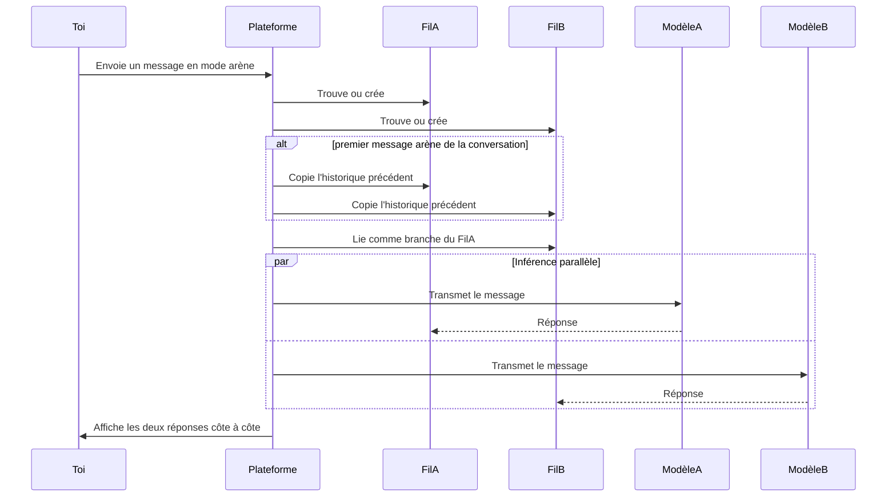

Le Mode Arène envoie le même message à deux modèles IA en même temps et rend les réponses dans une vue divisée. Sers-t'en pour évaluer un modèle candidat face à ton modèle par défaut, pour réunir des données de préférence à l'échelle de l'équipe avant un déploiement de modèle, ou pour montrer pourquoi un modèle gère une classe de prompts mieux qu'un autre. Tout Membre avec accès au chat peut lancer le Mode Arène ; les menus déroulants de modèle sont filtrés sur ce que l'organisation a configuré dans [Fournisseurs IA](/fr/platform/admin/providers) et sur ce que l'agent actif prend en charge.

Cette page couvre l'exécution : activer le mode, la vue divisée, enregistrer un verdict, et comment l'inférence parallèle fonctionne sous le capot.

## Activer le Mode Arène

Ouvre une conversation et clique sur l'icône **Épées** dans la barre d'outils — l'icône s'allume quand le Mode Arène est actif. Deux menus déroulants de modèle apparaissent au-dessus de la saisie, étiquetés **Modèle A** et **Modèle B** avec **vs** entre les deux. Choisis un modèle de chaque côté et envoie un message ; les deux réponses se diffusent dans une vue divisée. Pour rebasculer le mode, re-clique sur l'icône Épées — tout l'état arène (choix de modèles, fils, verdict) s'efface.

Le Mode Arène a besoin d'au moins deux modèles disponibles dans l'ensemble de fournisseurs de l'organisation. Si un seul modèle de chat est configuré, les menus de modèle sont masqués et la bascule désactivée — ajoute d'abord un second fournisseur dans [Fournisseurs IA](/fr/platform/admin/providers).

## La vue divisée

Après l'envoi d'un message, la zone de chat se divise en deux colonnes. La colonne de gauche diffuse la réponse du fil du Modèle A ; celle de droite diffuse celle du Modèle B. Chaque colonne porte un en-tête avec le nom du modèle ; les deux défilent indépendamment et prennent en charge toutes les fonctionnalités du chat, y compris les approbations, les pièces jointes et les actions sur les messages. Continue à envoyer des messages dans la même vue et chaque nouveau message part en parallèle aux deux modèles.

## Enregistrer un verdict

Une fois que les deux modèles ont répondu, une barre de verdict apparaît sous la vue divisée. Quatre options :

| Verdict              | Effet                                                                    |
| -------------------- | ------------------------------------------------------------------------ |
| **A est meilleur**   | Enregistre le Modèle A comme la réponse préférée.                        |
| **B est meilleur**   | Enregistre le Modèle B comme préféré et fait du Fil B la branche active. |
| **Égalité**          | Enregistre que les deux réponses se valent.                              |
| **Les deux mauvais** | Enregistre qu'aucune des deux réponses n'était satisfaisante.            |

Les verdicts sont stockés comme retour avec le choix du verdict et les deux IDs de modèle. Une fois enregistré, les boutons de verdict sont désactivés pour ce tour de comparaison, donc chaque paire reçoit un seul jugement. Les verdicts s'accumulent comme données de préférence — ton tableau de bord d'analyse d'usage fait remonter les victoires en tête-à-tête par paire et les classements de modèles agrégés dans le temps.

## Comment marche l'inférence parallèle

Quand tu envoies un message en Mode Arène, la plateforme crée deux fils séparés (ou réutilise les fils arène existants), copie l'historique de la conversation dans les deux si c'est le premier message arène de la conversation, lie le Fil B comme branche du Fil A, et transmet le même message aux deux modèles en parallèle. Aucun modèle ne voit la sortie de l'autre, donc le verdict reflète ce que chaque modèle a produit indépendamment.

Le lien de branche, c'est ce qui te laisse garder la réponse gagnante : quand tu choisis **B est meilleur**, le Fil B devient la branche active et les messages non-arène qui suivent continuent à partir de lui.

## Où ça s'inscrit

Le Mode Arène est la surface d'évaluation à l'intérieur du chat — le chemin le plus court entre « je veux savoir comment ces deux modèles se comparent sur mes vrais prompts » et un verdict enregistré. Sers-toi des verdicts qu'il produit pour décider quel modèle tu attribues comme préréglage **Standard** dans [Fournisseurs IA](/fr/platform/admin/providers) et quel modèle chaque agent utilise dans [Créer un agent](/fr/platform/agents/create). Pour les tendances agrégées, le tableau de bord d'analyse d'usage affiche les verdicts arène groupés par paire et par agent.
