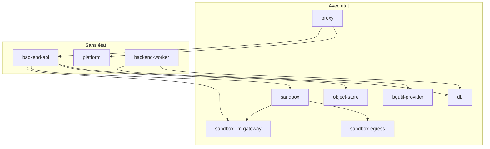

Cette page est ce qu’une stack doit reproduire quand tu écris Compose ou Kubernetes toi-même au lieu de lancer `tale deploy` : quels services tiennent l’état, les noms DNS, les sondes, les volumes. Le chemin CLI reste dans [Démarrage rapide](/fr/self-hosted/install/quickstart) et [Montées de version](/fr/self-hosted/operate/upgrades).

## Quand ce chemin est le bon

Prends la CLI quand tu peux la faire tourner. Prends cette page quand tu écris Compose, ou quand tu maps le même contrat sur Kubernetes.

| Cette page quand | La CLI quand |
| ---------------- | ------------ |
| Tu écris le compose de production, ou un mapping cluster — air-gap, automation déjà en place, pas de CLI sur l’hôte | [Démarrage rapide](/fr/self-hosted/install/quickstart) plus `tale deploy` quand tu veux le blue-green, `tale backup` et `tale rollback` |

Il n’existe pas de chart Helm officiel.

## Avec état et sans état

Dix services, deux sortes. Les services avec état tiennent les disques et l’identité fixe — tu les recrées, tu perds des données ou le DNS casse. Les services sans état sont des replicas interchangeables d’une image ; tu les recrées sur place à l’upgrade. Un seul fichier compose est le défaut. Des fichiers séparés ou Kubernetes t’appartiennent, tant que les noms DNS, le réseau sandbox isolé et l’ordre de démarrage restent.



`sandbox-llm-gateway` est le chemin harness : l’api le provisionne, et un conteneur de session l’atteint sous `llm-gateway`. `bgutil-provider` est le sidecar PO-token YouTube du worker, en best-effort — l’ingest de liens vidéo se dégrade sans lui.

Les trois services sans état partagent une image (`ghcr.io/tale-project/tale/tale-platform:<version>`). `TALE_ROLE` choisit `api` ou `worker` au boot ; l’étage web est la même image sans ce rôle. Épingle chaque image `tale-*` sur le même tag de release pour que les contrats de wire ne dérivent pas.

| Sorte | Services |
| ----- | -------- |
| Avec état | `proxy`, `db`, `object-store`, `sandbox`, `sandbox-egress`, `sandbox-llm-gateway`, `bgutil-provider` |
| Sans état | `platform`, `backend-api`, `backend-worker` |

## Les images

Chaque image `tale-*` est publiée sur la GitHub Container Registry sous le même tag de release, un seul numéro de version épingle donc toute la stack. Deux services tournent sur des images upstream qui ont leurs propres versions.

| Service | Image |
| ------- | ----- |
| `platform`, `backend-api`, `backend-worker` | `ghcr.io/tale-project/tale/tale-platform:<version>` |
| `proxy` | `ghcr.io/tale-project/tale/tale-proxy:<version>` |
| `db` | `ghcr.io/tale-project/tale/tale-db:<version>` |
| `sandbox` | `ghcr.io/tale-project/tale/tale-sandbox:<version>` |
| `sandbox-egress` | `ghcr.io/tale-project/tale/tale-sandbox-egress:<version>` |
| `sandbox-llm-gateway` | `ghcr.io/tale-project/tale/tale-sandbox-llm-gateway:<version>` |
| `object-store` | `minio/minio:RELEASE.2025-04-22T22-12-26Z` |
| `bgutil-provider` | `brainicism/bgutil-ytdlp-pot-provider:1.3.1` |

Une image n’est pas un service compose : le spawner crée chaque conteneur de session depuis `ghcr.io/tale-project/tale/tale-sandbox-runtime:<version>`, et son défaut intégré est le tag local que construit la stack de développement — un hôte qui ne l’a jamais construit nomme l’image de la registry dans `SANDBOX_RUNTIME_IMAGE`, sinon `Run code`, le rendu web et la génération de documents échouent tous sur une image introuvable. Récupère cette image toi-même avant le premier `up`. Le spawner la préchauffe au boot et ne répond sur `:8003` qu’une fois le pull terminé : sur un hôte froid, la sandbox reste donc en `starting` le temps que plusieurs gigaoctets arrivent — c’est exactement pour ça que `tale deploy` la récupère avant la stack.

Chaque exemple ci-dessous lit son tag depuis une seule variable, pour qu’une stack ne finisse jamais avec une api 0.5.11 à côté d’un proxy 0.5.9 :

```bash
# .env — the one line that pins all seven tale-* images
VERSION=0.5.11
```

`0.5.11` est la release contre laquelle cette page a été écrite, pas une recommandation. Installe la courante : son numéro est sur la page [latest release](https://github.com/tale-project/tale/releases/latest), et c’est ce numéro qui va dans `VERSION`. Compose la substitue depuis le `.env` du répertoire projet — le même fichier qui porte tes secrets.

## Les services sans état

Le fichier ci-dessous, ce sont les trois rôles sans état — alias, `/ping` en liveness, `TALE_ROLE`, `NET_ADMIN`. Pose les services avec état dans le même fichier ou ailleurs ; les tableaux de cette page disent ce qu’ils doivent encore faire. Épingle le tag d’image et remplis `.env` depuis la [Référence d’environnement](/fr/self-hosted/configuration/environment-reference).

```yaml
# Stateless app tier. No container_name: --scale needs free names.
# Add db, proxy, sandbox, … in this file or another — your call. In one file,
# add depends_on: { db: { condition: service_healthy }, … } as well.
services:
  platform:
    image: ghcr.io/tale-project/tale/tale-platform:${VERSION}
    env_file: [.env]
    volumes: ['config-data:/app/data:ro']
    restart: unless-stopped
    stop_grace_period: 45s
    healthcheck:
      test:
        [
          'CMD-SHELL',
          'curl -sf http://localhost:3000/api/health && [ -f /tmp/platform-ready ]',
        ]
      interval: 5s
      timeout: 3s
      retries: 3
      start_period: 180s
    networks:
      internal:
        aliases: [platform]
  backend-api:
    image: ghcr.io/tale-project/tale/tale-platform:${VERSION}
    environment:
      TALE_ROLE: api
      PORT: '3005'
      TALE_CONFIG_DIR: /app/data
      DATABASE_URL: postgresql://tale:${DB_PASSWORD}@db:5432/tale_app
      SANDBOX_URL: http://sandbox:8003
      SANDBOX_HTTP_API_BASE_URL: http://backend-api:3005
      OBJECT_STORE_ENDPOINT: http://object-store:9000
    env_file: [.env]
    volumes: ['config-data:/app/data']
    cap_add: [NET_ADMIN]
    restart: unless-stopped
    healthcheck:
      test: ['CMD-SHELL', 'curl -sf http://localhost:3005/ping']
      interval: 10s
      timeout: 3s
      retries: 3
      start_period: 30s
    networks:
      internal:
        aliases: [backend-api]
      sandbox:
        aliases: [backend-api]
  backend-worker:
    image: ghcr.io/tale-project/tale/tale-platform:${VERSION}
    environment:
      TALE_ROLE: worker
      TALE_CONFIG_DIR: /app/data
      DATABASE_URL: postgresql://tale:${DB_PASSWORD}@db:5432/tale_app
      SANDBOX_URL: http://sandbox:8003
      SANDBOX_HTTP_API_BASE_URL: http://backend-api:3005
      OBJECT_STORE_ENDPOINT: http://object-store:9000
    env_file: [.env]
    volumes: ['config-data:/app/data']
    cap_add: [NET_ADMIN]
    restart: unless-stopped
    healthcheck: { disable: true }
    networks: [internal]
volumes:
  config-data:
networks:
  internal:
  sandbox:
    name: tale-sandbox-net
    internal: true
    enable_ipv6: false
```

Il n’existe pas de compose de production versionné à recopier. La CLI génère une paire de fichiers et l’efface après `up`. Ton fichier n’a pas à lui ressembler.

## Les secrets que tu génères avant le premier boot

`tale init` génère chaque secret et écrit le `.env` ; sans la CLI, ce travail est le tien. La [Référence d’environnement](/fr/self-hosted/configuration/environment-reference) dit ce que fait chaque variable — les cinq ci-dessous sont celles qu’une stack montée à la main oublie le plus souvent, parce que le fichier d’exemple les laisse commentées pour que la CLI les remplisse.

| Variable | Valeur | Ce qui casse sans elle |
| -------- | ------ | ---------------------- |
| `SANDBOX_TOKEN` | `openssl rand -hex 32` | Le spawner s’arrête au démarrage. Il tient le socket docker de l’hôte et répond à chaque conteneur de session, il n’a donc pas de mode non signé ; le backend signe chaque appel au spawner avec la même valeur. |
| `OBJECT_STORE_ACCESS_KEY` | `tale`, ou un nom à toi | Le backend logue `object store (skipped)` au boot et refuse chaque upload. Il n’existe pas de défaut d’image pour elle — l’utilisateur root du store porte la même valeur. |
| `OBJECT_STORE_SECRET_KEY` | `openssl rand -hex 32` | Même saut, même silence. Une rotation plus tard rend orphelins tous les blobs déjà écrits sous l’ancien credential. |
| `OBJECT_STORE_PUBLIC_ENDPOINT` | ton `SITE_URL` | Les uploads échouent dans le navigateur avec une erreur réseau : l’URL présignée que le backend distribue pointe vers le `http://object-store:9000` interne, qu’aucun navigateur ne joint. |
| `SANDBOX_LLM_GATEWAY_ADMIN_PASSWORD` | `openssl rand -hex 32` | Chaque run d’agent échoue sur « the agent run could not start ». L’API de management de la gateway est présente sur le réseau sandbox, donc le backend ne l’appelle jamais anonymement — et sans appel de management, pas de clé virtuelle de session, donc aucun tour de harness ne démarre. Le nom d’utilisateur vaut `admin` par défaut (`SANDBOX_LLM_GATEWAY_ADMIN_USERNAME`). |

L’endpoint public se pose avant de démarrer, pas après. Le backend seede la connexion blob par défaut du déploiement dans le volume de config au premier boot (`default/object-storage/connection.json`) et ne réécrit jamais un défaut déjà présent — poser la variable sur une instance déjà démarrée ne change donc rien. Pour réparer une instance dans cet état, ajoute `"publicEndpoint": "<ton SITE_URL>"` dans ce fichier et redémarre le backend.

Le mot de passe de la gateway est l’autre qu’il faut poser juste du premier coup. La gateway le hashe dans son propre volume `llm-gateway-data` à la première utilisation et vérifie contre ce hash ensuite : une valeur changée plus tard laisse le backend sur un 401 dont il ne se sort pas. Le retour en arrière consiste à effacer ce volume, et donc toutes les clés virtuelles qu’il contient.

## Réseaux et noms DNS

Deux réseaux Docker portent chaque saut. Un réseau compose ordinaire suffit pour le plan interne. Le pont sandbox doit s’appeler `tale-sandbox-net` et être `internal` pour que le spawner puisse `docker run --network tale-sandbox-net` et qu’un conteneur de session ne joigne pas Internet sans passer par `sandbox-egress`. Un pont sans `internal` est un chemin ouvert vers l’extérieur.

| Nom que le processus résout | Qui répond | Réseaux |
| --------------------------- | ---------- | ------- |
| `backend-api` | Chaque replica api saine encore attachée | `internal`, `sandbox` |
| `platform` | Chaque replica d’étage web saine encore attachée | `internal` |
| `knowledge-db` | Le service `db` (la production replie le corpus dans le même Postgres) | `internal` |
| `object-store` | MinIO | `internal` |
| `sandbox` | Le spawner sandbox | `internal`, `sandbox` |
| `sandbox-egress` | Le proxy d’egress | `internal`, `sandbox` |
| `llm-gateway` | `sandbox-llm-gateway` | `internal`, `sandbox` |
| `HOST` (ton hostname public) | `proxy`, pour qu’un conteneur puisse faire un hairpin vers l’URL publique | `internal` |

Les workers n’ont pas d’alias partagé. Rien n’adresse un worker par nom ; ils ne font que prendre des jobs dans la queue. Les alias suffixés par une couleur (`backend-api-blue`, `platform-green`) ne servent que pour un blue-green pendant que deux versions tournent à la fois.

Le proxy envoie les voies API app vers `backend-api:3005` (`BACKEND_UPSTREAM`). Il envoie `/api/health` et la SPA vers `platform:3000`, et il sonde `platform` sur `/api/health`. Fais échouer cette sonde sur une replica web en drain et Caddy marque tout le site down.

## Volumes

Nomme ces volumes logiques dans ton compose. Un seul fichier peut laisser compose les créer. Marque-les external seulement si quelque chose hors de ce fichier doit monter les mêmes disques.

| Volume | Qui le monte | Ce qu’il tient |
| ------ | ------------ | -------------- |
| `config-data` | Backend en lecture-écriture, platform en lecture seule, sandbox en lecture seule sous `/app/platform-config` | Config d’org : agents, skills, fournisseurs, gouvernance, SSO, branding |
| `db-data` | `db` sous `/var/lib/postgresql/data` | `tale_app` et `tale_knowledge` |
| `db-backup` | `db` sous `/var/lib/postgresql/backup` | Cible de backup Postgres dans le conteneur |
| `object-store-data` | `object-store` sous `/data` | Blobs |
| `caddy-data`, `caddy-config` | `proxy` | Certificats et état Caddy |
| `llm-gateway-data` | `sandbox-llm-gateway` sous `/app/data` | Clés virtuelles par session |

Les instances montées depuis avant 0.5.11 peuvent encore avoir un volume `convex-data` à côté de `config-data`. La CLI copie le magasin une fois et ne supprime jamais l’ancien volume. Un premier boot écrit à la main sur un hôte neuf n’a pas besoin de `convex-data`.

## Sondes de santé

Liveness et readiness sont deux questions différentes. Les mélanger coupe une replica en drain du DNS avant la fin du travail en vol, ou garde une replica pas prête dans le pool.

La colonne commande est ce qu’exécute la stack livrée — chacune utilise un client qui existe vraiment dans cette image.

| Service | Sonde | Ce qu’elle veut dire |
| ------- | ----- | -------------------- |
| `backend-api` | `curl -sf http://localhost:3005/ping` | Liveness. Reste 200 pendant que la replica draine. Docker et Caddy s’en servent. |
| `backend-api` | `GET /ready` sur `:3005` | Readiness. 503 dès que cette replica draine. Le déploiement pose la question ; Docker et Caddy non. |
| `platform` | `curl -sf http://localhost:3000/api/health && [ -f /tmp/platform-ready ]` | Prête à servir la SPA. Garde ça à 200 tant que la replica tient encore l’alias `platform`. |
| `backend-worker` | Aucune | Le worker n’expose pas de HTTP. Désactive le healthcheck web cuit dans l’image, sinon la replica lit unhealthy en permanence. |
| `proxy` | `curl -sf http://127.0.0.1:2020/health` | Santé admin de Caddy. |
| `db` | `pg_isready -U tale && [ -f /tmp/.db_ready ]` | Postgres accepte les connexions et l’init est fini (base de connaissances et extensions). `start_period` 120s. Arrête le conteneur avec `SIGINT`, pas `SIGTERM`. |
| `object-store` | `mc ready local` | MinIO accepte les écritures. |
| `sandbox` | `curl -fsS http://127.0.0.1:8003/health` | Le spawner est up. `start_period` 15s une fois l’image runtime sur l’hôte — assez longue pour couvrir le pull sinon. Ne publie pas ce port sur un hôte public. |
| `sandbox-egress` | `nc -z 127.0.0.1 3128` | tinyproxy écoute. Ne sonde pas un hôte externe. |
| `sandbox-llm-gateway` | `wget -q -O /dev/null http://127.0.0.1:8080/health` | La gateway est up. L’image embarque le `wget` de busybox et pas `curl`. |

Deux d’entre elles punissent la supposition évidente, et les deux échouent d’une façon qui désigne le mauvais conteneur. Une sonde `curl` sur la gateway sort en 127 (`/bin/sh: curl: not found`) et le conteneur ne quitte jamais `starting`, alors qu’il sert depuis le début ; comme `sandbox` et `backend-api` l’attendent avec `condition: service_healthy`, `docker compose up` abandonne sur `dependency failed to start`, sur une stack où rien n’est cassé. La sandbox a la même forme pour une autre raison : tant qu’elle préchauffe l’image runtime, elle reste muette sur `:8003` — une `start_period` calibrée pour un hôte chaud la marque unhealthy au premier boot d’un hôte froid.

## Env que Compose doit injecter

La [Référence d’environnement](/fr/self-hosted/configuration/environment-reference) est chaque variable que le processus lit depuis `.env`. Les lignes ci-dessous sont ce que le fichier compose doit poser lui-même — les défauts de l’image pointent le processus vers le mauvais hôte.

| Nom | Valeur sur une stack de production |
| --- | ---------------------------------- |
| `TALE_ROLE` | `api` sur `backend-api`, `worker` sur `backend-worker`. Unset sur `platform`. |
| `PORT` | `3005` sur l’api. Le défaut `BACKEND_UPSTREAM` du proxy est `backend-api:3005`. |
| `TALE_CONFIG_DIR` | `/app/data` |
| `DATABASE_URL` | `postgresql://tale:${DB_PASSWORD}@db:5432/tale_app` |
| `SANDBOX_URL` | `http://sandbox:8003` |
| `SANDBOX_HTTP_API_BASE_URL` | `http://backend-api:3005` |
| `OBJECT_STORE_ENDPOINT` | `http://object-store:9000` |
| `SANDBOX_EGRESS_NETWORK` | `tale-sandbox-net` |
| `SANDBOX_EGRESS_PROXY` | `http://sandbox-egress:3128` |
| `SANDBOX_TOKEN` | La même valeur partout. `sandbox` ne démarre pas sans lui ; le backend signe ses appels au spawner avec. |
| `SANDBOX_RUNTIME_IMAGE` | `ghcr.io/tale-project/tale/tale-sandbox-runtime:<version>` sur `sandbox`. Le défaut est un tag de build local qu’un hôte de production n’a pas. |
| `BACKEND_UPSTREAM` | `backend-api:3005` sur `proxy`. |
| `OBJECT_STORE_UPSTREAM` | `object-store:9000` sur `proxy`, pour que les URL présignées soient relayées sous `/<bucket>/*`. |
| `OBJECT_STORE_BUCKET` | `tale-blobs` par défaut. Si tu le renommes, le même nom doit atteindre `proxy` et les deux rôles backend. |
| `MINIO_ROOT_USER`, `MINIO_ROOT_PASSWORD` | Sur `object-store` : le store lit ses propres noms, mappe donc `OBJECT_STORE_ACCESS_KEY` et `OBJECT_STORE_SECRET_KEY` dessus. |
| `TALE_DB_ROLE` | Unset sur la `db` repliée. Le rôle par défaut crée `tale_knowledge` et applique les migrations du corpus ; `platform` les saute et laisse le corpus sans tables. |

## Capacités et mounts qui cassent s’ils manquent

Ils ont l’air optionnels et échouent fermés quand ils manquent.

| Service | Doit avoir | Ce qui casse sans |
| ------- | ---------- | ----------------- |
| `backend-api`, `backend-worker` | `cap_add: [NET_ADMIN]` | L’entrypoint ne peut pas poser la barrière iptables SSRF (IMDS, link-local, RFC1918). |
| `sandbox-egress` | `cap_drop: [ALL]` puis `NET_ADMIN`, `DAC_OVERRIDE`, `CHOWN`, `SETUID`, `SETGID`, `NET_BIND_SERVICE` | Pas de barrière IMDS/RFC1918 ; tinyproxy ne peut ni binder ni abandonner ses privilèges. |
| `sandbox` | `/var/run/docker.sock` et `/var/lib/tale-sandbox` montés en bind 1:1 | Le spawner ne peut pas créer les conteneurs de session ; les chemins workspace que le daemon monte ne correspondent pas. |
| `db` | `stop_signal: SIGINT`, `stop_grace_period: 60s`, `shm_size: 256mb` | Un arrêt `SIGTERM` qui attend les clients finit en `SIGKILL` et peut laisser l’index BM25 avec une page à zéro. |
| `platform` | `stop_grace_period: 45s` | La grâce Docker par défaut de 10s envoie `SIGKILL` à l’étage web au milieu du drain et coupe le HTTP/SSE en vol. |
| `object-store` | Aucun port publié | Les URLs présignées passent par le proxy. Publier MinIO est une surface publique en plus. |

Ne publie que `80` et `443` sur `proxy`. Tout le reste reste sur le réseau interne.

## Ordre de démarrage

Monte les stores d’abord, puis le plan sandbox, puis l’étage app. Une api qui démarre avant que `db` et `object-store` soient sains crash-loop sur `ENOTFOUND` et sur une base manquante. Dans un seul fichier, `depends_on` avec `service_healthy` suffit.

```bash
# The pull is not a compose command, so it needs the tag .env pins in this
# shell too.
VERSION=$(sed -n 's/^VERSION=//p' .env)

# Not a compose service, and the spawner blocks on it at boot — pull it first so
# the sandbox probe is not waiting on several gigabytes.
docker pull "ghcr.io/tale-project/tale/tale-sandbox-runtime:$VERSION"

docker compose up -d
# Wait until db, object-store, proxy, sandbox, sandbox-egress, sandbox-llm-gateway
# report healthy. bgutil-provider is best-effort — YouTube ingest degrades without it.
```

Donne à chaque service une politique de redémarrage (`restart: unless-stopped`). Rien d’autre ne ramène un conteneur après un reboot de l’hôte ou un kill OOM, et une stack qui boote une fois et plus jamais est la panne que les opérateurs trouvent des semaines plus tard.

Les migrations de schéma tournent dans le backend au boot, sous un verrou advisory. Il n’y a pas d’étape migrate à part. Une replica qui ne peut pas appliquer une migration ne démarre pas ; laisse l’ancienne api tourner jusqu’à ce que la nouvelle soit saine.

## Kubernetes

Pas de chart Helm, pas de manifeste officiel. Mappe le contrat Docker ; n’invente pas une seconde architecture.

| Docker | Cluster |
| ------ | ------- |
| Sans état `platform`, `backend-api`, `backend-worker` | Deployments. Même image ; `TALE_ROLE` choisit le processus. Ce sont ceux que tu scales. |
| Avec état `db`, `object-store`, `proxy`, plan sandbox | StatefulSets (ou équivalent) plus les volumes de cette page. Ne fais pas tourner deux écrivains contre un seul disque. |
| Noms DNS compose (`backend-api`, `platform`, `knowledge-db`, `sandbox`, `llm-gateway`, …) | Services avec ces noms. Le proxy et le sandbox les résolvent. |
| `tale-sandbox-net` marqué `internal` | Une NetworkPolicy (ou un CNI isolé) qui bloque un pod de session vers Internet sauf par `sandbox-egress`. |
| `GET /ping` sur l’api | Liveness. Reste 200 pendant que la replica draine. |
| `GET /ready` sur l’api | La question de readiness de ton rollout. Ne pointe pas le Service sur `/ready` si tu draines. |
| `docker.sock` sandbox et `/var/lib/tale-sandbox` montés en bind 1:1 | La partie dure. Le spawner crée les conteneurs de session ; le chemin workspace que le daemon monte doit matcher le chemin dans le spawner. Un cluster sans socket Docker (ou un équivalent) ne peut pas faire tourner le plan sandbox. |
| `cap_add: [NET_ADMIN]` sur le backend | La barrière iptables SSRF. Sans elle l’entrypoint ne peut pas verrouiller IMDS et RFC1918. |

Ne publie que 80 et 443. Laisse Postgres, MinIO et le port sandbox hors de la liste de Services publics.

Recréer sur place les Deployments sans état est le défaut. Le zéro downtime, c’est un rolling update que tu construis.

## Ce que tu perds sans la CLI

`tale deploy` n’est pas un compose up. Les commandes ci-dessous n’ont pas d’équivalent dans un fichier que tu maintiens.

| Comportement CLI | Ce que tu fais à la place |
| ---------------- | ------------------------- |
| Bascule blue-green : démarrer la couleur inactive, attendre chaque replica, drain l’ancienne api, puis `docker network disconnect` | Recréer sur place, ou implémenter la bascule toi-même. Disconnect coupe les connexions vivantes — drain d’abord. |
| `tale backup` / `tale rollback` | Tes propres snapshots de volumes. Le rollback d’un minor ou d’un major est une restauration de snapshot, pas une down-migration. |
| Reprise flip-pending après un déploiement tué | Ton propre enregistrement de la couleur vivante. |
| Copie du volume de config depuis `convex-data` sur un hôte d’avant 0.5.11 | Copie le magasin toi-même, ou démarre neuf. |
| `/v1/drain` sandbox avant un roll in-place du spawner | `SIGTERM` plus 30s de grâce à l’arrêt est la rampe ; les runs en vol meurent quand même si tu recrées sans drain. |

Recréer sur place les services sans état est le défaut. Le zéro downtime est la partie que tu réimplémentes.

## Ce que la production ne doit pas faire

Ça a l’air local et casse une instance publique.

| Ne pas | Pourquoi |
| ------ | -------- |
| Publier `5432`, `8003` ou MinIO | Surface publique en plus. Les URLs présignées passent par le proxy. |
| Faire tourner un second Postgres pour le corpus | La production replie `tale_knowledge` dans `db` et alias ce service `knowledge-db`. |
| Épingler les noms sur l’étage app | Les replicas ne peuvent pas partager un nom de conteneur. |
| Builder depuis les sources sur un hôte public | Épingle `ghcr.io/tale-project/tale/<image>:<tag>`. |
| Livrer des secrets placeholder | Génère-les avant le premier up. |
| Donner aux conteneurs de session un chemin vers Internet | Le réseau sandbox (ou sa NetworkPolicy) doit être isolé. |

## Où cela s’inscrit

Tu as maintenant le contrat : quels services tiennent l’état, deux réseaux, les noms DNS que le proxy et le sandbox résolvent, les sondes à ne pas inverser, et ce que Kubernetes doit encore faire. La [Référence d’environnement](/fr/self-hosted/configuration/environment-reference) est chaque variable que les conteneurs lisent. [Architecture des conteneurs](/fr/self-hosted/operate/container-architecture) est ce que chaque conteneur possède quand l’un d’eux meurt. La plupart des équipes veulent encore le [démarrage rapide](/fr/self-hosted/install/quickstart) et `tale deploy` — cette page est le chemin quand ce wrapper est précisément ce que tu ne peux pas faire tourner.
