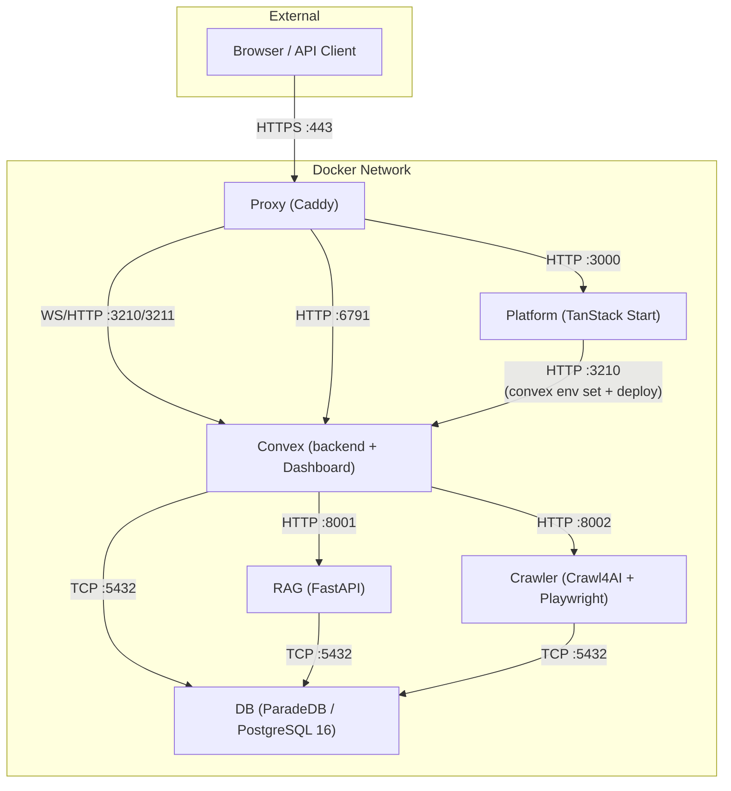

Tale tourne comme six conteneurs Docker gérés par Docker Compose — chacun avec une seule responsabilité et un seul port sur le réseau bridge interne. Cette page est le modèle mental de l'exploitant pour ce qui tourne, où et comment les services se parlent : quels volumes sont partagés, quels ports sont exposés, où la topologie blue-green se replie sur elle-même pendant un déploiement. Va la voir quand quelque chose n'atterrit pas là où tu l'attends — un endpoint de métriques injoignable, un port exposé par accident, un switch blue-green qui n'a pas drainé proprement.

## Vue des services

## Détails des images

| Service  | Image de base                                                              | Taille optimisée      | Stratégie de build                                                        |
| -------- | -------------------------------------------------------------------------- | --------------------- | ------------------------------------------------------------------------- |
| Platform | `ghcr.io/get-convex/convex-backend` (pour le binaire glibc `generate_key`) | **~320 Mo compressé** | 5 stages : deps → builder → pruner → runner → squash                      |
| Convex   | `ghcr.io/get-convex/convex-backend`                                        | **~485 Mo compressé** | 2 stages : dashboard → runner (Dashboard COPY depuis image upstream)      |
| Crawler  | `python:3.11-slim`                                                         | **~650 Mo compressé** | 3 stages : builder → runtime → squash. Chromium headless_shell uniquement |
| RAG      | `python:3.11-slim`                                                         | **~515 Mo**           | 3 stages : builder → runtime → squash. libpq5 uniquement                  |
| DB       | `paradedb/paradedb:0.22.5-pg16`                                            | **~1,06 Go**          | 3 stages : cleanup → runtime → squash                                     |
| Proxy    | `caddy:2.11-alpine`                                                        | **~88 Mo**            | un seul stage                                                             |

Séparer Convex de platform a réduit l’image platform de ~2,58 Go à ~320 Mo compressé ; le service convex est une nouvelle image ~485 Mo. Le disque total est similaire mais le layer platform rebuild bien plus vite pour des changements app-only.

## Mapping des ports

### Ports dev (`compose.yml`)

| Service  | Port hôte | Port conteneur   | Protocole           |
| -------- | --------- | ---------------- | ------------------- |
| DB       | 5432      | 5432             | TCP (PostgreSQL)    |
| Crawler  | 8002      | 8002             | HTTP                |
| RAG      | 8001      | 8001             | HTTP                |
| Convex   | —         | 3210, 3211, 6791 | WS/HTTP (via proxy) |
| Platform | —         | 3000             | HTTP (via proxy)    |
| Proxy    | 80, 443   | 80, 443          | HTTP/HTTPS          |

### Ports test (`compose.test.yml`)

| Service  | Port hôte           | Port conteneur   |
| -------- | ------------------- | ---------------- |
| DB       | 15432               | 5432             |
| Crawler  | 18002               | 8002             |
| RAG      | 18001               | 8001             |
| Convex   | 13210, 13211, 16791 | 3210, 3211, 6791 |
| Platform | 13000               | 3000             |
| Proxy    | 10080, 10443        | 80, 443          |

## Mapping des volumes

| Volume          | Monté dans              | Chemin                                 | But                                                                                                                                          |
| --------------- | ----------------------- | -------------------------------------- | -------------------------------------------------------------------------------------------------------------------------------------------- |
| `db-data`       | DB                      | `/var/lib/postgresql/data`             | répertoire de données PostgreSQL.                                                                                                            |
| `db-backup`     | DB                      | `/var/lib/postgresql/backup`           | backups DB.                                                                                                                                  |
| `rag-data`      | RAG                     | `/app/data`                            | fichiers temp, traitement de documents.                                                                                                      |
| `crawler-data`  | Crawler                 | `/app/data`                            | registre de sites, bases URL.                                                                                                                |
| `convex-data`   | Convex                  | `/app/data`                            | DB Convex (SQLite/pg-local), index de recherche, fichiers, JSON agents/workflows/integrations/providers.                                     |
| `convex-data`   | Platform                | `/app/data` **(read-only)**            | watcher SSE de config + serveur d’images branding.                                                                                           |
| `convex-data`   | Crawler, RAG            | `/app/platform-config` **(read-only)** | config provider partagée.                                                                                                                    |
| `caddy-data`    | Proxy, Convex           | `/data`, `/caddy-data`                 | certificats TLS.                                                                                                                             |
| `caddy-config`  | Proxy                   | `/config`                              | configuration Caddy.                                                                                                                         |
| `platform-data` | — _(legacy, non monté)_ | —                                      | préservé après upgrade pour la sécurité du rollback ; à retirer manuellement après validation : `docker volume rm <projectId>_platform-data` |

> **Important :** Ne lance jamais `docker compose down -v`. Le flag `-v` supprime tous les volumes Docker, effaçant définitivement ta base et toutes les données plateforme.

## Arguments de build

| Argument            | Défaut  | Utilisé par | Description                                             |
| ------------------- | ------- | ----------- | ------------------------------------------------------- |
| `VERSION`           | `dev`   | tous        | tag de version d’image (posé par CI depuis le tag git). |
| `INSTALL_CJK_FONTS` | `false` | Crawler     | installer le support des polices CJK (~100 Mo).         |

## Stratégie multi-stage

Tous les services utilisent un squash `FROM scratch` en stage final. Ça aplati les layers Docker pour que les suppressions de fichiers dans les étapes de cleanup libèrent vraiment du disque, au lieu d’ajouter des layers masquants. Ça garde les outils de build (`gcc`, `build-essential`, `libpq-dev`) hors de l’image finale.

### Platform (5 stages, post-split)

1. **bun-bin** — extrait le binaire Bun.
2. **workspace-deps** — installe toutes les dépendances npm (dont devDependencies).
3. **builder** — lance `vite build` pour produire la SPA.
4. **pruner** — réinstalle uniquement les prod deps, retire les paquets dev (`@vitest`, `@storybook`, `typescript`, etc.).
5. **runner** — runtime finale sur l’image base `convex-backend` (conservée pour le binaire glibc `generate_key` qui signe les tokens admin Convex). SPA Vite + serveur Bun seulement — pas de backend Convex.
6. **squash** — `FROM scratch` + `COPY --from=runner`. Tourne en root, bascule sur user `app` via `gosu` dans l’entrypoint.

### Convex (2 stages, nouveau en phase 2)

1. **convex-dashboard** — `FROM ghcr.io/get-convex/convex-dashboard` pour copier le build Next.js standalone.
2. **runner** — `FROM ghcr.io/get-convex/convex-backend`. Contient le daemon `convex-local-backend`, le Dashboard, les assets builtin de seed (agents/workflows/integrations/providers/branding) et l’entrypoint. Retire LLVM/Clang (~155 Mo).

### Crawler (3 stages)

1. **builder** — installe les deps Python via `uv`, télécharge Chromium headless_shell, cleanup profond (retire Chrome complet, FFmpeg, pip, `__pycache__`, symboles debug `.so`, répertoires de test).
2. **runtime** — `python:3.11-slim` propre avec seulement les libs système runtime (deps Chromium, tini, curl). Retire LLVM/icônes Adwaita.
3. **squash** — `FROM scratch` + `COPY --from=runtime`. Pré-crée les mountpoints de volume pour `/app/data` et `/app/platform-config`.

### RAG (3 stages)

1. **builder** — installe deps Python avec `build-essential` + `libpq-dev` pour compiler les paquets natifs, puis retire pip/setuptools.
2. **runtime** — `python:3.11-slim` propre avec seulement `libpq5` + `curl`. Pré-crée les mountpoints.
3. **squash** — `FROM scratch` + `COPY --from=runtime`.

### DB (3 stages)

1. **cleanup** — retire les symboles debug (~888 Mo), les libs LLVM partagées (~127 Mo), les fichiers d’extension PostGIS, les locales et docs de l’image ParadeDB de base.
2. **runtime** — `FROM scratch` + `COPY --from=cleanup`. Layer frais avec seulement les fichiers nettoyés.
3. **squash** — redéclare `PGDATA`, `PATH` et autres ENV perdus lors de `FROM scratch`.

## Health checks

| Service  | Endpoint                                              | Protocole      | Démarrage |
| -------- | ----------------------------------------------------- | -------------- | --------- |
| DB       | `pg_isready -U tale -d tale`                          | CLI            | 60 s      |
| Crawler  | `GET /health` sur :8002                               | HTTP           | 40 s      |
| RAG      | `GET /health` sur :8001                               | HTTP           | 40 s      |
| Convex   | `GET :3210/version` + `[ -f /tmp/convex-ready ]`      | HTTP + fichier | 60 s      |
| Platform | `GET :3000/api/health` + `[ -f /tmp/platform-ready ]` | HTTP + fichier | 180 s     |
| Proxy    | `GET /health` sur :2020 (interne)                     | HTTP           | 10 s      |

Les marqueurs `/tmp/<service>-ready` sont posés par l’entrypoint de chaque service après ses tâches d’init one-shot (Convex : backend up + seed builtin ; Platform : env sync + `convex deploy`). Ça empêche le trafic d’être routé avant que le service soit vraiment prêt.

## Tests conteneurs

Tale inclut trois scripts de tests :

| Script                                  | Commande                            | Ce qui est testé                                                                           |
| --------------------------------------- | ----------------------------------- | ------------------------------------------------------------------------------------------ |
| `tests/container-smoke-test.sh`         | `bun run docker:test`               | build, start, health checks, endpoints HTTP, connectivité inter-services.                  |
| `tests/container-image-test.sh`         | `bun run docker:test:image`         | labels OCI, user non-root, absence de secrets, instruction HEALTHCHECK, budgets de taille. |
| `tests/container-vulnerability-scan.sh` | `bun run docker:test:vulnerability` | scan Trivy (HIGH + CRITICAL).                                                              |

Voir le [guide de contribution Docker](/fr/develop/contributing-docker) pour la modification des Dockerfiles et le lancement des tests.

## Où ça s'inscrit

L'architecture des conteneurs est le modèle mental pour savoir ce qui tourne, où, et comment les services communiquent. Va la voir quand quelque chose n'arrive pas où tu l'attends — un endpoint de métrique injoignable, un port accidentellement exposé, un bascule blue-green qui n'a pas drainé proprement. Pour les surfaces d'observabilité par service, [Opérations](/fr/self-hosted/operate/observability/operations) est la page suivante ; pour les boutons de variables d'environnement, la [Référence des variables d'environnement](/fr/self-hosted/configuration/environment-reference) est exhaustive.
